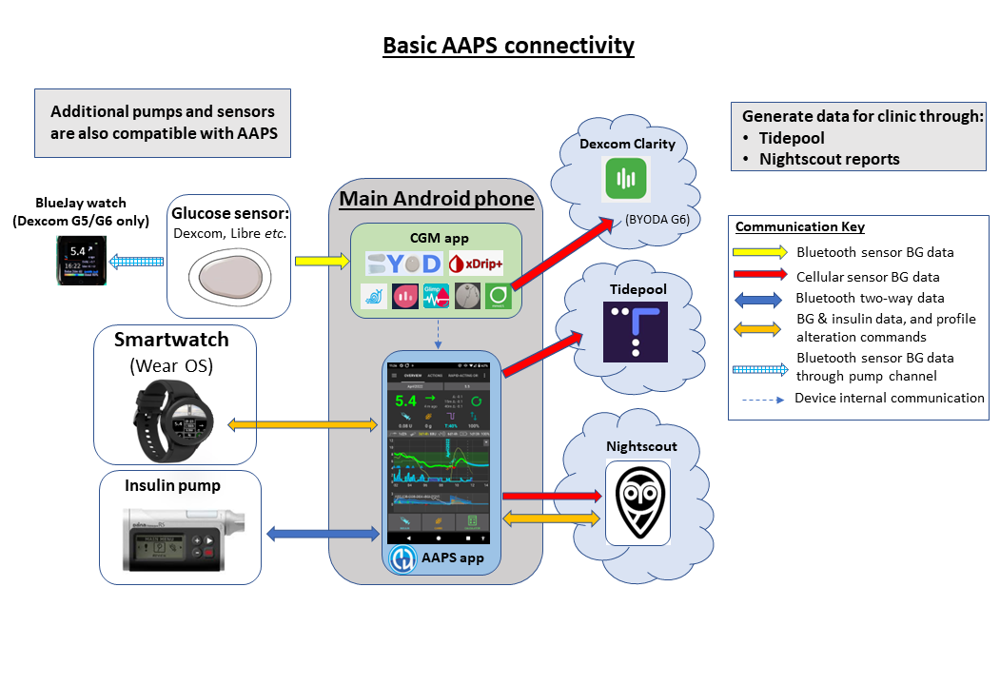
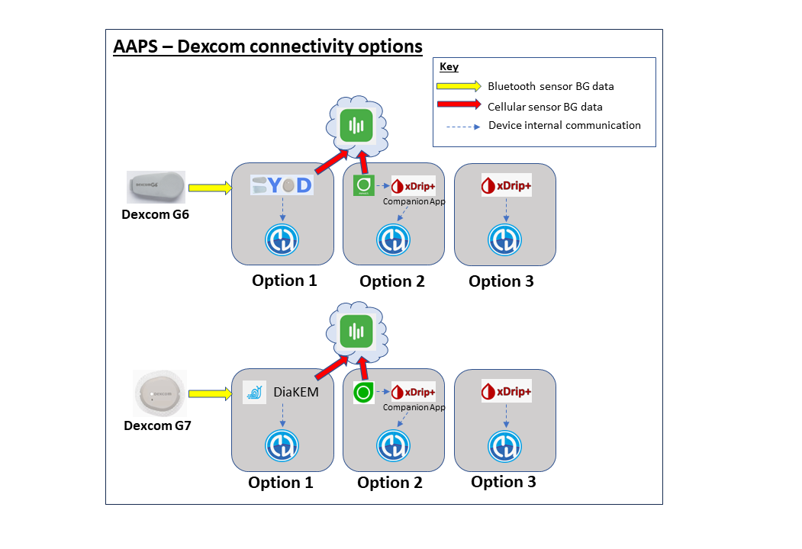

# 准备开始使用AAPS

欢迎使用本文档。 本指南旨在帮助用户​​准备配置并启用​​Android人工胰腺系统（**AAPS**）。

## 在文档中查找信息

您可以在[此处](../index.md)找到文档的**索引**和结构说明，也可以通过点击文档左上角**AAPS**图标来访问。 该索引页面提供各版块功能的概览， 您还可以使用本页左侧的标题来浏览文档。 最后，在**AAPS**符号的正下方，有一个实用的搜索功能。

我们的目标是让您能够轻松了解**AAPS**的功能和局限性。 在投入时间阅读文档后发现，您可能没有兼容的胰岛素泵或连续血糖监测（CGM）设备，或者**AAPS**提供的功能与您的期望不同，这可能会让您感到失望。

在实时使用**AAPS**时，**AAPS**文档中的许多与体验相关的细节会更有意义。 就像仅仅通过阅读规则很难学会一项运动一样，学习如何安全操作**AAPS**的基础规则，并在开始使用**AAPS**时学习如何最好地应用这些规则，需要两者的结合。

(preparing-safety-first)=

## 安全第一
“能力越大，责任越大…”

### 技术安全
**AAPS**拥有一系列广泛的安全特性。 这些限制条件是通过分阶段完成一系列的[目标](../SettingUpAaps/CompletingTheObjectives.md)逐步解除的，这些目标涉及测试特定参数和回答选择题。 随着**AAPS**的各个目标成功完成，其功能也会逐步解锁。 这个过程允许用户分阶段从开环安全过渡到闭环，同时学习**AAPS**的不同功能。

[目标](../SettingUpAaps/CompletingTheObjectives.md)旨在为用户提供最佳的**AAPS**入门体验，在设计时考虑了**AAPS**开发者观察到的新用户常见的错误和普遍趋势。 错误可能会发生，因为初学者缺乏经验且过于急切地想要开始使用**AAPS**, 或者忽略了关键点。 [目标](../SettingUpAaps/CompletingTheObjectives.md)旨在最大限度地减少这些问题。

### 医疗安全
```{admonition} Avoid permanent and painful damage to your eyes and nerves
:class:危险
关于血糖控制的迅速改善和糖化血红蛋白（HbA1c）水平的降低，建议谨慎行事 
```

一个重要的安全考虑是，**对于那些血糖水平已经升高了一段时间的人来说，糖化血红蛋白（HbA1c）的快速降低和血糖控制的改善可能会造成永久性损害**。 许多糖尿病患者并不了解这一点，而且并非所有临床医生都会让患者意识到这个问题。

这种损害可能包括**视力丧失和永久性神经病变（疼痛）**。 通过更缓慢地降低平均血糖水平，可以避免这种损害发生。 如果您目前的 HbA1c 偏高，并准备改用 **AAPS**（或任何其他闭环系统），_请_在开始之前与您的临床团队讨论这一潜在风险，并与他们商定一个时间计划。 在**AAPS**系统中，您可以轻松地先设定较高的血糖目标（目前，您可以选择的最高目标是10.6 mmol/L，但如果需要，您也可以保持一个故意设置得较宽松的控制方案），然后随着月份的推移逐步降低目标。

#### 在不造成永久性损害的情况下，能多快降低我的糖化血红蛋白（HbA1c）水平？

一项包含76名患者的回顾性[研究](https://pubmed.ncbi.nlm.nih.gov/1464975/)报告指出，如果在6个月内糖化血红蛋白（HbA1C）分别下降1%、2%或3%，则视网膜病变进展的风险将分别增加1.6倍、2.4倍和3.8倍。 他们建议，“在任何6个月期间，糖化血红蛋白（HbA1c）的降低幅度应限制在2%以内，以防止视网膜病变的进展......在血糖控制开始时降低过快可能导致视网膜病变的进展严重或暂时加剧。”

请注意 如果您使用不同的糖化血红蛋白（HbA1c）单位（mmol/mol 而不是 %），请点击[此处](https://www.diabetes.co.uk/hba1c-units-converter.html)获取HbA1c计算器工具。

在另一项包含954名患者的回顾性[评估](https://academic.oup.com/brain/article/138/1/43/337923)中，研究人员注意到：

**“在3个月内，糖化血红蛋白（HbA1c）下降2–3%时，糖尿病患者发生治疗诱发性神经病变的绝对风险为20%；而HbA1c在3个月内下降超过>4%时，糖尿病患者发生治疗诱发性神经病变的绝对风险则超过80%。”**

关于这项工作的[评论](https://academic.oup.com/brain/article/138/1/2/340563)认为，为避免并发症，**目标应该是在3个月内将A1c降低<<2%。**您可以在[此处](https://www.ncbi.nlm.nih.gov/pmc/articles/PMC6587545/pdf/DOM-21-454.pdf)和[此处](https://www.mdpi.com/1999-4923/15/7/1791)阅读有关该主题的其他评论。

人们普遍认为，_新_诊断的1型糖尿病患者（通常在开始胰岛素治疗之前，诊断时HbA1c水平非常高）似乎能够在诊断后立即迅速降低其HbA1c水平，而不会遇到同样程度的这些风险，因为他们没有长时间保持高血糖水平。 然而，这仍然是一个需要你与临床医生讨论的问题。

(PreparingForAaps-no-sglt-2-inhibitors)=
### 不要使用SGLT-2抑制剂

```{admonition} NO SGLT-2 inhibitors
:class:危险
SGLT-2抑制剂，也称为格列净类药物，可抑制肾脏对葡萄糖的重吸收。 格列净类药物（Gliflozins）能够极大地降低血糖水平，因此，在使用AAPS等闭环系统时，您绝对不能服用它们！ 这将存在发生酮症酸中毒和/或低血糖的重大风险！ 将这种药物与降低基础率以增加血糖（BG）的系统结合使用尤其危险。 

简而言之：
- **示例1：低血糖风险**
>午餐时，您根据摄入了45克葡萄糖，使用 **AAPS** 来计算并输注大剂量。 问题是，AAPS并不知晓SGLT-2抑制剂的作用，这种抑制剂会使身体排出一部分碳水化合物，从而导致身体吸收的碳水化合物与胰岛素的比例失衡，胰岛素相对过多，进而引发低血糖。

- **示例2：酮症酸中毒的风险。**
>抑制剂在后台消除了一部分碳水化合物，导致你的血糖水平下降。 **AAPS** 会自动指示胰岛素泵减少胰岛素的摄入量，包括基础胰岛素的输注。 长时间如此，可能会导致你的血糖持续低于目标值，以至于身体没有足够的基础胰岛素来吸收任何碳水化合物，进而引发酮症酸中毒。 通常情况下，1型糖尿病患者发生酮症酸中毒是因为他们的胰岛素泵出现故障，这会在他们的手机上触发警报，并且由于高血糖值而容易被察觉。 然而，格列净类药物（Gliflozins）带来的危险在于，即使胰岛素泵仍在正常工作，且血糖可能仍在目标范围内，也不会有任何AAPS警报。  

SGLT-2抑制剂的常见商品名包括：Invokana、Farxiga、Jardiance、Glyxambi、Synjardy、Steglatro和Xigduo XR等，还有其他一些品牌。
```


### 使用AAPS进行闭环控制的关键原则

在使用**AAPS**之前，必须理解闭环控制的关键原则和理念。 这需要通过投入个人的时间来阅读**AAPS**的文档，并完成旨在为您提供安全有效使用**AAPS**平台的目标来实现。 **AAPS**的文档量可能一开始看起来非常庞大，但请保持耐心并相信这个过程——采用正确的方法，你一定能掌握它！

进步的速度将因人而异，但要知道，完成所有目标通常需要6到9周的时间。 许多人会提前很久就开始构建、安装和设置**AAPS**。 为了辅助这一过程，该系统有一个“虚拟泵”，可以在完成早期目标时使用，这样你就可以在不实际使用它来输注胰岛素的情况下熟悉**AAPS**。 以下是对时间线的详细分解，请注意，在完成**AAPS**的第8个目标时，你将可以启用闭环。后续的目标会增加一些额外的功能，如**SMS命令**和**自动化**等，这些功能对某些用户来说很有用，但并不是**AAPS**核心功能的必要部分。

成功使用**AAPS**需要采取积极主动的方法，愿意分析血糖数据，并根据需要灵活调整**AAPS**的设置，以改善你的健康状况。 单靠阅读规则几乎不可能学会一项运动，**AAPS**也是如此。

#### 为设置和运行过程中的延迟和小问题做好准备。

在刚开始使用**AAPS**的初步阶段，你可能会遇到一些困难，比如闭环体系中的各个组件之间（以及可能的关注者之间）无法有效通信，以及在微调你的设置时遇到问题。 有些问题只有在日常生活中使用**AAPS**时才能解决，但在Facebook小组和Discord上有大量的帮助资源可供利用。 请相应地做好计划，并选择“合适”的时间，比如周末的一个安静的早晨（即不是深夜或你疲惫的时候，也不是在大型会议或旅行之前），来进行故障排除和解决问题。

#### 技术兼容性

**AAPS**仅与特定类型的胰岛素泵、连续血糖监测仪（CGM）和手机兼容，并且某些技术可能在不同国家无法使用。 为了避免任何失望或沮丧，请仔细阅读关于[CGM](../Getting-Started/CompatiblesCgms.md)（连续血糖监测仪）、[胰岛素泵](../Getting-Started/CompatiblePumps.md)和[手机](../Getting-Started/Phones.md)的部分。

#### 应用程序构建时间以及进展到完全闭环

构建**AAPS**（AndroidAPS）应用程序的时间取决于你的专业水平和技术能力。 对于没有经验的用户来说，构建**AAPS**通常需要半天到一天的时间（如果得到社区的帮助的话）。 随着你经验的积累，构建新版本**AAPS**的过程将会显著加快。

为了辅助构建过程，设有专门的章节：

- [常见问题解答（FAQs，第K节）](../UsefulLinks/FAQ.md)中有可能出现的常见错误及其解答列表；

- “[如何安装AAPS](../SettingUpAaps/BuildingAaps.md)？” （第D节）其中包括[故障排除](../GettingHelp/GeneralTroubleshooting.md)小节。

要达到闭环控制所需的时间因人而异，但你可以（[在这里](#how-long-will-it-take-to-set-everything-up)）找到使用AAPS实现完全闭环控制的大致时间表。


#### 密钥库&和配置设置导出文件

一个“.jks文件”（密钥库）是一个密码加密的文件，它对你自己的**AAPS**副本是唯一的。 你的Android手机使用它来确保没有其他人能够在没有密钥库的情况下升级你自己的AAPS副本。 简而言之，作为**AAPS**构建的一部分，你应该：

1.  请将你的密钥库文件（用于给你的应用签名的.jks文件）保存在安全的地方；

2.  记下你密钥库文件的密码。


这将确保你每次创建**AAPS**的更新版本时，都能使用完全相同的密钥库文件。 平均每年需要进行2次**AAPS**更新。

此外，**AAPS**提供了[导出所有配置设置](../Maintenance/ExportImportSettings.md)的功能。 这确保了你可以在更换手机、升级/重新安装应用程序时，以最小的干扰安全地恢复你的系统。 

#### 故障排除

如果你有任何不确定的地方，请随时联系AAPS社区——没有问题是愚蠢的！ 我们鼓励所有不同经验水平的用户提问。 由于**AAPS**用户众多，通常问题的回复速度很快。

##### [在AAPS Facebook群组中提问。](https://www.facebook.com/groups/AndroidAPSUsers/)

##### [在AAPS Discord频道中提问。](https://discord.gg/4fQUWHZ4Mw)


#### [去哪里寻求帮助](../UsefulLinks/BackgroundReading.md)？

本节旨在为新用户提供资源链接，以便他们能够获得帮助，包括访问由新用户和经验丰富的用户组成的社区支持。这些用户可以帮助解答问题，并解决在使用AAPS时通常会遇到的陷阱或难题。

#### [临床医生部分](../UsefulLinks/ClinicianGuideToAaps.md)

此处为[专为临床医生设计的章节](../UsefulLinks/ClinicianGuideToAaps.md)，旨在帮助其深入了解AAPS（Android人工胰腺系统）及开源人工胰腺技术。 在引言部分还提供了[如何与你的临床团队沟通](#introduction-how-can-i-approach-discussing-aaps-with-my-clinical-team)的指导。

## 我们要构建和安装什么？

该图提供了**AAPS**系统的关键组件（包括硬件和软件）的概览：




除了三个基本的硬件组件（手机、泵、葡萄糖传感器）之外，我们还需要： 1) **AAPS**应用 2) 一个报告服务器以及 3)一个连续葡萄糖监测（CGM）应用

### 1)Android手机应用程序：**AAPS**

**AAPS** 是运行在安卓智能手机&设备上的应用程序。 您将按照逐步指南自行构建**AAPS**应用程序（一个apk文件）。具体步骤包括：从GitHub下载**AAPS**源代码，在您的计算机上安装必要的程序（如Android Studio和GitHub Desktop），并构建您自己的**AAPS**应用程序副本。 然后，您将通过电子邮件、USB线缆_等_方式将**AAPS**应用程序传输到您的智能手机上并进行安装。

### 2) 报告服务器：NightScout（Tidepool*）

为了充分利用**AAPS**，您需要设置一个Nightscout服务器。 您可[自行操作](https://nightscout.github.io/nightscout/new_user/#free-diy)，或选择支付少量费用使用[托管式Nightscout服务](https://nightscout.github.io/#nightscout-as-a-service)代您完成配置。 Nightscout用于随时间收集来自**AAPS**的数据，并能够生成将连续葡萄糖监测（CGM）和胰岛素模式相关联的详细报告。 护理人员也可以使用Nightscout与**AAPS**应用程序进行远程通信，以监督其孩子的糖尿病管理。 这种远程通信功能包括实时监测血糖和胰岛素水平、远程注射胰岛素（通过短信）以及录入碳水。 试图单独分析连续葡萄糖监测（CGM）数据而不结合泵数据来评估你的糖尿病管理效果，就像是一个司机在开车时看不见前方，而只能依靠乘客来描述路况一样。  对于AAPS 3.2及更高版本，Tidepool可以作为Nightscout的替代方案。

### 3）CGM传感器应用

根据你的葡萄糖传感器/连续葡萄糖监测（CGM）设备，你需要一个兼容的应用来接收血糖读数并将它们发送给**AAPS**。 不同的选项如下所示，更多信息可以在[兼容的CGM部分](../Getting-Started/CompatiblesCgms.md)中找到：

  

### **AAPS**系统维护

**Nightscout**和**AAPS**都必须每年更新大约一次，因为会发布改进后的版本。 在某些情况下，更新可以推迟进行；但在其他情况下，为了安全起见，强烈推荐或认为更新是必不可少的。 关于这些更新的通知将在Facebook群组和Discord服务器上发布。 发布说明将明确说明具体的情况。 在更新期间，可能会有很多人问与您类似的问题，您将获得进行更新的支持。

(preparing-how-long-will-it-take)=
## 设置好一切需要多长时间？

如前所述，使用**AAPS**更像是一段需要投入个人时间的“旅程”。 这不是一次性的设置。 目前，构建**AAPS**、安装和配置**AAPS**和**CGM**软件，以及实现从开环到使用**AAPS**的混合闭环，总体估计大约需要4到6个月的时间。 因此，建议您优先考虑尽快构建**AAPS**应用并尽早完成初期目标，即使您目前还在使用不同的胰岛素输注系统（在完成第五个目标之前，您可以使用虚拟泵）。

部分目标需要一定的天数来确保您能够理解并熟悉新功能。 这个等待时间是不能绕过的，这些最短时间限制的设置是为了您的安全着想。

以下是一个大致的时间框架：

| 任务                                        |    预估时间    |
| ----------------------------------------- |:----------:|
| 初步阅读文档                                    |   1-2 天    |
| 安装/配置电脑以允许构建                              |   2-8 小时   |
| 设置报告服务器                                   |    1 小时    |
| 安装CGM应用 (xDrip+, BYODA, …)                |    1 小时    |
| 初步配置CGM→ xDrip+→ AAPS                     |    1 小时    |
| 初步配置AAPS→泵                                |    1 小时    |
| 配置AAPS→Nightscout/Tidepool（仅用于报告）         |    1 小时    |
| 可选：配置NightScout ↔**AAPS**&NSFollowers的互联。 |    1 小时    |
| 目标1：设置可视化和监控                              |    1 小时    |
| 目标2：学习如何控制AAPS                            |    2 小时    |
| 目标3：证明您的知识                                |   最多14天    |
| 目标4：开始开环操作                                |    至少7天    |
| 目标5：理解您的开环操作                              |    7 天     |
| 目标6：开始闭环操作（低血糖暂停）                         | 至少5天，最多14天 |
| 目标7：调整闭环设置                                | 至少1天，最多7天  |
| 目标8：调整基础率和比例，启用Autosens（自动敏感度调节）          | 至少7天，最多14天 |
| 目标9：启用超级微小大剂量（SMB）                        |   最少28天    |
| 目标10：自动化                                  |   最少28天    |
| 目标11：动态ISF（胰岛素敏感因子）                       |   最少28天    |

一旦您全面使用**AAPS**系统，您仍然需要定期微调您的设置，以改善您的整体糖尿病管理。

## 要求

### 医疗考虑

除了[安全部分](#safety-first)中的医疗警告外，根据您在泵中使用的胰岛素类型，还会有不同的参数设置。

#### 胰岛素选择

**AAPS**（AndroidAPS）的计算是基于胰岛素浓度为100单位/毫升（与泵的标准相同）来进行的。 支持以下类型的胰岛素曲线预设：

- 速效 Oref: Humalog（优泌乐）/NovoRapid（诺和锐）/NovoLog（诺和灵速效）
- 超速效ORef：Fiasp（菲速）
- Lyumjev（赖脯胰岛素-aabc）:

仅供实验/高级用户使用：
- 自由峰值Oref：允许您定义胰岛素活性的峰值


### 技术性

本文档旨在将所需的技术专业知识减少到绝对最低限度。 您需要使用计算机在Android Studio中构建**AAPS**应用程序（附有逐步说明）。 您还需要在公共云上通过互联网设置一个服务器，配置多个安卓手机应用程序，并培养糖尿病管理方面的专业知识。 这可以通过循序渐进、保持耐心以及获得**AAPS**社区的帮助来实现。 如果您已经能够熟练浏览互联网、管理自己的Gmail电子邮件，并保持计算机更新，那么构建**AAPS**是一个可行的任务。 慢慢来，不用着急。

### 智能手机

#### AAPS与Android版本

当前版本的**AAPS**（3.3）需要搭载**谷歌Android 11.0或更高版本**的Android智能手机。 If you are considering buying a new phone, (as of December 2024), Android 14 is preferred.<br/> Users are strongly encouraged to keep their build of **AAPS** up to date for safety reasons. 然而，对于无法使用Android 11.0或更高版本设备的用户，仍然可以使用与旧版Android兼容的**AAPS**早期版本，请参阅：[发行说明](#maintenance-android-version-aaps-version)。

#### 智能手机型号选择
您购买的具体型号取决于所需的功能。 您可以在[手机页面](../Getting-Started/Phones.md)上找到关于工作配置的建议和用户反馈。

鼓励用户保持其手机Android版本的更新，包括安全参数方面。 然而，如果您是**AAPS**的新用户或者不是技术专家，您可能想要在我们的各个论坛上等待其他人更新手机并确认安全后，再进行更新。

```{admonition} delaying Samsung phones updates
:class:警告
三星有着不幸的记录，他们强制推送手机更新，而这些更新却导致了蓝牙连接问题。 要禁用强制更新功能，需通过以下步骤启用手机的"开发者模式"：
前往设置 → 进入「关于手机」 → 选择「软件信息」 → 连续点击「版本号」直至系统提示已开启开发者模式。 返回到主设置菜单，您应该会看到一个新的‘开发者选项’菜单项。 打开开发者选项，滚动查找‘自动系统更新’并将其关闭。
```

```{admonition} Google Play Protect potential Issue
:class:警告
有多份报告称，**AAPS**每天早上都会被Google Play Protect任意关闭。 如果发生这种情况，您将需要进入Google Play的选项并禁用‘Google Play Protect’。 并非所有手机型号或所有Android版本都会受到影响。
```

