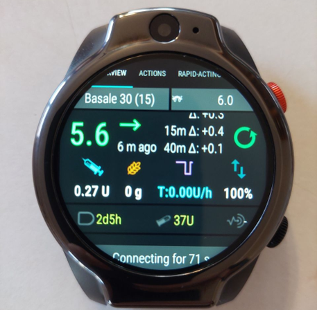
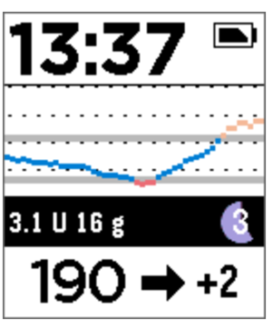

# 智能手表与AAPS

各种智能手表可用于显示**AAPS**中的一些信息或执行远程操作。

使用完整的Android手表（被视为小型[智能手机](./Phones.md)）可以实现智能手表直接控制**AAPS**（泵和传感器）。

一些智能手表可以允许您输入治疗信息或其他更多内容，但**AAPS**的管理仍然需要依靠手机本身。

智能手表在**AAPS**中的应用越来越广泛，无论是对于成人糖尿病患者还是对于儿童糖尿病患者的照料者/父母来说_都是如此_。

## 使用智能手表与**AAPS**结合的一般优势


智能手表-根据型号的不同-可以与**AAPS**以许多不同的方式结合使用。 它们可以用来完全或部分控制**AAPS**，或者仅仅用来远程检查血糖水平、活性胰岛素量和其他参数。

在许多情况下，将智能手表与**AAPS**集成在一起都很有用，比如在开车或骑自行（摩托）车以及锻炼期间。 部分用户认为，在会议、聚会或餐桌等场合，通过智能手表查看数据比使用手机更不易引人注意。 从安全角度来看，智能手表在移动时也很有用，它可以让用户将**AAPS**手机放在看不见的地方（比如包里），但可以通过智能手表进行远程控制。

## 对于使用**AAPS**的父母/照料者来说的具体优势

对于孩子来说——如果他们的**AAPS**手机在附近——照料者可以使用智能手表进行监测或修改，而无需使用**AAPS**手机。 例如，如果**AAPS**手机被藏在泵带中，这一点就非常有用。

智能手表可以作为基于手机的远程控制选项或[仅用于数据跟踪模式](../RemoteFeatures/FollowingOnly.md)的_补充_，或者作为这些选项的_替代_。

此外，与依赖于移动网络或Wi-Fi连接的父母/照料者追踪手机不同，通过蓝牙连接的智能手表可以在偏远地区发挥作用，比如洞穴中、船上或半山腰。 如果两个设备（**AAPS**手机和智能手表）在同一个wifi网络上，它们也可以使用wifi。

## 不同类型的智能手表与AAPS交互模式

目前，智能手表与**AAPS**结合使用主要有五种方式。 如下表所示： 

| 手表设置   | 功能               | 要求                                                                                                                                                                          |
| ------ | ---------------- | --------------------------------------------------------------------------------------------------------------------------------------------------------------------------- |
| 独立使用   | 无手机AAPS          | 全功能Android智能手表（请检查最低Android版本要求） 运行 **app-fullRelease** 应用程序                                                                                                                |
| 完全远程控制 | 大多数AAPS功能        | Android **Wear OS**手表（请检查Android/API版本）<1>运行**wear-fullRelease**版本</br>                                                                                                     |
| 远程控制   | AAPSClient 功能    | Android **Wear OS** 手表（请检查Android/API版本）</br>运行**[wear-aapsclientRelease](https://github.com/nightscout/AndroidAPS/releases)**版本                                            |
| 远程控制   | 部分AAPSClient功能   | 部分三星、Fitbit和Garmin手表<0>（具体信息请见下文）</br>                                                                                                                                      |
| 显示     | 显示一些AAPSClient指示 | 许多智能手表（请见[此处](https://bigdigital.home.blog/)）<1>支持xDrip+</a>和[WatchDrip+](https://bigdigital.home.blog/2022/06/16/watchdrip-a-new-application-for-xdrip-watch-integration/) |

## 在购买智能手表之前…

您购买的智能手表的具体型号取决于所需的功能。 您可以在[手机页面](#Phones-list-of-tested-phones)上找到有用的信息，包括经过测试的手机列表（其中也包含一些智能手表）。

受欢迎的手表品牌包括三星Galaxy、Garmin、Fossil、小米手环和Fitbit。 上表中总结的不同选项将在下文进行更详细的解释，以帮助您决定哪种智能手表适合您的情况。

如果您打算将智能手表与手机上的**AAPS**集成，以便与**AAPS**进行远程交互，您还需要考虑这两个设备是否兼容，特别是如果您的手机较旧或型号不常见时。

一般来说，如果您只想追踪血糖数值，而不与**AAPS**进行交互，那么您可以选择范围更广、价格更实惠且更简单的手表。

选择智能手表的最佳方式是在Discord或Facebook的**AAPS**群组中搜索“手表”相关的帖子。 阅读他人的经验分享，如果旧帖子没有解答您的疑问，请发布任何具体问题。

## 全选Android

这听起来是一个很有吸引力的选择，对吧？ 然而，目前只有少数爱好者正在尝试在独立手表上使用**AAPS**。 只有数量有限的智能手表拥有合理的界面，能够很好地与**AAPS**和您的持续葡萄糖监测(CGM)应用程序配合进行独立使用。 热门型号包括LEMFO LEM等。 您需要将**AAPS**“完整”版本的apk（通常安装在智能手机上的apk）而不是**AAPS**“穿戴”版本的apk加载到手表上。

虽然没有明确的规格可以帮助您了解一款手表是否适合独立使用**AAPS**，但以下参数将有所帮助：

1）Android 11或更高版本。 2）能够将手表表盘从“方形”模式切换出来，以使文字更大、更易阅读。 3）电池续航非常出色。 4）良好的蓝牙连接范围。

大多数关于独立**AAPS**手表的困扰都来自于与一个小屏幕的交互，以及当前的AAPS完整应用程序界面尚未为手表设计的事实。 由于屏幕尺寸受限，您可能更喜欢使用手写笔在手表上编辑**AAPS**设置，并且某些AAPS按钮可能无法在手表屏幕上显示。

额外的挑战是很难获得足够的电池续航时间，并且拥有足够电池续航的手表通常体积庞大且厚重。 用户报告说，他们在操作系统和省电设置上遇到了困难，很难在手表上启动传感器，蓝牙连接范围较差（无法同时与传感器和泵保持连接），并且防水性能也令人质疑。 以下照片展示了相关示例。



如果您对设置独立手表感兴趣，请阅读**AAPS** Facebook群组（良好的搜索选项包括“独立”和“Lemfo”）以及Discord上的帖子和评论，以获取更多信息。

## Wear OS

**AAPS**代码中包含一个可安装在[**Wear OS**智能手表](https://wearos.google.com/#oem-carousel)上的应用程序扩展。


请确认您的智能手表满足**AAPS**的[先决条件](#maintenance-android-version-aaps-version)。

### Wear OS_是_什么？

前三款智能手表选项都要求智能手表必须安装**Wear OS**。

**Wear OS**是运行在一些现代Android智能手表上的操作系统。 如果智能手表的描述中仅表明其与Android和iOS_兼容_，这并不意味着它运行的是Wear OS。 它可能是某种其他特定于供应商的操作系统，该操作系统与**AAPS**不兼容。 要支持安装和使用任何版本的**AAPS**或**AAPSClient**，智能手表需运行**Wear OS**，并搭载Android 11或更高版本系统。 截至2024年10月，**Wear OS**最新版本为5.0（基于Android 13开发）。

如果您在**Wear OS**手表上安装**AAPS**的wear.apk，则可以选择一系列不同的自定义**AAPS**表盘。 或者，您可以使用标准的智能手机表盘，并在表盘上以称为“小工具”的小磁贴形式包含您的**AAPS**信息。 除了时间之外，表盘上显示的任何功能都被称为“小工具（complication）”。


### 我的智能手表可能是什么样的？

在[将**AAPS**安装到您的手表上](../WearOS/WearOsSmartwatch.md)之后，您将能够自动从这些专为**AAPS**设计的表盘中选择您喜欢的表盘。 在大多数手表上，您只需长按主屏幕，直到屏幕缩小，然后向右滑动以选择其他屏幕：


这些是**AAPS**中嵌入的基本屏幕，还有[更多表盘](#WearOS_changing-to-AAPS-watchface)可供选择，您还可以使用[小工具](#Watchfaces-complications)。

### 我日常该如何操作Wear OS手表？

有关表盘以及日常使用的更多详细信息，包括如何制作（和分享）您自己的自定义表盘，可以在[在智能手表上操作Wear AAPS](../WearOS/WearOsSmartwatch.md)部分中找到。

(Watchfaces-tizen)=

## Samsung Tizen

**AAPS**支持将数据发送到[G-Watch应用](https://play.google.com/store/apps/details?id=sk.trupici.g_watch)中。

请查看专用的[Facebook群组](https://www.facebook.com/groups/gwatchapp)以获取最新消息。


(Watchfaces-garmin)=

## Garmin（佳明）

在Garmin ConnectIQ商店中，有一些与[AAPS](https://apps.garmin.com/search?keywords=androidaps)集成的Garmin手表表盘。


[AAPS Glucose Watch](https://apps.garmin.com/apps/3d163641-8b13-456e-84c3-470ecd781fb1)与**AAPS**实现了直接集成。 它除了显示葡萄糖读数外，还显示闭环状态数据（如活性胰岛素和临时基础率），并将心率读数发送到**AAPS**。 它在ConnectIQ商店中可供下载，但必要的**AAPS**插件仅从**AAPS** 3.2版本开始提供。 


## Fitbit

```{Warning}
Google确实在逐步淘汰Fitbit产品。 自定义表盘在欧洲不再可用（需要使用VPN）。 现在不建议购买Fitbit。
```

**AAPS**支持向[Sentinel](http://ryanwchen.com/sentinel.html)表盘发送数据。


**“Sentinel”**是由[Ryan Chen](http://ryanwchen.com/sentinel.html)为其家人开发的一款表盘，并且他免费为Fitbit智能手表（包括Sense1/2和Versa 2/3/4）的用户提供了这款表盘。 由于FitBit Luxe仅是一款健身追踪器，因此它与“Sentinel”表盘不兼容。 “Sentinel”表盘可以从[FitBit移动应用](https://gallery.fitbit.com/details/5f75448f-413d-4ece-a53d-b969c6afea7c)中下载。

它允许使用Dexcom Share、Nightscout或两者的组合作为数据源来监测1、2或3个人的血糖数值。

如果使用的是本地Web服务器模式，则还可以使用xDrip+或SpikeApp。 用户可以直接从手表上使用Nightscout的careportal功能设置自定义警报并提交事件，以帮助跟踪活性胰岛素（IOB）、活性碳水（COB）、输入餐食信息（碳水计数和大剂量数值）以及血糖检查值。

所有这些都会显示在Nightscout的时间线图表上，并作为IOB和COB字段中的更新值出现。 可以在专用的[Facebook群组“Sentinel”](https://www.facebook.com/groups/3185325128159614)中找到社区支持。

对于FitBit手表，还有一些额外的选项，但看起来它们仅用于监测。 这包括[Glance](https://glancewatchface.com/)。 这些额外的选项在[Nightscout的网页](https://nightscout.github.io/nightscout/wearable/#fitbit)上有描述。

## 仅跟踪（Following only）模式

这些智能手表将显示一些**AAPS**信息，有些则需要其他应用程序。

有各种各样价格实惠的智能手表仅能提供显示功能。 如果您正在使用Nightscout，那么对所有选项的一个很好的概述是[在这里](https://nightscout.github.io/nightscout/wearable/#)

以下是**AAPS**用户中一些广受欢迎的仅跟踪（follow-only）手表选项：

### **小米和Amazfit手表**

[Artem](https://github.com/bigdigital)为各种智能手表型号开发了一个xDrip+集成应用WatchDrip+，该应用主要适用于小米（_例如_小米手环）和Amazfit品牌：


您可以在他的网站[这里](https://bigdigital.home.blog/)阅读更多关于这些手表（包括如何设置）的信息。 这些手表的优点是体积小且相对实惠。 它们是一种广受欢迎的选择，特别是适合孩子和手腕较小的人佩戴。

### Pebble watch





Pebble手表（[现已停产](https://en.wikipedia.org/wiki/Pebble_(watch))）在2013年至2016年期间公开销售，现在可能仍有二手产品可供购买。 Fitbit收购了Pebble。 Pebble用户可以使用Urchin表盘来查看Nightscout数据。 显示的数据选项包括活性胰岛素（IOB）、当前活动的临时基础率和预测值。 如果您在使用开环系统，您可以使用IFTTT创建一个小程序，该程序可以实现在收到来自**AAPS**的通知时，发送短信或Pushover通知。

### [Bluejay 手表](https://bluejay.website/)


这些独特的技术设备能够**直接**从Dexcom发射器接收血糖数据。 很少有人知道，Dexcom G6/G7发射器实际上会在_两个_不同的频道上广播当前的血糖数据：一个手机频道和一个医疗频道。 Bluejay手表可以被设置为接收任一频道上的血糖数据，因此，如果AAPS正在使用手机频道，那么Bluejay手表就可以使用医疗频道。

其关键优势在于，它是目前唯一一款完全独立于手机和闭环系统的智能手表。 So, for example, if you disconnect the pump and the **AAPS** phone at the beach or theme park, and are out of range of the **AAPS** phone, you can still get readings from your Dexcom directly to the Bluejay watch.

据报道，其缺点是它并不总是能每5分钟就获取一次读数，而且电池是不可更换的。 Bluejay GTS手表运行的是xDrip+软件的修改版，而Bluejay U1手表则运行完整的xDrip+软件。

### Apple watch

参见[手表上的Nightscout](https://nightscout.github.io/nightscout/wearable/#)

Apple Watch现在支持G7直接连接，并且可以同时与**AAPS**一起使用。

