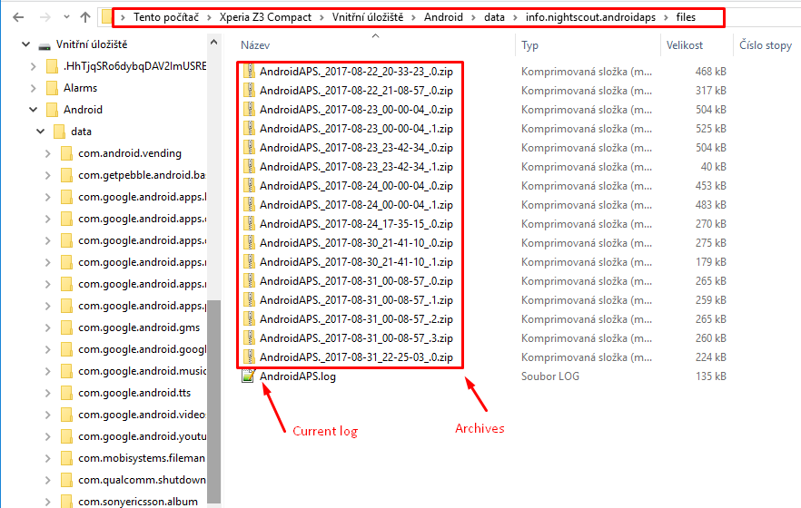

(Accessing-logfiles-accessing-logfiles)=

# 访问日志文件

* 将手机以文件传输模式连接至电脑
* 在AAPS数据目录中定位日志文件，路径为 `Android\data\info.nightscout.androidaps\files`。  
    根存储文件夹的命名可能因手机型号略有不同
* 对于 [AAPSClient](#RemoteControl_aapsclient)，路径为 `Android\data\info.nightscout.aapsclient\files`
* 注意：​**AAPS 3.3**​ 版本已变更日志存储位置。 如需旧版信息请查阅先前版本的文档

* 当前日志是.log文件，可通过多种方式查看：Android Studio内置的 [LogCat](https://developer.android.com/studio/debug/am-logcat.html) 工具，任意安卓日志查看器应用，或者直接作为纯文本文件阅读。 
* 历史日志文件会按日期/时间排序压缩存储在文件夹中 
* 如果您要在[Discord](https://discord.gg/4fQUWHZ4Mw)上分享日志文件以讨论潜在的bug，请解压并上传错误发生之前的文件。