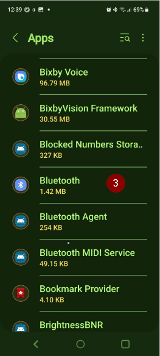

# 故障排除

您可以在维基的许多页面中找到故障排除信息。 本页面是一个链接合集，旨在帮助您找到解决问题的相关信息。

更多有用信息可能也可在[常见问题解答](../UsefulLinks/FAQ.md)中找到。

## AAPS 应用

### 构建与更新

* [丢失密钥库](#troubleshooting_androidstudio-lost-keystore)
* [Android Studio 故障排除](TroubleshootingAndroidStudio)

### 安装

您可能会看到 Google Play Protect 警告，提示该应用不安全、为旧版 Android 构建且不包含最新的隐私保护功能。

忽略该警告：更多详情，仍要安装。

### 设置
* 配置文件

  

* [胰岛素泵 - 来自不同泵的数据](#update30-failure-message-data-from-different-pump)

  

* [Nightscout 客户端](../GettingHelp/TroubleshootingNsClient.md)

### 使用
* [错误的碳水化合物值](#CobCalculation-detection-of-wrong-cob-values)

   

* [短信指令](#SMSCommands-troubleshooting)

### Cannot start Omnipod with Android 16

Upgrade to minimum version of AndroidAPS: 3.3.2.1.

### 频繁的蓝牙连接问题

#### Android 15

升级安卓系统或更换新手机后，**AAPS**经常丢失与泵的蓝牙连接。 重启手机后问题会暂时消失。 如果手机运行的是安卓15系统，可以尝试启用以下选项：

1) **打开偏好设置**，点击主屏幕右上角的三点菜单。

2. 向下滚动并打开**确认提示音** / **高级**子菜单。 启用**在安卓15+上绑定蓝牙设备**。

   

3. 如果泵请求配对，请接受。

4. 重启您的手机。

#### 电池优化

这种情况可能发生在多种胰岛素泵上。 除了将AAPP排除在任何电池优化之外，您还可以将系统蓝牙应用排除在电池优化之外。 这在某些情况下可能有所帮助。 根据您使用的手机不同，蓝牙应用的位置也会有所不同。

以下是特定 Android 手机上的示例操作步骤：

##### Pixel手机（原生安卓系统）

* 进入 Android 设置，选择"应用"

  

* 选择"查看所有应用"

  

* 在右侧菜单中选择"显示系统"应用

  

* 现在搜索并选择"蓝牙"应用

  

* 点击"应用电池用量"并选择"无限制"

  

##### 三星手机

* 进入 Android 设置，选择"应用"

* 在疑似改变排序算法的图标处（1），选择"显示系统应用"（2）

  

  

* 现在搜索蓝牙应用并选择查看其设置

  

* 选择"电池"

  

* 设置为"无限制"

  

## CGM

* [常规](#general-cgm-troubleshooting)
* [Dexcom G6](#DexcomG6-troubleshooting-g6)
* [Libre 3](#libre3-experiences-and-troubleshooting)
* [Libre 2](#Libre2-experiences-and-troubleshooting)
* [xDrip - 无 CGM 数据](#xdrip-identify-receiver)
* [xDrip - Dexcom 故障排除](#xdrip-troubleshooting-dexcom-g5-g6-and-xdrip)

## 胰岛素泵

* [DanaRS](#DanaRS-Insulin-Pump-dana-rs-specific-errors)
* [Accu-Chek Combo 通用指南](../CompatiblePumps/Accu-Chek-Combo-Tips-for-Basic-usage.md)
* [Accu-Chek Insight](#Accu-Chek-Insight-Pump-insight-specific-errors)
* [Medtronic + RileyLink](#MedtronicPump-what-to-do-if-i-loose-connection-to-rileylink-and-or-pump)

## 手机

* [Jelly](../CompatiblePhones/Jelly.md)
* [华为蓝牙与电池优化](../CompatiblePhones/Huawei.md)

## 智能手表

* [穿戴应用故障排除](#Watchfaces-troubleshooting-the-wear-app)
