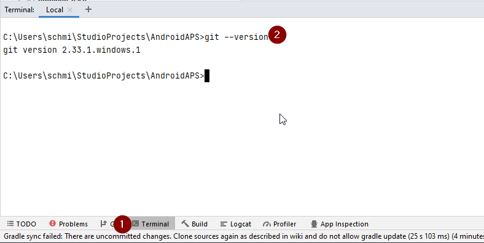
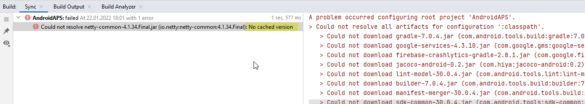
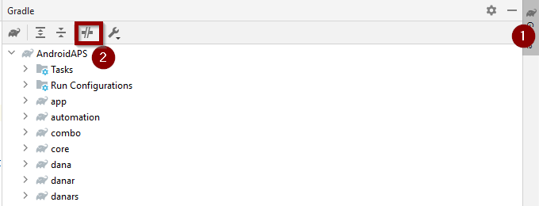
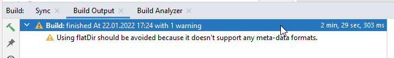

(troubleshooting_androidstudio-troubleshooting-android-studio)=

# Android Studio 故障排除

```{contents} List of common issues
:depth: 2
:local: true
```

(troubleshooting_androidstudio-lost-keystore)=
## 丢失密钥库
如果更新 **AAPS** 时使用相同的密钥库，则无需卸载手机上的旧版本。 因此建议将密钥库存储在安全位置。

如果尝试安装使用不同密钥库签名的 apk 文件，将出现安装失败的提示！

若无法找回旧密钥库或密码，请按以下步骤操作：

1. 在手机上[导出设置](../Maintenance/ExportImportSettings.md)
2. 将设置文件从手机复制或上传至外部存储（如电脑、云存储等）
4. 按照[更新指南](../Maintenance/UpdateToNewVersion)生成新签名的 apk 文件并传输至手机
5. 卸载手机上的旧版 **AAPS**
6. 安装新版 **AAPS**
7. 导入设置</a>以恢复目标完成进度和配置数据

   若在手机中找不到设置文件，请从外部存储复制回手机

8. 重新检查并禁用电池优化设置
9. 保持闭环运行

## Gradle 同步失败
Gradle 同步可能因多种原因失败。 当提示"Gradle sync failed"时，请点击 Android Studio 底部"Build"标签(1)查看具体错误信息(2)


```{contents} Likely reasons for gradle sync failures are:
:depth: 1
:local: true
```

*重要提示*： 解决特定问题后，需要重新触发[Gradle 同步](#gradle-resync)

(troubleshooting_androidstudio-uncommitted-changes)=
### 存在未提交的更改

若出现如下错误：


```
Build file 'C:\Data\50-Android\AndroidAPS\app\build.gradle.kts' line: 243

存在未提交的更改。
请按照 wiki 重新克隆源码并禁止 gradle 更新
```

#### 步骤 1 - 检查 Git 安装
  * 打开 Android Studio 底部的终端标签(1)，输入以下命令：
    ```
    git --version
    ```

    

    注意：git 和 version 之间有一个空格和两个连字符！

  * 若显示 Git 版本号（如上图）， 请继续[步骤 2](#troubleshooting-android-studio-check-for-uncommitted-changes)

  * 若提示：
    ```
    Git: command not found
    ```
    表示 Git 未正确安装

  * [检查 Git 安装](#BuildingAaps-steps-for-installing-git)

  * 若在 Windows 系统且刚安装 Git，需重启计算机使 Git 全局生效

  * 若已安装 Git 并重启后仍无法识别：

  * 在计算机中搜索"git.exe"文件

    记录所在目录路径

  * 转到Windows中的环境变量，选择变量“PATH”并点击编辑。 添加 Git 所在目录

  * 保存并关闭

  * 重启 Android Studio

(troubleshooting-android-studio-check-for-uncommitted-changes)=
#### 步骤 2：检查未提交的更改

  * 在 Android Studio 左侧打开"Commit"标签(1)
  * 可能看到"Default changeset"(2)或"Unversioned files"(3)：

    * 对于"Default changeset"，可能是误更新了 Gradle 或修改了文件内容

    * 右键点击"Default Changeset"选择"Rollback"

      

    * 文件将从 Git 服务器重新获取。 若无其他更改，继续[步骤 3](#gradle-resync)

  * 若存在"Unversioned Files"，可能是误将文件存入源码目录。 重要文件（如密钥库）应移至其他位置。 若不确定文件来源且非自行创建，可删除

    * 使用文件管理器移动或剪切文件至安全位置

    * 返回 Android Studio，点击 Commit 标签中的刷新按钮(4)确保文件已移除

      若无其他更改，继续[步骤 3](#gradle-resync)


#### 步骤 3：重新同步 Gradle

按照[重新同步 Gradle ](#gradle-resync)步骤操作

### Git 拉取失败 - 请确认身份信息

若出现此提示，需配置 Git 身份信息：


在终端依次执行以下命令：

```
git config --global user.name "您的姓名"
git config --global user.email 您的邮箱@example.com
```

姓名需用引号包裹


(troubleshooting_androidstudio-android-gradle-plugin-requires-java-11-to-run)=

(incompatible-gradle-jvm)=
### 不兼容的 Gradle JVM


```
当前构建配置使用了不兼容的 Java 21.0.3 和 Gradle 8.2
无法同步项目

建议升级至 Gradle 8.9 版本

最低兼容 Gradle 版本为 8.5

最大兼容 Gradle JVM 版本为 19
```

或：

```
原因：错误：无效的源版本：21
```

出现此类错误时，需下载正确的 JVM 版本：

1.  查看[要求表](#Building-APK-recommended-specification-of-computer-for-building-apk-file)确认当前构建的 **AAPS** 版本所需的 JVM 版本

2. 点击右侧大象图标(1)打开 Gradle 视图，进入设置(2)选择 **Gradle Settings**(3)：


3.  在“Gradle JDK”字段中，检查是否已选择正确的版本（1）。若未选择，点击该字段查看列表中是否已有目标版本。​ 下方示例显示JVM 21对应的选项标记为“jbr-21”。 若列表中已有，直接选中即可完成配置。 若未找到，点击字段选择"Download JDK"


4. 在版本(1)中选择 **AAPS** 要求的 JDK， 供应商(2)任选， 位置(3)保持默认。


5.  点击 **OK** 关闭**设置**
6. 重新同步 Gradle 按照[重新同步 Gradle ](#gradle-resync)步骤操作

(incompatible-version-of-android-gradle-plugin)=
### 不兼容的 Android Gradle 插件版本

  若出现如下错误：

`项目使用了不兼容的 Android Gradle 插件版本 (AGP x.x.x)。 最新支持版本为 AGP x.x.x`

  

  说明 Android Studio 版本过旧。 通过菜单 Help > Check for updates 更新 Android Studio 及其插件。

(troubleshooting_androidstudio-could-not-resolve-no-cached-version)=
### 无法解析/无缓存版本

  可能出现如下错误：



  * 右侧打开 Gradle 标签(1)

    确保按钮（2）*未*选中。

    

  * 按照[重新同步 Gradle](#gradle-resync) 步骤操作

(troubleshooting_androidstudio-unable-to-start-daemon-process)=
### 无法启动守护进程

  如果您看到类似下面的错误消息，您可能使用的是Windows 10 32位系统。 Android Studio 3.5.1 及以上版本不支持此功能，**AAPS** 开发者对此也无能为力！

  网络上已有相关方法可帮助判断操作系统是 32 位还是 64 位——例如[此链接](https://support.microsoft.com/en-us/windows/32-bit-and-64-bit-windows-frequently-asked-questions-c6ca9541-8dce-4d48-0415-94a3faa2e13d)。

  

(gradle-resync)=
### 重新同步 Gradle

  若仍显示同步失败，点击"Try again"链接重新尝试


  若无错误提示，可手动触发同步：

  * 打开右侧 Gradle 标签(1)

    

  * 右键点击 AAPS(2)

  * 选择"Reload Gradle Project"(3)

## 成功生成签名 APK 但显示 0 个构建变体

生成签名 APK 时可能出现"0 build variants"的误报：


此为假性警告。 检查输出目录即可找到生成的 apk 文件。


## 应用生成时存在编译器/Kotlin 警告

若构建成功但显示黄色/蓝色感叹号警告，可忽略这些警告

 

APK 已成功生成，可传输至手机安装。


## AAPS 未接收 CGM 数据

* 若使用修改版 Dexcom G6 应用：该版本已过时， 请改用[BYODA](#DexcomG6-if-using-g6-with-build-your-own-dexcom-app)

* 若使用 xDrip+：按[xDrip+ 设置页面](#xdrip-identify-receiver)标识接收器


## APK 安装失败


* 确认已将"app-full-release.apk"传输至手机
* 若手机显示"未安装应用"：

1. [导出设置](../Maintenance/ExportImportSettings.md)（在已安装的 AAPS 中）
2. 卸载手机上的 **AAPS**
3. 启用飞行模式并关闭蓝牙
4. 安装新版 apk
5. [导入配置](../Maintenance/ExportImportSettings.md)
6. 重新启用蓝牙并关闭飞行模式

## 安装成功但版本未更新

若成功构建并安装，但版本号未变，可能未[更新本地代码库](#Update-to-new-version-update-your-local-copy)

## 以上方法均无效

若所有方法均无效，可尝试全新构建：

1. [导出设置](../Maintenance/ExportImportSettings.md)（在已安装的 AAPS 中）

2. 准备好密钥密码和密钥库密码。 若忘记密码，可尝试在项目文件中查找（参考[这里](https://youtu.be/nS3wxnLgZOo)）

    或创建新密钥库

3. 按照[指南](#Building-APK-download-AAPS-code)重新构建

4. 成功构建后删除手机旧版 apk，传输并安装新版
5. [重新导入设置](../Maintenance/ExportImportSettings.md)恢复配置
6. 重新检查并禁用电池优化

## 最坏的情况

若问题仍未解决，可尝试完全卸载 Android Studio 后重新安装。  部分用户发现此操作可解决其构建问题。  卸载Android Studio时，请勿删除Android用户设置，并**确保卸载所有与之相关的文件**。若未彻底移除包括隐藏文件在内的所有Android Studio文件，卸载操作可能引发新问题而非解决现有问题。 完整的卸载指南可在线查找，例如：

[https://stackoverflow.com/questions/39953495/how-to-completely-uninstall-android-studio-from-windowsv10](https://stackoverflow.com/questions/39953495/how-to-completely-uninstall-android-studio-from-windowsv10)

然后按[安装指南](#Building-APK-install-android-studio)重新安装。
