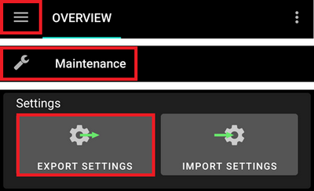
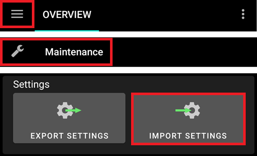

# 创建和恢复备份

在手机上安装AAPS后，它就变成了你每天依赖的“医疗设备”。 强烈建议为手机出现故障、被盗或丢失的情况制定紧急备份计划。 因此，务必做好准备，问问自己：“万一呢？”

为了将你的AAPS设置恢复到现有手机或新手机上，重要的是要将以下项目保存在安全的位置（即：不要保存在手机上）。 最佳实践是至少保留两份独立的备份：一份在本地硬盘或U盘上，另一份（推荐）在云端存储上，如Google Drive或Microsoft 365 OneDrive。 通过将备份存储在云端，你可以随时随地通过手机访问恢复设置所需的一切。

考虑购买一部备用手机，并练习恢复AAPS，以确保备用手机能按预期工作。 这一步将让你对紧急计划的有效性充满信心，如果你的主手机无法使用，你可以无缝继续使用AAPS。

为了能够恢复，手头备有以下项目是很重要的：

- 您的**Android Studio密钥库文件**和相关的**密码**：用于（重新）构建AAPS .APK安装程序文件。
- 最近的一份**AAPS安装程序.APK**副本。
- 最近的一份**设置导出**文件：用于恢复重要设置（包括您的目标！）。
- **如何备份**：您的<0>AAPS主密码</0>
- 额外实用程序的备份：如BYODA和/或xDrip+。
- 关于您设置的个人笔记。

以下是建议进行备份的项目。

## 创建备份

### 用于构建APK的计算机上的密钥库文件
当使用Android Studio构建.APK安装程序文件时，它会使用**密钥库文件和密码**对.APK安装程序文件进行签名。 要更新您当前的AAPS安装，必须使用与初始安装相同的密钥库对更新后的.APK安装程序文件进行签名。 在更新时，所有设置和AAPS数据库都将保留。 请注意，如果不这样做，您将需要先卸载当前的应用程序，然后重新安装并重新配置AAPS。

维护密钥库将大大降低将来更新APK的复杂性，特别是如果您需要从新计算机构建应用程序时。 有关在使用密钥库构建新APK时的详细信息，请参阅[更新AAPS](../Maintenance/UpdateToNewVersion.md)部分。

**何时备份**：在首次构建**AAPS** APK后，应备份密钥库。

**如何备份**：找到您的密钥库路径。 如果不记得，可以在Android Studio中选择**Build > APK > Next**来查找。 路径将列在“Key store path”中。 使用文件资源管理器导航到此路径，并复制您的密钥库文件（文件扩展名为`.jks`）。 将其保存到安全的云位置，以防计算机无法使用。 同时，务必记录下您的密钥库密码、密钥别名和密钥密码。

### 最新的APK副本
如果您的主**AAPS**手机丢失或损坏，拥有APK的副本将允许您快速使用新手机继续**AAPS**。 注意：您还需要备份偏好设置，如下所述。

**何时备份**：您应该保留安装在**AAPS**主手机上的最新APK的备份。 您可能还想保留一个更早的版本，以防出于某种原因需要回滚到该版本。

**如何备份**：使用Android Studio构建APK的计算机上会保留一份副本。 此外，建议使用云平台存储一份安装程序APK的副本。 确保您知道如何在需要时找到这两个位置。 考虑在计算机和云平台上设置专用文件夹来存储这些备份。

### AAPS设置文件（又称“首选项”）
有了APK安装程序文件的副本（见上文）和您的**设置**文件，您就可以快速在现有手机或新手机上开始使用。

**偏好设置**是根据您的设置定制AAPS应用程序的方式。 它们包含诸如配置构建器设置、目标状态、第三方通信设置（例如，Nightscout、Tidepool）、自动化和配置文件等详细信息。

将AAPS设置导出到文件，可以使您将配置恢复到特定的时间点。 如前所述，除了所有配置设置外，导出文件还包含您的目标状态，这在**（重新）安装**AAPS时需要恢复。 如果不这样做，您将需要从头开始重新完成所有目标以启用闭环。 设置文件还使您能够恢复“最后一个已知良好”的设置，以撤销任何配置更改。

**何时备份AAPS设置：**
* 每次完成一个目标时，以防止丢失进度。 _如果没有您的**设置**副本，在您需要重新安装AAPS或更换手机的情况下，您将不得不再次完成所有目标。_

* 每当您计划对配置进行重大更改时（更改SMB设置、更改胰岛素类型、更换泵、更改自动化设置），应在更改前后备份您的**偏好设置**。 这样，您既拥有最新的设置，也拥有更改前的副本，以防需要恢复。

* 仅适用于无管泵（Omnipod和Medtrum）用户：**偏好设置**文件包含当前药盒的连接详细信息，可用于在新手机上恢复与该pod的连接。 如果您在开始使用当前pod后没有导出偏好设置的副本，那么在需要更换当前手机时，您将需要启动新pod。

**如何手动备份：**

1. 如果您是第一次导入或导出**偏好设置**，则需要在[Preferences > General > Protection](#Preferences-master-password)中设置主密码。 设置密码并记录在安全的地方。 _没有此密码，您将无法访问您的**偏好设置**备份。 _

2. 在**AAPS**主屏幕，选择左上角的三条线（汉堡）菜单 > Maintenance（维护）> Export settings（导出设置）> 输入上面设置的主密码 > Ok（确定）。

 

3. 使用手机上的文件资源管理器（通常称为“Files”或“My Files”）导航至Internal Storage > AAPS > preferences。 在这里，您将看到所有导出的偏好设置文件的副本。 文件名应为`YYYY-MM-DD_Time_appname.json`。 将此文件上传到您选择的云平台。 然后，从云平台下载一份副本到您的本地计算机。

(ExportImportSettings-Settings-Export)=

## 设置导出

建议定期导出设置，尤其是在进行配置更改之前和之后。 您可以选择**手动导出或（更推荐）通过自动化方式**进行导出。 请务必记下您的AAPS主密码，并通过将手机上的设置文件复制到例如云存储位置来备份这些文件。

**注意**：_导出的设置将使用您的AAPS主密码进行加密：如果没有用于导出的主密码，您将无法导入设置文件！_

### 导入导出设置
要导出或导入设置，请使用AAPS**维护菜单**中的**导入或导出按钮**。


(ExportImportSettings-Automating-Settings-Export)=
### 自动化设置导出

要实现自动化设置导出[（**参见自动化功能**）](../DailyLifeWithAaps/Automations.md#automating-preference-settings-export)，需在[首选项 > 维护](#preferences-maintenance-settings)中启用"**无人值守设置导出**"选项。

此后可通过[自动化](../DailyLifeWithAaps/Automations.md#automating-preference-settings-export)功能配置定期（_如_每周）或pod更换后的设置导出。

_**注意**：在将设置导入用户时，总是需要输入AAPS密码！_


(ExportImportSettings-restoring-from-your-backups-on-a-new-phone-or-fresh-installation-of-aaps)=
## 在新手机或全新安装的AAPS上从备份中恢复
如果您有想要加载到新手机上的APK和**设置**的备份，或者因任何原因需要在现有手机上删除并重新安装APK，请使用以下说明。

_如果您使用相同密钥库构建的APK更新**AAPS**，则无需遵循此过程。 但是，在应用更新之前，仍建议创建备份。_

如果您在丢失或替换了原始密钥库后更新**AAPS**（即使用没有转移密钥库的新构建计算机），请确保按照上述步骤备份所有设置，然后卸载手机上现有的**AAPS**版本。

如有需要，在执行以下步骤之前，[设置您的CGM/BG源接收器](../Getting-Started/CompatiblesCgms.md)。

```{admonition} Tubeless pumps (Omnipod and Medtrum) users
:class: warning
导入**偏好设置**文件时，如果这些**偏好设置**是在不同的活动pod会话期间导出的，则会停用您当前的pod。 
```

1. 使用上述APK的备份副本，按照[新安装](../SettingUpAaps/TransferringAndInstallingAaps.md)的说明进行操作。

2. 启动**AAPS**并允许所有请求的权限。

3. 退出设置向导。 我们将从**偏好设置**的备份副本中导入所有必要的设置。

4. 在**AAPS**主屏幕，选择请求并允许顶部红色列出的所有权限。

5. 在**AAPS**主屏幕，在[Preferences > General > Protection](#Preferences-master-password)中设置主密码，与您备份时使用的密码相同。

6. 在**AAPS**主屏幕，选择左上角的三条线（汉堡）菜单 > Maintenance（维护）> Export settings（导出设置）> 输入上面设置的主密码 > Ok（确定）。 如果手机上尚不存在preferences文件夹，这将创建该文件夹。

7. 从云平台下载您的**偏好设置**文件备份。

8. 使用文件资源管理器（通常称为“Files”或“My Files”）将文件从下载位置移动到`/internal storage/AAPS/preferences`。

9. 在**AAPS**主屏幕，选择左上角的三条线（汉堡）菜单 > Maintenance（维护）> Import settings（导入设置）> 选择您要从中备份的偏好设置文件 > Ok（确定）> 输入上面设置的主密码 > Ok（确定）。 确保选择正确的偏好设置文件，将显示preferences文件夹中的所有.json文件。

 

10. **AAPS**将自动重启，并应导入所有偏好设置。

11. 仅适用于无管泵（Omnipod和Medtrum）用户 - 如果您的**偏好设置**不是从当前使用的pod备份的，您将需要启动新pod以开始胰岛素输送。

**故障排除**：如果您无法从**AAPS**主屏幕获得活动配置文件集，请选择左上角的三条线（汉堡）菜单 > config builder > Pump > 切换到Virtual Pump > 然后切换回您的泵类型。

### Dana RS用户注意事项

- 由于泵连接设置也会被导入，**AAPS**在您的新手机上将已经“知道”该泵，因此不会开始蓝牙扫描。
- 请手动配对新手机和泵。