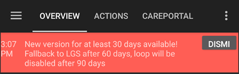

# 发布说明

请按照[更新手册](UpdateToNewVersion)中的说明进行操作。 故障排除部分也涵盖了在**AAPS**更新手册页面上更新时遇到的最常见问题。

当有新版本可用时，您将立即收到通知。 如果在到期日之前未更新，**AAPS**将切换至开环模式。



此提示非常重要，请勿忽略且无意打扰您。 **AAPS**的新版本不仅提供新功能，还包括重要的安全修复。 因此，每位**AAPS**用户都应尽快更新至最新版本。 遗憾的是，仍有来自非常旧版本的错误报告，因此这是为提高每位**AAPS**用户及DIY社区安全性所做的努力。 感谢您的理解。

```{admonition} First version of **AAPS**
:class: note
首个测试版本于2015年发布。 2016年推出了首个正式版本。

目前这些版本的编年记录暂不可用，但由于多次被问及，我们在此进行说明。

```


(maintenance-android-version-aaps-version)=

## Android版本与AAPS版本

如果您的手机使用低于Android 11的系统，将无法使用AAPS v3.3及更高版本，因为最低要求为Android 11。

为允许旧版Android用户继续使用旧版AAPS，我们推送了仅修改版本验证的新版本，不包含其他改进。 不包含其他改进。

### Android 11及以上

- 使用最新AAPS版本
- 从<https://github.com/nightscout/AndroidAPS>下载AAPS代码

### Android 9,10

- 使用AAPS版本**3.2.0.4**
- 从<https://github.com/nightscout/AndroidAPS>的3.2.0.4分支下载代码

### Android 8

- 使用AAPS版本**2.8.2.1**
- 从<https://github.com/nightscout/AndroidAPS>的2.8.2.1分支下载代码

### Android 7

- 使用AAPS版本**2.6.2**
- 从<https://github.com/nightscout/AndroidAPS>的2.6.2分支下载代码

## WearOS版本

- AAPS需要WearOS API级别28（Android 9）或更高

```{tip}
WearOS 5（API级别34，基于Android 14）存在[限制](#BuildingAapsWearOs-WearOS5)。
```

(latestrelease)=

(version3321)=

## Version 3.3.2.1

Release date: 13-08-2025

- Fixed Omnipod Bluetooth connection on Android 16
- CI process (Browser build)
- Fix mmol-mgdl conversion
- Fix wrong time selection in dialogs in some timezones
- Fix reading keys in simple mode
- Fix missed predictions on wear
- Improved ConfigBuilder
- Improved NSCv3 full sync

(version3300)=

## 版本 3.3.2.0

发布日期：2025年3月27日

### 如何升级

* 需使用[Android Studio "Meerkat"版本](#Building-APK-recommended-specification-of-computer-for-building-apk-file)或更高。 若已构建过3.3.x版本，需升级Android Studio。

### 从此版本起，通知和版本强制机制已简化并调整如下：
*  设备离线时（无网络连接）不会过期， 即取消60天和90天的宽限期。
*  过期后强制进入LGS模式
*  减少通知频率：
   - 剩余28天以上：每7天提醒
   - 剩余14-27天：每3天提醒
   - 剩余不足14天：每天提醒
   - 通知将在中午后生成，避免夜间打扰
* 仅保留两种通知类型：
   - 新版本可用（不影响AAPS运行）
   - 应用即将/已过期（未过期时不影响AAPS运行，过期后进入LGS模式）

### 新功能

* SMS RESTART命令 @MilosKozak
* 手表配置切换参数 @olorinmaia
* AAPS V2表盘暗色模式 @olorinmaia
* G7数据传输改进 @olorinmaia
* 小部件配置 @MilosKozak
* 单选按钮UI优化 @olorinmaia
* 自动化：通过地图选择位置 @MilosKozak
* 主屏幕显示版本号 @MilosKozak
* 强制使用现有git系统编译（禁用zip下载）
* 主界面显示版本 @MilosKozak
* Tidepool上传优化 @ConstantinMatheis

### 问题修复

* Dash解绑修复 @Andreas
* Garmin修复 @robertbuessow @suside
* 对话框IOB显示修复 @olorinmaia
* 目标拼写与验证改进 @MilosKozak
* 模拟TBR渲染修复 @MilosKozak
* 安全绕过修复 @tdrkDev

## 版本 3.3.1.3

发布日期：2025年1月21日

### 问题修复

* Dash：绑定改为可选（默认关闭）@MilosKozak
* Equil：修复10+U大剂量，报警优化 @EquilHack
* Garmin：手表功能改进 @swissalpine
* 手表功能优化 @olorinmaia
* 通过手表控制闭环状态 @tdrkDev
* 稳定性提升

*  **可能需要重新设置[认证器](#sms-commands-authenticator-setup)。**

## 版本 3.3.1.2

发布日期：2025年1月15日

### 如何升级

* 构建此版本需要[Android Studio "Ladybug Feature Drop"版本](#Building-APK-recommended-specification-of-computer-for-building-apk-file)或更高。 **这与普通的“Ladybug”版本不同。** 如果您已构建过3.3.x版本，需要再次升级Android Studio。

### 问题修复

* Dash：在Android 15+使用绑定
* 恢复Overview的Dexcom按钮
* Equil：允许移除故障泵
* 当DynISF调整因子为零时提示
* NSCv3：解决时间不同步设备的Websocket通信
* SMS命令：修复一次性密码。 **可能需要重新设置[认证器](#sms-commands-authenticator-setup)。 **
* 修复部分偏好设置无法编辑的问题
* 修复虚拟泵的主密码重置
* 修复大设置备份文件的导入

## 版本 3.3.1.0

发布日期：2025年1月6日

### UI变更

* [为AAPSClient和AAPSClient2添加区分颜色](#RemoteControl_aapsclient) @MilosKozak
* 优化用户操作布局与图标

### 其他功能

* 新增自动化触发条件：[步数统计](#screen-heart-rate-steps) @Roman Rihter
* NSCv3全量同步支持（包括TBR等此前未同步的数据）@MilosKozak
* NSClient v3：实现公告功能（_如_从AAPSClient到AAPS）@MilosKozak

### 技术调整与修复

* 修复Insight崩溃 @philoul
* 修复Nightscout中过多deviceStatus条目生成 @MilosKozak
* 修复碳水吸收计算 @MilosKozak
* 修复单选按钮与复选框颜色 @MilosKozak
* 修复DynISF百分比迁移错误 @MilosKozak
* 解决DynISF通知错位问题 @MilosKozak
* 修复表盘显示问题 @philoul

## 版本 3.3.0.0

发布日期：2024年12月29日

### 主要功能

* **[动态ISF](../DailyLifeWithAaps/DynamicISF.md)**不再作为独立插件，现整合至[OpenAPS SMB](#Config-Builder-aps)插件，并调整行为：
  * **配置文件切换**和**配置文件百分比**现已被纳入**动态ISF**的计算中，用于调整动态敏感度的应用强度。
  * 使用过去24小时的平均**ISF**值进行推注向导和**COB**计算， 不再使用**配置文件ISF**（历史数据缺失时除外）
  * 动态ISF文档已重写， 请务必阅读[启用动态ISF的注意事项](#dyn-isf-things-to-consider-when-activating-dynamicisf)。
* 为FreeStyle Libre 2/3用户启用[“始终SMB”和“碳水后SMB”](#Open-APS-features-enable-smb-always)
  * 注：需使用最新版xDrip+或Juggluco
* 新增**自动化**触发条件
* 无人值守设置导出

### 如何升级

* 升级前：
  * **<span style="color:red">要求Android 11及以上系统</span>**， 请先确认手机版本
  * 若使用旧版Combo驱动（依赖ruffy设备），请先迁移至[原生Combo驱动](../CompatiblePumps/Accu-Chek-Combo-Pump-v2.md)
  * 升级后将丢失[主屏幕附加图表](#AapsScreens-section-g-additional-graphs)，建议手动记录当前配置以便恢复
  * [Android 15的蓝牙连接问题](../Getting-Started/Phones.md)（非**AAPS**问题）， 需等待3.3.1.2修复
  * 主屏幕BYODA按钮因Android限制暂时移除， （3.3.1.2恢复）
* 升级步骤：遵循[更新指南](../Maintenance/UpdateToNewVersion.md)
  * 需使用[Android Studio "Ladybug"版本](#Building-APK-recommended-specification-of-computer-for-building-apk-file)或更高， 旧版本需<span style="color:red">配置JVM 21</span> （参见[Android Studio疑难解答 > JVM不兼容](#incompatible-gradle-jvm)）
  * 重要提示：如果不想丢失**AAPS**历史数据，升级时选择“更新”而非“卸载/重装”， 备份当前设置及旧版APK以防万一
* 升级后：
  * 在维护选项卡中设置新的[“AAPS目录”](#preferences-maintenance-logdirectory)

### 详细变更

#### CGM与泵驱动

* 为FreeStyle Libre 2/3用户[启用“始终SMB”和“碳水后SMB”](#Open-APS-features-enable-smb-always) @MilosKozak
* [Medtrum驱动](../CompatiblePumps/MedtrumNano.md)改进 @jbr77rr
  * 通信优化，新增兼容性设置
  * 激活时显示储药量
  * 修复激活流程错误
  * 同步状态反馈优化
* 新增支持泵型：[Equil 5.3](../CompatiblePumps/Equil5.3.md) @EquilHack
* 新增支持CGM：[Ottai](../CompatibleCgms/OttaiM8.md) @ottai-developer 和 [Syai Tag](../CompatibleCgms/SyaiTagX1.md) @syai-dev
* Insight驱动重写为Kotlin @Philoul
* 移除旧版依赖ruffy的Combo驱动

#### UI变更

* 新安装默认启用[简易模式](#preferences-simple-mode) @MilosKozak
* [快捷向导](#Preferences-quick-wizard)新增选项 @radicalb
  * 使用与计算器相同的推注逻辑， 支持“碳水时间”预推注
* [图表比例菜单](#aaps-screens-main-graph)与[附加图表菜单](#AapsScreens-activate-optional-information)优化 @Philoul
* [配置构建器布局](../SettingUpAaps/ConfigBuilder.md)改进 @MilosKozak
  * 默认折叠区块， 点击箭头展开
* AAPSClient中显示动态敏感度
* 推注向导UI优化 @kenzo44
* 浅色主题下泵选项卡文本显示修复 @jbr77rr

#### 其他功能

* [无人值守设置导出](#ExportImportSettings-Automating-Settings-Export) @vanelsberg
* 新增[自动化触发条件](#automations-automation-triggers) @vanelsberg
  * 储药器激活（仅限贴敷泵）
* 新增[自动化触发条件](#automations-automation-triggers) @jbr77rr
  * 管路、胰岛素、电池、传感器、储药器使用时间，泵电池电量
* 允许输入负碳水 @MilosKozak
* 新增[“AAPS目录”](#preferences-maintenance-settings)参数，可自定义存储路径
* 泵暂停时允许[胰岛素记录](#aaps-screens-buttons-insulin) @jbr77rr
* 更新[目标2](#objectives-objective2) @MilosKozak
  * 验证主密码设置
* 测试模式支持随机碳水 @MilosKozak
* 修复TDD计算错误 @MilosKozak
* SMS命令：允许[**禁用**NS触发的配置切换通知短信](#sms-commands-too-many-messages) @MilosKozak

#### 智能手表

* Wear与表盘功能改进 @Philoul @MilosKozak @olorinmaia
* 自动化操作手表磁贴 @Philoul
* 整合AAPS、AAPSClient、AAPSClient2表盘以监控多患者 @Philoul @MilosKozak
* 额外功能：仅手表显示用户操作 @MilosKozak

#### 技术调整

* [日志路径变更](#Accessing-logfiles-accessing-logfiles)
* 新模块结构 @MilosKozak
* 分离持久层与主代码 @MilosKozak
* 构建文件转用kts格式 @MilosKozak
* 算法转用Kotlin提升性能 @MilosKozak
* 新增大量单元测试 @MilosKozak等
* 更多代码转为Kotlin @MilosKozak
* 新偏好设置管理（XML→Kotlin）@MilosKozak
* 新CI配置，自有服务器运行 @MilosKozak
* 库更新至最新版，toml配置 @MilosKozak
* 迁移至Kotlin 2.0，Java 21 @MilosKozak

(version3204)=

## [版本 3.2.0.4](https://github.com/nightscout/AndroidAPS/releases/tag/3.2.0.4)

发布日期：2024年02月27日

这是最后一个支持Android 10的版本。 如果如法升级到Android 11, [请将 AAPS 升级到 3.2.0.4](#update-aaps-3204).

### 变更内容

- 支持xDrip G7
- 修复美敦力
- 修复自动化图标
- 修复绕过目标1

(version3200)=

## 版本 3.2.0.0 致敬 @Philoul

发布日期：2023年10月23日

### 重要提示

- 需要NS 15
- 使用NS v3插件时，通过NS界面（+按钮）或其他v1 API应用输入的治疗不会同步至AAPS。 这将在NS的未来版本中得到修复。 在NS全面转用v3前，请确保AAPS与AAPSClient使用相同客户端（v1或v3） 同样适用于AAPS和AAPSClient本身。
- v3插件的Websocket工作方式类似v1。 未启用WebSocket时，AAPS会定期从NS调度下载数据，这应该会降低功耗，因为NS不需要保持永久连接。 反之，这会导致数据交换出现延迟。 使用前请阅读[开发团队重要说明](#Important-comments-on-using-v3-versus-v1-API-for-Nightscout-with-AAPS)！
- 使用xDrip作为CGM源需重新选择
- Tidepool可用作NS替代完成首目标
- 发送数据至xDrip+需配置xDrip同步插件。 为了从AAPS接收BGs，必须选择“xDrip+ Sync Follower”作为源
- 切换至ComboV2驱动需卸载Ruffy并重新配对泵
- 启用DynISF需完成目标11（所有前置目标需完成）


### 变更内容

- EOPatch2/GlucomenDay泵驱动 @jungsomyeonggithub @MilosKozak
- ComboV2驱动（无需Ruffy）@dv1
- Medtrum Nano驱动 @jbr7rr
- 韩国版DanaI支持 @MilosKozak
- Glunovo CGM支持 @christinadamianou
- G7支持 @MilosKozak @rICTx-T1D @khskekec
- NSClient v3插件 @MilosKozak
- Tidepool支持 @MilosKozak
- 平滑插件 @MilosKozak, @justmara, 指数平滑@nichi (Tsunami)，平均平滑@jbr7rr
- DynamicISF插件 @Chris Wilson @tim2000s
- Garmin表盘与心率支持 @buessow
- 新徽标 @thiagomsoares
- 新表盘 @Philoul
- 修复3.1版本大量问题
- 更多位置支持添加备注 @Sergey Zorchenko
- UI修复 @MilosKozak @osodebailar @Andries-Smit @yodax @Philoul @dv1 @paravoid
- 新增SMS命令LOOP LGS/CLOSED @pzadroga
- Wear翻译 @Andries-Smit
- xDrip通信模块分离 @MilosKozak
- 内部调整：库更新，Rx3迁移，模块结构调整 @MilosKozak
- Diaconn驱动修复 @miyeongkim
- 数据库维护选项扩展 @MilosKozak
- AAPSClient提供信息，如果主手机已接通电源 @MilosKozak
- 推注向导调整： CGM不可用时忽略百分比（默认100%）
- 迁移至kts构建系统 @MilosKozak
- CI集成改进 @MilosKozak @buessow
- 测试清理 @ryanhaining @MilosKozak
- 新增11万行代码，修改24万行，涉及6884个文件

(Important-comments-on-using-v3-versus-v1-API-for-Nightscout-with-AAPS)=
### 关于AAPS使用Nightscout v3与v1接口的重要注意事项

v1是用于在NS网站和NS服务器之间交换数据的旧协议， 它有许多限制
- v1仅发送2天的数据
- 每次重新连接时都会发送所有2天的数据
- 必须使用WebSocket = 需保持持久连接，导致更高的电池消耗。
- 当与Nightscout频繁断连时，连接将暂停15分钟以防止数据用量过高。

v3为新协议， 更加安全高效
- 在使用令牌时，您可以更好地定义访问权限
- 协议在双方（AAPS和NS）都更高效
- 可以从NS读取最多3个月的数据
- 每个设备均可独立选择是否启用WebSocket​​（启用即实时更新更快；不启用虽降低功耗，但数据同步会延迟，例如数分钟）。
- NSClient在断开连接时不会暂停

限制：
- AAPS 3.2需搭配NS 15使用
- v3无法读取v1数据（未来NS版本可能解决）
- 反之，由于v1接口追踪数据变化的方法老旧低效，可能导致v1无法及时识别v3接口所做的更改。​
- 请留意：目前Nightscout内部仍采用v1接口，因此若你使用v3接口，将无法通过Nightscout网页界面手动输入数据。​ 若需远程输入数据，必须通过短信使用AAPS客户端。​

推荐设置：
- 基于上述原因，你应在所有设备上统一选择并仅使用一种接口方案（请注意，目前其他数据上传工具均仍在使用v1接口）。 如果您决定使用v3，请在AAPS和所有AAPSClient中选择v3
- 优先选择v3以提高效率
- 是否在v3中使用Websockets取决于您的偏好
- 强烈建议仅由AAPS统一收集所有数据，并作为唯一上传者将数据推送至Nightscout。​ 其他所有设备及应用应仅从NS读取数据，禁止写入。 遵循此方案可有效避免数据冲突与同步错误。​ 这也适用于使用Dexcom Share连接器将数据获取到NS的BG数据。

(version3100)=

## 版本 3.1.0

发布日期：2022年7月19日

(Releasenotes-important-hints-3-1-0)=
### 重要提示

- 更新完成后，请卸载Wear版应用并重新安装新版本。
- Omnipod用户请在更换储药器时更新！

### 变更内容

- 修复3.0版本问题
- 修复应用冻结 @MilosKozak
- DASH驱动修复 @avereha
- Dana驱动修复 @MilosKozak
- 大量UI优化，Material Design迁移，新图标 @Andries-Smit等 @Andries-Smit @MilosKozak @osodebailar @Philoul
- 小部件 @MilosKozak
- Aidex CGM支持 @andyrozman @markvader（仅限泵控制）
- 手表、[Wear OS小组件](#WearOsSmartwatch-wear-os-tiles)，翻译 @Andries-Smit
- Wear代码重构。 不再向后兼容 @MilosKozak
- a11y改进 @Andries-Smit
- 新增PIN保护 @Andries-Smit
- 图形比例菜单设置 @MilosKozak
- 统计信息增强 @MilosKozak
- 移除MDI插件，以VirtualPump为主
- 新增自动化操作：停止处理

## 版本 3.0.0

发布日期：2022年1月31日

(Releasenotes-important-hints-3-0-0)=
### 重要提示

- **最低支持Android 9.0。**
- **数据不会迁移到新数据库。 **不要抱怨，这是一个巨大的变化，所以简单来说是不可能的。 升级后，IOB、COB、治疗记录等数据将被清空。 升级后IOB、COB等数据清零，需新建[配置文件切换](../DailyLifeWithAaps/ProfileSwitch-ProfilePercentage.md) 请谨慎规划升级时间！ ！ 建议在无活性胰岛素和碳水时进行升级
- AAPS与NSClient需版本一致

确保在更新到3.0后按照[此处](../Maintenance/Update3_0.md)所述检查和调整设置。

### 准备步骤

**升级前至少两天：**

- 禁用Nightscout的Dexcom桥接
- 如果您使用G5/G6和xDrip作为收集器，则必须更新xDrip到2022年1月14日之后的新版本
- 建议G5/G6用户转用BYODA收集器以利用反向平滑（你仍可将xDrip用于其他用途，因其可通过BYODA接收数据）。

### 变更内容

- 代码重构（10万行新增，10.5万行修改）

- [Omnipod DASH支持](../CompatiblePumps/OmnipodDASH.md) @AdrianLxM等

- [Dana-i支持](../CompatiblePumps/DanaRS-Insulin-Pump.md) @MilosKozak

- [DiaconnG8支持](../CompatiblePumps/DiaconnG8.md)

- Glunovo支持

- 数据库升级至Room @MilosKozak等

- 大量代码转为Kotlin @MilosKozak

- 新泵驱动接口

- NSClient重写以优化同步 @MilosKozak

  - 禁止从NS删除记录（仅失效）
  - 禁止修改NS记录
  - 无需工程模式即可同步
  - 支持数据重同步

- 配置文件切换行为更改。 现在区分配置文件切换*（用户想要的东西）*和配置文件更改*（由泵执行的更改）*@MilosKozak @Tebbe

- 配置文件切换可启动临时目标 @MilosKozak

- NSProfile已弃用，仅可使用本地配置文件。 可[同步至NS](#Update3_0-nightscout-profile-cannot-be-pushed) @MilosKozak

- [主密码重置流程](#Update3_0-reset-master-password) @MilosKozak

- 用户操作追踪 @Philoul

- 新增自动化临时目标值触发 @Philoul

- 新增自动化Careportal操作 @Philoul

- 碳水对话框添加推注提醒 @Philoul

- Bolus 向导改进

- UI优化 @MilosKozak

- 新增用户自动化按钮 @MilosKozak

- 自动化布局更新 @MilosKozak

- 历史浏览器修复 @MilosKozak

- 移除目标9 @MilosKozak

- 修复CGM数据不稳定相关错误 @MilosKozak

- DanaR/RS通信改进 @MilosKozak

- CircleCI集成 @MilosKozak

- 文件位置更改：

  - /AAPS/extra（工程模式）
  - /AAPS/logs /AAPS/exports
  - /AAPS/preferences

## 版本 2.8.2

发布日期：2021年1月23日

- 另见[版本2.8.1.1的重要提示](#version-2811)

### 变更内容

- 稳定性提升
- Android 8+适配优化
- 图标改进
- 手表功能优化
- NSClient修复
- 推注顾问支持Pumpcontrol与NSClient

## 版本 2.8.1.1

发布日期：2021年1月12日

(important-hints-2-8-1-1)=
### 重要提示

- 强制启用**NS_UPLOAD_ONLY**选项
- 如果您使用NSClient输入临时目标、碳水化合物或配置文件切换，则必须在AAPS中将其关闭，**但仅在您的同步工作正常的情况下**（即，您没有看到不想要的数据更改，如自我修改临时目标、临时基础率等）。
- 注意：若其他应用（如xDrip的广播/上传/同步功能）正在处理治疗数据，请勿进行此操作。​
- 仅工程模式可关闭NS_UPLOAD_ONLY

### 主要变更

- RileyLink、Omnipod和MDT泵改进和修复
- 强制NS_UPLOAD_ONLY
- 修复SMB与Dexcom应用
- 表盘修复
- 崩溃报告优化
- gradle回退以支持直接安装表盘
- 自动化修复
- RS驱动改进
- 多崩溃修复
- UI优化
- 新翻译

(Releasenotes-version-2-8-0)=
## 版本 2.8.0

发布日期：2021年1月1日

### 重要提示

- **最低Android版本8.0**，旧版请使用仓库中的2.6.1.4
- [目标调整](#objectives-objective3)，**升级前完成未完成目标**
- 仓库仍为<https://github.com/nightscout/AndroidAPS> 如果您不熟悉git，最简单的更新方法是删除AAPS目录并进行[新克隆](../SettingUpAaps/BuildingAaps.md)。
- 使用[Android Studio 4.1.1](https://developer.android.com/studio/)或更高构建

### 主要新功能

- [Omnipod Eros支持](../CompatiblePumps/OmnipodEros.md) @bartsopers等
- [推注顾问](#Preferences-quick-wizard)与[进食提醒](#AapsScreens-section-j) @MilosKozak
- 新表盘 @rICTx-T1D
- Dana RS连接优化 @MilosKozak
- 移除Dexcom原生应用的SMB“未变化CGM值”限制
- 新增[低分辨率皮肤](#Preferences-skin)
- 新增[“孕妇”患者类型](#Open-APS-features-overview-of-hard-coded-limits) @Brian Quinion
- NSClient平板布局 @MilosKozak
- NSClient同步胰岛素、敏感度与显示设置 @MilosKozak
- [偏好设置过滤器](../SettingUpAaps/Preferences.md) @Brian Quinion
- 新泵图标 @Rig22等
- 支持[Lyumjev胰岛素](#Config-Builder-lyumjev)
- SetupWizard优化 @MilosKozak
- 安全增强 @dlvoy
- 各种改进和修复 @AdrianLxM @Philoul @swissalpine @MilosKozak @Brian Quinion

(Releasenotes-version-2-7-0)=
## 版本 2.7.0

发布日期：2020年9月24日

升级后请按[此指南](../Maintenance/Update2_7.md)检查设置。

需完成[目标11](#objectives-objective10)以继续使用[自动化](../DailyLifeWithAaps/Automations.md)功能（所有前置目标需完成）。 例如，若你尚未完成[目标3](#objectives-objective3)中的考核，则必须先完成该考核才能开始目标11。 这不会影响您已经完成的其他目标。 您已完成的目标将保留！

### 主要新功能

- 依赖注入，库更新，代码转Kotlin @MilosKozak等
- Dana泵模块 @MilosKozak
- [新布局选择](../DailyLifeWithAaps/AapsScreens.md) @MilosKozak
- 新[状态灯布局](#Preferences-status-lights) @MilosKozak
- [多图表支持](#AapsScreens-activate-optional-information) @MilosKozak
- [配置助手](../SettingUpAaps/YourAapsProfile.md) @MilosKozak
- [动态目标可视化](#AapsScreens-visualization-of-dynamic-target-adjustment) @Tornado-Tim
- 新[偏好设置布局](../SettingUpAaps/Preferences.md) @MilosKozak
- SMB算法更新 @Tornado-Tim
- [低血糖暂停模式](#Preferences-aps-mode) @Tornado-Tim
- [最低碳水需求通知](#key-aaps-features-minimal-carbs-required-for-suggestion) @twain47 @Tornado-Tim
- 移除Careportal（移至Actions） @MilosKozak
- 新加密备份格式 @dlvoy
- 新SMS TOTP验证 @dlvoy
- [新SMS命令PUMP CONNECT/DISCONNECT](#SMSCommands-commands) @Lexsus
- Dana泵基础率优化 @Mackwe
- Insight修复 @TebbeUbben @MilosKozak
- [默认语言设置](#Preferences-general) @MilosKozak
- 矢量图标 @Philoul
- [MDT泵中性临时基础率设置](#MedtronicPump-configuration-of-the-pump) @Tornado-Tim
- 历史记录优化 @MilosKozak
- 移除OpenAPS MA算法 @Tornado-Tim
- 移除Oref0敏感度 @Tornado-Tim
- [生物识别/密码保护设置](#Preferences-protection) @MilosKozak
- [新自动化触发条件](../DailyLifeWithAaps/Automations.md) @PoweRGbg
- [Open Humans上传](../SupportingAaps/OpenHumans.md) @TebbeUbben @AdrianLxM
- 新文档 @Achim

(Releasenotes-version-2-6-1-4)=
## 版本 2.6.1.4

发布日期：2020年4月5日

请使用[Android Studio 3.6.1](https://developer.android.com/studio/)或更高版本构建APK。

### 主要新功能

- Insight：针对固件版本3禁用大剂量振动（第二次尝试）
- 其他功能与2.6.1.3相同。 更新是可选的。

## 版本 2.6.1.3

发布日期：2020年3月5日

请使用[Android Studio 3.6.1](https://developer.android.com/studio/)或更高版本构建APK。

### 主要新功能

- Insight：针对固件版本3禁用大剂量振动
- 其他功能与2.6.1.2相同。 更新是可选的。

## 版本 2.6.1.2

发布日期：2020年4月19日

请使用[Android Studio 3.6.1](https://developer.android.com/studio/)或更高版本构建APK。

### 主要新功能

- 修复Insight服务中的崩溃问题
- 其他功能与2.6.1.1相同。 如果未受此错误影响，则无需升级。

## 版本 2.6.1.1

发布日期：2020年4月6日

请使用[Android Studio 3.6.1](https://developer.android.com/studio/)或更高版本构建APK。

### 主要新功能

- 解决使用Combo泵时SMS CARBS命令的问题
- 其他功能与2.6.1相同。 如果未受此错误影响，则无需升级。

## 版本 2.6.1

发布日期：2020年3月21日

请使用[Android Studio 3.6.1](https://developer.android.com/studio/)或更高版本构建APK。

### 主要新功能

- 允许在NSClient设置中仅输入`https://`
- 修复了手表端[BGI](../UsefulLinks/Glossary.md)显示异常的问题。​
- 修复小UI错误
- 修复Insight崩溃问题
- 修复Combo泵的未来碳水化合物输入
- 修复LocalProfile到NS的同步
- Insight警报改进
- 改进从泵历史记录中检测大剂量
- 修复NSClient连接设置（wifi、充电）
- 修复向xDrip发送修正

(Releasenotes-version-2-6-0)=
## 版本 2.6.0

发布日期：2020年2月29日

请使用[Android Studio 3.6.1](https://developer.android.com/studio/)或更高版本构建APK。

### 主要新功能

- 小幅设计更改（主页…）

- 移除Careportal选项卡/菜单

- 新本地配置文件插件

  - 本地配置文件可以保存多个配置文件
  - 可以克隆和编辑配置文件
  - 可以将配置文件上传到NS
  - 可以将旧配置文件开关克隆到新配置文件（应用时间偏移和百分比）
  - 用于目标设置的垂直数字选择器​

- 移除SimpleProfile

- [扩展大剂量](#Extended-Carbs-extended-bolus-and-switch-to-open-loop-dana-and-insight-pump-only)功能 - 闭环将被禁用

- MDT插件：修复重复条目错误

- 配置文件中未指定单位，但它是全局设置

- 向启动向导添加新设置

- 不同的UI和内部改进

- [穿戴设备的小部件](../WearOS/WearOsSmartwatch.md)

- 新[SMS命令](../RemoteFeatures/SMSCommands.md) BOLUS-MEAL、SMS、CARBS、TARGET、HELP

- 修复语言支持

- 目标：[允许回溯](#CompletingTheObjectives-go-back-in-objectives)，时间获取对话框

- 自动化：[允许排序](#Automations-the-order-of-the-automations-in-the-list-matters)

- 自动化：修复自动化在禁用循环时运行的错误

- Combo的新状态行

- GlucoseStatus改进

- 修复TempTarget NS同步

- 新统计活动

- 允许在开环模式下进行扩展大剂量

- Android 10闹钟支持

- 大量新翻译

## 版本 2.5.1

发布日期：2019年10月31日

请注意[版本2.5.0](#Releasenotes-version-2-5-0)中列出的[重要说明](#Releasenotes-version-2-5-0)和[限制](#Releasenotes-is-this-update-for-me-currently-is-not-supported)。 \*修复了网络状态接收器中的一个错误，该错误导致多次崩溃（虽然不严重，但会浪费大量能量进行重新计算）。 \*新版本控制将允许进行小更新而不会触发更新通知。

(Releasenotes-version-2-5-0)=
## 版本 2.5.0

发布日期：2019年10月26日

(Releasenotes-important-notes-2-5-0)=

### 重要说明

- 请使用[Android Studio版本3.5.1](https://developer.android.com/studio/)或更高版本来[构建APK](../SettingUpAaps/BuildingAaps.md)或[更新](UpdateToNewVersion)。
- 如果您使用xDrip，[识别接收器](#xdrip-identify-receiver)必须设置。
- 如果您使用Dexcom G6和打过补丁的Dexcom应用程序，则需要[2.4文件夹](https://github.com/dexcomapp/dexcomapp/tree/master/2.4)中的版本。
- Glimp从版本4.15.57及更高版本受支持。

(Releasenotes-is-this-update-for-me-currently-is-not-supported)=
### 这个更新适合我吗？ 目前不支持

- Android 5及以下版本
- Poctech
- 600SeriesUploader
- 2.3目录中的打过补丁的Dexcom

### 主要新功能

- 目标SDK内部更改为28（Android 9），支持Jetpack
- 支持RxJava2、Okhttp3、Retrofit
- 支持旧款[美敦力泵](../CompatiblePumps/MedtronicPump.md)（需要RileyLink）
- 新增[自动化插件](../DailyLifeWithAaps/Automations.md)
- 允许[仅注射部分剂量](#Preferences-advanced-settings-overview)（基于推注向导计算结果）。​
- 渲染胰岛素活性
- 根据autosens结果调整IOB预测
- 支持新的Dexcom修补版APK（[2.4文件夹](https://github.com/dexcomapp/dexcomapp/tree/master/2.4)）
- 验证签名
- 允许OpenAPS用户绕过目标
- 新增[目标](../SettingUpAaps/CompletingTheObjectives.md) - 考试、应用操作（如果您在以前的版本中至少开始了“开放循环入门”目标，则考试是可选的。）
- 修复了Dana\*驱动程序中报告错误时间差的问题
- 修复了[SMS通信器](../RemoteFeatures/SMSCommands.md)中的错误

## 版本 2.3

发布日期：2019年4月25日

### 主要新功能

- Insight的重要安全修复（如果您使用Insight，这非常重要！）
- 修复历史浏览器
- 修复增量计算
- 语言更新
- 检查GIT并在Gradle升级时发出警告
- 更多自动化测试
- 修复AlarmSound服务中的潜在崩溃（感谢@lee-b！）
- 修复BG数据广播（现在独立于SMS权限工作！）
- 新增版本检查器

## 版本 2.2.2

发布日期：2019年4月7日

### 主要新功能

- Autosens修复：停用TT提高/降低目标
- 新增翻译
- Insight驱动程序修复
- SMS插件修复

## 版本 2.2

发布日期：2019年3月29日

### 主要新功能

- [DST修复](#time-adjustment-daylight-savings-time-dst)
- Wear更新
- [SMS插件](../RemoteFeatures/SMSCommands.md)更新
- 目标回溯。
- 如果手机磁盘已满，则停止循环

## 版本 2.1

发布日期：2019年3月3日

### 主要新功能

- [Accu-Chek Insight](../CompatiblePumps/Accu-Chek-Insight-Pump.md)支持（由Tebbe Ubben和JamOrHam提供）
- 主屏幕上的状态灯（Nico Schmitz）
- 夏令时助手（Roumen Georgiev）
- Fix processing profile names coming from NS (Johannes Mockenhaupt)
- 修复UI阻塞（Johannes Mockenhaupt）
- 支持更新的G5应用（Tebbe Ubben和Milos Kozak）
- 支持G6、Poctech、Tomato、Eversense BG源（Tebbe Ubben和Milos Kozak）
- 修复了从首选项中禁用SMB的问题（Johannes Mockenhaupt）

### 杂项

- 如果您使用的是非默认`smbmaxminutes`值，则需要重新设置此值

## 版本 2.0

发布日期：2018年11月3日

### 主要新功能

- oref1/SMB支持（[oref1文档](https://openaps.readthedocs.io/en/latest/docs/Customize-Iterate/oref1.html)）请务必阅读文档，了解SMB的预期功能、行为、能实现什么以及如何使用它以确保其顺畅运行。
- 支持Accu-Chek Combo泵
- 设置向导：引导您完成AAPS的设置过程

(Releasenotes-settings-to-adjust-when-switching-from-ama-to-smb)=
### 从AMA切换到SMB时需要调整的设置

- 必须启动目标10才能启用SMB（SMB标签通常会显示适用的限制）

- maxIOB现在包括_所有_IOB，而不仅仅是添加的基础量。 也就是说，如果为一餐给予8U的推注，而maxIOB为7U，则在IOB降至7U以下之前，不会给予SMB。

- 从AMA切换到SMB时，min_5m_carbimpact的默认值从3更改为8。 如果您是从AMA升级到SMB，则需要手动更改它

- 注意：在构建AAPS 2.0 APK时：当前版本的Android Gradle插件不支持按需配置！ 如果构建失败并出现与“按需配置”相关的错误，您可以执行以下操作：

  - 点击文件>设置（在Mac上，点击Android Studio>首选项）打开首选项窗口。
  - 在左侧窗格中，点击构建、执行、部署>编译器。
  - 取消选中按需配置复选框。
  - 点击应用或确定。

(Releasenotes-overview-tab)=
### 概述标签

- 顶部功能区提供访问暂停/禁用循环、查看/调整配置文件以及启动/停止临时目标（TT）的权限。 TT使用首选项中设置的默认值。 新的Hypo TT选项是一个高临时TT，以防止循环过于激进地纠正救援碳水化合物。
- 治疗按钮：旧的治疗按钮仍然可用，但默认隐藏。 现在可以配置按钮的可见性。 新增胰岛素按钮、新增碳水化合物按钮（包括[eCarbs/扩展碳水化合物](../DailyLifeWithAaps/ExtendedCarbs.md)）
- [彩色预测线](#aaps-screens-prediction-lines)
- 在胰岛素/碳水化合物/计算器/填充对话框中显示备注字段的选项，这些字段会上传到NS
- 更新的填充对话框允许填充和创建用于更换输注部位和更换药筒的Careportal条目

### 手表

- 单独的构建变体已弃用，现在包含在常规完整构建中。 要从手表使用推注控制，请在手机上启用此设置
- 向导现在只询问碳水化合物（如果在手表设置中启用了百分比，则还会询问百分比）。 哪些参数包含在计算中可以在手机上的设置中配置
- 确认和信息对话框现在也可以在Wear 2.0上工作
- 添加了eCarbs菜单条目

### 新插件

- PocTech应用作为BG源
- Dexcom修补版应用作为BG源
- oref1灵敏度插件

### 杂项

- 应用现在使用抽屉来显示所有插件；在配置构建器中选为可见的插件将作为顶部的标签（收藏夹）显示
- 对配置构建器和目标标签进行了大修，添加了描述
- 新应用图标
- 大量改进和错误修复
- 如果泵长时间无法访问（例如，泵电池耗尽）或错过BG读数，则发出与Nightscout无关的警报（请参阅设置中的*本地警报*）
- 保持屏幕开启的选项
- 显示Android通知作为通知的选项
- 高级过滤（允许始终启用SMB和餐后6小时）支持使用修补版Dexcom应用或xDrip与G5原生模式作为BG源。
