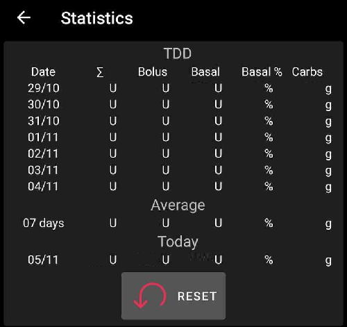

# **复查您的数据​**

## **AAPS历史浏览器**

​**AAPS**​ 将所有用户历史数据（__**血糖****、治疗记录、基础率、目标值、**配置文件切换**等）存储在其自有数据库中，这些数据无法导出或复制，可能需要定期清理。 为了进行清理，需要在 ​**AAPS**​ 中回顾“较旧的历史数据”。 这可以通过上传至 Nightscout 来完成。

您可以通过概览菜单中的“历史”浏览器查看 ​**AAPS**​ 的历史记录。

选择您要查看的日期。

显示选项与概览主图中的设置相同。

“历史浏览器”菜单允许选择要显示的时间段，间隔为：6、12、18 或 24 小时。

通过选择箭头按钮，可以按所需时间间隔向前或向后移动“历史浏览器”（如下所示）。

点击此按钮可返回实时视图：

(reviewing-statistics)=
## **AAPS统计信息**

​**AAPS**​ 提供基础监测统计数据。

大多数数值参考 ADA 2023 [建议](https://diabetesjournals.org/care/article/46/Supplement_1/S97/148053/6-Glycemic-Targets-Standards-of-Care-in-Diabetes)。

### 每日总剂量

​**TDD**​ 显示一周内的以下信息：

- Σ: 每日胰岛素总剂量（**TDD**），即当天输注的速效胰岛素与基础胰岛素总和。
- 大剂量：大剂量治疗和SMB的总和。
- 基础: 仅基础胰岛素。
- 基础%: 基础胰岛素在总剂量（**TDD**）中的占比。
- 碳水化合物: 已记录的碳水化合物和电子碳水（eCarbs）治疗。

TDD 部分在页面加载时实时计算，可能需要几秒钟完成。

### 入框时间（Time in Range，TIR）

入框时间（**TIR**）：70-180 mg/dl 或 3.9-10 mmol/l。

​**TIR**​ 信息提供 7 天和 30 天数据（取决于 ​**AAPS**​ 数据库中的可用数据量）。

下方还显示严格入框时间（Time In Tight Range，TITR）70-140 mg/dl 或 3.9-7.8 mmol/l 的统计。

**与您的内分泌科医生讨论目标**

糖尿病管理因人而异。 任何建议目标值都应与内分泌科医生或医疗团队讨论。 如果正确使用，AAPS 的统计数据可以成为跟踪__血糖__趋势和监测进展的有效工具。

详细的 14 天 ​**TIR**​ 统计。

​**SD**: 标准差，反映血糖波动性的[指标](https://www.ncbi.nlm.nih.gov/pmc/articles/PMC3125941/)（数值越高波动越大）。

HbA1c: 基于 CGM 测量平均值估算的糖化血红蛋白值。 此为指示性数值，可能与血液 HbA1c 检测结果不一致。

### 活动监控器

活动监控器记录每项 ​**AAPS**​ 功能的使用时长。

------

## **Nightscout 与 Tidepool 有何区别？**

Nightscout 可以帮助用户存储 ​**AAPS**​ 数据，并提供多种[报告工具](https://nightscout.github.io/nightscout/reports/)。

而 Tidepool 允许用户[查看数据](https://www.tidepool.org/viewing-your-data)，并支持[与医疗团队便捷共享](https://www.tidepool.org/providers/how-it-works#tidepool-data-platform)。