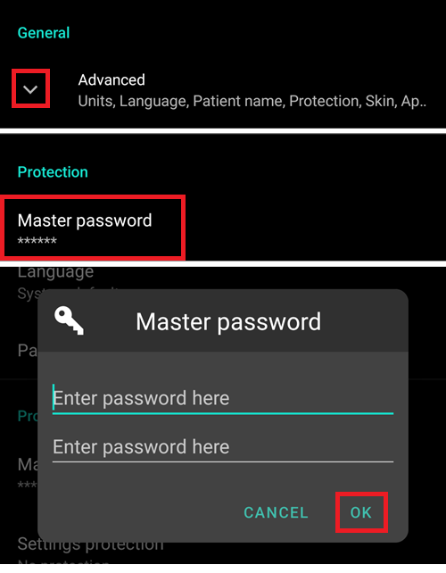

# 从AAPS 2.6升级后的必要检查

- 升级至AAPS 2.7时程序代码进行了重大调整。
- 因此更新后您必须进行一些设置检查或修改。
- 新功能与增强功能的详细信息请参阅[发布说明](#Releasenotes-version-2-7-0)。

## 检查血糖数据源

- 升级后检查血糖数据源是否正确。
- 特别是使用[xDrip+](../CompatibleCgms/xDrip.md)时，血糖来源可能被更改为"Dexcom app (patched)"。
- 打开[配置生成器](#Config-Builder-bg-source)（主界面左上角汉堡菜单）
- 滚动至"BG source"选项。
- 如需更改则选择正确的血糖数据源。

## 完成考核目标

- AAPS 2.7新增了针对[自动化功能](../DailyLifeWithAaps/Automations.md)的目标11（后续版本已重编号为目标10！）。
- 您需要先完成[目标3和4](#objectives-objective3)的考核才能解锁目标11。
- 例如，若你尚未完成[目标3](#objectives-objective3)中的考核，则必须先完成该考核才能开始目标11。
- 这不会影响您已经完成的其他目标。 您已完成的目标将保留！

## 设置主密码

- 自2.7版本起，[导出设置](ExportImportSettings.md)需要加密保护。
- 打开偏好设置（主界面右上角三点菜单）
- 点击"常规"下方的三角符号
- 选择"主密码"
- 输入密码并确认，点击确定。

## 导出配置文件

- AAPS 2.7采用新的加密备份格式。
- 升级至2.7版本后必须[导出设置](ExportImportSettings.md)。
- 旧版本配置文件仅能导入至AAPS 2.7，导出时将自动转为新格式。 导出时会采用新格式。
- 建议将配置文件同时备份至手机外其他安全位置（如电脑、云存储等）。
- 若使用相同密钥库构建AAPS 2.7 apk，可直接覆盖安装无需卸载旧版。
- 所有设置及已完成目标均会保留。
- 若密钥库丢失，需使用新密钥库构建2.7版本，并按照[故障排除指南](#troubleshooting_androidstudio-lost-keystore)导入旧版设置。

## 自动灵敏度调整（提示 - 无需操作）

- 自动灵敏度算法升级为动态切换模型，符合参考设计标准。
- 算法将在24小时和8小时窗口间动态选择 敏感性更高的计算结果。
- 如果用户来自oref1，他们可能会注意到系统可能对变化不太敏感，因为敏感性可能在24小时或8小时之间变化。

## 设置Dana RS胰岛素泵密码（如使用该型号）

- 旧版本未对[Dana RS](../CompatiblePumps/DanaRS-Insulin-Pump.md)的泵密码进行验证。
- 打开偏好设置（界面右上角三点菜单）
- 滚动至"Dana RS"并点击三角符号
- 选择"泵密码（仅v1）"
- 输入泵密码（[默认密码](#DanaRS-Insulin-Pump-default-password)因固件版本而异）后确认。

修改Dana RS泵密码请参照[DanaRS页面](#DanaRS-Insulin-Pump-change-password-on-pump)说明操作。
