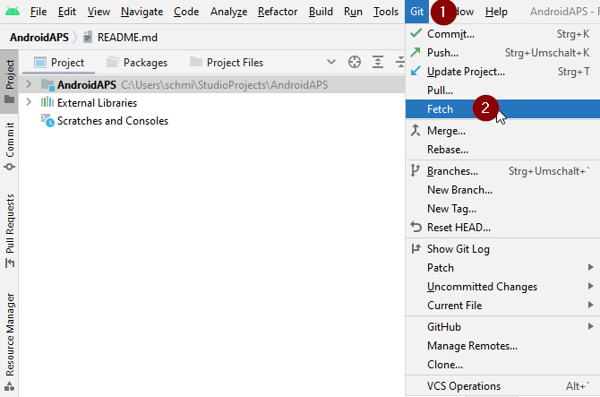
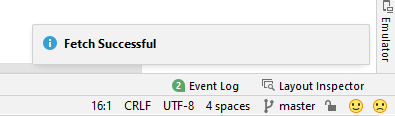
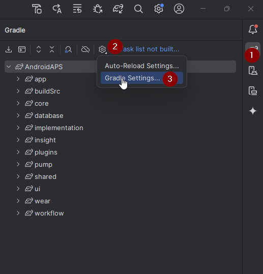

- - -
orphan: true
- - -

# 更新至AAPS 3.2.0.4

(update-aaps-3204)=

## 自行构建而非下载

**由于医疗器械相关法规的限制，AAPS应用（一个apk文件）无法提供下载。 构建该应用供自己使用是合法的，但不得将副本提供给他人**

详情请参阅[常见问题页面](../UsefulLinks/FAQ.md)。

## 构建AAPS 3.2.0.4的计算机及软件要求

* 构建APK可能需要特定版本的**[Android Studio](https://developer.android.com/studio/)**。

| AAPS 版本                 | 推荐<br/>Android Studio<br/>版本 | 备选<br/>Android Studio<br/>版本 | Gradle | JVM |
| ----------------------- | ---------------------------------------- | ---------------------------------------- | ------ |:--- |
| [3.2.0.4](#version3200) | Hedgehog (2023.1.1)                      | 最高支持至Meerkat版本                           | 8.2    | 17  |

推荐版本是已内置适配的JVM版本。 推荐版本同时也是构建**AAPS**的最低可用版本。 若使用低于"推荐"的版本将**无法**完成构建。 若选用其他版本，可能遭遇与JVM版本相关的兼容性问题。 请参考[Android Studio问题排查指南](#troubleshooting_androidstudio-uncommitted-changes)解决。 若您当前的Android Studio版本未在下表中列出，则需先升级至支持版本。

Gradle版本由源代码仓库锁定，在拉取/更新代码时将自动获取正确版本。 此处列出仅作参考，无需手动干预。

* Android Studio 不支持 [Windows 32位系统](#troubleshooting_androidstudio-unable-to-start-daemon-process)。 请牢记，**64位CPU和64位操作系统是必要条件**。 如果您的系统不满足这一条件，您需要更换相应的硬件、软件或整个系统。

<table class="tg">
<tbody>
  <tr>
    <th class="tg-baqh">操作系统 (仅限 64 位)</th>
    <td class="tg-baqh">Windows 8 或更新版</td>
    <td class="tg-baqh">Mac OS 10.14 或更新版</td>
    <td class="tg-baqh">任何支持Gnome、KDE或Unity桌面环境的Linux系统；&nbsp;&nbsp;GNU C库2.31或更高版本。</td>
  </tr>
  <tr>
    <th class="tg-baqh"><p align="center">CPU（仅限64位）</th>
    <td class="tg-baqh">x86_64 CPU架构；第二代Intel Core或更新版本，或支持<br><a href="https://developer.android.com/studio/run/emulator-acceleration#vm-windows" target="_blank" rel="noopener noreferrer"><span style="text-decoration:var(--devsite-link-text-decoration,none)">Windows Hypervisor</span></a>的AMD CPU。</td>
    <td class="tg-baqh">基于ARM的芯片，或第二代Intel Core或更新版本（需支持<br><a href="https://developer.android.com/studio/run/emulator-acceleration#vm-mac" target="_blank" rel="noopener noreferrer"><span style="text-decoration:var(--devsite-link-text-decoration,none)">Hypervisor.Framework</span></a>）。</td>
    <td class="tg-baqh">x86_64 CPU架构；第二代Intel Core或更新版本，或支持AMD虚拟化（AMD-V）和SSSE3的AMD处理器。</td>
  </tr>
  <tr>
    <th class="tg-baqh"><p align="center">内存（RAM）</th>
    <td class="tg-baqh" colspan="3"><p align="center">8GB 或更多</td>
  </tr>
  <tr>
    <th class="tg-baqh"><p align="center">硬盘</th>
    <td class="tg-baqh" colspan="3"><p align="center">至少30GB的可用空间。 建议使用SSD（固态硬盘）。</td>
  </tr>
  <tr>
    <th class="tg-baqh"><p align="center">分辨率</th>
    <td class="tg-baqh" colspan="3"><p align="center">至少1280 x 800 <br></td>
  </tr>
  <tr>
    <th class="tg-baqh"><p align="center">网络连接</th>
    <td class="tg-baqh" colspan="3"><p align="center">宽带</td>
  </tr>
</tbody>
</table>

**强烈建议（非强制）使用固态硬盘（SSD）而非机械硬盘（HDD），因为这将减少你构建AAPS apk文件所需的时间。**不过，在构建**AAPS** apk文件时，你仍然可以使用机械硬盘。 如果使用机械硬盘，构建过程可能会需要很长时间才能完成，但是一旦开始，你就可以让它无人值守地运行。

## 3.2.0.4构建过程中的帮助与支持

若在构建**AAPS**应用时遇到困难，请先查阅专用[Android Studio故障排除](https://androidaps.readthedocs.io/en/3.2/GettingHelp/TroubleshootingAndroidStudio.html)章节。

如果你认为构建说明中有错误、遗漏或令人困惑的地方，或者你仍然在努力解决问题，请联系[Facebook](https://www.facebook.com/groups/AndroidAPSUsers)或[Discord](https://discord.gg/4fQUWHZ4Mw)上的其他**AAPS**用户组。 如果你想自己更改某些内容（如更新截图_等_），请提交一个[拉取请求（PR）](../SupportingAaps/HowToEditTheDocs.md)。

```{note}
本页面同时展示了新版和经典版Android Studio用户界面的示例图片。
```

## 3.2.0.x至3.2.0.4更新概览

```{contents} Steps for updating to 3.2.0.4
:depth: 1
:local: true
```

### 导出当前设置

从手机现有**AAPS**版本导出设置。 您可能用不到它，但以防万一最好保存。

若忘记操作方法，请参阅[导出与导入设置](ExportImportSettings.md)。

### 更新本地AAPS副本

* 在 Android Studio 中打开现有的 AAPS 项目。 可能需要选择您的项目。 （双击）AAPS项目。


<br>


* 在Android Studio菜单栏选择Git -> Fetch



<br>


* 右下角会显示 Fetch 成功的消息。



<br>


* 在菜单栏选择Git -> Pull


<br>


* 保持所有选项默认（origin/master）并点击 Pull


<br>


* 等待下载完成，底部状态栏会显示进度。 完成后，会显示成功消息。

  ```{note}
  更新的文件可能不同！ 这并不意味着有问题。
  ```


<br>


* Gradle Sync 会自动运行以下载依赖项。 请等待它完成。


<br>


### 选择JVM 17版本

- 点击右侧大象图标(1)打开 Gradle 视图，进入设置(2)选择 **Gradle Settings**(3)：



<br>


- 在**Gradle JDK**字段检查是否已选择**jbr-17**（1）。 若未选择，点击字段查看是否已存在列表中。


- 在版本（1）中选择**17**， 供应商（2）选择JetBrains Runtime或其他供应商。 位置(3)保持默认。


- 点击 **OK** 关闭**设置**

### 选择AAPS 3.2.0.4分支

- 左下角点击Git符号，右键3.2.0.4分支并选择Checkout。


<br>


### 同步Gradle项目

```{admonition} WARNING!
:class: warning
**切勿更新Gradle。 ** 始终与项目同步。
```

新版界面使用大象图标选择Sync Project with Gradle Files（或参考[此处](#gradle-resync)）。


经典界面参考[此处](https://androidaps.readthedocs.io/en/3.2/GettingHelp/TroubleshootingAndroidStudio.html#gradle-resync)。


### 构建签名版3.2.0.4 APK

您的源代码现在是当前发布的版本，并且已检查所有前提条件。 请按 [构建签名 APK 章节](#Building-APK-generate-signed-apk) 的描述构建签名 APK。

### 传输并安装3.2.0.4 APK

需将 APK 传输至手机后进行安装。

```{note}
若您使用 Android Studio 中已有的密钥库完成构建，则无需删除手机上的现有应用。 安装APK时，按照提示安装更新。
对于其他场景，例如在Android Studio中为您的签名APK建立新的密钥库，您需要在安装APK之前删除旧的应用程序。 **确保导出您的设置！**
```

具体操作请参考 [传输与安装 AAPS](../SettingUpAaps/TransferringAndInstallingAaps.md) 说明。

### 验证手机上的AAPS 3.2.0.4版本

安装新的APK后，您可以通过点击右上角的三个点菜单，然后点击“关于”来检查手机上的AAPS版本。 您应该看到当前版本。

