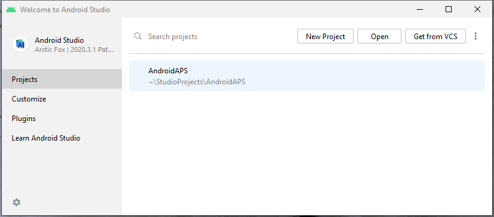
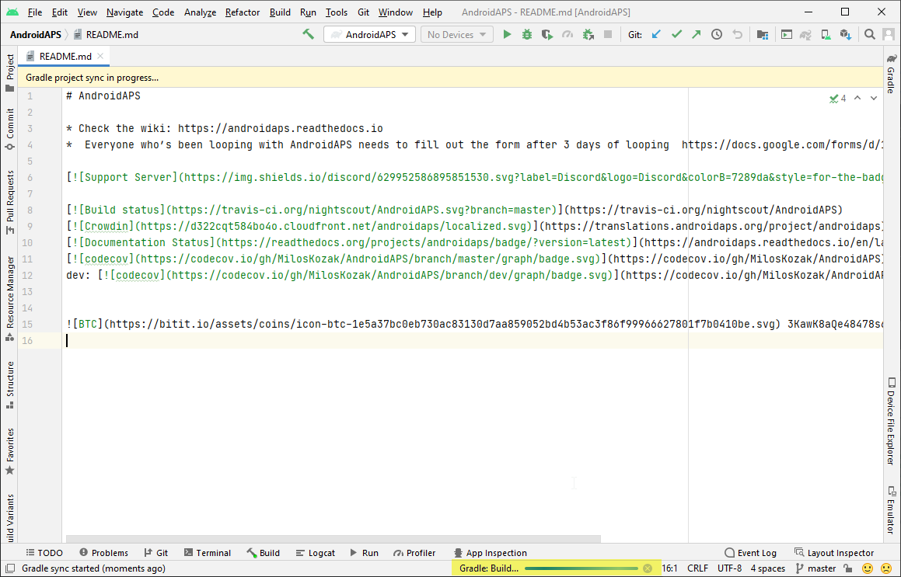
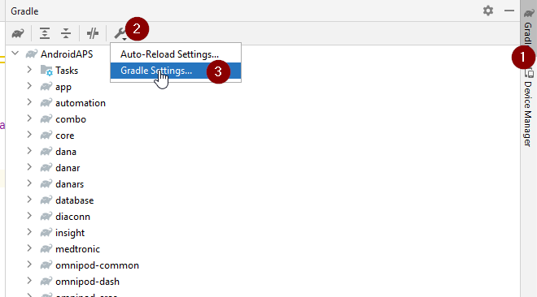

# Updating to AAPS 3.2.0.4

## Build yourself instead of download

**由于医疗器械相关法规的限制，AAPS应用（一个apk文件）无法提供下载。 It is legal to build the app for your own use, but you must not give a copy to others!**

See [FAQ page](../UsefulLinks/FAQ.md) for details.

## Computer and software specifications for building AAPS 3.2.0.4

* 构建APK可能需要特定版本的**[Android Studio](https://developer.android.com/studio/)**。

| AAPS 版本                 | 推荐<br/>Android Studio<br/>版本 | 备选<br/>Android Studio<br/>版本 | Gradle | JVM |
| ----------------------- | ---------------------------------------- | ---------------------------------------- | ------ |:--- |
| [3.2.0.4](#version3200) | Hedgehog (2023.1.1)                      | 最高支持至Meerkat版本                           | 8.2    | 17  |

推荐版本是已内置适配的JVM版本。 推荐版本同时也是构建**AAPS**的最低可用版本。 若使用低于"推荐"的版本将**无法**完成构建。 若选用其他版本，可能遭遇与JVM版本相关的兼容性问题。 请参考[Android Studio问题排查指南](#troubleshooting_androidstudio-uncommitted-changes)解决。 若您当前的Android Studio版本未在下表中列出，则需先升级至支持版本。

Gradle版本由源代码仓库锁定，在拉取/更新代码时将自动获取正确版本。 此处列出仅作参考，无需手动干预。

* Android Studio 不支持 [Windows 32位系统](#troubleshooting_androidstudio-unable-to-start-daemon-process)。 请牢记，**64位CPU和64位操作系统是必要条件**。 如果您的系统不满足这一条件，您需要更换相应的硬件、软件或整个系统。

<table class="tg">
<tbody>
  <tr>
    <th class="tg-baqh">操作系统 (仅限 64 位)</th>
    <td class="tg-baqh">Windows 8 或更新版</td>
    <td class="tg-baqh">Mac OS 10.14 或更新版</td>
    <td class="tg-baqh">任何支持Gnome、KDE或Unity桌面环境的Linux系统；&nbsp;&nbsp;GNU C库2.31或更高版本。</td>
  </tr>
  <tr>
    <th class="tg-baqh"><p align="center">CPU（仅限64位）</th>
    <td class="tg-baqh">x86_64 CPU架构；第二代Intel Core或更新版本，或支持<br><a href="https://developer.android.com/studio/run/emulator-acceleration#vm-windows" target="_blank" rel="noopener noreferrer"><span style="text-decoration:var(--devsite-link-text-decoration,none)">Windows Hypervisor</span></a>的AMD CPU。</td>
    <td class="tg-baqh">基于ARM的芯片，或第二代Intel Core或更新版本（需支持<br><a href="https://developer.android.com/studio/run/emulator-acceleration#vm-mac" target="_blank" rel="noopener noreferrer"><span style="text-decoration:var(--devsite-link-text-decoration,none)">Hypervisor.Framework</span></a>）。</td>
    <td class="tg-baqh">x86_64 CPU架构；第二代Intel Core或更新版本，或支持AMD虚拟化（AMD-V）和SSSE3的AMD处理器。</td>
  </tr>
  <tr>
    <th class="tg-baqh"><p align="center">内存（RAM）</th>
    <td class="tg-baqh" colspan="3"><p align="center">8GB 或更多</td>
  </tr>
  <tr>
    <th class="tg-baqh"><p align="center">硬盘</th>
    <td class="tg-baqh" colspan="3"><p align="center">至少30GB的可用空间。 建议使用SSD（固态硬盘）。</td>
  </tr>
  <tr>
    <th class="tg-baqh"><p align="center">分辨率</th>
    <td class="tg-baqh" colspan="3"><p align="center">至少1280 x 800 <br></td>
  </tr>
  <tr>
    <th class="tg-baqh"><p align="center">网络连接</th>
    <td class="tg-baqh" colspan="3"><p align="center">宽带</td>
  </tr>
</tbody>
</table>

**强烈建议（非强制）使用固态硬盘（SSD）而非机械硬盘（HDD），因为这将减少你构建AAPS apk文件所需的时间。**不过，在构建**AAPS** apk文件时，你仍然可以使用机械硬盘。 如果使用机械硬盘，构建过程可能会需要很长时间才能完成，但是一旦开始，你就可以让它无人值守地运行。

## Help and support during 3.2.0.4 building process

If you run into difficulties in the process of building the **AAPS** app, there is a dedicated [**troubleshooting Android Studio**](https://androidaps.readthedocs.io/en/3.2/GettingHelp/TroubleshootingAndroidStudio.html) section, please consult that first.

如果你认为构建说明中有错误、遗漏或令人困惑的地方，或者你仍然在努力解决问题，请联系[Facebook](https://www.facebook.com/groups/AndroidAPSUsers)或[Discord](https://discord.gg/4fQUWHZ4Mw)上的其他**AAPS**用户组。 如果你想自己更改某些内容（如更新截图_等_），请提交一个[拉取请求（PR）](../SupportingAaps/HowToEditTheDocs.md)。

```{note}
This page provides both example pictures for the **New** and old (**Classic**) Android Studio user interfaces.
```

## Overview for updating 3.2.0.x to 3.2.0.4

```{contents} Steps for updating to 3.2.0.4
:depth: 1
:local: true
```

### Export your current settings

Export your settings from the existing **AAPS** version on your phone. You might not need it, but better be safe than sorry.

See the [Export & import settings](ExportImportSettings.md) page if you don't remember how to do this.

### Update your local AAPS copy

* Open your existing AAPS project with Android Studio. You might need to select your project. (Double) click on the AAPS project.



<br>


* In the menu bar of Android Studio, select Git -> Fetch


<br>


* You will see a message in the lower right corner that Fetch was successful.


<br>


* In the menu bar, now select Git -> Pull


<br>


* Leave all options as they are (origin/master) and select Pull


<br>


* Wait while download is in progress, you will see this as info in the bottom bar. When it's done, you will see a success message.

  ```{note}
  The files that were updated may vary! This is not an indication
  ```


<br>


* Gradle Sync will be running to download some dependencies. Wait until it is finished.



<br>


### Select JVM version 17

- Open the Gradle view by clicking on the elephant (1) on the right side of Android Studio and open the settings (2) and select **Gradle Settings** (3):


<br>



- In **Gradle JDK** field, check if the appropriate version: **jbr-17** is selected (1) If not, click on the field, and see if it is already available in the list.


- In Version (1), select **17**. In Vendor (2) select JetBrains Runtime or any Vendor. Location (3): do not change.


- Close the **Settings** dialog with **OK**.

### Select the AAPS 3.2.0.4 branch

- At the bottom left, select the Git symbol, right-click on 3.2.0.4 and Checkout.


<br>


### Sync project with Gradle

```{admonition} WARNING!
:class: warning
**Never update Gradle.** Always sync it with the project.
```

Use the elephant icon and Sync Project with Gradle Files (or follow [this](#gradle-resync)) for the new UI.


Or ([this](https://androidaps.readthedocs.io/en/3.2/GettingHelp/TroubleshootingAndroidStudio.html#gradle-resync)) for the classic UI.


### Build the Signed 3.2.0.4 APK

Your sourcecode is now the current released version, and all prerequisites have been checked. It's time to build the signed apk as described in the [build signed apk section](#Building-APK-generate-signed-apk).

### Transfer and install the 3.2.0.4 APK

You need to transfer the apk to your phone so you can install it.

```{note}
If you completed the build with the same existing key store in Android Studio, then you do not need to remove the existing app on your phone. When you install the apk, follow the prompts to install updates.
For other scenarios such as establishing a new key store in Android Studio for your signed apk, you will need to delete the old app before installing the apk. **Make sure to export your settings!**
```

See the instructions for [transferring and installing AAPS](../SettingUpAaps/TransferringAndInstallingAaps.md)

### Check AAPS version 3.2.0.4 on phone

After you installed the new apk, you can check the AAPS version on your phone by clicking the three dots menu on the top right and then About. You should see the current version.

