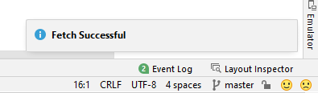
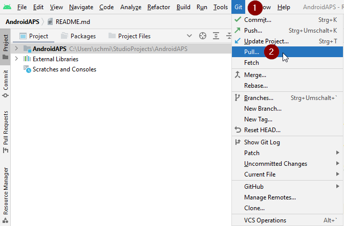
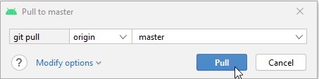

# Update with a computer

## 自行构建而非下载

**AAPS** is not available to download, due to regulations concerning medical devices. 构建该应用供自己使用是合法的，但不得将副本提供给他人 详情请参阅[常见问题页面](../UsefulLinks/FAQ.md)。

```{note}
如果您想在新电脑上构建 **AAPS**：请将备份的密钥库文件复制到新电脑。 然后按照 [首次构建 **AAPS** 流程](../SettingUpAaps/BuildingAaps.md) 操作，而非本指南。 唯一区别在于您可以选择已复制的密钥库文件而无需新建。
```

## Overview for updating to a new version of AAPS with a computer

```{contents} Steps for updating to a new version of AAPS
:depth: 1
:local: true
```

In case you experience problems, see separate page for [troubleshooting Android Studio](../GettingHelp/TroubleshootingAndroidStudio).

### Export your settings

从手机现有**AAPS**版本导出设置。 您可能用不到它，但以防万一最好保存。

若忘记操作方法，请参阅[导出与导入设置](ExportImportSettings.md)。

### Check your Android Studio version

The minimal version required is described in the [Building Instructions](#Building-APK-recommended-specification-of-computer-for-building-apk-file). If your version is older, please [update Android Studio first](#Building-APK-install-android-studio)!

(Update-to-new-version-update-your-local-copy)=
### Update your local copy

```{admonition} WARNING
:class: warning
If you update from versions prior to 2.8.x, please follow the instructions to do a [New clone](../SettingUpAaps/BuildingAaps.md), as this guide will not work for you!
```

* 在 Android Studio 中打开现有的 AAPS 项目。 可能需要选择您的项目。 （双击）AAPS项目。

  

* 在Android Studio菜单栏选择Git -> Fetch

   

* 右下角会显示 Fetch 成功的消息。

   

* 在菜单栏选择Git -> Pull

   

* 保持所有选项默认（origin/master）并点击 Pull

   

* 等待下载完成，底部状态栏会显示进度。 完成后，会显示成功消息。

  ```{note}
  更新的文件可能不同！ 这并不意味着有问题。
  ```

   

* Gradle Sync 会自动运行以下载依赖项。 请等待它完成。

  

### 检查 JVM 版本

This check is particularly indicated if you have already built a previous version of **AAPS** on the same computer.

Check in the [Building Instructions](#Building-APK-recommended-specification-of-computer-for-building-apk-file) the required version for JVM, matching the **AAPS** version you are now building. 然后按照[不兼容的 Gradle JVM](#incompatible-gradle-jvm)中的步骤确保当前使用正确版本。

(Update-to-new-version-build-the-signed-apk)=
### 构建签名 APK

您的源代码现在是当前发布的版本，并且已检查所有前提条件。 请按 [构建签名 APK 章节](#Building-APK-generate-signed-apk) 的描述构建签名 APK。

(Update-to-new-version-transfer-and-install)=

### 传输并安装 APK
需将 APK 传输至手机后进行安装。

```{note}
若您使用 Android Studio 中已有的密钥库完成构建，则无需删除手机上的现有应用。 安装APK时，按照提示安装更新。
对于其他场景，例如在Android Studio中为您的签名APK建立新的密钥库，您需要在安装APK之前删除旧的应用程序。 **确保导出您的设置！**
```

具体操作请参考 [传输与安装 AAPS](../SettingUpAaps/TransferringAndInstallingAaps.md) 说明。

Continue [here](#Update-to-new-version-check-aaps-version-on-phone).

## 故障排除

如果出现问题，请不要惊慌。

深呼吸！

若您的问题已有记录，请参考 [Android Studio 故障排除](../GettingHelp/TroubleshootingAndroidStudio) 页面！

If you need further help, please reach out to other **AAPS** users on [Facebook](https://www.facebook.com/groups/AndroidAPSUsers) or [Discord](https://discord.gg/4fQUWHZ4Mw).