# Android Auto

**AAPS** is capable of sending you information about your current status as a message, directly into Android Auto in your car.

```{admonition} version and last change information :class: dropdown date of last edit: 07/05/2023

versions used for documentation:

* AAPS 3.2.0-dev-i
* Android Auto: 9.3.631434-release ```

## Requirements

**AAPS** uses a feature of Android Auto which allows messages from apps on the mobile to be routed to the display of Auto Audio in the car.

That means that:

* You must configure **AAPS** to use system notifications for alerts and notifications and
* As **AAPS** is an unofficial App, allow the use of "unknown sources" with Android Auto.

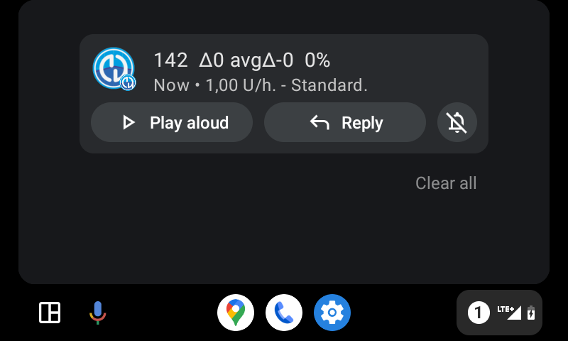

## Use system notifications in AAPS for alerts and notifications

Open 3-dot-menu on top right of **AAPS** home screen and select **Preferences**

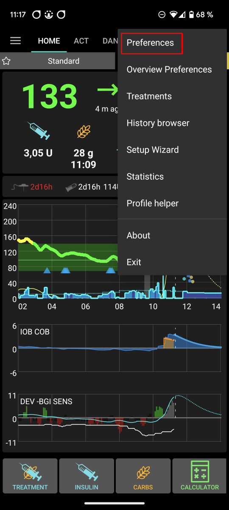

In **Local Alerts** activate **Use system notifications for alerts and notifications**

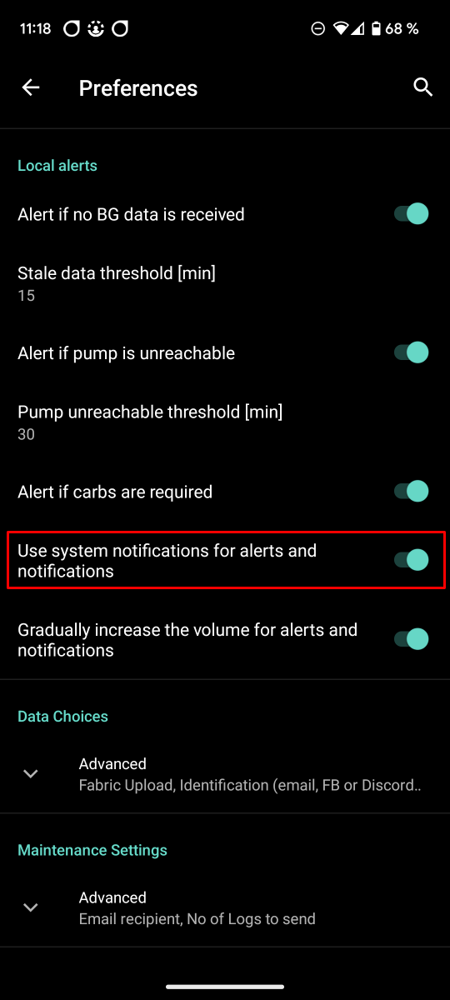

Please check now that you get notifications from **AAPS** on the phone before you walk to your car!

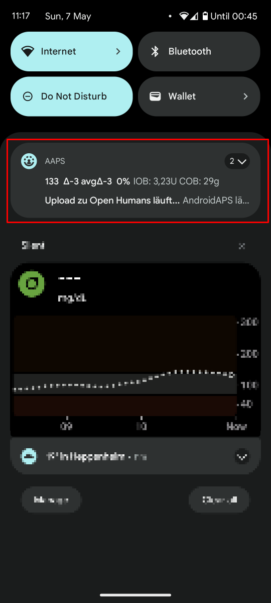

## Allow the use of "unknown sources" with Android Auto.

As **AAPS** is not an official Android Auto app, notifications have to be activated for "unknown sources" in Android Auto. This is done through the use of the developer mode which we will show you here.

Go to your car and connect your mobile with the cars audio system.

You should now see a screen similar to this screen.

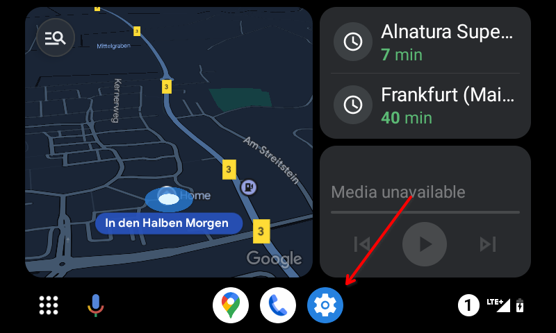

Press on the **setting** icon to start the configuration.

Scroll down to the end of the page and select **see more in the phone**.

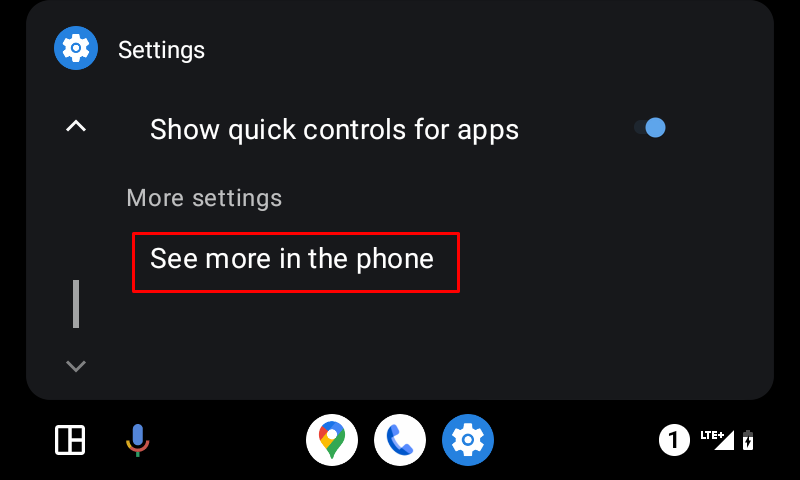

Now on the mobile we will activate the developer mode.

The first screen looks like this. Scroll down to the end of the page.

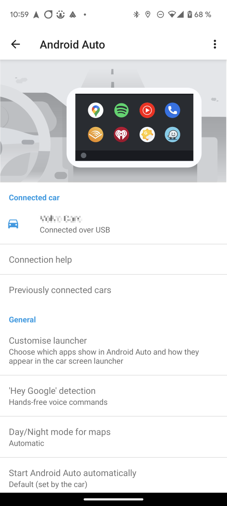

There you see the version of Android Auto listed. Tap 10 times (in word ten) on the version of Android Auto. With this hidden combination you have now enabled developer mode.

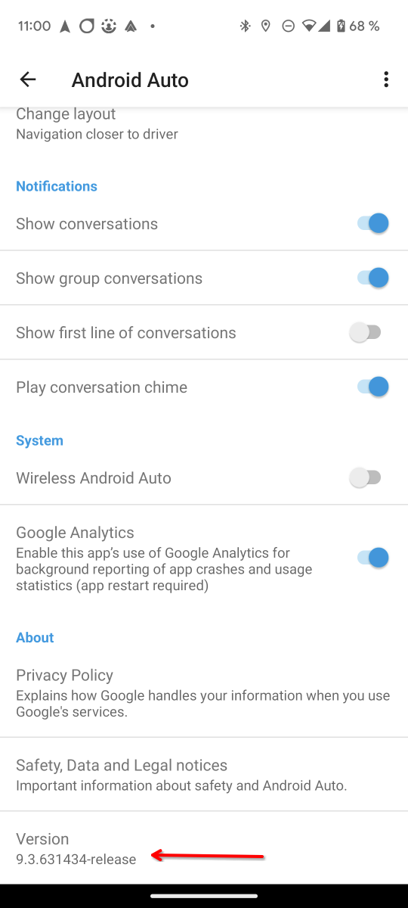

Confirm that you want to enable the developer mode in the modal dialog "Allow development settings?".

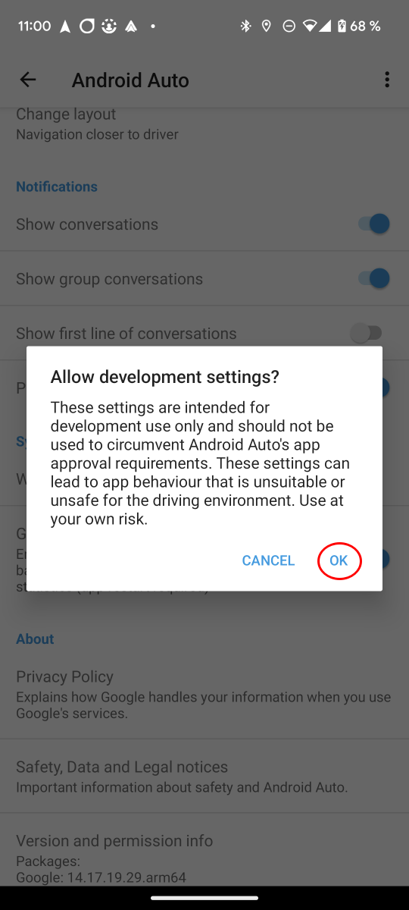

In the **developer settings** enable the "Unknown sources".

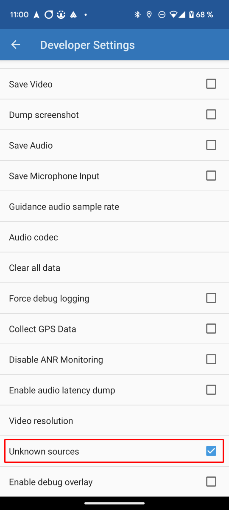

Now you can quit developer mode if you want. Tap three dots menu on the top right to do so.

## Show notifications in car

Tap the **number icon** on the lower right side in Android Auto in your car.

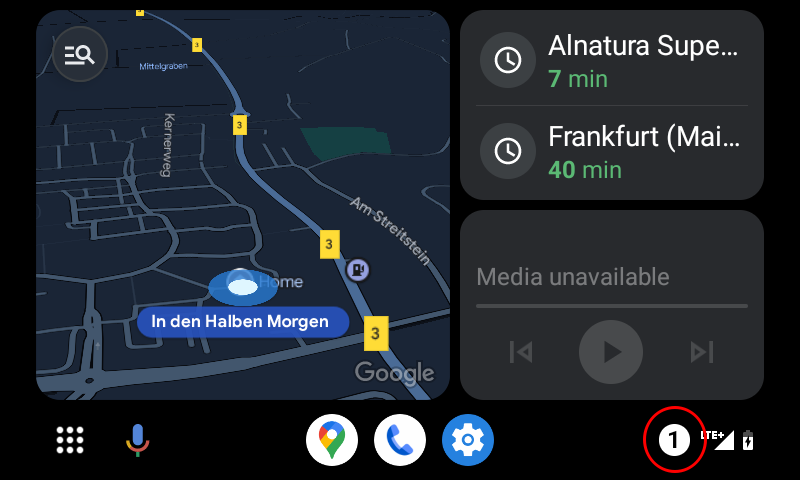

Your CGM data will be shown as follows:


## 故障排除:

* If you don't see the notification, check if you [allowed AAPS to show notifications](#use-system-notifications-in-aaps-for-alerts-and-notifications) in Android and if [Android Auto has access rights to notifications](#allow-the-use-of-unknown-sources-with-android-auto).