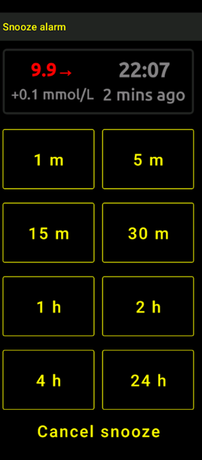
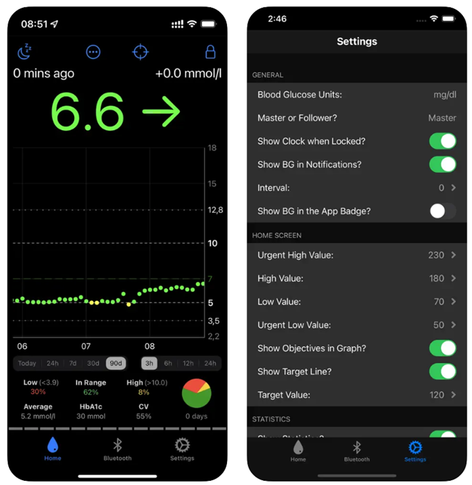
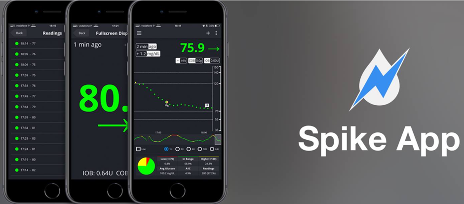

# 仅跟踪AAPS（不与AAPS系统交互）

除了远程控制**AAPS**和跟踪其数据的各种可能性（如[远程控制](../RemoteFeatures/RemoteControl.md)所述）之外，社区还开发了多种应用程序和设备，用于仅跟踪数字（如血糖水平和其他信息），而无需与**AAPS**进行交互。

关于跟踪**AAPS**的广泛选项，可以访问[Nightscout follower](https://nightscout.github.io/nightscout/downloaders/#)网页以获取概览。

```{contents} Table of contents
:depth: 1
:local: true
```

下面详细解释了与**AAPS**结合使用的最常见策略。

## 智能手机应用程序

```{contents} These are some of the main “follower” apps used by **AAPS** users. All of these apps are “free”: 
:depth: 1
:local: true
```

### Dexcom Follow（[Android](https://play.google.com/store/apps/details?id=com.dexcom.follow.region2.mgdl) 和 [iOS](https://apps.apple.com/fr/app/dexcom-follow-mg-dl-dxcm2/id1032203080)）


* Dexcom Follow与多种手机（Android和iPhone）兼容。 即使您不使用官方Dexcom应用程序接收传感器数据，也可以使用Dexcom Follow。

* 许多护理人员熟悉Dexcom Follow，并更喜欢其简洁的界面。

* Dexcom Follow非常适合教师/老人和对糖尿病和血糖水平了解很少的人。 它具有可定制的警报（血糖水平、警报音等）。 如果需要，可以完全关闭警报，这对于仍在适应中并产生多个假低值的传感器非常有用。

#### 设置Dexcom Follow：操作指南

如果您使用非官方的Dexcom应用程序BYODA接收传感器数据，您可能能够从BYODA应用程序内发送邀请给跟踪者。

您无法再通过第三方应用向Dexcom关注者发送邀请邮件了。 在xDrip+中，邀请请求只会显示“邀请未发送”的消息。

您必须安装官方“Dexcom”应用程序，发送邀请，然后卸载官方应用程序。

执行此操作的步骤如下：

在_任何_智能手机（Android/iPhone）上安装官方的“Dexcom”应用程序，如果更方便，这可以是关注者的手机。 2）使用您的Dexcom用户名和密码登录，这与您用于Dexcom Clarity的登录详细信息相同（如果您已经是Dexcom/Clarity客户）。 如果您没有Dexcom登录信息，此时可以选择创建一个新登录。 3）滑动浏览介绍菜单 4) 在传感器代码处添加“无代码”。 5) 在“发射器序列号 (Transmitter SN)”下选择“手动输入 (enter manually)”，并输入任何有效的发射器代码（如果您知道，可以使用您已过期的发射器代码之一，这样就不会干扰您当前发射器的运行，它们遵循特定格式的数字和字母组合：“NLNNNL”，并且只使用某些特定组合，因此使用您已知的有效代码是最简单的）。 6)  一旦应用程序正在尝试查找发射器和传感器，您将能够邀请跟踪者：选择应用程序左上角的三个小点，并添加新跟踪者。 如果其中一个跟踪者更换了手机并需要新的邀请，您也可以在此处从跟踪者列表中删除他们，并为他们发送新的邀请电子邮件以在新手机上使用。 在跟踪者手机上，从App Store（iPhone）或Play（Android）下载并安装Dexcom Follow。 安装Dexcom Follow应用程序，系统会提示您打开电子邮件以找到成为跟踪者的邀请。    
8) 现在你可以删掉官方的 Dexcom G6 应用。

对于Dexcom Follow，传感器数据将从**AAPS**手机导出，直接从BYODA或通过xDrip+，具体取决于您使用的应用程序。


### [Nightguard](https://apps.apple.com/fr/app/nightguard/id1116430352) (iOS)


优点（用户报告）：

* 在[App Store](https://apps.apple.com/us/app/nightguard/id1116430352)上可用，界面简洁、用户友好。

* 通过滑动按钮或摇晃手机，可以在5分钟到24小时的不同间隔内延迟警报。

* 可定制警报（高低警报、15-45分钟内无数据时的缺失读数）。

* 快速上升/下降（连续2-5次读数，您可选择）。 还可以选择两次单独读数之间的差值。

* 智能延迟，如果水平朝正确方向移动则不会发出警报。

* 有一个“Care”选项卡，似乎允许您为特定持续时间设置新的临时目标、删除临时目标或输入碳水化合物。

缺点（用户报告）：

* 仅适用于iOS。

* 无论设置哪个TT级别，TT都显示为5 mmol。

* 从不显示临时基础率，尽管它显示TB。

### [Nightwatch](https://play.google.com/store/apps/details?id=se.cornixit.nightwatch) (Android)




* Nightwatch自称是Nightscout客户端，可在Android手机或平板电脑上监控用户的Nightscout血糖水平。

* 该应用程序可从[Google Play](https://play.google.com/store/apps/details?id=se.cornixit.nightwatch)下载，并实时显示血糖数据。

* 用户可以设置自定义的低血糖和高血糖警报声音。

* 血糖数据可以以mmol/L或mg/dL为单位查看。

* 需要Android 5.0及以上版本。

* 具有深色Ul、大号读数和按钮，专为夜间使用而设计。

### xDrip+ (Android)

您可以使用xDrip+作为跟踪器。

#### 与Nightscout一起使用

将xDrip+设置为Nightscout跟踪器。 您将收到血糖和治疗信息，但不包括基础率。


#### 不使用Nightscout - xDrip+血糖数据源

如果您的**AAPS**数据源是xDrip+（或者如果xDrip+也可以从其他应用程序（如BYODA、Juggluco等）接收血糖数据），则可以从主手机使用它来与xDrip+跟踪器共享数据，显示血糖、治疗和基础率。


#### 不使用Nightscout - xDrip+血糖伴侣应用程序

如果您的**AAPS**数据源不是xDrip+，但您可以从伴侣应用程序数据源显示血糖数据，则可以从主手机使用它与xDrip+跟踪器共享数据，显示血糖、治疗和基础率。


### xDrip4iOS (iOS)


xDripSwift是从将原始xDrip应用程序移植到iOS发展而来的，后来演变为“xDrip for iOS”，即**xDrip4iOS**。

```{admonition} Further detail about how to attempt to obtain the original **xDrip4iOS** app
:class: dropdown
[xDrip4iOS Facebook群组](https://www.facebook.com/groups/853994615056838/announcements)是xDrip4iOS和Shuggah的主要社区支持。 **xDrip4iOS**可以连接到许多不同的CGM系统和发射器，并显示血糖值、图表和统计数据，同时提供警报。 它还可以上传到Nightscout或作为[Nightscout的跟踪器应用程序](https://xdrip4ios.readthedocs.io/en/latest/connect/follower/)使用。 

怎样才能在我的iPhone上获取xDrip4iOS？
有两种可选的方式
1. 如果您拥有 Mac 设备和 Apple Developer 开发者账号（年费 99 欧元/美元），可[按照指引](https://xdrip4ios.readthedocs.io/en/latest/install/build/)自行构建 xDrip4iOS 应用。

若您愿意，可成为“发布者（releaser）​”并通过[个人TestFlight链接](https://xdrip4ios.readthedocs.io/en/latest/install/personal_testflight/) 将xDrip4iOS分享给最多100人，帮助他们使用该应用。

2. 请加入 [xDrip4iOS Facebook 群组](https://www.facebook.com/groups/853994615056838/announcements) 并查阅置顶帖，获取当前可用的应用安装方法。 **您不应该请求应用程序的邀请**（请阅读群组规则）。
```




**Shuggah**是什么？ 乌克兰某开发团队复制了xDrip4iOS（其代码在GitHub上公开共享）的项目代码，并通过企业账户在App Store上发布。 Shuggah版本完全不受xDrip4iOS原开发团队管理。

[xDrip4iOS Facebook群组](https://www.facebook.com/groups/853994615056838/announcements)仅支持官方xDrip4iOS应用及配套的Apple Watch应用。

### [Sugarmate](https://apps.apple.com/fr/app/sugarmate/id1111093108) (iOS)


[Sugarmate](https://sugarmate.io/)可从App Store下载到iPhone上。 Sugarmate与以下设备兼容：
* Apple iPhone（需要软件版本13.0或更高版本）
* Apple iPad（需要软件版本13.0或更高版本）
* Google Android（将Web应用程序保存到主屏幕）

据Sugarmate用户报告，它可以在美国与Apple CarPlay一起使用，在驾驶时显示血糖读数。 目前尚不清楚在美国以外的国家是否可能实现这一点。 如果您了解更多信息，请通过完成拉取请求（链接）将此信息添加到文档中，这既快速又简单。


### [Spike](https://spike-app.com/) (iOS)



Spike可以用作主接收器或跟踪器应用程序，提供血糖、警报和IOB等信息。

该网站和应用程序已不再开发。 可以在[Facebook](https://www.facebook.com/groups/1973791946274873)和[Gitter](https://gitter.im/SpikeiOS/Lobby)上找到支持。

## 用于监测在手机上运行的**AAPS**（全数据档案或仅葡萄糖数据）的智能手表。

请参考[此处](../Getting-Started/Watches.md)获取更多信息。


## 跟踪AAPS的设备

```{contents} Devices include:
:depth: 1
:local: true
```

### M5 stack


M5Stack是一个小盒子，可用于多种应用程序编程。 Martin的项目[M5Stack NightscoutMon](https://github.com/mlukasek/M5_NightscoutMon/wiki)可以显示传感器血糖值和趋势、IOB和COB。 它装在一个塑料盒子里，配备彩色显示屏、micro SD卡插槽、3个按钮、扬声器和内置电池。 它是一个很棒的血糖监测器，如果您有Nightscout帐户，设置起来也相对容易。 用户通常在家中的Wi-Fi上运行它，但一些用户报告说，通过运行手机Wi-Fi热点，可以在骑摩托车时使用它作为显示屏。

### Sugarpixel

SugarPixel是一种用于连续血糖监测的备选葡萄糖显示警报系统的设备，可与Dexcom应用程序或Nightscout应用程序连接在用户的智能手机上。 该设备实时显示血糖读数。 这款CGM硬件监测器具有随机音调生成音频警报（非常响亮）、振动警报（适用于听力障碍者）、可自定义的显示选项和原生多用户跟踪功能。


* SugarPixel具有多种显示选项，包括mg/dL和mmol/L，以满足用户需求，并具有颜色编码的血糖值。
* 标准界面显示血糖值、趋势箭头和变化量。 变化量是指与上一次读数相比的增加或减少量。
* SugarPixel可以定制为在低亮度下使用，具有BG和时间界面，以便用户在床头柜上看到血糖读数和当前时间。
* SugarPixel的彩色界面利用整个显示屏显示单一颜色，代表血糖值。 这样用户就可以在户外玩耍时，在后院、露台或游泳池通过窗口远距离查看血糖读数。
* 大号BG界面适用于床头柜用户，尤其是戴眼镜或隐形眼镜的用户。

### Ulanzi TC001上的Nightscout Clock

**Nightscout Clock**是在**Ulanzi TC001**设备上运行的开源软件。 它与Dexcom服务器或Nightscout连接，并实时显示血糖读数。


* 该时钟支持mmol/L和mg/dL单位，并包括声音警报。
* 有多个显示选项，请参考[Github nightscout-clock](https://github.com/ktomy/nightscout-clock?tab=readme-ov-file#more-information-for-people-who-needs-it)以获取概览。
* 设置和配置设备只需几个简单步骤。 一旦设置完成，它只需要电源和Wi-Fi即可工作。
* Ulanzi TC001设备的购买成本显著低于SugarPixel。
* 软件及安装说明可在[Github nightscout-clock](https://github.com/ktomy/nightscout-clock?tab=readme-ov-file)上找到。
* 它由Artiom Kenibasov开发和维护，在[Facebook AAPS Users群组](https://www.facebook.com/groups/cgminthecloud/posts/8776932509094594/)中提供支持。

### PC (TeamViewer)
一些用户发现使用完整的远程访问工具（如[TeamViewer](https://www.teamviewer.com/)）有助于高级远程故障排除。
