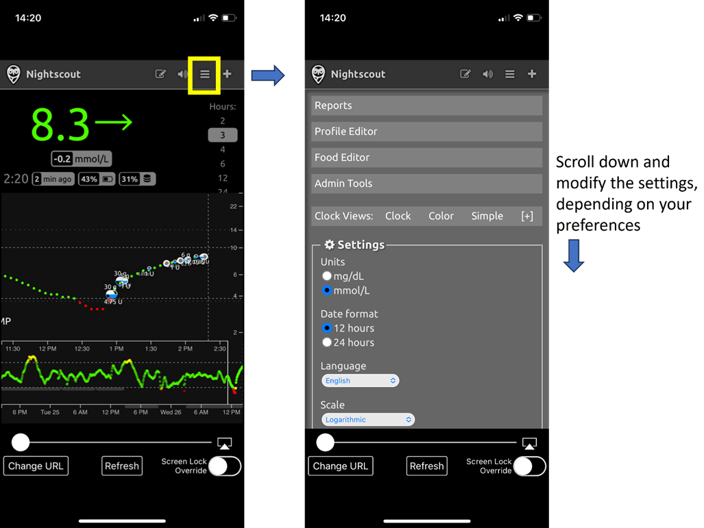

# 远程控制AAPS
有四种高度有效的工具可用于远程管理**AAPS**：

1) [SMS commands](#RemoteControl_SMS-Commands) (follower phone can be either Android or iOS), 2) [AAPSClient](#RemoteControl_aapsclient) (follower phone is Android) 3) [Nightscout](#RemoteControl_nightscout) (Android, iOS or other computer/device).  
4) [Smartwatches](#RemoteControl_smartwatches) (Android)

前三种大多适用于护理人员/家长，但智能手表对护理人员/家长以及成人糖尿病患者本身都非常有用。

(RemoteControl_SMS-Commands)=

## 1) 短信命令

请参见专门的[短信命令](../RemoteFeatures/SMSCommands.md)页面。

(RemoteControl_aapsclient)=
## 2) AAPSClient

**AAPSClient**在外观上非常类似于**AAPS**本身，为护理人员提供了远程操作AAPS命令的标签：

### 关于AAPSClient与AAPSClient2

目前有两个可安装的APK版本：**​AAPSClient**​ 和 ​**AAPSClient2**，两者存在细微但重要的区别，具体说明如下。

如果护理人员需要第二个**AAPSClient**副本来远程控制另一个使用Nightscout账户的患者，他们应该在安装**AAPSClient**之外再安装**AAPSClient2**。 **AAPSClient 2**允许单个护理人员在同一跟随者手机上两次安装**AAPSClient** apk，以便能够同时访问并远程控制两名不同的患者。

为了区分两个应用，部分元素的背景颜色不同：**AAPSClient**采用黄色，**AAPSClient2**采用蓝色。 这些元素包括应用图标、桌面小部件以及应用内显示**AAPS**状态的功能区域。  注：小部件背景的不透明度支持自定义调节。

### 下载与安装

**AAPSClient**可以安装在单个手机或多个跟随者手机上（即家长1的跟随者手机和家长2的跟随者手机），以便两位护理人员都能获得访问权限并远程控制患者的**AAPS**手机。

要下载**AAPSClient**，请前往[GitHub代码仓库](https://github.com/nightscout/AndroidAPS/releases/)，点击名为**"app-AAPSClient-release_x.x.x.x"**的资源文件（实际版本可能比下图所示版本更新）：

然后转到计算机上的_downloads_。 在Windows上，-downloads_将显示右侧功能区：

下载完成后，点击_在文件夹中显示_以定位文件。

**AAPSClient** apk现在可以通过以下方式传输：

通过USB数据线传输到跟随者手机上；或者， 拖动到Google Drive文件夹中，然后点击“app-AAPSClient-release”文件将其添加到跟随者手机。

若您需自行使用**AAPS**，并需通过**AAPSClient**监测他人，必须自行构建**AAPSClient**而非按前述方式从GitHub仓库下载。 原因是您无法在同一部手机上安装由不同密钥签名的**AAPS**与**AAPSClient**应用。  自行构建**AAPSClient**时，请遵循与[常规AAPS构建](../SettingUpAaps/BuildingAaps.md)相同的流程。 在**生成已签名的应用捆绑包或APK**页面时，请选择**aapsclientRelease**而非**fullRelease**。

### 同步-AAPSClient和AAPS的设置（适用于3.2.0.0及以上版本）

一旦在跟随者手机上安装了__AAPSClient__ apk，用户必须确保其在Config Builder中的“Preferences”正确设置并与Nightscout 15的__AAPS__对齐（请参阅[此处](../Maintenance/UpdateToNewVersion)的发布说明）。 下面的示例提供了使用Nightscout15的NSClient和NSClientV3的同步指南，但__AAPS__还有其他可用选项（例如xDrip+）。

在“Config Builder”下的“Synchronization”中，用户可以选择__AAPS__和跟随者手机都适用的同步选项：

- 选项1：NSClient（也称为“v1”）- 将用户的数据与Nightscout同步；

- 选项2：NSClientV3（也称为“v3”）- 使用v3 API将用户的数据与Nightscout同步。

用户必须确保AAPS和AAPSClient手机__都__通过选择v1或v3的选项进行同步：

选项1：两台手机都使用v1：

- 输入您的Nightscout URL

- 输入您的API密钥

选项2：两台手机都使用v3：

- 在NSClientV3标签下输入您的Nightscout URL

- 在“Config Build”标签下输入您的NS访问令牌。 请按照[此处](https://nightscout.github.io/nightscout/security/#create-a-token)的说明操作

如果选择Websockets（这是可选的），请确保它在__AAPS__和__AAPSClient__手机中均已激活或停用。 在__AAPS__中激活Websockets而在__AAPSClient__中未激活（反之亦然）将导致__AAPS__出现故障。 启用Websockets将允许与Nightscout更快同步，但可能导致手机电池消耗更多。

用户应确保__AAPSClient__和__AAPS__在各自手机的“NSClient”标签下均显示“已连接”，并且一旦在__AAPSClient__中选择，就可以在__AAPS__中正确激活“Profile Switches”或“Temp Target”。

用户还应确保在__AAPSClient__和__AAPS__的“Treatments”中都记录了碳水化合物，否则可能表明用户设置出现故障。

### 故障排除“NS访问令牌”配置问题

精确的“NS访问令牌”配置可能因您的Nightscout提供商是付费托管站点还是非付费托管站点而有所不同。

如果您在使用**AAPS** v3时遇到“NS访问令牌”接受问题，并且使用的是付费托管的Nightscout站点，您可能需要首先与您的Nightscout提供商联系，以了解如何解决“NS访问令牌”问题。 否则，请联系**AAPS**小组，但在这样做之前，请仔细检查您是否已正确按照[此处](https://nightscout.github.io/nightscout/security/#create-a-token)的说明操作。

### AAPSClient的功能包括：

| 标签/汉堡菜单           | 功能                                                                                                                                                                                                                                   |
| ----------------- | ------------------------------------------------------------------------------------------------------------------------------------------------------------------------------------------------------------------------------------ |
| **操作（Action）** 标签 | - Profile Switch  - Loop Status change  - Temp Target - BG Check - CGM Sensor Insert - Note - Exercise - Announcement - Question? - History Browser |
| **食物** 标签         |                                                                                                                                                                                                                                      |
| **治疗** 标签         | - 检查已执行完毕的治疗，包括推注和输入的碳水化合物                                                                                                                                                                                                           |
| **运维** 标签         | - 导出和导入设置                                                                                                                                                                                                                            |
| **配置文件** 标签       | - 创建新配置文件 - 配置文件切换                                                                                                                                                                                                          |

**AAPSClient**允许护理人员通过移动或互联网网络远程进行许多在**AAPS**中允许的调整（不包括胰岛素推注）。 **AAPSClient**的主要优点是护理人员/家长可以快速、轻松地使用它来远程控制**AAPS**。 __AAPSClient__在发送需要认证的命令时，_可以_比输入SMS命令快得多。 在**AAPSClient**上输入的命令会上传到Nightscout。 In order for the actions taken in **AAPSClient** to be actually actioned in **AAPS**, the NSClient settings must allow to receive such orders. See the [Synchronization section of NSClient preferences](#Preferences-nsclient-synchronization).

只有同步功能运行良好（_即_您没有看到不需要的数据更改，如TT、TBR等的自我修改），才建议通过**AAPSClient**进行远程控制。 请参阅[2.8.1.1版本的发布说明](#important-hints-2-8-1-1)以获取更多详细信息。

### AAPSClient与智能手表选项

智能手表是帮助管理孩子**AAPS**的非常有用的工具。 有几种不同的配置可选。 如果在父母的手机上安装了**AAPSClient**，则可以在与父母的手机连接的兼容智能手表上安装[**AAPSClient WearOS**应用程序](https://github.com/nightscout/AndroidAPS/releases/)。 这将显示当前的血糖值、Loop（闭环系统）状态和允许碳水化合物输入、临时目标设定以及配置更改。 但它不允许通过WearOS应用进行大剂量胰岛素注射。 您可以阅读有关智能手表的更多信息[此处](#4-smartwatches)。

(RemoteControl_nightscout)=
## 3) Nightscout

Nightscout不仅是“云”中的服务器，还有专用的**Nightscout**应用，可以直接从iPhone的App Store下载。 如果您有Android跟随者手机，则没有专用的Nightscout应用，最好使用[**AAPSClient**](#2-aapsclient)，或者，如果您只想跟随而不发送治疗，可以从Playstore下载并安装[Nightwatch](https://play.google.com/store/apps/details?id=se.cornixit.nightwatch)应用。

在iPhone上安装**Nightscout**应用后，打开应用并按照设置提示操作，输入您的Nightscout地址（见下方左侧）。 此形式可能因您的Nightscout托管方式而异。 （_例如_ http://youraddresshere.herokuapp.com） 然后输入您的Nightscout API密钥（见下方右侧）。 如果没有提示您输入API密码，则需要点击应用顶部的挂锁来输入：

有关设置的更多信息可直接从[Nightscout](https://nightscout.github.io/nightscout/discover/)获取

首次登录时，您将看到一个非常简单的显示。 通过选择右上角的“汉堡菜单”并向下滚动来自定义显示选项：

向下滚动到“设置”。 您可能希望将“刻度”更改为“线性”，因为BG显示的坐标轴默认值刻度是对数刻度，并在“使用基础率”下选择“default”，以便显示泵基础量。

选择您所需的选项。 如果您使用其他应用进行警报，请取消选中警报。

继续向下滚动，直到到达“显示插件。

您需要确保选中了“护理面板（careportal）”，并且还可以选择各种其他指标（最有用的是：IOB、care portal、pump、cannula age、insulin age、basal profile和OpenAPS）。

重要的是，您现在需要点击底部的“保存”以使这些更改生效。

点击“保存”后，应用将返回您的主Nightscout屏幕，看起来像这样：

1. 当前血糖值
2. AAPS系统状态信息- 点击屏幕上的各个选项卡以显示更多详细信息。 使用汉堡菜单添加或删除这些显示选项。
3. 最近的血糖轨迹，显示治疗情况（碳水化合物、推注）
4. 较长期的血糖轨迹
5. “汉堡菜单”用于设置显示选项、生成报告、编辑配置文件和Nightscout管理工具
6. “+”菜单用于输入要发送到AAPS的治疗
7. 选择不同的时间段进行显示
8. 基础胰岛素配置文件
9. 绿色线=历史血糖 蓝色线=预测血糖

详细查看Nightscout应用右上角的菜单：

1. Careportal回顾性编辑？
2. 打开/关闭警报
3. 汉堡菜单-用于设置首选项
4. Careportal-记录治疗-发送更改到AAPS

灰色选项卡（如果您点击选项卡，则会显示更多信息）上的屏幕上有大量关于**AAPS**系统状态的信息：

1. 5分钟血糖趋势
2. 大剂量向导预览
3. 点击“基础率”查看当前配置文件和基础信息
4. 距离AAPS最新一次CGM读数的时间
5. **泵**：胰岛素、电池电量和AAPS最后一次连接到它的时间
6. AAPS最后一次刷新时间- 如果超过5分钟，可能表明AAPS手机与泵/CGM之间的连接存在问题
7. 点击“IOB”查看基础和推注胰岛素的分配
8. 储液器中的胰岛素使用时长
9. 管路使用时间
10. AAPS手机的电池状态
11. 数据库大小。 如果它变得太大（仅限DIY Nightscout-托管服务会忽略），您可能会开始遇到连接问题。 您可以通过汉堡菜单中的管理工具菜单删除数据来清理数据库。

点击页面底部的“刷新”以关闭弹出窗口。

### 通过Nightscout应用向AAPS发送治疗

要通过**Nightscout**应用向**AAPS**发送治疗，请在主要的AAPS手机上，进入**AAPS**应用中的**AAPSClient**标签。 打开右侧的点菜单，然后打开AAPSClient选项–同步，并在此菜单中选择相关选项。 将其设置为接收不同的命令（临时目标等），并同步配置文件。 如果似乎没有同步，请返回AAPSClient标签并选择“全量同步”并等待几分钟。

iPhone上的Nightscout具有与PC上相同的所有功能。 它允许您向**AAPS**发送许多命令，但不允许您发送胰岛素推注。

### 取消负胰岛素以避免重复低血糖

虽然您实际上不能推注胰岛素，但您可以通过Nightscout“宣布”胰岛素作为“校正推注”，尽管它不会被输送。 由于AAPS现在会考虑那个假的胰岛素推注，宣布胰岛素实际上会使AAPS变得不那么激进，并且可以在配置文件过强（例如，由于先前的运动）的情况下用于取消负胰岛素并防止低血糖。 您需要在**AAPS**手机在场的情况下自行检查这一点，以防您的**Nightscout**设置有所不同。

一些最常用的**Nightscout**命令如下表所示。

#### Nightscout命令表

| 最常用的治疗                       | 功能，命令何时有用的示例                                                                                    |
| ---------------------------- | ----------------------------------------------------------------------------------------------- |
| **校正大剂量**                    | 允许您“宣布”**但<u>不</u>推注**胰岛素。  在夜间等情况下非常有用，用于取消负胰岛素以防止低血糖， 例如，如果配置文件过强。          |
| **碳水化合物校正**                  | 宣布现在的碳水化合物                                                                                      |
| **临时目标** **取消临时目标** | 允许设置和取消临时目标。 请注意，取消并不总是有效， 在这种情况下，您可以为短时间段（2分钟）设置一个新目标， 之后它将恢复为正常目标。 |
| **配置文件切换**                   | 允许您检查当前正在运行的配置文件， 并切换到另一个配置文件，可以是永久性的， 或者是定义的时间段（分钟）。                         |

| 使用较少的命令                                                                                           | 功能，命令何时有用的示例                                                  |
| ------------------------------------------------------------------------------------------------- | ------------------------------------------------------------- |
| **BG检查**                                                                                          | 向AAPS发送BG检查。                                                  |
| **小零食推注** **餐食推注** **组合推注**                                                     | 可以宣布碳水化合物（加上蛋白质和脂肪） 从过去60分钟到未来60分钟。组合大剂量允许同时宣告胰岛素用量。 |
| **公告** **笔记** **问题** **运动** **Open APS离线** **DAD警报** | 添加这些信息备注（DAD=diabetic dog alert（糖尿病狗警报？））。                    |
| **输注部位更换** **电池更换** **储药器更换**                                                   | 宣布这些泵更换。                                                      |
| **CGM传感器启动** **CGM传感器植入** **CGM传感器停止**                                          | 宣布这些CGM更改。                                                    |
| **临时基础开始** **临时基础结束**                                                                    | 在开环中最有用。                                                      |

阅读[此处](https://nightscout.github.io/)有关**Nightscout**选项的更多信息

### 充分利用Nightscout应用的技巧

1). 如果您停留在某个页面并希望再次看到主屏幕，只需点击“refresh”（底部中间），这将带您回到显示BG图的**Nightscout**主页。

要查看当前在手机上运行的配置文件，请点击屏幕上方图表上的各种图标。 通过点击“basal”可以查看更多信息（当前的碳水化合物比例、敏感性和时区等）。 “OpenAPS”提供了有关配置文件和当前目标等信息。 还可以监控手机和泵的电池。 BWP提供了有关算法根据IOB和COB对未来情况的看法的信息。

#### 菜单中的其他图标：铅笔（编辑）是什么意思？

您可以使用编辑铅笔（从技术上讲）来移动或删除过去48小时内的大剂量或校正治疗。

有关此功能的更多信息请见[此处](https://nightscout.github.io/nightscout/discover/#edit-mode-edit)

虽然这在删除宣布的（但未推注的）碳水化合物时可能很有用，但实际上它与**AAPS**配合得并不好，我们建议您直接通过**AAPS**应用进行此类更改。

(RemoteControl_smartwatches)=
## 4) 智能手表

### 选项1) 从Wear OS手表控制AAPS

一旦您在手表上[设置了**AAPS**](../WearOS/BuildingAapsWearOS.md)，您可以在[智能手表上操作Wear AAPS的详细信息](../WearOS/WearOsSmartwatch.md)中找到有关智能手表表盘及其功能的广泛信息。

简而言之，可以从智能手表触发以下功能：

* 设置临时目标

* 使用大剂量计算器（计算变量可以在手机设置中定义）

* 管理eCarbs

* 管理大剂量（胰岛素+碳水化合物）

* 手表设置

* 状态

* 检查泵状态

* 检查闭环状态

* 检查和更改配置文件、CPP（Circadian Percentage Profile=时间偏移+百分比）

* 显示TDD（每日总剂量=推注+每日基础量）

* 远程推注，其中护理人员和1型糖尿病儿童位于不同位置（如果手表和手机都连接到网络，这对于AAPS手表和AAPS手机是可能的）

#### 使用其他应用（如WhatsApp）从护理人员到手表的通信

可以在手表上添加其他应用，如WhatsApp，用于（例如）护理人员和孩子之间的消息通信。 重要的是，手机只能关联一个Google账户，否则手表将无法传输这些数据。 您需要年满13岁才能拥有Samsung账户，并且这需要在与Android手机相同的电子邮件地址中设置。

一个视频展示了如何在Galaxy 4手表上设置WhatsApp进行消息传递（你无法获得WhatsApp的全部功能），[点击此处](https://gorilla-fitnesswatches.com/how-to-get-whatsapp-on-galaxy-watch-4/)查看。

通过在手机上的**Galaxy 可穿戴**应用和手表上进行调整，可以实现WhatsApp消息以轻微震动提醒，并可在当前表盘上显示WhatsApp消息。

### 选项2）手表上的**AAPS**，用于远程控制手机上的**AAPS**

与使用AAPSClient、Nightscout或SMS命令的关注者手机类似（链接到相关部分），智能手表也可以用于远程控制**AAPS**并提供完整的个人档案数据。 与使用关注者手机的一个关键区别在于，智能手表与**AAPS**手机之间的连接是通过蓝牙实现的，不需要验证码。 作为补充说明，如果通过蓝牙连接的智能手表和**AAPS**手机同时也在Wi-Fi/蜂窝数据网络上，手表也可以与**AAPS**手机进行交互，从而实现更远的通信范围。 这包括在**AAPS**手表佩戴者（如看护者）和T1D儿童（携带**AAPS**手机）处于不同位置时进行远程给药，这在T1D儿童上学时等情况下特别有用。

因此，遥控智能手表在以下任何情况下通常都很有用：

a) **AAPSClient**/Nightscout/**SMS**命令无法工作时；或

b) 用户希望避免使用验证码（如随从手机在输入数据、选择治疗方案或输入碳水化合物时需要验证码）。

智能手表需要拥有**Android wear**软件（理想版本为10或更高）才能控制**AAPS**。 请检查手表的技术规格，并查阅[手机页面](../Getting-Started/Phones.md)。 如果不确定，请在**AAPS**的Facebook/Discord群组中搜索或询问。

关于在流行的[Samsung Galaxy Watch 4（40mm）上设置**AAPS**的具体操作指南见下文。 [佳明（Garmin）](https://apps.garmin.com/en-US/apps/a2eebcac-d18a-4227-a143-cd333cf89b55?fbclid=IwAR0k3w3oes-OHgFdPO-cGCuTSIpqFJejHG-klBTm_rmyEJo6gdArw8Nl4Zc#0)手表也是一个受欢迎的选择。 如果您有设置其他智能手表的经验，并且认为这对其他人有帮助，请将这些信息添加到这些页面中[编辑文档](../SupportingAaps/HowToEditTheDocs.md)，以便与更广泛的**AAPS**社区分享您的发现。

### 选项3）手表上的AAPSClient用于远程控制手机上的**AAPS**

手表的软件，即**AAPSClient** Wear apk，可以直接从[Github](https://github.com/nightscout/AndroidAPS/releases/)下载。

要下载软件，请点击所需的应用（在此屏幕截图中，**wear-aapsclient-release_3.2.0.1**或**wear-aapsclient2-release_3.2.0.1**均可使用，有两个版本可供选择，以防您需要为第二个看护者手表准备一份副本）：

然后点击“另存为”，并将文件保存到计算机上的方便位置：

**AAPSClient** wear apk可以通过与**AAPS** Wear应用相同的方式传输到您的手机并传输到手表上，具体操作详见[将手机上的AAPS Wear应用传输到您的AAPS手机](#remote-control-transferring-the-aaps-wear-app-onto-your-aaps-phone)。  

