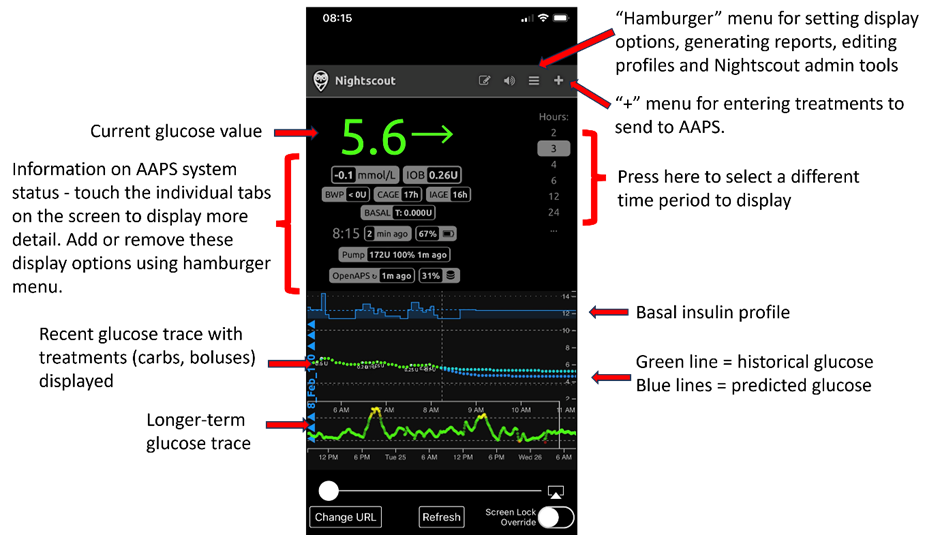
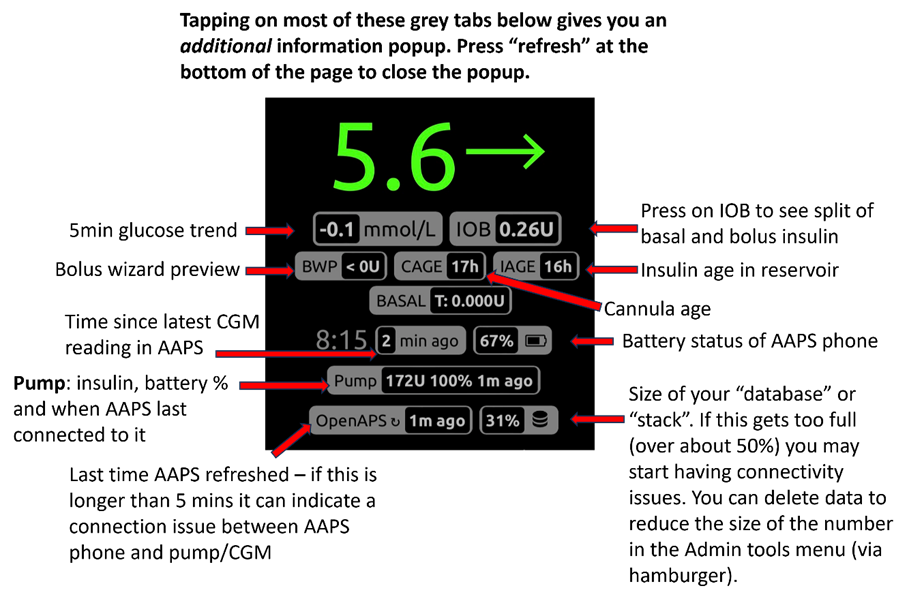

# 远程控制AAPS
有四种高度有效的工具可用于远程管理**AAPS**：

1) [短信命令](RemoteControl_SMS-Commands)（跟随者手机可以是Android或iOS）， 2) [AAPSClient](RemoteControl_aapsclient)（跟随者手机是Android）， 3) [Nightscout](RemoteControl_nightscout)（Android、iOS或其他计算机/设备），  
4) [智能手表](RemoteControl_smartwatches)（Android）。

前三种大多适用于护理人员/家长，但智能手表对护理人员/家长以及成人糖尿病患者本身都非常有用。

(RemoteControl_SMS-Commands)=

## 1) 短信命令

请参见专门的[短信命令](../RemoteFeatures/SMSCommands.md)页面。

(RemoteControl_aapsclient)=
## 2) AAPSClient

_注意：对于AAPS 3.2及更高版本，**NSClient**已被**AAPSClient**替代，请查看版本发布说明以获取更多信息。_

对于**AAPS** 3.2之前的版本，如果您有护理人员/家长的Android手机，可以直接下载并安装[**<0>AAPSClien**](https://github.com/nightscout/AndroidAPS/releases/)apk。 **AAPSClient**在外观上非常类似于**AAPS**本身，为护理人员提供了远程操作AAPS命令的标签：

有两个版本的apk可以从[此处下载](https://github.com/nightscout/AndroidAPS/releases/)，**AAPSClient**&**AAPSClient2**，它们之间有一个细微但重要的区别，如下所述。

**AAPSClient**可以安装在单个手机或多个跟随者手机上（即家长1的跟随者手机和家长2的跟随者手机），以便两位护理人员都能获得访问权限并远程控制患者的**AAPS**手机。

如果护理人员需要第二个**AAPSClient**副本来远程控制另一个使用Nightscout账户的患者，他们应该在安装**AAPSClient**之外再安装**AAPSClient2**。 **AAPSClient 2**允许单个护理人员在同一跟随者手机上两次安装**AAPSClient** apk，以便能够同时访问并远程控制两名不同的患者。

要下载**AAPSClient**，请导航至[此处](https://github.com/nightscout/AndroidAPS/releases/)并点击资源**“app-AAPSClient-release_x.x.x.x”**（它可能是比下方截图中显示的更新版本）：

然后转到计算机上的_downloads_。 在Windows上，-downloads_将显示右侧功能区：

下载完成后，点击_在文件夹中显示_以定位文件。

**AAPSClient** apk现在可以通过以下方式传输：

通过USB数据线传输到跟随者手机上；或者， 拖动到Google Drive文件夹中，然后点击“app-AAPSClient-release”文件将其添加到跟随者手机。

### 同步-AAPSClient和AAPS的设置（适用于3.2.0.0及以上版本）

一旦在跟随者手机上安装了__AAPSClient__ apk，用户必须确保其在Config Builder中的“Preferences”正确设置并与Nightscout 15的__AAPS__对齐（请参阅[此处](../Maintenance/UpdateToNewVersion)的发布说明）。 下面的示例提供了使用Nightscout15的NSClient和NSClientV3的同步指南，但__AAPS__还有其他可用选项（例如xDrip+）。

在“Config Builder”下的“Synchronization”中，用户可以选择__AAPS__和跟随者手机都适用的同步选项：

- 选项1：NSClient（也称为“v1”）- 将用户的数据与Nightscout同步；

- 选项2：NSClientV3（也称为“v3”）- 使用v3 API将用户的数据与Nightscout同步。

用户必须确保AAPS和AAPSClient手机__都__通过选择v1或v3的选项进行同步：

选项1：两台手机都使用v1：

- 输入您的Nightscout URL

- 输入您的API密钥

选项2：两台手机都使用v3：

- 在NSClientV3标签下输入您的Nightscout URL

- 在“Config Build”标签下输入您的NS访问令牌。 请按照[此处](https://nightscout.github.io/nightscout/security/#create-a-token)的说明操作

如果选择Websockets（这是可选的），请确保它在__AAPS__和__AAPSClient__手机中均已激活或停用。 在__AAPS__中激活Websockets而在__AAPSClient__中未激活（反之亦然）将导致__AAPS__出现故障。 启用Websockets将允许与Nightscout更快同步，但可能导致手机电池消耗更多。

用户应确保__AAPSClient__和__AAPS__在各自手机的“NSClient”标签下均显示“已连接”，并且一旦在__AAPSClient__中选择，就可以在__AAPS__中正确激活“Profile Switches”或“Temp Target”。

用户还应确保在__AAPSClient__和__AAPS__的“Treatments”中都记录了碳水化合物，否则可能表明用户设置出现故障。

### 故障排除“NS访问令牌”配置问题

精确的“NS访问令牌”配置可能因您的Nightscout提供商是付费托管站点还是非付费托管站点而有所不同。

如果您在使用**AAPS** v3时遇到“NS访问令牌”接受问题，并且使用的是付费托管的Nightscout站点，您可能需要首先与您的Nightscout提供商联系，以了解如何解决“NS访问令牌”问题。 否则，请联系**AAPS**小组，但在这样做之前，请仔细检查您是否已正确按照[此处](https://nightscout.github.io/nightscout/security/#create-a-token)的说明操作。

### AAPSClient的功能包括：

| 标签/汉堡菜单           | 功能                                                                                                                                   |
| ----------------- | ------------------------------------------------------------------------------------------------------------------------------------ |
| **操作（Action）** 标签 | - 配置文件切换 - 临时目标 - 血糖检查 - 动态探头插入 - 备注 - 锻炼 - 宣布 - 问题? - 历史浏览器 |
| **食物** 标签         |                                                                                                                                      |
| **治疗** 标签         | - 检查已执行完毕的治疗，包括推注和输入的碳水化合物                                                                                                           |
| **运维** 标签         | - 导出和导入设置                                                                                                                            |
| **配置文件** 标签       | - 创建新配置文件 - 配置文件切换                                                                                                          |

**AAPSClient**允许护理人员通过移动或互联网网络远程进行许多在**AAPS**中允许的调整（不包括胰岛素推注）。 **AAPSClient**的主要优点是护理人员/家长可以快速、轻松地使用它来远程控制**AAPS**。 __AAPSClient__在发送需要认证的命令时，_可以_比输入SMS命令快得多。 在**AAPSClient**上输入的命令会上传到Nightscout。

只有同步功能运行良好（_即_您没有看到不需要的数据更改，如TT、TBR等的自我修改），才建议通过**AAPSClient**进行远程控制。 请参阅[2.8.1.1版本的发布说明](#important-hints-2-8-1-1)以获取更多详细信息。

### AAPSClient与智能手表选项

智能手表是帮助管理孩子**AAPS**的非常有用的工具。 有几种不同的配置可选。 如果在父母的手机上安装了**AAPSClient**，则可以在与父母的手机连接的兼容智能手表上安装[**AAPSClient WearOS**应用程序](https://github.com/nightscout/AndroidAPS/releases/)。 这将显示当前的血糖值、Loop（闭环系统）状态和允许碳水化合物输入、临时目标设定以及配置更改。 但它不允许通过WearOS应用进行大剂量胰岛素注射。 您可以阅读有关智能手表的更多信息[此处](#4-smartwatches)。

(RemoteControl_nightscout)=
## 3) Nightscout

Nightscout不仅是“云”中的服务器，还有专用的**Nightscout**应用，可以直接从iPhone的App Store下载。 如果您有Android跟随者手机，则没有专用的Nightscout应用，最好使用[**AAPSClient**](#2-aapsclient)，或者，如果您只想跟随而不发送治疗，可以从Playstore下载并安装[Nightwatch](https://play.google.com/store/apps/details?id=se.cornixit.nightwatch)应用。

在iPhone上安装**Nightscout**应用后，打开应用并按照设置提示操作，输入您的Nightscout地址（见下方左侧）。 此形式可能因您的Nightscout托管方式而异。 （_例如_ http://youraddresshere.herokuapp.com） 然后输入您的Nightscout API密钥（见下方右侧）。 如果没有提示您输入API密码，则需要点击应用顶部的挂锁来输入：

有关设置的更多信息可直接从[Nightscout](https://nightscout.github.io/nightscout/discover/)获取

首次登录时，您将看到一个非常简单的显示。 通过选择右上角的“汉堡菜单”并向下滚动来自定义显示选项：

向下滚动到“设置”。 您可能希望将“刻度”更改为“线性”，因为BG显示的坐标轴默认值刻度是对数刻度，并在“使用基础率”下选择“default”，以便显示泵基础量。

选择您所需的选项。 如果您使用其他应用进行警报，请取消选中警报。

继续向下滚动，直到到达“显示插件。

您需要确保选中了“护理面板（careportal）”，并且还可以选择各种其他指标（最有用的是：IOB、care portal、pump、cannula age、insulin age、basal profile和OpenAPS）。

重要的是，您现在需要点击底部的“保存”以使这些更改生效。

点击“保存”后，应用将返回您的主Nightscout屏幕，看起来像这样：

1. 当前血糖值
2. AAPS系统状态信息- 点击屏幕上的各个选项卡以显示更多详细信息。 使用汉堡菜单添加或删除这些显示选项。
3. 最近的血糖轨迹，显示治疗情况（碳水化合物、推注）
4. 较长期的血糖轨迹
5. “汉堡菜单”用于设置显示选项、生成报告、编辑配置文件和Nightscout管理工具
6. “+”菜单用于输入要发送到AAPS的治疗
7. 选择不同的时间段进行显示
8. 基础胰岛素配置文件
9. 绿色线=历史血糖 蓝色线=预测血糖

Looking in more detail at the top left menu of the Nightscout app:

1. Careportal retrospective edit
2. Turn on/off alarms
3. Hamburger - for setting preferences
4. Careportal - Log treatment - to send changes to AAPS

There is a huge amount of information on the status of the **AAPS** system in the grey tabs (and even more information is revealed if you tap the tab) on this screen:

1. 5min glucose trend
2. Bolus wizard preview
3. Press on Basal to see your current profile and basal information
4. Time since latest CGM reading in AAPS
5. **Pump**: insulin, battery % and when AAPS last connected to it
6. Last time AAPS refreshed - if this is longer than 5 mins it can indicate a connection issue between AAPS phone and pump/CGM
7. Press on IOB to see split of basal and bolus insulin
8. Insulin age in reservoir
9. 管路使用时间
10. Battery status of AAPS phone
11. Size of your database. If it gets too full (DIY Nightscout only - hosted services just ignore) you may start having connectivity issues. You can delete data to reduce the size of the number in the Admin tools menu (via hamburger).

Press "refresh" at the bottom of the page to close the popup.

### Sending treatments through the Nightscout app to AAPS

To set-up sending treatments from the **Nightscout** app to **AAPS**, on the main AAPS phone, go into the **AAPSClient** tab in the **AAPS** app. Open the right-hand dot menu, and open AAPSClientpreferences – synchronisation and select the relevant options in this menu. Set it to receive the different commands (temporary targets, etc) and also to synchronise profiles. If things don’t seem to be synchronised, go back to the AAPSClient tab and select “full synchronisation” and wait a few minutes.

Nightscout on your iPhone has all the same functions as Nightscout on your PC. It allows you to send many commands to **AAPS**, but it does not allow you to send insulin boluses.

### Cancelling negative insulin to avoid repeat hypos

Although you cannot actually bolus insulin, you can however “announce” insulin through Nightscout as a “correction bolus”, although it is not delivered. Because AAPS now takes that fake insulin bolus into account, announcing insulin actually works to make AAPS _less aggressive_, and can be useful for cancelling negative insulin and preventing lows in the event that your profile has been too strong (for example due to prior exercise). You will want to check this for yourself in the presence of the **AAPS** phone, in case your **Nightscout** setup differs.

Some of the most useful **Nightscout** commands are described in the table below.

#### Nightscout command table

| Most commonly used treatments                             | Function, example of when command is useful                                                                                                                                                                                                               |
| --------------------------------------------------------- | --------------------------------------------------------------------------------------------------------------------------------------------------------------------------------------------------------------------------------------------------------- |
| **Correction bolus**                                      | Allows you to announce **but <u>not</u> bolus** insulin. Very useful for cancelling negative insulin to prevent a hypo, for example in the middle of the night, if the profile has been too strong.                                     |
| **Carb correction**                                       | Announce carbs now                                                                                                                                                                                                                                        |
| **Temporary Target** **Temporary Target cancel** | Allows temp targets to be set and cancelled. Note that cancelling does not always work, in this instance you can set a new target for a short time period (2 min) which will then revert back to the normal target afterwards. |
| **配置文件切换**                                                | Allows you to check the current profile which is running, and switch to another profile, either permanently, or for a defined length of time (mins).                                                                                    |

| Less widely used commands                                                                                                           | Function, example of when command is useful                                                                                                                              |
| ----------------------------------------------------------------------------------------------------------------------------------- | ------------------------------------------------------------------------------------------------------------------------------------------------------------------------ |
| **BG check**                                                                                                                        | Send a BG check to AAPS.                                                                                                                                                 |
| **Snack bolus** **Meal bolus** **Combo bolus**                                                                    | Can announce carbs (plus proteins and fat)  from 60 min in the past to 60 min in the future. Combo bolus allows insulin announcement at the same time. |
| **Announcement** **Note** **Question** **Exercise** **Open APS offline** **DAD alert** | Add these info notes (DAD = diabetic dog alert).                                                                                                                         |
| **Pump site change** **Battery change** **Insulin cartridge change**                                              | Announces these pump changes.                                                                                                                                            |
| **CGM sensor start** **CGM sensor insert** **CGM sensor stop**                                                    | Announces these CGM changes.                                                                                                                                             |
| **Temp basal start** **Temp basal end**                                                                                    | Most useful in open looping.                                                                                                                                             |

Read more about **Nightscout** options [here](https://nightscout.github.io/)

### Tips for getting the most out of the Nightscout app

1). If you get “stuck” on a page and want to be able to see the main screen again, just click “refresh” (bottom middle) and this will take you back to the **Nightscout** homepage with the BG graph.

To see the current profile which is running on the phone, press the various icons on the screen above the graph. More info (current carb ratio, sensitivity and timezone etc.) can be seen by pressing “basal” and “OpenAPS” gives info about the profile and current target etc. Both the phone battery% and the pump battery % can also be monitored. BWP gives information on what the algorithm thinks will happen in the future, given the IOB and COB.

#### Other icons in the menu: what does the pencil (edit) mean?

You can (technically) use the edit pencil to move or delete bolus or correction treatments from the last 48h.

More about this [here](https://nightscout.github.io/nightscout/discover/#edit-mode-edit)

Although this could potentially be useful for deleting announced (but not bolused for) carbs, in practice it doesn’t currently work well with **AAPS** and we recommend making changes like this via the **AAPS** app directly.

(RemoteControl_smartwatches)=
## 4) Smartwatches

### Option 1) Controlling AAPS from a Wear OS Watch

Once you have [setup **AAPS** on your watch](../WearOS/BuildingAapsWearOS.md), extensive details about the smartwatch faces and their functions can be found in [Operation of Wear AAPS on a Smartwatch](../WearOS/WearOsSmartwatch.md).

As a brief overview, the following functions can be triggered from the smartwatch:

* set a temporary target

* use the bolus calculator (calculation variables can be defined in settings on the phone)

* administer eCarbs

* administer a bolus (insulin + carbs)

* watch settings

* status

* check pump status

* check loop status

* check and change profile, CPP (Circadian Percentage Profile = time shift + percentage)

* show TDD (Total daily dose = bolus + basal per day)

* Remote bolus where the caregiver and T1D child are in different locations (this is possible for the **AAPS** watch and **AAPS** phone providing both devices are connected to the network)

#### Communication from caregivers to the watch using other apps (like WhatsApp)

It is possible to add additional apps to the watch, like WhatsApp, for messaging (for example) between caregivers and kids. It is important only to have ONE Google account associated with the phone, or the watch will not bring this data across. You need to be 13 or older to have a Samsung account, and this needs to be set up in the same email address which is used on the Android phone.

A video explaining getting WhatsApp setup for messaging on the Galaxy 4 watch (you can’t get full functionality of WhatsApp) is shown [here](https://gorilla-fitnesswatches.com/how-to-get-whatsapp-on-galaxy-watch-4/)

Making adjustments in both the **Galaxy wearable** app on the **AAPS** phone and the watch makes it possible for WhatsApp messages to announce with a slight vibration, and also for the WhatsApp message to display over the existing watchface.

### Option 2) **AAPS** on watch, for remote control of **AAPS** on a phone

Similarly to using a follower phone with either AAPSClient, Nightscout or SMS commands (link to sections) a smartwatch can be used to remotely control **AAPS** and provide full profile data. A key difference to using a follower phone is that the smartwatch to **AAPS** phone link is via bluetooth and does not require an authenticator code. As a side-note, if both smartwatch and **AAPS** phone linked by bluetooth are also on a Wi-Fi/Cellular data network, the watch will also interact with the **AAPS** phone, giving a longer range of communication. This includes remote delivery of a bolus where the caregiver with the **AAPS** watch and T1D child (with **AAPS** phone) are in different locations and which can useful in circumstances where the T1D child is in school.

A remote control smartwatch is therefore often useful in any situation where:

a)  **AAPSClient**/Nightscout/**SMS** commands cannot work; or

b)  The user wishes to avoid the need for authenticator code (as required for the follower phone with inputting data, selecting TT or entering carbs).

A smartwatch needs to have **Android wear** software (ideally 10 or higher) to be able to control **AAPS**. Please check the technical specifications of the watch, and check the [Phones page](../Getting-Started/Phones.md). Search, or ask in the **AAPS**  Facebook/Discord groups if unsure.

Specific How-to guides for setting up **AAPS** on the popular [Samsung Galaxy Watch 4 (40mm) is given below. The [Garmin](https://apps.garmin.com/en-US/apps/a2eebcac-d18a-4227-a143-cd333cf89b55?fbclid=IwAR0k3w3oes-OHgFdPO-cGCuTSIpqFJejHG-klBTm_rmyEJo6gdArw8Nl4Zc#0) watch is also a popular choice. If you have experience of setting up a different smartwatch which you think would be useful to others, please add it into these pages [edit the documentation](../SupportingAaps/HowToEditTheDocs.md) to share your findings with the wider **AAPS** community.

### Option 3) AAPSClient on a watch for remote control of **AAPS** on a phone

The software for the watch, **AAPSClient** Wear apk, can be downloaded directly from [Github](https://github.com/nightscout/AndroidAPS/releases/).

To download the software, click on the required app (in this screenshot, either **wear-aapsclient-release_3.2.0.1** or **wear-aapsclient2-release_3.2.0.1** would work, there are two versions in case you need a copy for a second caregiver watch):

Then "save as" and save the file to a convenient location on your computer:

The **AAPSClient** wear apk can be transferred to your phone and side-loaded onto the watch in the same way as the **AAPS** Wear app, as detailed in [Transferring the Wear app onto your AAPS phone](#remote-control-transferring-the-aaps-wear-app-onto-your-aaps-phone)  

