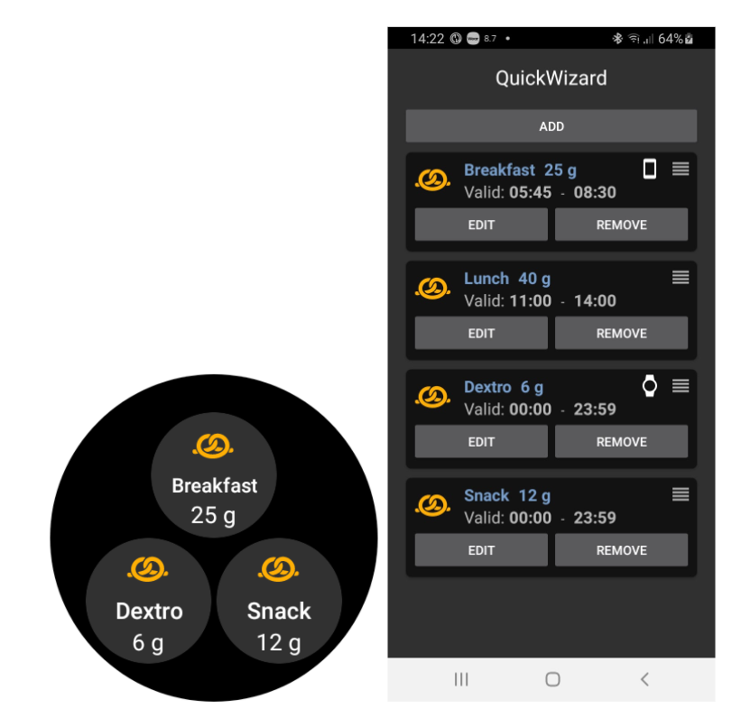

# 通过您的Wear OS智能手表操作AAPS

(Watchfaces-aaps-watchfaces)=

## AAPS表盘

```{warning}
AAPS表盘适用于API级别为28至33的Wear OS智能手表。
Wear OS 5的更改锁定了表盘：仅可使用小工具。
```

在AAPS Wear APK的基本构建中，包含了几种可供选择的表盘。 这些表盘包括平均变化量、IOB、当前活跃的临时基础率、基础率配置文件以及持续葡萄糖监测（CGM）读数图表。

表盘上的一些可用操作包括：

* 双击血糖值进入AAPS菜单
* 双击血糖图表更改图表的时间尺度

## 配置

Enable the Wear module in the [Config Builder > Synchronization](../SettingUpAaps/ConfigBuilder.md).

使用Wear Preferences定义在计算通过手表给予的剂量时应考虑的变量（例如，15分钟趋势、COB...）。

如果您想通过手表进行大剂量等操作， 那么在“手表设置”中，您需要启用“从手表控制”。


通过手表选项卡或汉堡菜单（如果未显示选项卡，则在屏幕左上角），您可以：

* 重新发送所有数据。 如果手表有一段时间未连接，并且您想将信息推送到手表，这可能很有帮助。
* 直接从手机打开手表上的设置。

确保AAPS的通知在手表上未被阻止。 操作的确认（例如，剂量、临时目标）会通过通知发送，您需要滑动并点击确认。

## 访问AAPS主菜单

要访问AAPS主菜单，您可以使用以下选项之一：

* 双击你的BG值
* 在手表应用程序菜单中选择AAPS图标
* 点击AAPS小工具（如果已配置为菜单）

## 设置（在Wear手表上）

要访问表盘设置，请进入AAPS主菜单，向上滑动并选择“设置”。

实心星号表示启用状态（**开**），空心星号表示设置已禁用（**关**）：


### AAPS伴侣参数

* **剂量时震动**（默认`开`）：
* **操作单位**（默认为`mg/dl`）：如果**开启**，动作单位为`mg/dl`；如果**关闭**，单位为`mmol/l`。 在设置目标时间（TT）时使用。

(Watchfaces-watchface-settings)=

### 表盘设置

* **显示日期**（默认`关`）：请注意，并非所有表盘都显示日期。
* **显示IOB**（默认`开`）：显示或不显示IOB值（详细值设置在AAPS Wear参数中）。
* **显示COB**（默认`开`）：显示或不显示COB值。
* **显示变化量**（默认`开`）：显示或不显示过去5分钟的血糖变化量。
* **显示平均变化量**（默认`开`）：显示或不显示过去15分钟的平均血糖变化量。
* **显示手机电池**（默认`开`）：手机电池百分比。 低于30%时显示为红色。
* **显示Rig电池**（默认`关`）：Rig电池是手机电池、泵电池和传感器电池的综合（通常为三者中的最低值）。
* **显示基础率**（默认`开`）：显示或不显示当前基础率（单位为U/h，如果是TBR单位为%）。
* **显示闭环状态**（默认`开`）：显示自上次闭环运行以来的分钟数（如果超过15分钟，值周围的箭头会变红）。
* **显示血糖**（默认`开`）：显示或不显示最后的血糖值。
* **显示趋势箭头**（默认`开`）：显示或不显示血糖趋势箭头。
* **显示Ago**（默认`开`）：显示最后一次读数的时间。
* **深色模式**（默认`开`）：您可以在黑色背景和白色背景之间切换（Cockpit和Steampunk表盘除外）。
* **高亮基础率**（默认`关`）：提高基础率和临时基础率的可见性。
* **匹配分隔符**（默认`关`）：对于AAPS、AAPSv2和AAPS（大号）表盘，显示对比背景的分隔符（**关**）或与背景颜色匹配的分隔符（**开**）。
* **图表时间范围**（默认`3小时`）：您可以在子菜单中选择图表的最大时间范围，介于1小时和5小时之间。

### 用户界面设置

* **输入设计**：使用此参数，您可以选择在输入AAPS命令（临时目标、胰岛素、碳水化合物...）时“+”和“-”按钮的位置。


### 特定表盘参数

#### Steampunk表盘

* **变化量粒度**（默认`中等`）


#### Circle WF

* **大号数字**（默认`关`）：增大文本大小以提高可见性。
* **环形历史**（默认`关`）：以绿色环内的灰色环图形显示血糖历史。
* **浅色环形历史**（默认`开`）：环形历史更不显眼，使用更深的灰色。
* **动画**（默认`开`）：启用时，在受支持的手表且不在省电低分辨率模式下，表盘圆形将动画显示。

### 命令设置

* **菜单中的向导**（默认`开`）：允许在主菜单中使用向导界面输入碳水化合物并设置剂量。
* **菜单中的填充**（默认`关`）：允许从手表执行填充/灌注操作。
* **单一目标**（默认`开启`）
  
  * `开`：您设置一个单一的临时目标值。
  * `关`：您设置低目标和高目标作为临时目标。

* **向导百分比**（默认`关闭`）：允许根据向导进行大剂量校正（在确认通知前输入的百分比值）。

(Watchfaces-complications)=

## 小部件

*小部件*一词源自传统制表业，用于描述在主表盘上增加的额外功能——如另一个小窗口或子表盘（显示日期、星期几、月相等）。 Wear OS 2.0沿用了这一比喻，允许将自定义数据提供商（如天气、通知、健身计数器等）添加到任何支持小部件的表盘上。

AAPS Wear OS应用自版本`2.6`起支持小工具，并允许任何支持小工具的第三方表盘配置为显示与AAPS相关的数据（如血糖及其趋势、IOB、COB等）。

小部件还可以作为访问AAPS功能的**快捷方式**。 通过点击它们，您可以打开与AAPS相关的菜单和对话框（具体取决于小部件类型和配置）。


### 小部件类型

AAPS Wear OS应用仅提供原始数据，根据预定义格式。 第三方表盘决定在哪里以及如何呈现小工具，包括其布局、边框、颜色和字体。 在许多可用的Wear OS小工具类型中，AAPS使用：

* `短文本` - 包含两行文字，每行7个字符，有时分别称为值和标签。 通常呈现为一个圆圈或小型药丸形状内，一行位于另一行下方，或者并排显示。 这是一种空间非常有限的小部件。 AAPS会尝试删除不必要的字符以适应这种限制：例如，通过四舍五入值、删除值前后的零等。
* `长文本` - 包含两行文本，每行约20个字符。 通常渲染在矩形或长药丸形状内——一行在另一行下方。 它用于更多细节和文本状态。
* `范围值` - 用于预定义范围内的值，如百分比。 它包含图标、标签，通常渲染为圆形进度表盘。
* `大图片` - 当受表盘支持时，可用作背景的自定义背景图像。

### 小部件设置

要将小部件添加到表盘上，请长按并点击下方的齿轮图标进行配置。 具体配置方式取决于表盘的设计——您可以点击占位符，或者进入表盘的小部件设置菜单。 AAPS的小部件在AAPS菜单项下分组显示。

在表盘上配置小部件时，Wear OS会展示并筛选能够适配表盘所选小部件位置的小部件列表。 如果在列表中找不到特定的小部件，很可能是因为其类型不适用于该位置。

### AAPS提供的小部件

AAPS提供以下小部件：


* **基础率、COB&IOB**（`短文本`，打开*菜单*）：第一行显示*基础率*，第二行显示*COB*和*IOB*。
* **血糖值**（`短文本`，打开*菜单*）：第一行显示*血糖值*和*趋势*箭头，第二行显示*测量时间*和*血糖变化量*。
* **COB&IOB**（`短文本`，打开*菜单*）：第一行显示*COB*，第二行显示*IOB*。
* **详细COB**（`短文本`，打开*向导*）：第一行显示当前活跃的*COB*，第二行显示计划的（未来的，预估碳水）碳水。
* **COB图标**（`短文本`，打开*向导*）：以静态图标显示*COB*的值。
* **完整状态**（`长文本`，打开*菜单*）：一次性显示大部分数据：第一行显示*血糖*值、*趋势*箭头、*血糖变化量*和*测量时间*。 第二行显示*COB*、*IOB*和*基础率*。
* **翻转完整状态**（`长文本`，打开*菜单*）：与标准*完整状态*显示相同的数据，但两行内容互换。 适用于只显示`长文本`中一行内容的表盘。
* **详细COB**（`短文本`，打开*大剂量*）：第一行显示总*COB*，第二行显示*大剂量*和*基础部分*在*IOB*中的占比。
* **IOB图标**（`短文本`，打开*大剂量*）：以静态图标显示*IOB*的值。
* **上传器/手机电量**（`范围值`，打开*状态*）：显示AAPS手机（上传器）的电池百分比，由AAPS报告。 以百分比指示器和反映报告值的电池图标显示。 可能不是实时更新，而是在其他重要AAPS数据变化时更新（通常约为每5分钟一次，随新的*血糖*测量值更新）。

此外，还有三种`大图像`类型的小部件：**深色壁纸**、**灰色壁纸**和**浅色壁纸**，它们显示静态的AAPS壁纸。

### 与小部件相关的设置

* **小部件点击动作** （默认`默认`）：决定用户点击小工具时打开的对话框： 
  * *默认*：特定于小工具类型的操作（见上表）。
  * *菜单*：AAPS主菜单。
  * *向导*：大剂量向导-大剂量计算器
  * *大剂量*：直接剂量值输入。
  * *eCarb*：eCarb配置对话框。
  * *状态*：状态子菜单。
  * *无*：禁用AAPS小工具的点击操作。
* **小工具中的Unicode**（默认`开`）：当`开`时，小工具将使用Unicode字符表示符号，如`Δ`（Delta）、`⁞`（垂直点分隔符）或`⎍`（基础率符号）。 它们的渲染取决于字体，这可能非常依赖于表盘。 此选项允许在需要时切换Unicode符号`关`——如果自定义表盘使用的字体不支持这些符号——以避免图形故障。

(WearOsSmartwatch-wear-os-tiles)=

## Wear OS功能块（Tiles）

Wear OS Tiles 可让用户轻松访问信息和执行操作以完成任务。 该功能仅适用于运行 Wear OS 2.0 及更高版本的 Android 智能手表。

Tiles 功能让您无需通过表盘菜单即可快速访问 AAPS 应用程序中的操作。 Tiles 是可选的，用户可以根据需要进行添加和配置。

Tiles 可与任何表盘“并排”使用。 要访问已启用的 Tile，只需在表盘上从右向左滑动即可显示。

请注意，图块不会保存AAPS手机应用的实际状态，并且仅会发出请求，该请求需要在手表上确认后才能应用。

## 如何添加Tiles

在使用Tiles之前，您必须在Android APS的“Wear OS”设置中切换“从手表控制”。


根据您的Wear OS版本、品牌以及智能手机，有两种启用Tiles的方式：

1. 在您的手表上，从表盘开始； 
  * 向左滑动直到到达“+ 添加tiles”。 
  * 选择一个tiles。
2. 在您的手机上打开手表的配套应用。 
  * 对于三星，打开“Galaxy Wearable”；对于其他品牌，打开“Wear OS”。
  * 点击“Tiles”部分，然后点击“+ 添加”按钮。
  * 通过选择它来找到您想添加的AAPS Tiles。 
  * 可以通过拖放更改tiles的顺序。

Tiles的内容可以通过长按tile并点击“编辑”或“齿轮图标”按钮进行自定义。

### APS（操作）Tile

操作Tiles可以容纳1到4个用户定义的操作按钮。 要进行配置，请长按该Tiles，这将显示配置选项。 类似的操作也可以通过标准的手表菜单来完成。

"操作"tile中支持的操作可以请求AAPS手机应用执行以下操作：

* **计算**；基于碳水化合物输入和可选百分比执行剂量计算[1]。
* **胰岛素**；通过输入胰岛素单位请求胰岛素输送”
* **治疗**；请求给予胰岛素并添加碳水化合物。
* **碳水化合物**；添加（延长）碳水化合物。
* **TempT**；设置自定义的临时目标值和持续时间


[1] 通过Wear OS菜单，将“计算器百分比”选项设置为“开启”，以在大剂量计算器中显示百分比输入。 默认百分比基于“概览”部分中[“输送大剂量向导结果的一部分%”](#Preferences-deliver-this-part-of-bolus-wizard-result)的手机设置。当用户未提供百分比时，将使用手机中的默认值。 请通过手机应用中的“偏好设置”-“向导设置”来配置大剂量计算器的其他参数。

### AAPS（临时目标）Tile

The Temp Target Tile can request a temporary target based on AAPS phone presets. Configure preset time and targets through the phone app setting by going to "Preferences", "Overview", ["Default Temp-Targets"](#Preferences-default-temp-targets) and set the duration and targets for each preset. Configure the visible actions on the tile through the tile settings. Long press the tile to show the configuration options and select 1 to 4 options:

* **Activity**; for sport
* **Hypo**; to raise the target during hypo treatment
* **Eating soon**; to lower the target to raise the insulin on board
* **Manual**; set a custom temporary target and duration
* **Cancel**; to stop the current temporary target


### AAPS(QuickWizard)Tile

The QuickWizard tile can hold 1 to 4 quick wizard action buttons, defined with the phone app[2]. See [QuickWizard](#Preferences-quick-wizard). You can set standard meals (carbs and calculation method for the bolus) to be displayed on the tile depending on the time of the day. Ideal for the most common meals/snacks you eat during the day. You can specify if the quick wizard buttons will show on the phone, watch, or both. Please note that the phone can show only one quick wizard button at a time. The quick wizard setup also can specify a custom percentage of the insulin for the bolus. The custom percentage enables you to vary, for example, snack at 120%, slow absorbing breakfast 80% and hypo treatment sugar snack at 0%



[2] Wear OS limits tiles update frequency to only once every 30 seconds. When you notice that the changes on your phone are not reflected on the tile, consider; waiting 30 seconds, using the "Resend all data" button from the Wear OS section of AAPS, or removing the tile and adding it again. To change the order of the QuickWizard buttons dragging an item up or down.

## Always on

Long battery life for Android Wear OS smartwatches is a challenge. Some smartwatches get as much as 30 hours before recharging. The display should be switched off for optimal power saving when not in use. Most watches support the “Always on” display.

Since AAPS version 3, we can use a “Simplify UI” during always-on-mode. This UI only contains the blood glucose, direction, and time. This UI is power-optimized with less frequent updates, showing less information and lightening fewer pixels to save power on OLED displays.

The simplified UI mode is available for the watch-faces: AAPS, AAPS V2, Home Big, Digital Style, Steampunk, and Cockpit. The simplified UI is optional and is configured through the watch face settings. (log press the watch face and click “edit” or the gear icon) Select the configuration “Simplify UI" and set it to “Always on” or “Always on and charging”.

### Night-time mode

While charging, it would be helpful if the display could stay “always-on” and show your blood glucose during the night. However, the standard watch-faces are too bright and have too much information, and the details are hard to read with sleepy eyes. Therefore, we added an option for the watch-face to simplify the UI only during charging when set in the configuration.

The simplified UI mode is available for the watch-faces: AAPS, AAPS V2, Home Big, Digital Style, Steampunk, and Cockpit. The simplified UI is optional and is configured through the watch face settings. (log press the watch face and click “edit” or the gear icon) Select the configuration “Simplify UI" and set it to “During charging” or “Always on and charging”

The Android developer options enable your watch to stay awake during charging. To make the developer options available, see the [official documentation](https://developer.android.com/training/wearables/get-started/debugging). Set the “Stay awake when charging” to “on” in the developer options”.

Note: not all displays can handle always-on very well. It can cause screen burn-in, especially on the older OLED displays. The watches will generally dim the display to prevent burn-in; please check your owner’s manual, the manufacturing, or the internet for advice.


## Snooze Alert shortcut

It is possible to create a shortcut to snooze the alerts/alarm of AAPS. Muting the sound via your watch is convenient and faster without reaching for your phone. Note; you still have to check your alarm message on your phone and handle it accordingly, but you can check that later. When your watch has two buttons, you can assign a key to the `AAPS Snooze Alert` program.

To link the button on the Samsung Watch 4 go to `Settings > Advanced Features > Customize Buttons > Double press > AAPS Snooze Alert`

### Snooze xDrip

When you use xDrip and have xDrip installed on the watch, the 'AAPS Snooze Alert' shortcut will also Snooze any xDrip alarm.

## Performance and battery life tips

Wear OS watches are very power-constrained devices. The size of the watch case limits the capacity of the included battery. Even with recent advancements both on hardware and software side, Wear OS watches still require daily charging.

If an experienced battery span is shorter than a day (from dusk to dawn), here are some tips to troubleshoot the issues.

Main battery-demanding areas are:

* Active display with a backlight on (for LED) or in full intensity mode (for OLED)
* Rendering on screen
* Radio communication over Bluetooth

Since we cannot compromise on communication (we need up-to-date data) and want to have the most recent data rendered, most of the optimizations can be done in *display time* area:

* Stock watchfaces are usually better optimized than custom one, downloaded from the store.
* It is better to use watchfaces that limit the amount of rendered data in inactive / dimmed mode.
* Be aware when mixing other Complications, like third party weather widgets, or other - utilizing data from external sources.
* Start with simpler watchfaces. Add one complication at the time and observe how they affect battery life.
* Try to use **Dark** theme for AAPS watchfaces, and [**Matching divider**](#watchface-settings). On OLED devices it will limit the amount of pixels lit and limit burnout.
* Check what performs better on your watch: AAPS stock watchfaces or other watchfaces with AAPS Complications.
* Observe over a few days, with different activity profiles. Most watches activate the display on glancing, movement and other usage-related triggers.
* Check your global system settings that affect performance: notifications, backlight/active display timeout, when GPS is activated.
* Check [list of tested phones and watches](#Phones-list-of-tested-phones) and [ask community](../GettingHelp/WhereCanIGetHelp.md) for other users experiences and reported battery lifetime.
* **We cannot guarantee that data displayed on watchface or complication is up-to-date**. In the end, it is up to Wear OS to decide when to update a watchface or a complication. Even when the AAPS app requests update, the System may decide to postpone or ignore updates to conserve battery. When in doubt and low on battery on watch - always double-check with main AAPS app on phone.

(Watchfaces-troubleshooting-the-wear-app)=

## Troubleshooting the wear app:

* Sometimes it helps to re-sync the apps to the watch as it can be a bit slow to do so itself: Android Wear > Cog icon > Watch name > Resync apps.
* Enable ADB debugging in Developer Options (on watch), connect the watch via USB and start the Wear app once in Android Studio.
* If Complications does not update data - check first if AAPS watchfaces work at all.

## Additional AAPS custom watchfaces are also available

[Here](../ExchangeSiteCustomWatchfaces/index.md) you can download Zip-Files with custom watchfaces made by other users.

## Build your own watchface

If you want to build your own watchface, follow the [guide here](../ExchangeSiteCustomWatchfaces/CustomWatchfaceReference.md).

Once you have built a custom watchface, you can share your own **AAPS** custom watchface with others, the zip-file can be uploaded in the folder "ExchangeSiteCustomWatchfaces" via a Pull Request into Github. During merge of the pull request, the documentation team will extract the CustomWatchface.png file and prefix it with the filename of the Zip-file.