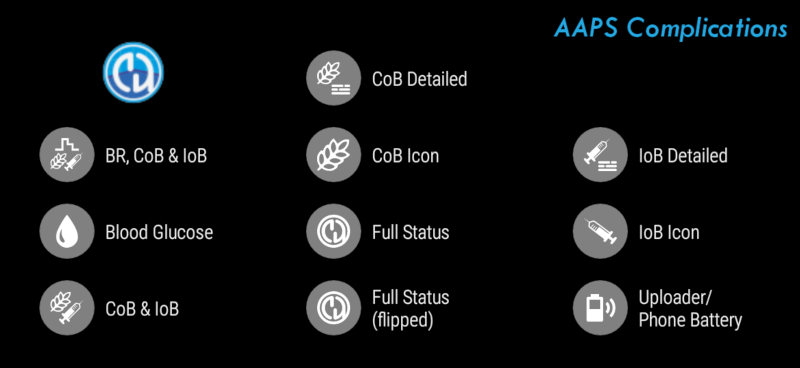
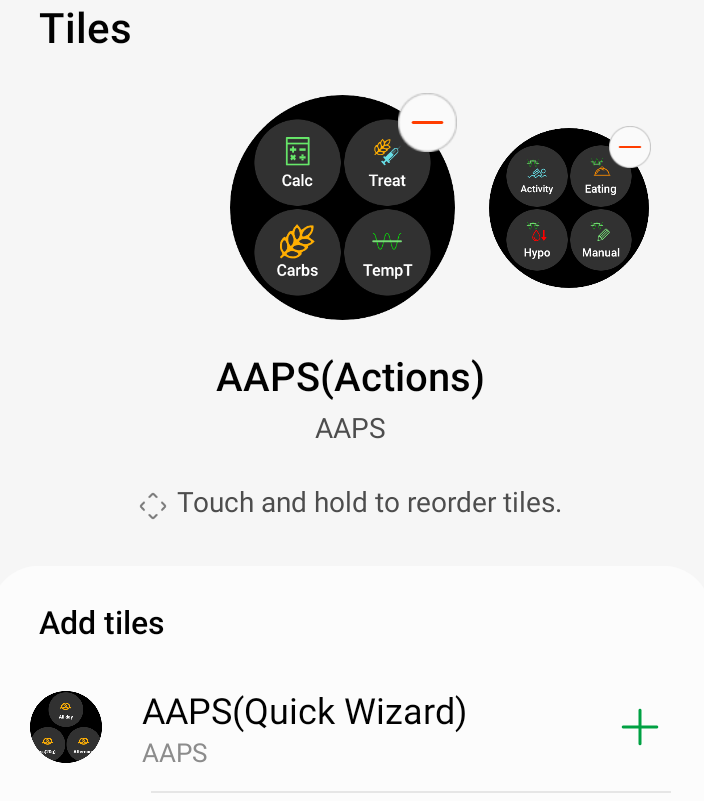

# 通过您的Wear OS智能手表操作AAPS

(Watchfaces-aaps-watchfaces)=

## AAPS表盘

```{warning}
AAPS表盘适用于API级别为28至33的Wear OS智能手表。
Wear OS 5的更改锁定了表盘：仅可使用小工具。
```

在AAPS Wear APK的基本构建中，包含了几种可供选择的表盘。 这些表盘包括平均变化量、IOB、当前活跃的临时基础率、基础率配置文件以及持续葡萄糖监测（CGM）读数图表。

表盘上的一些可用操作包括：

* 双击血糖值进入AAPS菜单
* 双击血糖图表更改图表的时间尺度

## 配置

在[配置构建器 > 同步](../SettingUpAaps/ConfigBuilder.md)中启用穿戴设备模块。

使用Wear Preferences定义在计算通过手表给予的剂量时应考虑的变量（例如，15分钟趋势、COB...）。

如果您想通过手表进行大剂量等操作， 那么在“手表设置”中，您需要启用“从手表控制”。


通过手表选项卡或汉堡菜单（如果未显示选项卡，则在屏幕左上角），您可以：

* 重新发送所有数据。 如果手表有一段时间未连接，并且您想将信息推送到手表，这可能很有帮助。
* 直接从手机打开手表上的设置。

确保AAPS的通知在手表上未被阻止。 操作的确认（例如，剂量、临时目标）会通过通知发送，您需要滑动并点击确认。

## 访问AAPS主菜单

要访问AAPS主菜单，您可以使用以下选项之一：

* 双击你的BG值
* 在手表应用程序菜单中选择AAPS图标
* 点击AAPS小工具（如果已配置为菜单）

## 设置（在Wear手表上）

要访问表盘设置，请进入AAPS主菜单，向上滑动并选择“设置”。

实心星号表示启用状态（**开**），空心星号表示设置已禁用（**关**）：


### AAPS伴侣参数

* **剂量时震动**（默认`开`）：
* **操作单位**（默认为`mg/dl`）：如果**开启**，动作单位为`mg/dl`；如果**关闭**，单位为`mmol/l`。 在设置目标时间（TT）时使用。

(Watchfaces-watchface-settings)=

### 表盘设置

* **显示日期**（默认`关`）：请注意，并非所有表盘都显示日期。
* **显示IOB**（默认`开`）：显示或不显示IOB值（详细值设置在AAPS Wear参数中）。
* **显示COB**（默认`开`）：显示或不显示COB值。
* **显示变化量**（默认`开`）：显示或不显示过去5分钟的血糖变化量。
* **显示平均变化量**（默认`开`）：显示或不显示过去15分钟的平均血糖变化量。
* **显示手机电池**（默认`开`）：手机电池百分比。 低于30%时显示为红色。
* **显示Rig电池**（默认`关`）：Rig电池是手机电池、泵电池和传感器电池的综合（通常为三者中的最低值）。
* **显示基础率**（默认`开`）：显示或不显示当前基础率（单位为U/h，如果是TBR单位为%）。
* **显示闭环状态**（默认`开`）：显示自上次闭环运行以来的分钟数（如果超过15分钟，值周围的箭头会变红）。
* **显示血糖**（默认`开`）：显示或不显示最后的血糖值。
* **显示趋势箭头**（默认`开`）：显示或不显示血糖趋势箭头。
* **显示Ago**（默认`开`）：显示最后一次读数的时间。
* **深色模式**（默认`开`）：您可以在黑色背景和白色背景之间切换（Cockpit和Steampunk表盘除外）。
* **高亮基础率**（默认`关`）：提高基础率和临时基础率的可见性。
* **匹配分隔符**（默认`关`）：对于AAPS、AAPSv2和AAPS（大号）表盘，显示对比背景的分隔符（**关**）或与背景颜色匹配的分隔符（**开**）。
* **图表时间范围**（默认`3小时`）：您可以在子菜单中选择图表的最大时间范围，介于1小时和5小时之间。

### 用户界面设置

* **输入设计**：使用此参数，您可以选择在输入AAPS命令（临时目标、胰岛素、碳水化合物...）时“+”和“-”按钮的位置。


### 特定表盘参数

#### Steampunk表盘

* **变化量粒度**（默认`中等`）


#### Circle WF

* **大号数字**（默认`关`）：增大文本大小以提高可见性。
* **环形历史**（默认`关`）：以绿色环内的灰色环图形显示血糖历史。
* **Light Ring History** (default `On`): Ring history more discrete with a darker gray
* **动画**（默认`开`）：启用时，在受支持的手表且不在省电低分辨率模式下，表盘圆形将动画显示。

### 命令设置

* **菜单中的向导**（默认`开`）：允许在主菜单中使用向导界面输入碳水化合物并设置剂量。
* **菜单中的填充**（默认`关`）：允许从手表执行填充/灌注操作。
* **单一目标**（默认`开启`）
  
  * `开`：您设置一个单一的临时目标值。
  * `关`：您设置低目标和高目标作为临时目标。

* **向导百分比**（默认`关闭`）：允许根据向导进行大剂量校正（在确认通知前输入的百分比值）。

(Watchfaces-complications)=

## 小部件

*小部件*一词源自传统制表业，用于描述在主表盘上增加的额外功能——如另一个小窗口或子表盘（显示日期、星期几、月相等）。 Wear OS 2.0沿用了这一比喻，允许将自定义数据提供商（如天气、通知、健身计数器等）添加到任何支持小部件的表盘上。

AAPS Wear OS应用自版本`2.6`起支持小工具，并允许任何支持小工具的第三方表盘配置为显示与AAPS相关的数据（如血糖及其趋势、IOB、COB等）。

小部件还可以作为访问AAPS功能的**快捷方式**。 通过点击它们，您可以打开与AAPS相关的菜单和对话框（具体取决于小部件类型和配置）。


### 小部件类型

AAPS Wear OS应用仅提供原始数据，根据预定义格式。 第三方表盘决定在哪里以及如何呈现小工具，包括其布局、边框、颜色和字体。 在许多可用的Wear OS小工具类型中，AAPS使用：

* `短文本` - 包含两行文字，每行7个字符，有时分别称为值和标签。 通常呈现为一个圆圈或小型药丸形状内，一行位于另一行下方，或者并排显示。 这是一种空间非常有限的小部件。 AAPS会尝试删除不必要的字符以适应这种限制：例如，通过四舍五入值、删除值前后的零等。
* `长文本` - 包含两行文本，每行约20个字符。 通常渲染在矩形或长药丸形状内——一行在另一行下方。 它用于更多细节和文本状态。
* `范围值` - 用于预定义范围内的值，如百分比。 它包含图标、标签，通常渲染为圆形进度表盘。
* `大图片` - 当受表盘支持时，可用作背景的自定义背景图像。

### 小部件设置

要将小部件添加到表盘上，请长按并点击下方的齿轮图标进行配置。 具体配置方式取决于表盘的设计——您可以点击占位符，或者进入表盘的小部件设置菜单。 AAPS的小部件在AAPS菜单项下分组显示。

在表盘上配置小部件时，Wear OS会展示并筛选能够适配表盘所选小部件位置的小部件列表。 如果在列表中找不到特定的小部件，很可能是因为其类型不适用于该位置。

### AAPS提供的小部件

AAPS提供以下小部件：



* **基础率、COB&IOB**（`短文本`，打开*菜单*）：第一行显示*基础率*，第二行显示*COB*和*IOB*。
* **血糖值**（`短文本`，打开*菜单*）：第一行显示*血糖值*和*趋势*箭头，第二行显示*测量时间*和*血糖变化量*。
* **COB&IOB**（`短文本`，打开*菜单*）：第一行显示*COB*，第二行显示*IOB*。
* **详细COB**（`短文本`，打开*向导*）：第一行显示当前活跃的*COB*，第二行显示计划的（未来的，预估碳水）碳水。
* **COB图标**（`短文本`，打开*向导*）：以静态图标显示*COB*的值。
* **完整状态**（`长文本`，打开*菜单*）：一次性显示大部分数据：第一行显示*血糖*值、*趋势*箭头、*血糖变化量*和*测量时间*。 第二行显示*COB*、*IOB*和*基础率*。
* **翻转完整状态**（`长文本`，打开*菜单*）：与标准*完整状态*显示相同的数据，但两行内容互换。 适用于只显示`长文本`中一行内容的表盘。
* **详细COB**（`短文本`，打开*大剂量*）：第一行显示总*COB*，第二行显示*大剂量*和*基础部分*在*IOB*中的占比。
* **IOB图标**（`短文本`，打开*大剂量*）：以静态图标显示*IOB*的值。
* **上传器/手机电量**（`范围值`，打开*状态*）：显示AAPS手机（上传器）的电池百分比，由AAPS报告。 以百分比指示器和反映报告值的电池图标显示。 可能不是实时更新，而是在其他重要AAPS数据变化时更新（通常约为每5分钟一次，随新的*血糖*测量值更新）。

此外，还有三种`大图像`类型的小部件：**深色壁纸**、**灰色壁纸**和**浅色壁纸**，它们显示静态的AAPS壁纸。

### 与小部件相关的设置

* **小部件点击动作** （默认`默认`）：决定用户点击小工具时打开的对话框： 
  * *默认*：特定于小工具类型的操作（见上表）。
  * *菜单*：AAPS主菜单。
  * *向导*：大剂量向导-大剂量计算器
  * *大剂量*：直接剂量值输入。
  * *eCarb*：eCarb配置对话框。
  * *状态*：状态子菜单。
  * *无*：禁用AAPS小工具的点击操作。
* **小工具中的Unicode**（默认`开`）：当`开`时，小工具将使用Unicode字符表示符号，如`Δ`（Delta）、`⁞`（垂直点分隔符）或`⎍`（基础率符号）。 它们的渲染取决于字体，这可能非常依赖于表盘。 此选项允许在需要时切换Unicode符号`关`——如果自定义表盘使用的字体不支持这些符号——以避免图形故障。

(WearOsSmartwatch-wear-os-tiles)=

## Wear OS功能块（Tiles）

Wear OS Tiles 可让用户轻松访问信息和执行操作以完成任务。 该功能仅适用于运行 Wear OS 2.0 及更高版本的 Android 智能手表。

Tiles 功能让您无需通过表盘菜单即可快速访问 AAPS 应用程序中的操作。 Tiles 是可选的，用户可以根据需要进行添加和配置。

Tiles 可与任何表盘“并排”使用。 要访问已启用的 Tile，只需在表盘上从右向左滑动即可显示。

请注意，图块不会保存AAPS手机应用的实际状态，并且仅会发出请求，该请求需要在手表上确认后才能应用。

## 如何添加Tiles

在使用Tiles之前，您必须在Android APS的“Wear OS”设置中切换“从手表控制”。


根据您的Wear OS版本、品牌以及智能手机，有两种启用Tiles的方式：

1. 在您的手表上，从表盘开始； 
  * 向左滑动直到到达“+ 添加tiles”。 
  * 选择一个tiles。
2. 在您的手机上打开手表的配套应用。 
  * 对于三星，打开“Galaxy Wearable”；对于其他品牌，打开“Wear OS”。
  * 点击“Tiles”部分，然后点击“+ 添加”按钮。
  * 通过选择它来找到您想添加的AAPS Tiles。 
  * 可以通过拖放更改tiles的顺序。

Tiles的内容可以通过长按tile并点击“编辑”或“齿轮图标”按钮进行自定义。

### APS（操作）Tile

操作Tiles可以容纳1到4个用户定义的操作按钮。 要进行配置，请长按该Tiles，这将显示配置选项。 类似的操作也可以通过标准的手表菜单来完成。

"操作"tile中支持的操作可以请求AAPS手机应用执行以下操作：

* **计算**；基于碳水化合物输入和可选百分比执行剂量计算[1]。
* **胰岛素**；通过输入胰岛素单位请求胰岛素输送”
* **治疗**；请求给予胰岛素并添加碳水化合物。
* **碳水化合物**；添加（延长）碳水化合物。
* **TempT**；设置自定义的临时目标值和持续时间


[1] 通过Wear OS菜单，将“计算器百分比”选项设置为“开启”，以在大剂量计算器中显示百分比输入。 默认百分比基于“概览”部分中[“输送大剂量向导结果的一部分%”](#Preferences-deliver-this-part-of-bolus-wizard-result)的手机设置。当用户未提供百分比时，将使用手机中的默认值。 请通过手机应用中的“偏好设置”-“向导设置”来配置大剂量计算器的其他参数。

### AAPS（临时目标）Tile

临时目标磁贴可以根据AAPS手机预设请求临时目标。 通过手机应用设置中的“偏好设置”、“概览”、[“默认临时目标”](#Preferences-default-temp-targets)来配置预设时间和目标，为每个预设设置持续时间和目标。 通过磁贴设置配置磁贴上可见的操作。 长按磁贴以显示配置选项，并选择选项1到4：

* **活动**；用于运动。
* **低血糖**；在低血糖治疗期间提高目标
* **即将进食**；降低目标以增加活性胰岛素。
* **手动**；设置自定义临时目标和持续时间。
* **取消**；停止当前的临时目标。


### AAPS（快速向导）磁贴

快速向导磁贴可以容纳1到4个快速向导操作按钮，这些按钮通过手机应用[2]定义。 请参阅[快速向导](#Preferences-quick-wizard)。 您可以设置标准餐食（碳水化合物和大剂量计算方法），以便根据一天中的时间显示在磁贴上。 非常适合您一天中最常吃的餐食/零食。 您可以指定快速向导按钮是显示在手机上、手表上，还是两者都显示。 请注意，手机一次只能显示一个快速向导按钮。 快速向导设置还可以指定推注胰岛素的自定义百分比。 自定义百分比使您能够调整，例如，零食为120%、慢吸收早餐为80%，低血糖治疗时的含糖零食为0%。


[2] Wear OS 将磁贴更新频率限制为每30秒仅更新一次。 当您注意到手机上的更改未反映在图块上时，请考虑等待30秒、使用AAPS中的“重新发送所有数据”按钮或删除图块并重新添加。 通过拖放更改快速向导按钮的顺序。

## 屏幕常亮

Android Wear OS智能手表的长电池寿命是一个挑战。 一些智能手表在充电前可使用长达30小时。 为优化电源节省，在不使用时应关闭显示屏。 大多数手表支持“常亮”显示。

自AAPS版本3起，我们可以在常亮模式下使用“简化用户界面（Simplify UI）”。 该界面仅包含血糖值、趋势方向和时间。 This UI is power-optimized with less frequent updates, showing less information and lighting up fewer pixels to save power on OLED displays.

简化用户界面模式适用于以下表盘：AAPS、AAPS V2、Home Big, Digital Style, Steampunk, and Cockpit.。 简化用户界面是可选的，可通过表盘设置进行配置。 （长按表盘并点击“编辑”或齿轮图标）选择“简化用户界面”配置，并将其设置为“始终开启”或“充电时始终开启”。

### 夜间模式

在充电时，如果显示屏能够保持“始终开启”并在夜间显示您的血糖值，那将非常有帮助。 然而，标准表盘的亮度过高，信息过多，而且细节在困倦的眼睛看来很难阅读。 因此，我们添加了一个选项，让表盘仅在充电时（如果在配置中设置）简化用户界面。

简化用户界面模式适用于以下表盘：AAPS、AAPS V2、Home Big, Digital Style, Steampunk, and Cockpit.。 简化用户界面是可选的，可通过表盘设置进行配置。 （长按表盘并点击“编辑”或齿轮图标）选择“简化用户界面”配置，并将其设置为“充电时”或“始终开启且充电时”。

Android开发者选项使您的手表能够在充电时保持唤醒状态。 要使开发者选项可用，请参阅[官方文档](https://developer.android.com/training/wearables/get-started/debugging)。 在开发者选项中将“充电时保持唤醒”设置为“开”。

注意：并非所有显示屏都能很好地处理常亮状态。 它可能会导致屏幕烧屏，尤其是在较旧的OLED显示屏上。 手表通常会调暗显示屏以防止烧屏；请查阅您的用户手册、制造商网站或互联网以获取建议。


## 暂停警报快捷方式

可以创建快捷方式以暂停AAPS的警报/提醒。 通过手表静音声音既方便又快捷，无需伸手拿手机。 请注意，您仍然需要在手机上查看警报消息并相应处理，但您可以稍后再查看。 如果您的手表有两个按钮，您可以将一个键分配给`AAPS暂停警报`程序。

要将按钮链接到Samsung Watch 4，请转到`设置 > 高级功能 > 自定义按钮 > 双击 > AAPS暂停警报`

### 暂停xDrip警报

如果您使用xDrip并在手表上安装了xDrip，则“AAPS暂停警报”快捷方式也将暂停任何xDrip警报。

## 性能和电池寿命提示

Wear OS手表是电源受限的设备。 手表表壳的大小限制了内置电池的容量。 尽管在硬件和软件方面取得了最近的进步，Wear OS手表仍然需要每天充电。

如果实际电池续航时间短于一天（从日落到日出），以下是一些故障排除提示：

主要耗电区域包括：

* 带有背光的活动显示屏（对于LED）或全亮度模式（对于OLED）。
* 屏幕渲染。
* 通过蓝牙的无线电通信。

由于我们无法在通信方面妥协（我们需要最新数据）并且希望渲染最新数据，因此大多数优化都可以在*显示时间*区域进行：

* 系统自带的表盘通常比从商店下载的自定义表盘优化得更好。
* 建议使用在非活跃/暗屏模式下限制渲染数据量的表盘。
* 请注意，当混合使用其他小工具（如第三方天气小工具或其他利用外部数据源的小工具）时的情况。
* 从简单的表盘开始。 一次添加一个复杂功能，并观察它们对电池寿命的影响。
* 尝试为AAPS表盘使用**深色**主题和[**匹配分隔符**](#watchface-settings)。 在OLED设备上，这将限制点亮的像素数量并限制烧屏。
* 检查在您的手表上使用AAPS标准表盘还是带有AAPS小工具的其他表盘效果更好。
* 在不同的活动配置文件下，观察几天。 大多数手表会在瞥视、移动和其他使用相关触发条件下激活显示屏。
* 检查影响性能的全局系统设置：通知、背光/活动显示超时、何时激活GPS。
* 检查[已测试手机和手表列表](#Phones-list-of-tested-phones)并[向社区寻求帮助](../GettingHelp/WhereCanIGetHelp.md)以获取其他用户的经验和报告的电池续航时间。
* **我们无法保证表盘或复杂功能上显示的数据是最新的**。 最终，何时更新表盘或复杂功能由Wear OS决定。 即使AAPS应用请求更新，系统也可能会为了节省电量而决定推迟或忽略更新。 当手表电量不足且有疑问时，请务必通过手机上的主AAPS应用进行再次确认。

(Watchfaces-troubleshooting-the-wear-app)=

## 排查穿戴应用的故障

* 在开发者选项（在手表上）中启用ADB调试，通过USB连接手表，并在Android Studio中启动Wear应用。
* 如果小工具不更新数据，请首先检查AAPS表盘是否正常工作。

## 还有其他AAPS自定义表盘可供选择

[在这里](../ExchangeSiteCustomWatchfaces/index.md)您可以下载由其他用户制作的自定义表盘ZIP文件。

## 构建您自己的表盘

如果您想构建自己的表盘，请遵循[此指南](../ExchangeSiteCustomWatchfaces/CustomWatchfaceReference.md)。

一旦构建了自定义表盘，您可以与其他人共享自己的**AAPS**自定义表盘，可以通过向Github提交拉取请求将ZIP文件上传到“ExchangeSiteCustomWatchfaces”文件夹中。 在合并拉取请求期间，文档团队将提取CustomWatchface.png文件，并使用ZIP文件的文件名。