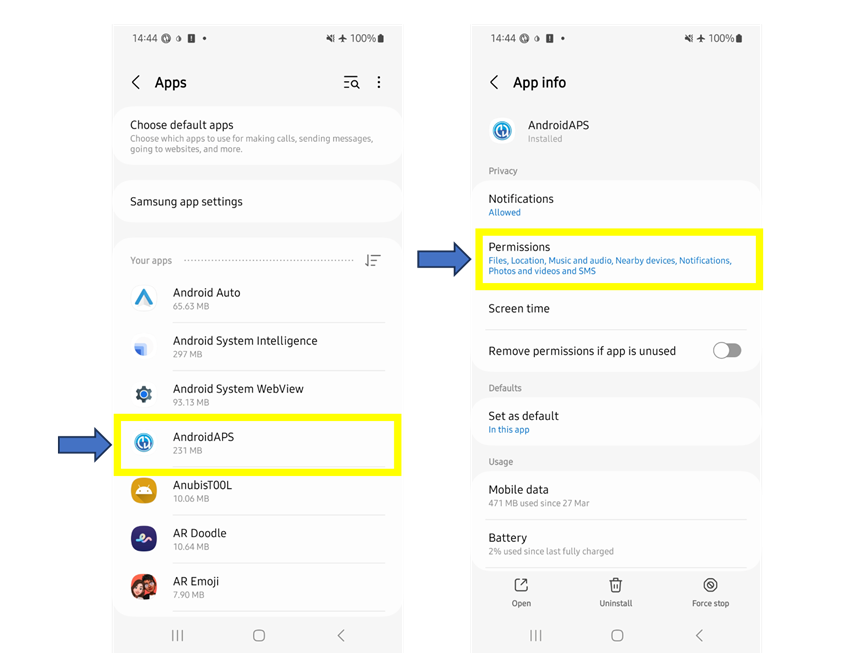
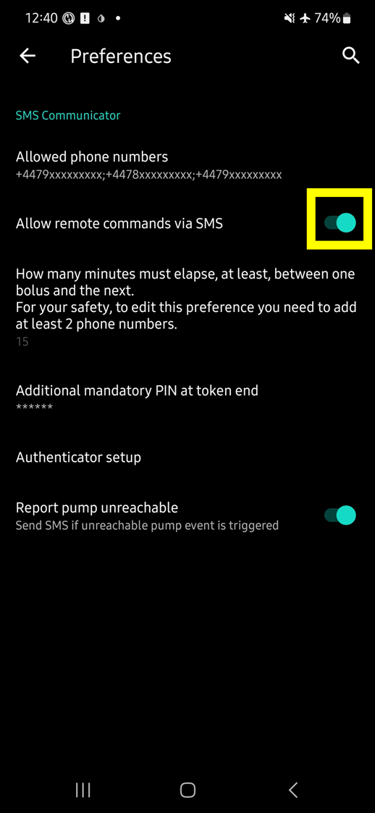
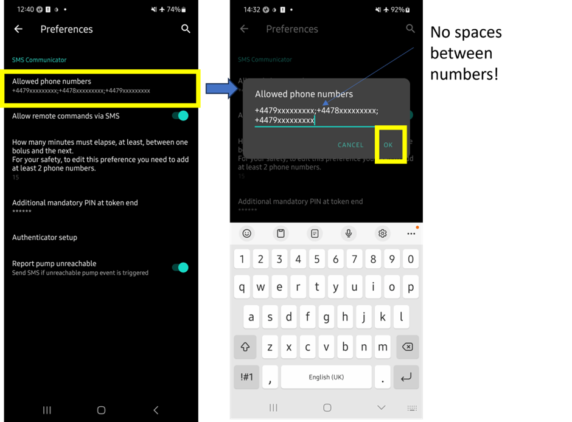
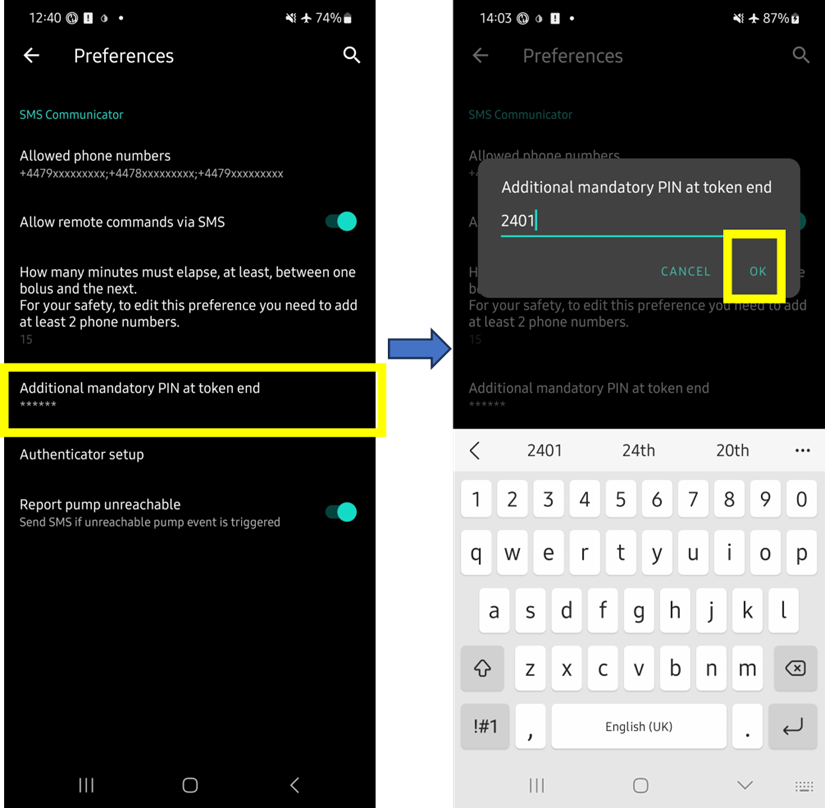
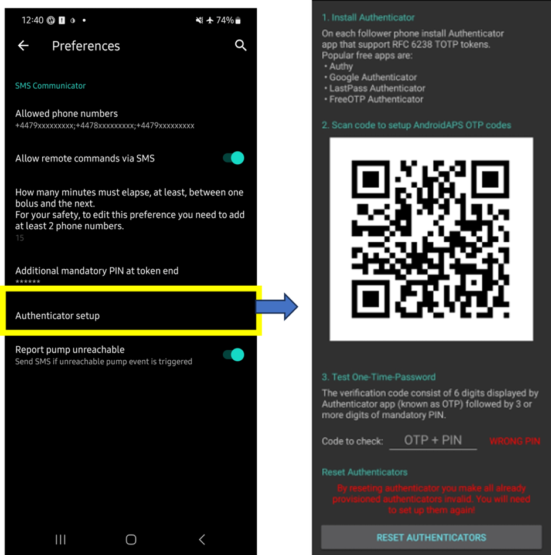

# 短信指令

```{contents} Table of contents
:depth: 2
```

大多数临时目标的调整、跟踪**AAPS**等操作都可以通过Android手机上的[**AAPSClient**应用程序](../RemoteFeatures/RemoteMonitoring.md)在互联网连接下进行。 然而，大剂量注射（boluses）不能通过**AAPSClient**进行，但您可以使用短信指令。 如果您使用的是iPhone作为跟随者设备，因此无法使用**AAPSClient**应用程序，则可以使用额外的短信指令。

**SMS命令真的很有用：**
1. 用于日常远程控制

2. 如果您想通过远程方式注射胰岛素

3. 在互联网接收不良的区域，文本消息能够传输，但数据/互联网电话接收受限。 这在前往偏远地区（如露营、滑雪）时非常有用。

4. 如果您的其他远程控制方法（Nightscout/AAPSClient）暂时无法工作

## 安全第一

如果您在**AAPS**中启用了**短信通信器**，请考虑到用于发送远程指令的手机可能会被盗，或者被其他人使用。 请始终至少使用PIN码锁定您的手机。 强烈推荐使用强密码和/或生物识别锁定，并确保这与APK主密码（导出**AAPS**设置所需的密码）不同。

此外，建议允许[第二个电话号码](#SMSCommands-authorized-phone-numbers)用于短信指令。 这样，如果您的主远程手机被盗，您可以使用第二个号码[禁用](#SMSCommands-other)短信通信器。

默认的两次大剂量注射之间的最小时间间隔为15分钟。 出于安全考虑，您必须至少添加两个授权电话号码才能将此时间间隔缩短。 如果您在上次大剂量注射后的15分钟内再次尝试远程大剂量注射，您将收到响应“远程大剂量注射不可用。 请稍后再试”。

AAPS还会通过短信通知您，远程指令（如大剂量注射或配置切换）是否已执行。 建议至少设置两个不同的电话号码来接收确认短信，以防其中一个接收手机被盗。

**如果您通过短信指令进行大剂量注射，您必须单独输入碳水化合物（第二条短信、AAPSClient、Nightscout等）！**如果你未能这样做，那么IOB正确但COB比实际要低，这样**AAPS**会认为你有太多IOB，超出阈值的IOB会导致AAPS不执行你的修正大剂量。

对于敏感指令，必须使用带有基于时间的一次性密码的身份验证器应用程序来提高安全性。

如果您想移除某个照护者手机发送短信指令的能力，请在**AAPS**中使用紧急按钮“[重置身份验证器](#sms-commands-authenticator-setup)”或发送短信指令“[SMS停止](#SMSCommands-other)”。 通过重置身份验证器，您将使所有照护者的手机无效。 您需要重新设置它们。

## 短信指令使用

```{contents} The overall process is as follows
:depth: 1
:local: true
```

(sms-commands-authenticator-setup)=
### 身份验证器设置

使用双重身份验证来提高安全性。

在护理人员手机上，从应用商店（App store）或谷歌商店（Google play）下载并安装一个身份验证器应用程序。 流行的免费应用程序包括：
  - [Authy](https://authy.com/download/)
  - Google Authenticator - [Android](https://play.google.com/store/apps/details?id=com.google.android.apps.authenticator2) / [iOS](https://apps.apple.com/de/app/google-authenticator/id388497605)
  - [LastPass Authenticator](https://lastpass.com/auth/)
  - [FreeOTP Authenticator](https://freeotp.github.io/)

这些身份验证器应用程序会生成一个有时间限制的、一次性的6位密码，类似于手机银行或电商APP。 您可以使用其他身份验证器应用程序，只要它支持RFC 6238 TOTP令牌。 Microsoft Authenticator不适用。

### 检查手机设置

在手机上，转到**应用程序 > AAPS > 权限**。 确保**短信**和**电话**权限已允许。



### 日期时间同步

两台手机的时间必须同步。 最佳做法是从网络自动设置。 时间差异可能会导致身份验证问题。

在**AAPS**手机和照护者手机上，检查日期和时间是否同步。 具体如何操作取决于您的设备，您可能需要尝试不同的设置。

示例（对于Samsung S23）：**设置 > 常规管理 > 日期和时间**：确保已勾选**自动日期和时间**。

如果手机设置为儿童帐户，某些选项可能因需要管理员通过家庭帐户而呈灰色。 在照护者/父母iPhone上，此日期和时间设置称为“自动设置”。 如果您不确定是否已同步手机，请不用担心，您可以设置短信指令并在之后进行故障排除（如有需要，请寻求帮助）。

### AAPS设置

完成手机端设置验证后，请进入**AAPS**主程序，依次进入[Config Builder > General](../SettingUpAaps/ConfigBuilder.md)菜单项，启用**SMS通信**模块。

转到短信通信器的首选项。

启用“允许通过短信远程指令”：



(SMSCommands-authorized-phone-numbers)=
#### 允许的手机号码

输入照护者手机号码。 包括国家代码，并排除手机号码前的第一个“0”，如下所示：
* 中国手机号码：+18612345678
* 美国手机号码：+11234567890
* 法国手机号码：+33612344567
* _等等。_

请注意，基于您的位置，号码前的“+”可能需要或不需要。 要确定这一点，请发送一个示例文本，这将在短信通信器标签中显示接收到的格式。

如果您要添加多个手机号码，请用分号分隔它们，**号码之间不要有空格**（这很重要！）。 选择“确定”：



#### 大剂量命令之间的时间间隔

- 您可以定义通过短信发送的两次大剂量注射之间的最小延迟。
- 出于安全考虑，您必须至少添加两个授权电话号码才能编辑此值。

#### 验证码末尾强制附加的PIN码

出于安全考虑，回复代码后必须附加一个PIN码。 选择一个您（和其他照护者）在发送短信指令时在身份验证器代码后使用的PIN码。

PIN码要求：

* 3到6位数字
* 不是相同的数字（例如1111或1224）
* 不是连续数字（例如1234）



#### 身份验证器设置

* 遵循屏幕上的逐步说明。
* 在_照护者手机_上打开已安装的身份验证器应用程序，设置新连接，
* 并使用照护者手机扫描**AAPS**提供的QR码。
* 测试从身份验证器应用程序获得的一次性密码，后面附上您的PIN码：

示例：
* 身份验证器应用程序的令牌是457051
* 您的强制PIN码是2401
* 要检查的代码是4570512401

如果输入正确，红色的“错误的PIN码”文本将自动更改为绿色的“正确”。 **没有按钮可以按！ **流程现已完成，输入代码后没有“确定”按钮需要按：



现在您应该已设置好短信指令。

如果您想移除已配置的身份验证器，请使用按钮“身份验证器设置 > 重置身份验证器”。 （通过重置身份验证器，您将使所有已配置的身份验证器无效。 您需要重新设置它们。）

## 设置短信指令

### 使用短信指令的第一步

1) 为了检查是否已正确设置所有内容，请通过照护者手机向**AAPS**手机发送“bg”作为短信测试连接。 您应该收到类似以下内容的回复：


如果您没有收到任何响应，请按照下面的[故障排除](#SMSCommands-troubleshooting)部分检查一下。

2) 现在尝试一个需要身份验证的短信指令，_例如_“target hypo”。 照护者手机将收到一条文本回复，提示您输入身份验证器中的**六位身份验证密码**，后面附上只有照护者/跟随者知道的附加**PIN码**（假设您的PIN码只有4位数字，则总共为10位数字）。

当您首次尝试发送短信指令时，请在**AAPS**手机旁尝试，以查看其工作方式：


照护者手机将收到来自**AAPS**的短信回复，确认远程短信指令是否已成功执行。

如果您的指令成功，您将收到确认回复。 如果出现问题，您将收到错提示误消息。 有关常见错误，请参阅下面的[故障排除](#SMSCommands-troubleshooting)。

**提示**：如果您的手机（每部使用的手机）估计会发送大量短信，则无限制短信套餐可能很有用。

### 通过短信发送餐时大剂量注射命令

胰岛素的远程大剂量注射**只能**通过<1>短信指令</1>进行，不能通过Nightscout或AAPSClient执行。 然而，碳水化合物可以通过这三种方法中的任何一种宣布。 无法在一条短信消息中同时发送碳水化合物和胰岛素指令。 这些指令必须按以下方式单独发送：

1) 通过短信指令发送胰岛素大剂量注射（_例如_，“bolus 2”将指令注射2单位）相当于在**AAPS**中使用“注射器”图标。 2) 发送碳水化合物（_例如_，“carbs 20”将宣布20克碳水化合物）。 这相当于在**AAPS**中使用“碳水化合物”标签。

为了避免低血糖（hypos），一个好的做法是开始先保守一点，即注射比根据IC计算结果**少一点的胰岛素**，因为这样做没有考虑到当前的血糖水平或血糖变化趋势。

**您发送这些指令的顺序很重要**。 如果您通过任何途径宣布了大量碳水化合物，并且启用了SMB，**AAPS**可能会立即响应，部分注射胰岛素。 因此，如果您在宣布碳水化合物_后_尝试发送胰岛素大剂量注射，您可能会遇到令人沮丧的延迟和“大剂量注射进行中”消息，并且您需要检查已给予的SMB有多少。 或者，如果您没有意识到SMB正在被给予，并且您自己的后续大剂量注射也成功，则对于该餐而言，可能会给予过多的胰岛素。 因此，如果远程为餐时大剂量注射，请始终在宣布碳水化合物_之前_发送胰岛素大剂量注射。 如果您愿意，可以使用Nightscout或**AAPSClient**与短信指令的组合。 碳水化合物可以通过无需身份验证的Nightscout宣布（请参阅下面的说明），因此比短信指令更快。

(SMSCommands-commands)=
## 指令

```{contents} List of command groups
:depth: 1
:local: true
```

指令必须以英文发送，如果回复字符串已翻译，则回复将以您的本地语言显示。 指令不区分大小写，您可以使用小写或大写。


下面的**短信指令表**显示了所有可能的短信指令。 _示例值_旨在帮助理解。 指令具有与**AAPS**应用程序本身允许的相同范围的可能值（目标、百分比配置等）。

(authentication-or-not)=
### 是否需要身份验证？

一些短信指令会立即回复，而一些短信指令则需要通过身份验证器进行强**身份验证**。 像“**BG**”（请求当前血糖值）这样的简单查询输入快速，不需要身份验证，并返回以下**AAPS**状态信息：


需要更多安全性的指令需要输入密码，例如：


下面表格中的*Auth*列指示每个指令是否需要这样的强身份验证。

### CGM数据

| 指令         | 身份验证 | 功能与*回复*                                                                                                                                    |
| ---------- | ---- | ------------------------------------------------------------------------------------------------------------------------------------------ |
| BG         | 否    | 回复: last BG, delta, IOB (bolus and basal), COB<br/>*Last BG: 5.6 4min ago, Delta: -0,2 mmol, IOB: 0.20U (Bolus: 0.10U Basal: 0.10U)* |
| CAL 5.6/90 | 是    | 将CGM校准为5.6/90的值<br/>（使用适合您的葡萄糖单位的值）<br/>仅在**AAPS**中 的<br/>*已发送校准*正确设置后才有效。                                               |

### 胰岛素泵

| 指令                   | 身份验证 | 功能与*回复*                                                                                                                           |
| -------------------- | ---- | --------------------------------------------------------------------------------------------------------------------------------- |
| 泵                    | 否    | 命令为：PUMP （这里是翻译工具的bug，而且还没找到怎么改）<br> 最后连接：1分钟前<br/>临时基础率：0.00U/h @11:38 5/30分钟<br/>体内胰岛素活性：0.5U 剩余量：34U 电池：100% |
| PUMP DISCONNECT *30* | 是    | 断开泵连接*30*分钟                                                                                                                       |
| PUMP CONNECT         | 是    | 重新连接泵                                                                                                                             |

### 基础率

| 指令                | 身份验证 | 功能与*回复*          |
| ----------------- | ---- | ---------------- |
| BASAL 0.3         | 是    | 以0.3U/h开始基础率30分钟 |
| BASAL 0.3 20      | 是    | 以0.3U/h开始基础率20分钟 |
| BASAL 30%         | 是    | 以30%基础率开始30分钟    |
| BASAL 30% 50      | 是    | 以30%基础率开始50分钟    |
| BASAL STOP/CANCEL | 是    | 停止临时基础率          |


### 闭环（Loop）

| 指令                | 身份验证 | 功能与*回复*                                                                                                              |
| ----------------- | ---- | -------------------------------------------------------------------------------------------------------------------- |
| LOOP STATUS       | 否    | 响应取决于实际状态：<br/> - *闭环已禁用* 如果循环被禁用或LGS（低血糖暂停）<br/>- *循环已启用* 如果循环是闭环或开环<br/>- *已暂停（10分钟）* 如果循环已断开或暂停 |
| LOOP STOP/DISABLE | 是    | 泵将恢复到预编程的基础率。 <br/>*闭环已被禁用*                                                                                    |
| LOOP START/ENABLE | 是    | *闭环已被启用*                                                                                                             |
| LOOP SUSPEND 20   | 是    | *闭环将暂停20分钟*                                                                                                          |
| LOOP RESUME       | 是    | *闭环已恢复*                                                                                                              |
| LOOP CLOSED       | 是    | *当前闭环模式：闭环*                                                                                                          |
| LOOP LGS          | 是    | *当前循环模式：低血糖暂停*                                                                                                       |

### 大剂量

在上次大剂量注射指令或远程指令后的15分钟内（如果添加了两个电话号码，则此值可编辑）不允许远程大剂量注射！ 在这种情况下，响应将是*远程大剂量注射不可用。 请稍后再试。 * 当泵当前正在给予大剂量注射时，也会发送此响应。

| 指令                   | 身份验证 | 功能与*回复*                                                                            |
| -------------------- | ---- | ---------------------------------------------------------------------------------- |
| BOLUS 1.2            | 是    |                                                                                    |
| BOLUS 0.60 MEAL      | 是    | 给予指定的大剂量注射0.60U<br/>**并**设置[即将用餐的临时目标](#TempTargets-eating-soon-temp-target) |
| CARBS 5              | 是    | 输入5g碳水，不包含大剂量                                                                      |
| CARBS 5 17:35/5:35PM | 是    | 在17：30输入5g碳水，<br/>可接受的时间格式取决于<br/>手机上的时间设置（12小时/24小时）。                 |
| EXTENDED 2 120       | 是    | 开始扩展大剂量注射2U，持续120分钟。 <br/>仅适用于[兼容的泵](#screens-action-tab)。                   |
| EXTENDED STOP/CANCEL | 是    | 停止扩展大剂量                                                                            |

### 配置文件

| 指令             | 身份验证 | 功能与*回复*                                                      |
| -------------- | ---- | ------------------------------------------------------------ |
| PROFILE STATUS | 否    | 当前配置和百分比                                                     |
| PROFILE LIST   | 否    | **AAPS**中的当前配置文件列表，例如：<br/>1. 配置文件1<br/>2. 配置文件2 |
| PROFILE 1      | 是    | 切换到列表中的配置1。 <br/>使用列表返回的数字，<br/>而不是您保存的配置名称      |
| PROFILE 2 30   | 是    | 切换到配置2的30%                                                   |

### 临时目标

| 指令                        | 身份验证 | 功能与*回复*               |
| ------------------------- | ---- | --------------------- |
| TARGET MEAL/ACTIVITY/HYPO | 是    | 设置临时目标，餐时、活动、低血糖其中的一种 |
| TARGET STOP/CANCEL        | 是    | 取消临时目标                |


(SMSCommands-other)=
### 其他

| 指令                 | 身份验证 | 功能与*回复*                                                                                                                          |
| ------------------ | ---- | -------------------------------------------------------------------------------------------------------------------------------- |
| TREATMENTS REFRESH | 否    | 从Nightscout刷新治疗数据                                                                                                                |
| AAPSCLIENT RESTART | 否    | 如果发现<br/>与Nightscout或**AAPSClient**的通信问题，则很有用                                                                              |
| SMS DISABLE/STOP   | 否    | 禁用短信远程服务，回复代码Any。 <br/>请记住，您只能从**AAPS**主智能手机直接重新激活它。                                                                       |
| HELP               | 否    | 返回所有可用于查询的功能：<br/>BG, LOOP, TREATMENTS, ....<br/>发送进一步的***HELP ***FUNCTION****** 指令以列出<br/>该部分的所有可用选项。 |
| HELP BOLUS         |      | *BOLUS 1.2<br/>BOLUS 1.2 MEAL*                                                                                             |

(SMSCommands-troubleshooting)=
## 故障排除与常见问题

```{contents} List of questions and issues
:depth: 1
:local: true
```

### 我们不能通过SMS命令做什么？

1) **您不能设置_临时_配置文件切换**（例如，将模式设置为“运动”持续60分钟），尽管您可以永久切换到“运动”模式。 临时模式切换可以通过Nightscout或AAPSClient来设置。

2) **您不能取消自动化**或**设置用户自定义目标**，但有一些近似解决方案：例如，假设正常模式的目标血糖是5.5。 您在AAPS中设置了一个自动化，以在下午2:30至3:30之间始终将目标设为7.0，因为学校有体育课，并且该自动化的一个条件是“不存在临时目标”。 但这周，您临时接到通知说体育课取消了，改为吃披萨，但孩子已经带着**AAPS**手机去学校了。 如果自动化启动了7.0的高临时目标，并且您（在AAPS手机上或远程）取消了它，自动化的条件仍然满足，AAPS会在一分钟后再次设置高目标。

**如果您可以访问AAPS手机**，您可以取消勾选/修改自动化，或者，如果您不想这么做，您只需在操作选项卡或通过点击目标选项卡设置一个新的5.6的临时目标持续60分钟。 这将阻止自动化设置7.0的高目标。

**如果您无法访问AAPS手机**，可以使用SMS命令进行近似修复：例如，使用命令“target meal”将目标设为5.0持续45分钟（其他默认目标包括8.0用于活动或低血糖，参见表格）。 但是，使用SMS命令您不能指定_特定_的目标值（例如5.6持续60分钟），您需要使用AAPSClient或Nightscout来做到这一点。

### 如果我改变了对刚发送的命令的主意怎么办？

AAPS只会执行最新的命令。 因此，如果您输入了“bolus 1.5”，然后，在没有进行身份验证的情况下，您发送了一个新的命令“bolus 1”，它将忽略之前的1.5命令。 **AAPS**在向您提示输入身份验证代码之前，以及执行操作后，都会向护理者的手机发送一条确认SMS命令的回复。

### 为什么我没有收到对SMS命令的回复？

可能是以下原因之一：

1) 消息没有发送到手机（网络问题）。 2)** AAPS**仍在处理请求的过程中（_例如_，输注胰岛素，这取决于您的输注速率，可能需要一些时间）。 3) 当收到命令时，**AAPS**手机的蓝牙与泵的连接不良，命令失败（这通常会在**AAPS**手机上产生报警）。

### SMS命令完全没有回复

在护理者手机和/或**AAPS**手机上，尝试禁用以下选项：
* **作为聊天消息发送** 
* 如果使用Android Messages应用或Google Messages应用，禁用RCS消息：
  - 打开Messages中的特定SMS对话
  - 选择右上角的点状选项
  - 选择“详细信息”
  - 激活“仅发送SMS和MMS消息” 

### 执行命令时出错

命令可能不成功的原因有几个：

* SMS命令设置不完整/不正确
* 您发送的命令格式错误（如“disconnect pump 45”而不是“pump disconnect 45”）
* 您使用了错误或已过期的身份验证码（如果当前代码即将过期，最好等待几秒钟以获取新代码）
* 代码+PIN正确，但SMS的发送/接收存在延迟，导致**AAPS**计算出身份验证码已过期
* **AAPS**手机离泵太远，或者跟泵断开了。
* 系统正在忙着输注大剂量

常见错误如下所示：


### 一旦命令经过身份验证，我可以停止它吗？

您不能。 但是，您可以在**AAPS**手机上快速通过取消输注弹窗来取消通过SMS发送的输注。 许多SMS命令（除了输注和碳水化合物输入）都可以轻松反转，或者在出现错误时采取措施减轻意外影响。

对于输注和碳水化合物输入中的错误，您仍然可以采取行动。 例如，如果您宣布了20克碳水化合物，但您的孩子只吃了10克，并且您（或现场的护理者）无法直接在**AAPS**手机上删除该治疗，您可以设置一个高的临时目标，或设置降低的模式，以使**AAPS**不那么激进。

### 多条SMS

如果您反复收到相同的消息（例如，模式切换），则可能是您意外地与其他应用程序设置了循环条件。 这可能是xDrip+等应用程序。 如果是这样，请确保xDrip+（或任何其他应用程序）不上传治疗到NightScout。

如果其他应用程序安装在多部手机上，请确保在所有手机上都停用上传。

(sms-commands-too-many-messages)=
### 我从SMS命令中收到了太多短信。 我可以减少频率或让它们停止吗？

使用SMS命令可能会从**AAPS**手机向护理者的手机生成大量自动消息。 如果您在**AAPS**中设置了自动化，您还会收到消息，例如“泵中的基础模式已更新”。 如果您的AAPS手机计划（以及每个护理者手机）拥有无限短信额度会很有用，并且要在所有手机上停用短信通知、警报或振动。 如果要使用SMS命令，就不可能不收到这些更新。 因此，您可能需要一种与孩子直接沟通的替代方式（如果他们年龄足够大），而不是使用SMS。 **AAPS**护理者常用的替代通信应用程序包括Whatsapp、Lime、Telegram和Facebook Messenger。

若需禁用源自Nightscout的<0>Profile changed</0>短信通知， 可在AAPS主目录下的`extra`子目录中创建**严格**命名为`do_not_send_sms_on_profile_change`的空文件。