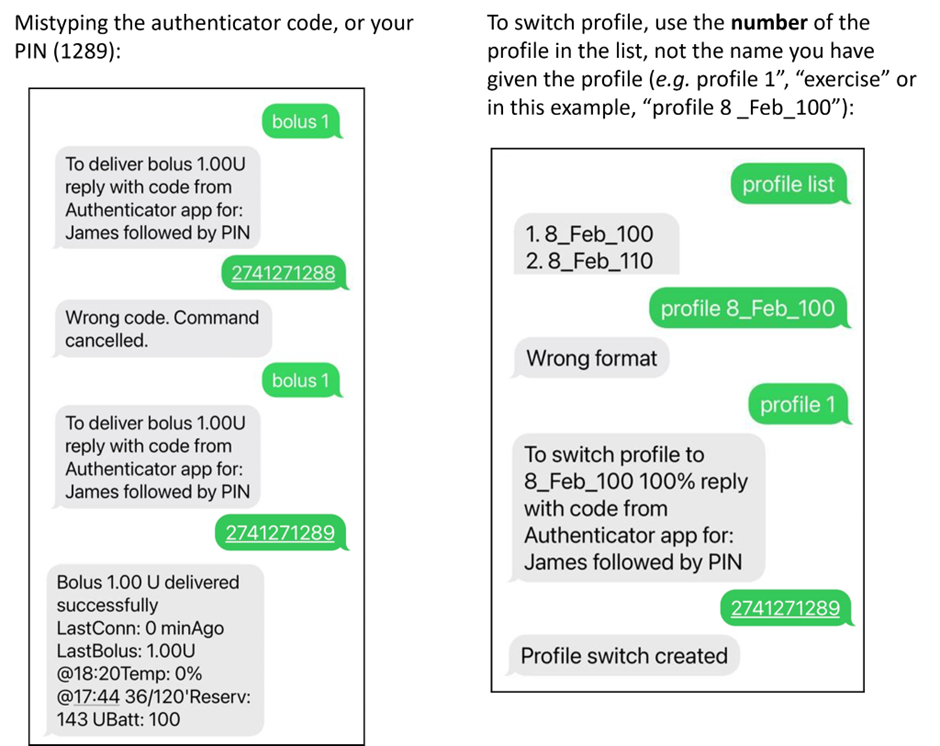

# 短信指令

```{contents} Table of contents
:depth: 2
```

大多数临时目标的调整、跟踪**AAPS**等操作都可以通过Android手机上的[**AAPSClient**应用程序](../RemoteFeatures/RemoteMonitoring.md)在互联网连接下进行。 然而，大剂量注射（boluses）不能通过**AAPSClient**进行，但您可以使用短信指令。 如果您使用的是iPhone作为跟随者设备，因此无法使用**AAPSClient**应用程序，则可以使用额外的短信指令。

**SMS命令真的很有用：**
1. 用于日常远程控制

2. 如果您想通过远程方式注射胰岛素

3. 在互联网接收不良的区域，文本消息能够传输，但数据/互联网电话接收受限。 这在前往偏远地区（如露营、滑雪）时非常有用。

4. 如果您的其他远程控制方法（Nightscout/AAPSClient）暂时无法工作

## 安全第一

如果您在**AAPS**中启用了**短信通信器**，请考虑到用于发送远程指令的手机可能会被盗，或者被其他人使用。 请始终至少使用PIN码锁定您的手机。 强烈推荐使用强密码和/或生物识别锁定，并确保这与APK主密码（导出**AAPS**设置所需的密码）不同。

此外，建议允许[第二个电话号码](#SMSCommands-authorized-phone-numbers)用于短信指令。 这样，如果您的主远程手机被盗，您可以使用第二个号码[禁用](#SMSCommands-other)短信通信器。

默认的两次大剂量注射之间的最小时间间隔为15分钟。 出于安全考虑，您必须至少添加两个授权电话号码才能将此时间间隔缩短。 如果您在上次大剂量注射后的15分钟内再次尝试远程大剂量注射，您将收到响应“远程大剂量注射不可用。 请稍后再试”。

AAPS还会通过短信通知您，远程指令（如大剂量注射或配置切换）是否已执行。 建议至少设置两个不同的电话号码来接收确认短信，以防其中一个接收手机被盗。

**如果您通过短信指令进行大剂量注射，您必须单独输入碳水化合物（第二条短信、AAPSClient、Nightscout等）！**如果你未能这样做，那么IOB正确但COB比实际要低，这样**AAPS**会认为你有太多IOB，超出阈值的IOB会导致AAPS不执行你的修正大剂量。

对于敏感指令，必须使用带有基于时间的一次性密码的身份验证器应用程序来提高安全性。

如果您想移除某个照护者手机发送短信指令的能力，请在**AAPS**中使用紧急按钮“[重置身份验证器](#sms-commands-authenticator-setup)”或发送短信指令“[SMS停止](#SMSCommands-other)”。 通过重置身份验证器，您将使所有照护者的手机无效。 您需要重新设置它们。

## 短信指令使用

```{contents} The overall process is as follows
:depth: 1
:local: true
```

### 身份验证器设置

使用双重身份验证来提高安全性。

在护理人员手机上，从应用商店（App store）或谷歌商店（Google play）下载并安装一个身份验证器应用程序。 流行的免费应用程序包括：
  - [Authy](https://authy.com/download/)
  - Google Authenticator - [Android](https://play.google.com/store/apps/details?id=com.google.android.apps.authenticator2) / [iOS](https://apps.apple.com/de/app/google-authenticator/id388497605)
  - [LastPass Authenticator](https://lastpass.com/auth/)
  - [FreeOTP Authenticator](https://freeotp.github.io/)

这些身份验证器应用程序会生成一个有时间限制的、一次性的6位密码，类似于手机银行或电商APP。 您可以使用其他身份验证器应用程序，只要它支持RFC 6238 TOTP令牌。 Microsoft Authenticator不适用。

### 检查手机设置

在手机上，转到**应用程序 > AAPS > 权限**。 确保**短信**和**电话**权限已允许。


### 日期和时间同步

两台手机的时间必须同步。 最佳做法是从网络自动设置。 时间差异可能会导致身份验证问题。

在**AAPS**手机和照护者手机上，检查日期和时间是否同步。 具体如何操作取决于您的设备，您可能需要尝试不同的设置。

示例（对于Samsung S23）：**设置 > 常规管理 > 日期和时间**：确保已勾选**自动日期和时间**。

如果手机设置为儿童帐户，某些选项可能因需要管理员通过家庭帐户而呈灰色。 在照护者/父母iPhone上，此日期和时间设置称为“自动设置”。 如果您不确定是否已同步手机，请不用担心，您可以设置短信指令并在之后进行故障排除（如有需要，请寻求帮助）。

### AAPS设置

现在已检查手机设置，在**AAPS**应用程序本身中，使用[配置构建器](../SettingUpAaps/ConfigBuilder.md)启用**短信通信器**模块。

转到短信通信器的首选项。

启用“允许通过短信远程指令”：


(SMSCommands-authorized-phone-numbers)=
#### 允许的手机号码

输入照护者手机号码。 包括国家代码，并排除手机号码前的第一个“0”，如下所示：
* 中国手机号码：+18612345678
* 美国手机号码：+11234567890
* 法国手机号码：+33612344567
* _等等。_

请注意，基于您的位置，号码前的“+”可能需要或不需要。 要确定这一点，请发送一个示例文本，这将在短信通信器标签中显示接收到的格式。

如果您要添加多个手机号码，请用分号分隔它们，**号码之间不要有空格**（这很重要！）。 选择“确定”：


#### 大剂量命令之间的时间间隔

- 您可以定义通过短信发送的两次大剂量注射之间的最小延迟。
- 出于安全考虑，您必须至少添加两个授权电话号码才能编辑此值。

#### 验证码末尾强制附加的PIN码

出于安全考虑，回复代码后必须附加一个PIN码。 选择一个您（和其他照护者）在发送短信指令时在身份验证器代码后使用的PIN码。

PIN码要求：

* 3到6位数字
* 不是相同的数字（例如1111或1224）
* 不是连续数字（例如1234）


(sms-commands-authenticator-setup)=
#### 身份验证器设置

* 遵循屏幕上的逐步说明。
* 在_照护者手机_上打开已安装的身份验证器应用程序，设置新连接，
* 并使用照护者手机扫描**AAPS**提供的QR码。
* 测试从身份验证器应用程序获得的一次性密码，后面附上您的PIN码：

示例：
* 身份验证器应用程序的令牌是457051
* 您的强制PIN码是2401
* 要检查的代码是4570512401

如果输入正确，红色的“错误的PIN码”文本将自动更改为绿色的“正确”。 **没有按钮可以按！ **流程现已完成，输入代码后没有“确定”按钮需要按：


现在您应该已设置好短信指令。

如果您想移除已配置的身份验证器，请使用按钮“身份验证器设置 > 重置身份验证器”。 （通过重置身份验证器，您将使所有已配置的身份验证器无效。 您需要重新设置它们。）

## 设置短信指令

### 使用短信指令的第一步

1)  To check you have set everything up correctly, test the connection by typing “bg” as an SMS message from the caregiver phone to the **AAPS** phone. You should get a response similar to that shown here:


If you don't receive any response, check the [Troubleshooting](#SMSCommands-troubleshooting) section below.

2)  Now try an SMS command that requires the authenticator, _e.g._ “target hypo”. The caregiver’s phone will receive a text back, prompting you to enter the **six-digit authenticator password** from the authenticator app, followed by the additional secret **PIN** known only by caregivers/followers (a string of ten digits in total, assuming your PIN is only 4 digits).

When you try sending an SMS command for the first time, try it in the presence of the **AAPS** phone, to see how it works:


The caregiver’s phone will receive an SMS in reply from **AAPS** to confirm if the remote SMS command has been carried out successfully.

If your command is successful, you will receive a reply to confirm this. If there is a problem you will receive an error message. See [Troubleshooting](#SMSCommands-troubleshooting) below for common errors.

**Hint**: It can be useful to have unlimited SMS on your phone plan (for each phone used) if a lot of SMS will be sent.

### Delivering mealtime boluses through SMS commands

Remote bolusing of insulin can _only_ be done via **SMS Commands**, it cannot be actioned through NightScout or AAPSClient. Carbs however, can be announced through any of the three methods. It is not possible to send both carbs and insulin commands in one single SMS message. These commands must be sent separately as follows:

1)  Send the insulin bolus (_e.g._“bolus 2” will command a bolus of 2 units) through SMS commands is equivalent to using the “syringe” icon in **AAPS**. 2)  Send the carbs (_e.g._ “carbs 20” will announce 20g of carbs). This is equivalent to using the “carbs” tab in **AAPS**.

To avoid hypos, it is a good idea to start conservatively, by bolusing **less insulin** than would be needed according to your carb ratio, because you are not taking into account the current glucose level or glucose trend.

**The order in which you send these commands is important**. If you announce a large amount of carbs by any route, and have SMBs enabled, **AAPS** may immediately respond by giving a partial bolus of insulin. So, if you then try to send an insulin bolus _after_ announcing the carbs, you may have a frustrating delay and a “bolus in progress” message, and you then need to check what has been given as an SMB. Or, if you do not realise an SMB is being delivered, and your own subsequent bolus is also successful, too much insulin may be delivered for the meal overall. Therefore, if bolusing for meals remotely, always send the insulin bolus _before_ the carb announcement. If you prefer, you can use a combination of Nightscout or **AAPSClient** with SMS commands. Carbs can be announced through Nightscout without any authentication (see instructions subsection below) , and are therefore quicker than SMS commands.

(SMSCommands-commands)=
## Commands

```{contents} List of command groups
:depth: 1
:local: true
```

Commands must be sent in English, the response will be in your local language if the response string is already [translated](#translations-translate-strings-for-AAPS-app). The commands are not case-sensitive, you can use lower or upper case.


The **SMS Commands Tables** below show all the possible SMS commands. _Example values_ are given, to aid understanding. The commands have the same range of possible values (targets, percent profile etc.) which are allowable in the **AAPS** app itself.

(authentication-or-not)=
### Authentication or not?

Some SMS commands give an immediate response, and some SMS commands require strong **authentication** through the Authenticator app. A simple enquiry like “**BG**” (which requests an update on current glucose) is quick to type, doesn't need authenticating, and returns the **AAPS** status information shown below:


Commands which need more security require a code to be entered, for example:


The *Auth* column in the tables below, indicates whether such a strong authentication is required for each command.

### CGM data

| Command    | Auth | Function & *Response*                                                                                                                                                                       |
| ---------- | ---- | ------------------------------------------------------------------------------------------------------------------------------------------------------------------------------------------- |
| BG         | No   | Returns: last BG, delta, IOB (bolus and basal), COB<br/>*Last BG: 5.6 4min ago, Delta: -0,2 mmol, IOB: 0.20U (Bolus: 0.10U Basal: 0.10U)*                                             |
| CAL 5.6/90 | Yes  | Will calibrate the CGM with a value of 5.6/90<br/>(use the value appropriate to your glucose units)<br/>Works only if properly set-up in **AAPS**.<br/>*Calibration sent* |

### Pump

| Command              | Auth | Function & *Response*                                                                                 |
| -------------------- | ---- | ----------------------------------------------------------------------------------------------------- |
| 泵                    | No   | Last conn: 1 min ago<br/>Temp: 0.00U/h @11:38 5/30min<br/>IOB: 0.5U Reserv: 34U Batt: 100 |
| PUMP DISCONNECT *30* | Yes  | To disconnect pump for *30* minutes                                                                   |
| PUMP CONNECT         | Yes  | Pump reconnected                                                                                      |

### 基础率

| Command           | Auth | Function & *Response*            |
| ----------------- | ---- | -------------------------------- |
| BASAL 0.3         | Yes  | To start basal 0.3U/h for 30 min |
| BASAL 0.3 20      | Yes  | To start basal 0.3U/h for 20 min |
| BASAL 30%         | Yes  | To start basal 30% for 30 min    |
| BASAL 30% 50      | Yes  | To start basal 30% for 50 min    |
| BASAL STOP/CANCEL | Yes  | To stop temp basal               |


### 闭环（Loop）

| Command           | Auth | Function & *Response*                                                                                                                                                                                                                     |
| ----------------- | ---- | ----------------------------------------------------------------------------------------------------------------------------------------------------------------------------------------------------------------------------------------- |
| LOOP STATUS       | No   | Response depends on actual status:<br/> - *Loop is disabled* if the loop is disabled or LGS<br/> - *Loop is enabled* if the loop is closed or open<br/> - *Suspended (10 min)* if the loop is disconnected or suspended |
| LOOP STOP/DISABLE | Yes  | The pump will revert to the pre-programmed basal rate.<br/>*Loop has been disabled*                                                                                                                                                 |
| LOOP START/ENABLE | Yes  | *Loop has been enabled*                                                                                                                                                                                                                   |
| LOOP SUSPEND 20   | Yes  | *Loop suspended for 20 minutes*                                                                                                                                                                                                           |
| LOOP RESUME       | Yes  | *Loop resumed*                                                                                                                                                                                                                            |
| LOOP CLOSED       | Yes  | *Current loop mode: Closed Loop*                                                                                                                                                                                                          |
| LOOP LGS          | Yes  | *Current loop mode: Low Glucose Suspend*                                                                                                                                                                                                  |

### 大剂量

Remote bolus is not allowed within 15 min (this value is editable only if 2 phone numbers added) after last bolus command or remote commands! In this case, the response would be *Remote bolus not available. Try again later.* This response is also sent when the pump is currently delivering a bolus.

| Command              | Auth | Function & *Response*                                                                                                        |
| -------------------- | ---- | ---------------------------------------------------------------------------------------------------------------------------- |
| BOLUS 1.2            | Yes  |                                                                                                                              |
| BOLUS 0.60 MEAL      | Yes  | Delivers the specified 0.60U bolus<br/>**and** sets the [Eating Soon TempTarget](#TempTargets-eating-soon-temp-target) |
| CARBS 5              | Yes  | To enter 5g, without a bolus                                                                                                 |
| CARBS 5 17:35/5:35PM | Yes  | To enter 5g at 17:35.<br/>The acceptable time format depends<br/> on the time setting (12h/24h) on the phone.    |
| EXTENDED 2 120       | Yes  | To start extended bolus 2U for 120 min.<br/>Only for [compatible pumps](#screens-action-tab).                          |
| EXTENDED STOP/CANCEL | Yes  | To stop extended bolus                                                                                                       |

### 配置文件

| Command        | Auth | Function & *Response*                                                                                                                                        |
| -------------- | ---- | ------------------------------------------------------------------------------------------------------------------------------------------------------------ |
| PROFILE STATUS | No   | Current profile and percentage                                                                                                                               |
| PROFILE LIST   | No   | The current list of profiles in **AAPS**, e.g.:<br/>1. Profile1<br/> 2. Profile2                                                                 |
| PROFILE 1      | Yes  | To switch profile to profile 1 in the list.<br/>Use the numbers as returned by the **PROFILE LIST**,<br/>not the profile names as you saved them |
| PROFILE 2 30   | Yes  | To switch profile to Profile2 30%                                                                                                                            |

### Temporary Targets

| Command                   | Auth | Function & *Response*                     |
| ------------------------- | ---- | ----------------------------------------- |
| TARGET MEAL/ACTIVITY/HYPO | Yes  | To set the Temp Target MEAL/ACTIVITY/HYPO |
| TARGET STOP/CANCEL        | Yes  | To cancel Temp Target                     |


(SMSCommands-other)=
### 其他

| Command            | Auth | Function & *Response*                                                                                                                                                                                     |
| ------------------ | ---- | --------------------------------------------------------------------------------------------------------------------------------------------------------------------------------------------------------- |
| TREATMENTS REFRESH | No   | Refresh treatments from NS                                                                                                                                                                                |
| NSCLIENT RESTART   | No   | Useful if you notice a communication problem<br/>with Nightscout or **AAPSClient**                                                                                                                  |
| SMS DISABLE/STOP   | No   | To disable the SMS Remote Service reply with code Any.<br/>Keep in mind that you'll able to reactivate it directly<br/>from the **AAPS** master smartphone only.                              |
| HELP               | No   | Returns all functions available for interrogation:<br/>BG, LOOP, TREATMENTS, ....<br/>Send further ***HELP ***FUNCTION****** command to list<br/>all options available in this section. |
| HELP BOLUS         |      | *BOLUS 1.2<br/>BOLUS 1.2 MEAL*                                                                                                                                                                      |

(SMSCommands-troubleshooting)=
## Troubleshooting and FAQ

```{contents} List of questions and issues
:depth: 1
:local: true
```

### What _can’t_ we do with SMS commands?

1)  **You cannot set a _temporary_ profile switch** (so for example, setting "profile exercise" for 60 minutes), although you can permanently switch to “profile exercise”. Temporary profiles switches can instead be set through Nightscout or AAPSClient.

2)  **You cannot cancel automations** or **set user-defined targets** but there are approximate solutions: As an example, imagine the normal profile target is 5.5. You have set an automation in AAPS, to always set a high target of 7.0 between 2.30pm and 3.30pm because of a sports class in school, and a condition of the automation is that “no temp target exists”. This week, you have been told at short notice that the sports class is cancelled, and is being replaced by a pizza-eating session, but your kid is already at school with the **AAPS** phone. If the high temporary target of 7.0 is started by the automation, and you cancel it (on the **AAPS** phone, or remotely) the conditions for the automation are still met and **AAPS** will simply set the high target again, a minute later.

**If you did have access to the AAPS phone**, you could uncheck/modify the automation, or, if you don’t want to do that, you could simply set a new temp target of 5.6 for 60 min under the Actions Tab or by pressing on the target tab. This would prevent the automation from setting the high target of 7.0.

**If you don’t have access to the AAPS phone** SMS commands can be used for an approximate fix: for example, by using the command “target meal” to set a target of 5.0 for 45 mins (other default targets are 8.0 for activity or hypo, see Table). However, with SMS commands you cannot specify a _specific_ value target value (of 5.6 for 60 minutes, for example), you would need to use **AAPSClient** or Nightscout to do this.

### What happens if I change my mind about a command I have just sent?

**AAPS** will only deliver on the most recent command. So, if you type “bolus 1.5”, and then, without authenticating, you send a new command “bolus 1”, it will ignore the earlier 1.5 command. **AAPS** will always send the caregiver's phone a response to confirm what the SMS command is before you are prompted to enter the authentication code, as well as a response following the action.

### Why didn't I get a response to an SMS command?

It could be for one of these reasons:

1)  The message has not got through to the phone (network issues). 2)  **AAPS** is still in the process of processing the request (_e.g._ a bolus, which can take some time to deliver depending on your bolus rate). 3)  The **AAPS** phone does not have good bluetooth connection to the pump when the command is received, and the command has failed (this usually creates an alarm on the **AAPS** phone).

### No response whatsoever for SMS commands

On the caregiver phone and/or **AAPS** phone, try disabling the following options :
* **Send as chat message** 
* If using Android Messages App or Google Messages App, disable RCS messaging:
  - open the specific SMS conversation in Messages
  - Select the options ellipsis in the top right corner
  - select "Details"
  - Activate "Only send SMS and MMS messages" 

### Errors carrying out commands

There are several possible reasons the command may not be successful:

* SMS commands setup isn’t complete/correct
* You sent a command which had an incorrect format (like “disconnect pump 45” instead of “pump disconnect 45”)
* You used an incorrect, or expired authenticator code (it is usually good to wait a few seconds for a fresh code, if the current one is about to expire)
* The code+PIN was OK, but there was a delay in the SMS leaving/arriving, which led **AAPS** to calculate that the authenticator code had expired
* The **AAPS** phone is out of range/contact with the pump
* The system is already busy delivering a bolus

Common errors are shown in the examples below:



### How can I stop a command once it has been authenticated?

You can't. However, you can cancel a bolus sent by SMS on the **AAPS** phone itself, by simply cancelling it on the bolusing popup, if you are quick. Many SMS commands (apart from bolusing and carb announcements) can be easily reversed, or actions taken to mitigate unintended effects if a mistake is made.

For errors in bolusing and carb announcements, you can still take action. For example, if you have announced 20g carbs but your child only eats 10g and you (or an onhand caregiver) is unable to delete the treatment in the **AAPS** phone directly, you could set a high temporary target, or set a reduced profile, to encourage **AAPS** to be less aggressive.

### Multiple SMS

If you receive the same message repeatedly (_e.g._ a profile switch) you may have accidentally set up a looping condition with other apps. This could be xDrip+, for example. If so, please ensure that xDrip+ (or any other app) does not upload treatments to NightScout.

If the other app is installed on multiple phones make sure to deactivate upload on all of them.

### I am getting far too many text messages from SMS Commands. Can I reduce the frequency, or make them stop?

Using SMS commands may generate a lot of automated messages from the **AAPS** phone to the caregiver’s phone. You will also receive messages, for example “basal profile in pump updated” if you have automations set up in **AAPS**. It can be useful to have unlimited SMS allowance on your **AAPS** phone plan (and for each caregiver phone used) if a lot of SMS will be sent, and to deactivate SMS notifications, alarms or vibrations on all phones. It is not possible to use SMS commands and not receive these updates. Because of this, you may want an alternative way to communicate directly with your child (if they are old enough), instead of SMS. Common alternative communication apps used by **AAPS** caregivers include Whatsapp, Lime, Telegram, and Facebook Messenger.