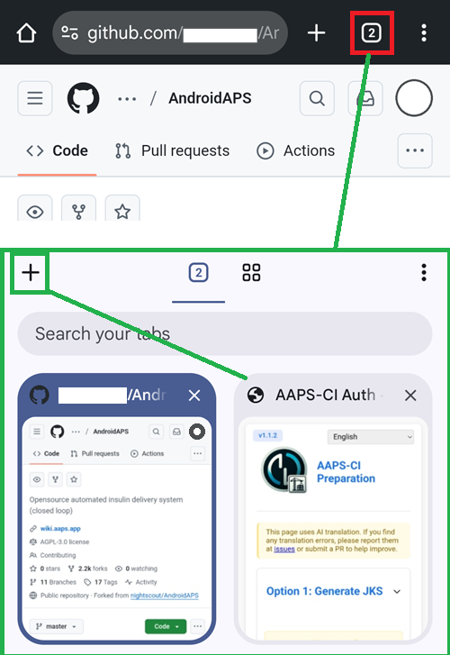
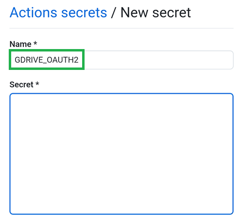

(browser-build)=

# AAPS 浏览器构建指南

GitHub Actions 构建流程

**为什么 3.3.2.1 是“强制底线”？**

## 自行构建而非下载

**由于医疗器械相关法规的限制，AAPS应用（一个apk文件）无法提供下载。 构建该应用供自己使用是合法的，但不得将副本提供给他人**

详情请参阅[常见问题页面](../UsefulLinks/FAQ.md)。

(Building-APK-without-a-computer)=

## 构建 AAPS 的设备与软件规范

我们推荐使用 Android 设备。 你也可以使用电脑或 iOS 设备。

你需要在浏览器中打开多个标签页，并频繁地在它们之间切换。 例如使用 Chrome 浏览器：



你还需要一个 Google 账号，以便将生成的应用程序保存到你的 Google 云端硬盘（Google Drive）中。

```{note}
本维基指南假设你正通过手机和 Chrome 浏览器执行所有操作。  
你需要在不同的标签页之间来回切换：建议在开始前关闭所有已打开的标签页，以防在切换过程中迷失操作步骤。
```

(github-fork)=

## 1. AAPS 个人分叉 (AAPS personal fork)

你需要将你的个人 Android Java 密钥（Key）和 Google Drive 信息秘密地存储在 GitHub 中（稍后我们将解释具体操作方法）。

由于这些操作无法在 AndroidAPS 的公共仓库中进行，因此你需要创建一份属于你个人的源代码副本（这被称为“分叉”或 Fork）。

### GitHub 账号

如果你还没有 GitHub 账号，你需要创建一个 GitHub 账号。 你可以使用电子邮件注册，也可以通过 Google 账号进行关联注册。 请按照注册和验证流程进行操作。

完成账号注册后，登录 GitHub。

### 分叉 (Fork) AndroidAPS

点击[此链接](https://github.com/nightscout/AndroidAPS)打开 AndroidAPS 官方仓库。

点击“Fork”图标。 这将在你自己的账户中创建一份副本。


向下滚动下一个页面，点击“Create Fork”。


*如果你想要构建开发版本（Developers versions）或进行自定义开发，你可以[取消勾选]“Copy the main branch only（仅复制主分支）”。*


```{note}
以下是该段内容的原文翻译：

你无法执行 Fork 并且看到了这个提示？

创建新的分叉 (Create a new fork)

分叉 (Fork) 是仓库的一份副本。 分叉（Forking）一个仓库可以让你自由地实验各种更改，而不会影响到原始项目。 查看现有的分叉（View existing forks）。</br>
 “必填项均标有星号 ()”</br>
* “没有可用于分叉此仓库的目标。”</br></br>
这意味着你已经拥有一个现有的 AndroidAPS 分叉（Fork）</br>。
 请确保它是最新的，然后继续执行“准备步骤（Preparation Steps）”。
```

```{warning}
绝不要在未备份 Secret（私密变量）的情况下删除你的分叉（Fork）！
```

以下是该段内容的原文翻译： GitHub 现在显示的是你个人的 AndroidAPS 副本。 请保持此浏览器标签页处于打开状态。


(aaps-ci-preparation)=

## 2. 准备步骤

- 如果你正在使用 Android 设备进行构建，请从 Google Play 商店安装 “[File Manager Plus](https://play.google.com/store/apps/details?id=com.alphainventor.filemanager)”（文件管理器 +）。

```{admonition} File Manager Plus
:class: dropdown

:::{include} BrowserBuildFileManagerPlus.md
```

- 从此处下载准备文件：[aaps-ci-preparation.html](https://github.com/nightscout/aaps-ci-preparation/releases/download/release-v1.1.2/aaps-ci-preparation.html)

````{admonition} Note
:class: note

1. 如果你是从某个 App 内部（通过内置网页视图 Web View）打开此页面，HTML 文件可能无法正常下载。 请复制该 URL 并在浏览器（如 Chrome）中打开：
```text
https://github.com/nightscout/aaps-ci-preparation/releases/download/release-v1.1.2/aaps-ci-preparation.html
```
或者访问最新的发布版本页面:
```text
https://github.com/nightscout/aaps-ci-preparation/releases/latest
```
2.托管在本站的备份副本：
—— 如果外部链接也无法访问，你可以使用此备份文件进行下载。
<!--crowdin:disable-->

```{eval-rst}
.. raw:: html

    &nbsp;&nbsp;&nbsp;&nbsp;&nbsp;&nbsp;<a href="../_static/CI/aaps-ci-preparation.html" download>  aaps-ci-preparation.html</a>
```
<!--crowdin:enable-->
````
AndroidAPS 的构建需要私钥（Private keys），这些私钥存储在一个 Java 密钥库（Java KeyStore，简称 JKS）中：
- 如果你是第一次构建 AAPS（或者你没有 Android Studio 生成的 JKS 文件），请按照 [AAPS-CI 选项 1 – 生成 JKS (Generate JKS)](aaps-ci-option1) 的步骤来完成设置。
</br>

```{warning}
使用 选项 1 (Option 1) 构建 AAPS 将无法直接升级你现有的 AAPS。
你需要： [Export settings](#ExportImportSettings-Automating-Settings-Export) on your phone.
2. 将设置文件从手机复制或上传到外部位置（例如：你的电脑、云存储服务等）。
3. 按照“选项 1”所述的方法，生成一个新版本的已签名 APK，并将其传输到你的手机上。
4. 在您的手机上卸载之前的 AAPS 版本。
5. 在您的手机上安装新的 AAPS 版本。
6. 导入设置以恢复你的任务进度（Objectives）和配置信息
7. 从 Nightscout 恢复你的数据。
```

- 如果你想使用自己的 JKS 文件（即你之前在电脑上使用 Android Studio 构建 AAPS 时所用的密钥文件），并且你知道该文件的密码和别名（通常为 key0），请选择 [AAPS-CI 选项 2 – 上传现有 JKS (Upload Existing JKS)](aaps-ci-option2)。

</br>

AAPS 应用程序（App）构建完成后，将自动保存到您的 Google 云端硬盘（Google Drive）中。

(aaps-ci-option1)=
### AAPS-CI 选项 1 – 生成 JKS (Generate JKS)
 - Suitable for first-time users, or those without a JKS, or who have forgotten the password or alias.
- Here are examples using multiple platforms below.
- Select your platform in the list below, between Android (preferred choice), iOS or Computer.

```{tab-set}

:::{tab-item} Android
(aaps-ci-option1-android)=
:::{include} BrowserBuildO1A.md
:::  

:::{tab-item} iOS
(aaps-ci-ios-ipad)=
:::{include} BrowserBuildO1I.md
:::  

:::{tab-item} Computer
(aaps-ci-option1-computer)=
:::{include} BrowserBuildO1C.md
:::  

```

Skip the next section and continue [here](#aaps-ci-google-drive-auth).

---

(aaps-ci-option2)=

### AAPS-CI Option 2 – Upload Existing JKS
 - Suitable for users who already have a JKS and know the JKS password and alias  (For `KEYSTORE_PASSWORD`, `KEY_ALIAS`, and `KEY_PASSWORD`, enter your actual password and alias in GitHub - those from Android Studio, see below where you used them.)

```{admonition} KEY + PASSWORDS
:class: dropdown


```

 - Here are examples using multiple platforms below.
 - Select your platform in the list below, between Android (preferred choice) or Computer.


```{tab-set}

:::{tab-item} Android
(aaps-ci-option2-android)=
:::{include} BrowserBuildO2A.md
:::  

:::{tab-item} Computer
(aaps-ci-option2-computer)=
:::{include} BrowserBuildO2C.md
:::  

```

(aaps-ci-google-drive-auth)=

### AAPS-CI Google Drive Auth

Note: If you already followed this part in the video, you can now skip to [here](#github-build-apk).

Return to the File Explorer Plus tab.

Scroll down to the Google Drive Auth section and tap Start Auth.


Select your Google account.


Scroll down and accept the access. The web page needs it to obtain the Google Drive authentication key.

Tap Continue.


The `GDRIVE_OAUTH2` field will populate, tap the top Copy button.


Switch back to the GitHub tab.

Scroll down to Repository secrets and tap New repository secret.

If you followed Option 1 you should see this:


If you followed Option 2 there will be more keys:


In the Name field, paste the text you just copied. Use a long touch on the text box to show the paste menu.



Switch to the File Explorer Plus tab.

Tap the second Copy button.


Switch back to the GitHub tab.

1. In the Secret field, paste the text you just copied. Use a long touch on the text box to show the paste menu.

2. Tap Add secret.


GitHub will now be able to store the AAPS apk file in your Google Drive, once built.

(github-build-apk)=
## AAPS-CI GitHub Actions to Build the AAPS APK
 - Suitable for general users.

```{tab-set}

:::{tab-item} Wiki
:::{include} BrowserBuildCIS.md
:::  

:::{tab-item} Video
<div align="center" style="max-width: 360px; margin: auto; margin-bottom: 2em;">
  <div style="position: relative; width: 100%; aspect-ratio: 9/16;">
    <iframe
      src="https://www.dailymotion.com/embed/video/x9rdwms?autoplay=0&queue-enable=false&loop=1"
      style="position: absolute; top: 0; left: 0; width: 100%; height: 100%;"
      frameborder="0"
      allowfullscreen>
    </iframe>
  </div>
</div>
:::  

```

### Build Version selection

**Only AAPS versions from 3.3.2.1 and above will build with the Browser method.**


(variant)=

### Build Variants selection

*Note: both Android and Android Wear apps will be built automatically.*

  - Select the variant you need:
    - fullRelease: For regular pump usage with full functionality.
    - [aapsclientRelease, aapsclient2Release](#RemoteControl_aapsclient): For caregivers (requires [Nightscout](../SettingUpAaps/Nightscout.md))。
    - pumpcontrolRelease: To replace your pump app/controller


Variants ending with “Debug” indicates that the APK will be built in debug mode, which is useful for developers for troubleshooting.

<!-- If you want to test the items in a pull request has been moved to dev page /AdvancedOptions/DevBranch.md -->

(aaps-ci-troubleshooting)=
## AAPS-CI Troubleshooting

(aaps-ci-preparation-web)=
### aaps-ci-preparation web page
  - When you open aaps-ci-preparation.html using a file manager, it will start a temporary local server on your phone to display the webpage and receive the Google refresh token.
  - If you see the screen below, it means you have been inactive for a while, and the file manager has already shut down the local server.
  - Please reopen aaps-ci-preparation.html using the file manager app and complete the remaining steps.

  

(aaps-ci-disable-software)=
### Disable Software That May Interfere With OAUTH Verification
  - Disable any VPN or security app (firewall, antimalware,...) on the phone before trying to get the OAUTH key.

(aaps-ci-actions-permission)=
### Check GitHub Actions Permission Settings
  - Make sure GitHub Actions policies are set to “Allow all actions and reusable workflows” (Settings → Actions → General).

  

`actions/checkout@v4` and `actions/setup-java@v4` are not allowed to be used in `xxxxx/AndroidAPS`. Actions in this workflow must be: within a repository owned by `xxxxx`

--------

```{warning}
Customizations are usually not necessary. This is for your information ony.
```

(github-cherry-pick)=

## If you want to add a specific commit to your branch, please use cherry-pick.

  

  - Use workflow from Branch: Please enter the branch name you want to cherry-pick to.
  - Upstream Repository: Please enter the repository name you want to cherry-pick from.
  - Commit SHA: Please enter the commit SHA you want to cherry-pick.(like git commit hash)
  - Select Build Variant: [variant](variant)

(ci-keystore-export)=
## CI KeyStore Export

If you want to export your stored keystore, use this method.

This script will export your previously configured keystore information (from Option 1 or Option 2) as a password-protected ZIP file to the `/AAPS/KeyStore` directory in your Google Drive.

```{warning}
Before using this export method, make sure your keystore and Google Drive settings have been completed.
```

### 步骤：

1. **Add ZIP Password Secret:**
   - Go to your repository's **Settings** → **Secrets and variables** → **Actions**
   - Click **New repository secret**
   - In the **Name** field, enter: `ZIP_PASSWORD`
   - In the **Secret** field, enter your custom ZIP encryption password
   - Use only English letters and numbers for the password (no special symbols)
   - Click **Add secret**

   

2. **Run Export Workflow:**
   - Go to the **Actions** tab in your repository
   - Select **CI KeyStore Export**
   - Click **Run workflow**
   - The exported keystore ZIP file will be saved to your Google Drive

   

   