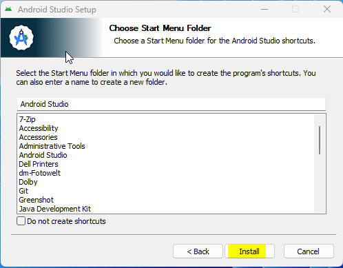
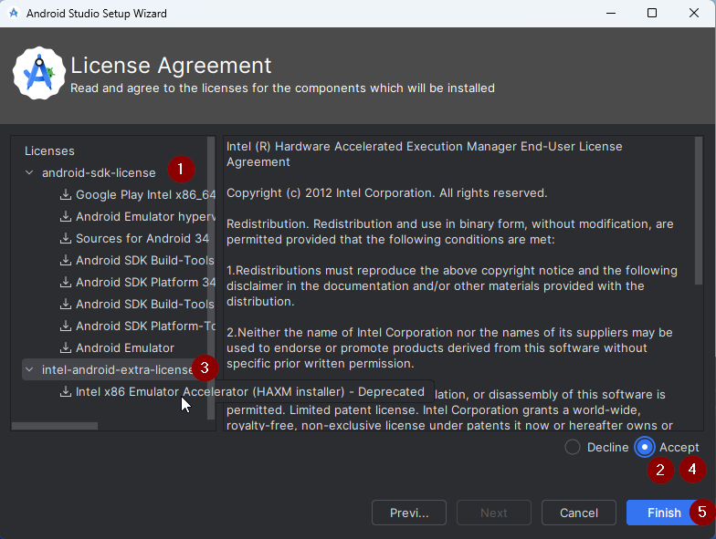
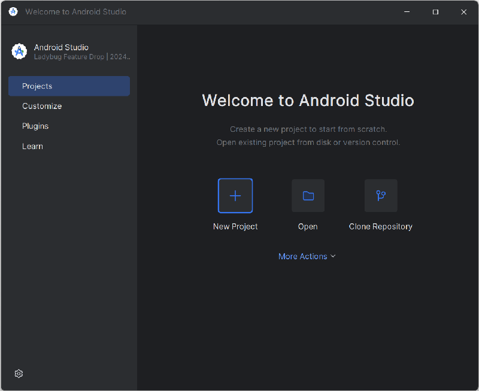
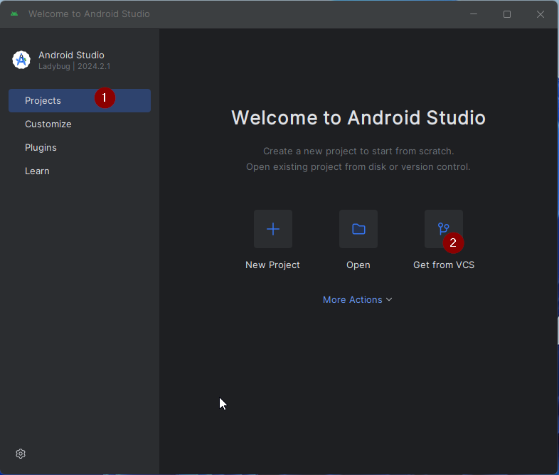
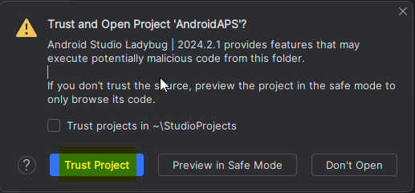
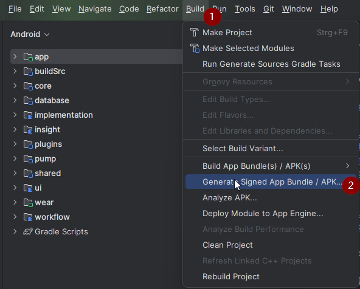
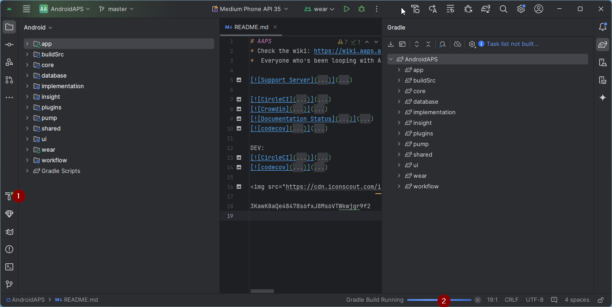
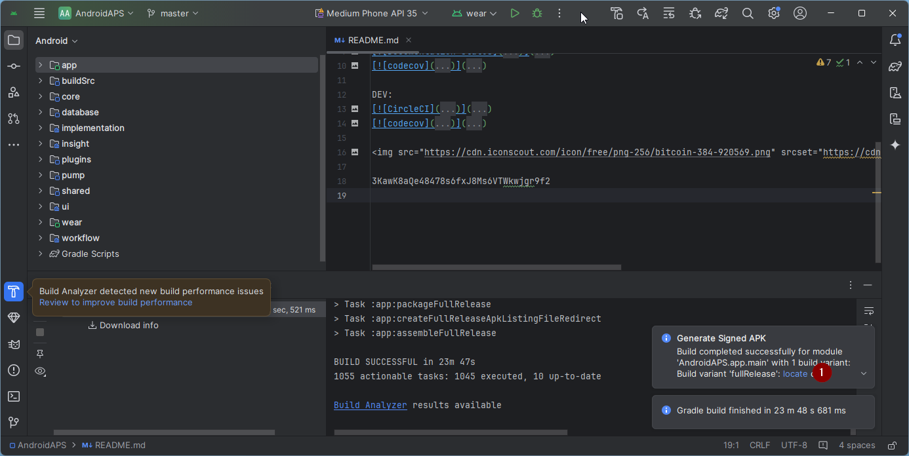

# 构建（Building）AAPS

## 自行构建而非下载

**由于医疗器械相关法规的限制，AAPS应用（一个apk文件）无法提供下载。 构建该应用供自己使用是合法的，但不得将副本提供给他人**

详情请参阅[常见问题页面](../UsefulLinks/FAQ.md)。


(Building-APK-recommended-specification-of-computer-for-building-apk-file)=
## 构建AAPS所需的计算机和软件规格。

* 构建APK可能需要特定版本的**[Android Studio](https://developer.android.com/studio/)**。 请参考下方表格：

| AAPS 版本                 | 推荐<br/>Android Studio<br/>版本 | 备选<br/>Android Studio<br/>版本 | Gradle | JVM |
| ----------------------- | ---------------------------------------- | ---------------------------------------- | ------ |:--- |
| 2.6.2                   | 3.6.1                                    |                                          | 5.6.4  | 11  |
| 2.8.2.1                 | 4.1.1                                    |                                          | 6.1.1  | 13  |
| [3.1.0.3](#version3100) | 2020.3.1                                 | up to Narwhal                            | 7.3.3  | 17  |
| [3.2.0.4](#version3204) | Hedgehog (2023.1.1)                      | up to Narwhal                            | 8.2    | 17  |
| [3.3.1.3](#version3300) | Ladybug 功能更新包 (2024.2.2)                 | up to Narwhal                            | 8.10   | 21  |
| [3.3.2](#version3300)   | Meerkat (2024.3.1)                       | Narwhal                                  | 8.11.1 | 21  |
| [3.3.2.1](#version3321) | Narwhal (2025.1.2)                       |                                          | 8.13   | 21  |

推荐版本是已内置适配的JVM版本。 推荐版本同时也是构建**AAPS**的最低可用版本。 若使用低于"推荐"的版本将**无法**完成构建。 若选用其他版本，可能遭遇与JVM版本相关的兼容性问题。 请参考[Android Studio问题排查指南](#troubleshooting_androidstudio-uncommitted-changes)解决。 若您当前的Android Studio版本未在下表中列出，则需先升级至支持版本。

Gradle版本由源代码仓库锁定，在拉取/更新代码时将自动获取正确版本。 此处列出仅作参考，无需手动干预。

* Android Studio 不支持 [Windows 32位系统](#troubleshooting_androidstudio-unable-to-start-daemon-process)。 请牢记，**64位CPU和64位操作系统是必要条件**。 如果您的系统不满足这一条件，您需要更换相应的硬件、软件或整个系统。

<table class="tg">
<tbody>
  <tr>
    <th class="tg-baqh">操作系统 (仅限 64 位)</th>
    <td class="tg-baqh">Windows 8 或更新版</td>
    <td class="tg-baqh">Mac OS 10.14 或更新版</td>
    <td class="tg-baqh">任何支持Gnome、KDE或Unity桌面环境的Linux系统；&nbsp;&nbsp;GNU C库2.31或更高版本。</td>
  </tr>
  <tr>
    <th class="tg-baqh"><p align="center">CPU（仅限64位）</th>
    <td class="tg-baqh">x86_64 CPU架构；第二代Intel Core或更新版本，或支持<br><a href="https://developer.android.com/studio/run/emulator-acceleration#vm-windows" target="_blank" rel="noopener noreferrer"><span style="text-decoration:var(--devsite-link-text-decoration,none)">Windows Hypervisor</span></a>的AMD CPU。</td>
    <td class="tg-baqh">基于ARM的芯片，或第二代Intel Core或更新版本（需支持<br><a href="https://developer.android.com/studio/run/emulator-acceleration#vm-mac" target="_blank" rel="noopener noreferrer"><span style="text-decoration:var(--devsite-link-text-decoration,none)">Hypervisor.Framework</span></a>）。</td>
    <td class="tg-baqh">x86_64 CPU架构；第二代Intel Core或更新版本，或支持AMD虚拟化（AMD-V）和SSSE3的AMD处理器。</td>
  </tr>
  <tr>
    <th class="tg-baqh"><p align="center">内存（RAM）</th>
    <td class="tg-baqh" colspan="3"><p align="center">16GB or more</td>
  </tr>
  <tr>
    <th class="tg-baqh"><p align="center">硬盘</th>
    <td class="tg-baqh" colspan="3"><p align="center">至少30GB的可用空间。 建议使用SSD（固态硬盘）。</td>
  </tr>
  <tr>
    <th class="tg-baqh"><p align="center">分辨率</th>
    <td class="tg-baqh" colspan="3"><p align="center">至少1280 x 800 <br></td>
  </tr>
  <tr>
    <th class="tg-baqh"><p align="center">网络连接</th>
    <td class="tg-baqh" colspan="3"><p align="center">宽带</td>
  </tr>
</tbody>
</table>

**强烈建议（非强制）使用固态硬盘（SSD）而非机械硬盘（HDD），因为这将减少你构建AAPS apk文件所需的时间。**不过，在构建**AAPS** apk文件时，你仍然可以使用机械硬盘。 如果使用机械硬盘，构建过程可能会需要很长时间才能完成，但是一旦开始，你就可以让它无人值守地运行。

## 构建过程中的帮助和支持

如果在构建**AAPS**应用的过程中遇到困难，有一个专门的[**Android Studio故障排除**](../GettingHelp/TroubleshootingAndroidStudio)部分，请先参考该部分。

如果你认为构建说明中有错误、遗漏或令人困惑的地方，或者你仍然在努力解决问题，请联系[Facebook](https://www.facebook.com/groups/AndroidAPSUsers)或[Discord](https://discord.gg/4fQUWHZ4Mw)上的其他**AAPS**用户组。 如果你想自己更改某些内容（如更新截图_等_），请提交一个[拉取请求（PR）](../SupportingAaps/HowToEditTheDocs.md)。

## 构建AAPS应用的逐步指南。

```{admonition} WARNING
:class:警告
如果你之前已经构建过AAPS，则无需再次执行以下所有步骤。
请直接跳转到[更新指南](../Maintenance/UpdateToNewVersion.md)！
```

```{contents} The overall steps for building the **AAPS** apk file
:depth: 1
:local: true
```

在本指南中，您将看到构建**AAPS** apk文件的_示例_截图。 由于我们用于构建**AAPS** apk的软件**Android Studio**会定期更新，这些截图可能与您的安装界面不完全一致，但您仍然可以按照它们进行操作。

**Android Studio**可在Windows、Mac OS X和Linux平台上运行，因此不同平台的步骤可能会存在细微差异。

(install-git-if-you-dont-have-it)=
### Git安装步骤

```{admonition} Why Git? 
:class: 下拉菜单（dropdown？）
Git是一个“_版本控制系统_”（VCS）。\
Git是一个程序，允许您跟踪代码中的更改并与他人协作。 您将使用Git从GitHub网站将**AAPS**源代码的副本复制到您的本地计算机。 然后，您将在计算机上使用Git来构建**AAPS**应用程序（apk）。 
```

(BuildingAaps-steps-for-installing-git)=
#### 安装Git的步骤

1.  检查**Git**是否已安装</0。 您可以通过在Windows搜索栏中输入“git”来进行检查。如果看到**“Git bash”**或其他形式的Git，则表示已安装，您可以直接跳到[安装Android Studio](#install-android-studio)部分。


2. 如果您的系统未安装 Git，请从[**这里**](https://git-scm.com/downloads)的“下载”部分下载并安装适用于您系统的最新版本。 任何最新版本的Git都应该可以工作，请根据您的系统（Mac、Windows或Linux）选择正确的版本。

**Mac用户注意：**Git网页还会指导您安装一个名为“homebrew”的附加程序以辅助安装。 如果您通过Homebrew安装Git，则无需更改任何首选项。

(Make_a_note_of_Git_path)=

* 在安装过程中，当您被要求“选择目标位置”时，请记下Git的_安装位置_（即“**安装路径**”），因为您将在下一步中需要检查它。 它将会是类似于“C:\Program Files\Git\cmd\git.exe”的路径。

*  在Git安装的多个步骤中，只需接受所有默认选项即可。

*  安装完成后，如果您忘记记录Git的安装位置，可以按照以下步骤找到它：在电脑搜索栏中输入“git”，右键点击“Git bash”，选择“打开文件位置”，然后将鼠标悬停在“Git bash”图标上，此时就会显示它的安装位置。

* 在进行下一步之前，请重启您的计算机。

(Building-APK-install-android-studio)=
### 安装 Android Studio

- **在以下步骤中，您必须始终保持在线状态，因为Android Studio会下载多个更新。**

```{admonition} What is Android Studio?
:class: 下拉菜单（dropdown？）
Android Studio 是一个运行在计算机上的程序。 Android Studio允许您从互联网下载源代码（使用Git），并构建智能手机（和智能手表）应用程序。 在您的PC上使用Android Studio构建新的或更新的应用程序，不会破坏当前在智能手机上运行的AAPS循环版本，因为它们是完全独立的过程。 
```

安装Android Studio时最重要的一点就是**要有耐心！**在安装和设置过程中，Android Studio会下载大量内容，这需要一些时间。

```{admonition} Different UI
:class:警告
重要提示：Android Studio在最近的版本中更改了其用户界面。 本指南将向您展示在“Ladybug”中的新用户界面下执行这些步骤的方法。 如果您仍在使用旧的用户界面，您可能想先按照[这些说明]将Android Studio更改为新的用户界面。
```

Android Studio版本至关重要。 请参考[前文说明](#Building-APK-recommended-specification-of-computer-for-building-apk-file)选择合适的Android Studio版本。

下载[当前版本的Android Studio](https://developer.android.com/studio)，或者从[**存档**](https://developer.android.com/studio/archive)下载旧版本，并接受下载协议。


下载完成后，启动下载的应用程序以将其安装在您的电脑上。 您可能需要接受/确认来自Windows的关于下载应用程序的一些警告！

通过点击“下一步”来安装Android Studio，如下图所示。 您**无需**更改任何设置！


If you want to save hard disk space, your you can uncheck Android Virtual Device: it is not used for building **AAPS**.


现在点击“安装”：



一旦完成，点击“下一步”。


在最后一步，点击“完成”以首次启动Android Studio。


系统会询问您是否愿意帮助改进Android Studio。 选择您喜欢的选项，这对后续步骤没有任何影响。


欢迎屏幕欢迎您安装Android Studio。 点击“下一步”。


选择“标准”作为安装类型。


再次点击“下一步”以验证设置。


现在您需要接受许可协议。 左侧有两个部分（1 + 3），您需要逐一选择，并在右侧的每个部分选择“接受”（2 + 4）。

然后可以点击“完成”（5）按钮。



现在将下载并安装一些Android软件包。 请耐心等待。

完成后，您将看到以下屏幕，您可以再次选择“完成”。


您现在将看到Android Studio的欢迎屏幕。




(Building-APK-download-AAPS-code)=
### 下载AAPS代码。

```{admonition} Why can it take a long time to download the AAPS code?
:class: 下拉菜单（dropdown？）
当**AAPS**首次被下载时，Android Studio将通过互联网连接到Github网站，以下载**AAPS**的源代码。 这个过程大约需要1分钟。 

然后，Android Studio将使用Gradle（一种Android应用开发工具）来识别在您的计算机上构建这些项目所需的其他组件。 
```

在Android Studio的欢迎屏幕上，检查左侧是否已高亮显示“**项目**”(1)。

接着在右侧点击**克隆仓库**按钮（2）：



我们现在将告诉Android Studio从哪里获取代码：


* 左侧应默认选中“存储库URL”（1）。
* “Git”应作为版本控制（2）被选中（默认）。
* 现在复制这个URL:
    ```
    https://github.com/nightscout/AndroidAPS.git
    ```
    并将其粘贴到URL文本框（3）中。

* 确认保存克隆代码的（默认）目录在计算机上尚未存在（4）。 您可以将其更改为某个目录，但请记住您存储的位置！
* 现在点击“克隆”按钮（5）。

```{admonition} INFORMATION
:class: 信息
记下这个目录。 这是您的源代码存储的位置！
```

您现在将看到一个屏幕，告诉您存储库正在被克隆：


在某个时刻，Android Studio将会关闭并重新启动。 您可能会被询问是否要信任该项目。 点击“信任项目”：

  


仅针对Windows用户：如果防火墙请求权限，请允许访问：

 

在成功克隆存储库后，Android Studio将打开克隆的项目。

(NewUI)=
```{admonition} New UI
:class:信息
Android Studio 最近更改了其用户界面。 新安装的Android Studio默认使用新的用户界面！

只有当您的Android Studio看起来与新的用户界面不同时，您才可能需要切换到新的用户界面：
点击左上角的汉堡菜单，然后选择**设置**（在Apple计算机上可能是**偏好设置**）。
在**外观&行为**中，转到**新UI**并勾选**启用新UI**。 然后重启Android Studio以开始使用新UI。

如果您找不到**新UI**选项，不用担心：您已经在使用它了！
```


当Android Studio打开时，请耐心等待（这可能需要几分钟），特别是**不要**按照弹出窗口中的建议更新项目。

Android Studio将自动开始“Gradle项目同步”，这将需要几分钟时间来完成。 您可以看到它（仍在）运行：


```{admonition} NEVER UPDATE GRADLE!
:class:警告
Android Studio可能会建议更新Gradle系统。 不要更新Gradle！ 这会带来麻烦。
```

仅限Windows计算机：你可能会遇到Windows Defender运行的通知：点击**Automatically**并确认，这将使构建运行得更快！


您可以让Gradle同步继续运行，并已经开始执行下一步操作。

(Building-APK-set-git-path-in-preferences)=
### 在Android Studio首选项中设置Git路径

现在，我们将告诉Android Studio在哪里可以找到[之前](#install-git-if-you-dont-have-it)安装的Git。

* 仅限Windows用户：在[安装Git](#install-git-if-you-dont-have-it)后确保你已经重启了计算机。 如果之前没有重启，现在请重启并重新打开Android Studio。

在**Android Studio**左上角，打开汉堡菜单，导航到**File**> **Settings**（Windows上）或**Android Studio** > **Preferences**（Mac上）。 这将打开以下窗口，点击展开名为**Version Control**（1）的下拉菜单，然后选择**Git**


检查**Android Studio**是否可以自动定位正确的**Git可执行文件路径**，方法是点击“Test”按钮（1）：


如果自动设置成功，你当前版本的**Git**将显示在路径旁边。

   


如果你发现**git.exe**没有自动找到，或者点击“Test”导致错误（1），你可以要么
* 手动输入你[之前](#BuildingAaps-steps-for-installing-git)保存的路径，要么
* 点击文件夹图标（1），然后手动导航到之前[已安装](#BuildingAaps-steps-for-installing-git)**git.exe**的目录。
* 使用Test按钮验证你的设置！

  

(Building-APK-generate-signed-apk)=
### 构建AAPS的“签名版”APK文件

```{admonition} Why does the AAPS app need to be "signed"?
:class:下拉菜单（dropdown？）
Android要求每个应用都必须被_签名_，以确保它只能在以后从发布原始应用的同一可信来源更新。 有关此主题的更多信息，请访问[这个链接]
(https://developer.android.com/studio/publish/app-signing.html#generate-key). 

这意味着我们生成一个签名或“keystore”文件，并在构建**AAPS**应用时使用它。
```


**重要提示：在进行下一步之前，请确保Gradle同步已成功完成！**


点击左上角的汉堡菜单以打开菜单栏。 选择**Build**（1），然后选择**Generate Signed App Bundle / APK**（2）。



选择“APK”而不是“Android App Bundle”，然后点击“下一步”：


在下一个屏幕中，确保“模块”设置为“AAPS.app”（1）。

(Building-APK-wearapk)=
```{admonition} INFORMATION!
:class: 信息
如果您要为手表创建APK，现在需要选择AAPS.wear！
```


点击“创建新的...” （2）以开始创建您的密钥库。

```{admonition} INFORMATION!
:class: information
您只需要创建一次keystore。
如果您之前已经构建过AAPS，请不要创建新的keystore，而是选择您现有的keystore并输入其密码！
```

**_注意：_** keystore是一个文件，用于存储签名应用的信息。 它是加密的，并且信息通过密码保护。


* 点击“文件夹”图标（1）以选择您计算机上的一个路径来保存您的密钥库。

  **不要**使用存储源代码的目录，而是选择您也会转移到新计算机上的某个目录。

```{admonition} WARNING!
:class:警告
请务必记下您的keystore存储位置。 在构建下一个AndroidAPS更新时，您将需要它！
```

* 现在选择一个简单的密码（并记下它），在密码框（2）中输入它，并确认密码（2）。

  密钥库和密钥的密码不需要非常复杂。 如果您将来丢失了密码，请参阅[丢失keystore的故障排除](#troubleshooting_androidstudio-lost-keystore)。

* 默认的密钥别名（3）是“key0”，请保持不变。

* 现在您需要为您的密钥设置一个密码。 为了简单起见，如果您愿意，可以使用与上面设置的密钥库相同的密码。 输入密码（4）并确认它。

```{admonition} WARNING!
:class:警告
记下这些密码！ 在构建下一个AAPS更新时，您将需要它们！
```

* 有效期默认为25年，保持不变。

* 输入您的名字和姓氏（5）。 其他信息无需填写，但您可以根据需要自行添加（6-7）。

* 点击“确定”（8）以继续：


在**Generate signed App Bundle or APK**页面上，现在将显示您的keystore的路径。 现在重新输入密钥库密码（1）和密钥密码（2），并勾选方框（3）以记住密码，这样您在下次构建APK时（例如，更新到新的AAPS版本时）就不用再次输入这些密码。 点击“下一步”（4）：


在下一个屏幕中，选择构建变量“完全版本（fullRelease）”（2），然后点击“创建”（3）。 您应该记住在（1）处显示的目录，因为之后您可以在那里找到构建好的APK文件！

   

Android Studio现在将构建AAPS apk。 在右下角会显示“Gradle 构建运行中”（2）。 此过程需要一些时间，具体取决于您的计算机和互联网连接，因此**请耐心等待！**如果您想查看构建进度，请点击Android Studio底部的“build”小锤子图标（1）：



现在您可以查看构建进度：


构建完成后，Android Studio 将显示“构建成功”的信息。 您可能会看到一个弹出通知，您可以点击它以选择“定位”。 如果您错过了这个通知，请点击通知图标（1），然后在屏幕最底部点击**locate**（2）以打开通知列表：


**_如果构建不成功，请参阅[Android Studio故障排除部分](../GettingHelp/TroubleshootingAndroidStudio)。_**

在通知框中，点击蓝色链接“定位”：

 构建成功后，您将收到通知，并可以通过点击通知中的链接来定位您的apk文件。

   

恭喜！ 现在您已经构建了AAPS apk文件，接下来您将把这个文件传输到您的智能手机上。

```{tip}
如果您认为将来可能会使用Android Wear智能手表，那么现在是构建AAPS Wear apk的最佳时机，以确保它与您的AAPS apk同步。
```

接下来，请转到下一阶段[传输和安装**AAPS**](../SettingUpAaps/TransferringAndInstallingAaps.md)。


