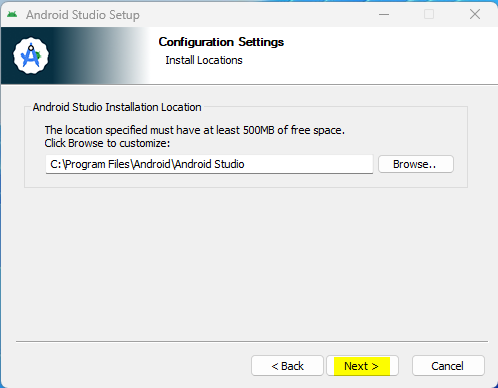
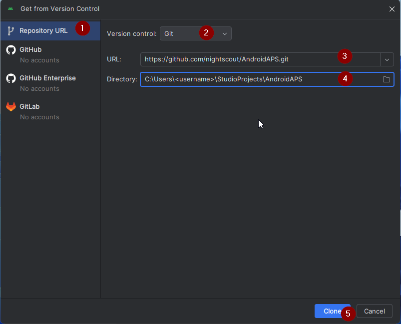
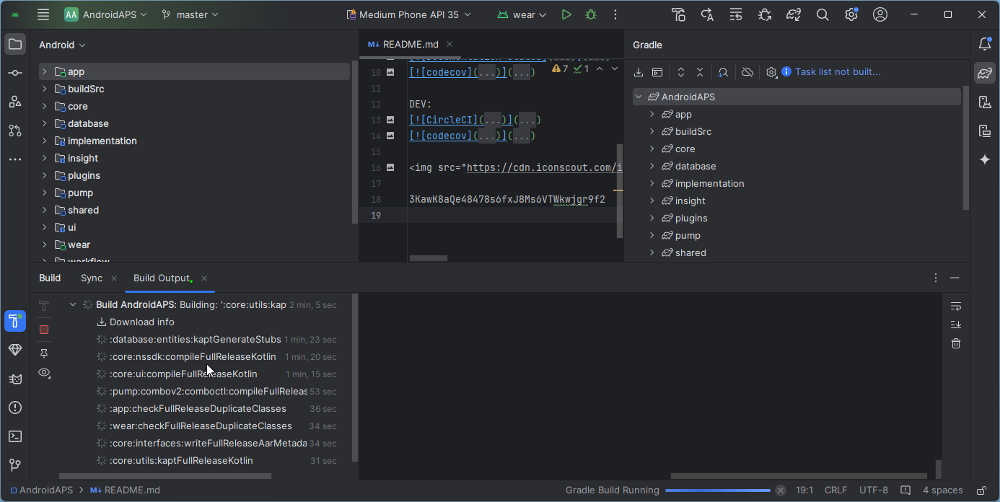

# Building AAPS

## Build yourself instead of download

**由于医疗器械相关法规的限制，AAPS应用（一个apk文件）无法提供下载。 It is legal to build the app for your own use, but you must not give a copy to others!**

See [FAQ page](../UsefulLinks/FAQ.md) for details.


(Building-APK-recommended-specification-of-computer-for-building-apk-file)=
## Computer and software specifications for building AAPS

* 请使用至少为**[Hedgehog（2023.1.1）版本或更新版本（如Iguana、Jellyfish、Koala或Ladybug）的Android Studio](https://developer.android.com/studio/)**来构建apk文件。 Older versions of Android Studio need to be updated first!
* Android Studio 不支持 [Windows 32位系统](#troubleshooting_androidstudio-unable-to-start-daemon-process)。 请牢记，**64位CPU和64位操作系统是必要条件**。 如果您的系统不满足这一条件，您需要更换相应的硬件、软件或整个系统。

<table class="tg">
<tbody>
  <tr>
    <th class="tg-baqh">OS (Only 64 bit)</th>
    <td class="tg-baqh">Windows 8 or higher</td>
    <td class="tg-baqh">Mac OS 10.14 or higher</td>
    <td class="tg-baqh">Any Linux supports Gnome, KDE, or Unity DE;&nbsp;&nbsp;GNU C Library 2.31 or later</td>
  </tr>
  <tr>
    <th class="tg-baqh"><p align="center">CPU (Only 64 bit)</th>
    <td class="tg-baqh">x86_64 CPU architecture; 2nd generation Intel Core or newer, or AMD CPU with support for a <br><a href="https://developer.android.com/studio/run/emulator-acceleration#vm-windows" target="_blank" rel="noopener noreferrer"><span style="text-decoration:var(--devsite-link-text-decoration,none)">Windows Hypervisor</span></a></td>
    <td class="tg-baqh">ARM-based chips, or 2nd generation Intel Core or newer with support for <br><a href="https://developer.android.com/studio/run/emulator-acceleration#vm-mac" target="_blank" rel="noopener noreferrer"><span style="text-decoration:var(--devsite-link-text-decoration,none)">Hypervisor.Framework</span></a></td>
    <td class="tg-baqh">x86_64 CPU architecture; 2nd generation Intel Core or newer, or AMD processor with support for AMD Virtualization (AMD-V) and SSSE3</td>
  </tr>
  <tr>
    <th class="tg-baqh"><p align="center">RAM</th>
    <td class="tg-baqh" colspan="3"><p align="center">8GB or more</td>
  </tr>
  <tr>
    <th class="tg-baqh"><p align="center">Disk</th>
    <td class="tg-baqh" colspan="3"><p align="center">At least 30GB free space. SSD is recommended.</td>
  </tr>
  <tr>
    <th class="tg-baqh"><p align="center">Resolution</th>
    <td class="tg-baqh" colspan="3"><p align="center">至少1280 x 800 <br></td>
  </tr>
  <tr>
    <th class="tg-baqh"><p align="center">Internet</th>
    <td class="tg-baqh" colspan="3"><p align="center">Broadband</td>
  </tr>
</tbody>
</table>

**强烈建议（非强制）使用固态硬盘（SSD）而非机械硬盘（HDD），因为这将减少你构建AAPS apk文件所需的时间。**不过，在构建**AAPS** apk文件时，你仍然可以使用机械硬盘。 If you do, the building process may take a long time to complete, but once it has started, you can leave it running unattended.

## Help and support during the building process

如果在构建**AAPS**应用的过程中遇到困难，有一个专门的[**Android Studio故障排除**](../GettingHelp/TroubleshootingAndroidStudio)部分，请先参考该部分。


如果你认为构建说明中有错误、遗漏或令人困惑的地方，或者你仍然在努力解决问题，请联系[Facebook](https://www.facebook.com/groups/AndroidAPSUsers)或[Discord](https://discord.gg/4fQUWHZ4Mw)上的其他**AAPS**用户组。 如果你想自己更改某些内容（如更新截图_等_），请提交一个[拉取请求（PR）](../SupportingAaps/HowToEditTheDocs.md)。

## Step-by-step guide to building the AAPS app

```{admonition} WARNING
:class:警告
如果你之前已经构建过AAPS，则无需再次执行以下所有步骤。
请直接跳转到[更新指南](../Maintenance/UpdateToNewVersion.md)！
```

```{contents} The overall steps for building the **AAPS** apk file
:depth: 1
:local: true
```

在本指南中，您将看到构建**AAPS** apk文件的_示例_截图。 由于我们用于构建**AAPS** apk的软件**Android Studio**会定期更新，这些截图可能与您的安装界面不完全一致，但您仍然可以按照它们进行操作。

**Android Studio**可在Windows、Mac OS X和Linux平台上运行，因此不同平台的步骤可能会存在细微差异。

(install-git-if-you-dont-have-it)=
### Git安装步骤

```{admonition} Why Git? 
:class: 下拉菜单（dropdown？）
Git是一个“_版本控制系统_”（VCS）。\
Git是一个程序，允许您跟踪代码中的更改并与他人协作。 您将使用Git从GitHub网站将**AAPS**源代码的副本复制到您的本地计算机。 然后，您将在计算机上使用Git来构建**AAPS**应用程序（apk）。 
```

(BuildingAaps-steps-for-installing-git)=
#### Steps for Installing Git

1.  检查**Git**是否已安装</0。 您可以通过在Windows搜索栏中输入“git”来进行检查。如果看到**“Git bash”**或其他形式的Git，则表示已安装，您可以直接跳到[安装Android Studio](#install-android-studio)部分。


2. 如果您的系统未安装 Git，请从[**这里**](https://git-scm.com/downloads)的“下载”部分下载并安装适用于您系统的最新版本。 Any recent Git version should work, select the correct version according to your system, either Mac, Windows and Linux.

**Note for Mac users:** the Git webpage will also guide you to install an additional program called "homebrew" to aid the installation. If you install Git via homebrew, there is no need to change any preferences.

(Make_a_note_of_Git_path)=

* During the installation, when you are asked to "select destination location" make a note of _where_ Git is being installed (the "**installation path**") you will need to check it in the next step. It will be something similar to "C:\Program Files\Git\cmd\git.exe"

*  As you proceed through several steps of the Git installation, just accept all the default options.

*  After the install, if you forgot to make a note of the where Git was installed, you can find it as follows: type "git" into the PC search bar, right click on "Git bash", select "open file location" hover over the "Git bash" icon with your mouse, which will then reveal where it is installed.

* Reboot your computer before the next step.

(Building-APK-install-android-studio)=
### Install Android Studio

- **You have to be online all of the time during the following steps, as Android Studio downloads several updates**

```{admonition} What is Android Studio?
:class: dropdown
Android Studio is a program which runs on your computer. It allows you to download source code from the internet (using Git) and build smartphone (and smartwatch) apps. You cannot "break" a current, looping version of **AAPS** which you might have running on a smartphone by building a new or updated app on your PC with Android Studio, these are totally separate processes. 
```

One of the most important things when installing Android Studio is **be patient!** During installation and setup, Android Studio is downloading a lot of stuff which will take time.

Any version of Android Studio like version Hedgehog or any newer is suitable. With version Ladybug, you might need to do one extra step, but it's doable!

```{admonition} Different UI
:class: warning
Import note: Android Studio changed its UI during the last releases. This guide will show you the steps with the *new UI* in "Ladybug". If you still use the older UI, you might want to change Android Studio to the new UI first following [these instructions](NewUI).
```

Download the [current version of Android Studio](https://developer.android.com/studio) or an older version from the [**Archives**](https://developer.android.com/studio/archive) and accept the download agreements.


Once the download is finished, start the downloaded application to install it on your computer. You might need to accept/confirm some warnings about downloaded apps from Windows!

Install Android Studio by clicking "Next", as shown in the following screenshots. You do **not** need to change any settings!




Now click on "Install":


Once it's completed, press "Next"


In the last step, click on "Finished" to start Android Studio for the first time.


You will be asked if you want to help improve Android Studio. Choose the option to your liking, it won't make any difference for the following steps.


The welcome screen greets you to the installation of Android Studio. Press "Next".


Select "Standard" as installation type.


Verify the settings by clicking "Next" again.


Now you need to accept the license agreements. You have two sections (1 + 3) on the left side which you have to select one after the other and each select "Accept" (2 + 4) on the right side.

Then the "Finish" (5) button can be clicked.


Some Android packages will now be downloaded and installed. Be patient and wait.

When it's finished, you will find the following screen where you can select "Finish" again.


You will now see the Welcome screen of Android Studio.


(Building-APK-download-AAPS-code)=
### Download the AAPS code

```{admonition} Why can it take a long time to download the AAPS code?
:class: dropdown

The first time **AAPS** is downloaded, Android Studio will connect over the internet to the Github website to download the source code for **AAPS**. This should take about 1 minute. 

Android Studio will then use **Gradle** (a development tool for Android apps) to identify other components needed to build these items on your computer. 
```

On the Android Studio Welcome screen, check that "**Projects**" (1) is highlighted on the left.

Then click "**Get from VCS**" (2) on the right:


We will now tell Android Studio where to get the code from:



* "Repository URL" should be selected (by default) on the left (1).
* "Git" should be selected (by default) as version control (2).
* Now copy this URL:
    ```
    https://github.com/nightscout/AndroidAPS.git
    ```
    and paste it into the URL textbox (3).

* Check the (default) directory for saving the cloned code exists on your computer and doesn't already exists (4). You can change it to some directory, but please remember where you stored it!
* Now click the button "Clone" (5).

```{admonition} INFORMATION
:class: information
Make a note of the directory. It is where your sourcecode is stored!
```

You will now see a screen telling you that the repository is being cloned:


At some point, Android Studio will close and start again. You may be asked whether you want to trust the project. Click on "Trust project":

  


Only for Windows users: If your firewall asks for permission, grant access:

 

After the repository is cloned successfully, Android Studio will open the cloned project.

(NewUI)=
```{admonition} New UI
:class: information
Android Studio changed its UI recently. New installations of Android Studio use the new UI by default!

Only if your Android Studio looks different, you might need to switch to the new UI:
Click on the hamburger menu on the top left, then select **Settings** (or **Preferences** on Apple computers).
In **Appearance & Behaviour**, go to **New UI** and tick **Enable new UI**. Then restart Android Studio to start using it.

If you don't find the option **New UI** don't worry: you are already using it!
```


When Android Studio opened, wait patiently (this may take a few minutes), and particularly, **do not** update the project as suggested in the pop-up.

Android Studio will start a "Gradle project sync" automatically, which will take a couple of minutes to finish. You can see it (still) running:


```{admonition} NEVER UPDATE GRADLE!
:class: warning

Android Studio might recommend updating the gradle system. **Never update gradle!** This will lead to difficulties.
```

Only on windows computers: You might get a notification about windows defender running: Click on **Automatically** and confirm, it will make the build run faster!


You can leave the gradle sync running and follow the next steps already.

(Building-APK-set-git-path-in-preferences)=
### Set Git path in Android Studio preferences

Now we will tell Android studio where to find Git, which you installed [earlier](#install-git-if-you-dont-have-it).

* Windows users only: Make sure you have restarted your computer after [installing Git](#install-git-if-you-dont-have-it). If not, restart now and re-open Android Studio

In the top left corner of **Android Studio**, open the hamburger menu and navigate to **File** > **Settings** (on Windows) or **Android Studio** > **Preferences** (on Mac). This opens the following window, click to expand the dropdown called **Version Control** (1) and select **Git**


Check if **Android Studio** can automatically locate the correct **Path to Git executable** automatically by clicking the button "Test" (1):


If the automatic setting is successful, your current version of **Git** will be displayed next to the path.

   


If you find that **git.exe** is not found automatically, or that clicking "Test" results in an error (1), you can either
* manually enter the path which you saved [earlier](#BuildingAaps-steps-for-installing-git), or
* click on the folder icon (1) and manually navigating to the directory where **git.exe** was installed [earlier](#BuildingAaps-steps-for-installing-git)
* Verify your settings with the **Test** button!

  

(Building-APK-generate-signed-apk)=
### Build the AAPS "signed" APK

```{admonition} Why does the AAPS app need to be "signed"?
:class: dropdown

Android requires each app to be _signed_, to ensure that it can only be updated later from the same trusted source that released the original app. For more information on this topic, follow [this link](https://developer.android.com/studio/publish/app-signing.html#generate-key). 

For our purposes, this just means that we generate a signing or "keystore" file and use it when we build the **AAPS** app.
```


**Important: Make sure the gradle sync is finished successfully before proceeding!**


Click the hamburger menu on the top left to open the menu bar. Select **Build** (1), then select **Generate Signed App Bundle / APK** (2)


Select "APK" instead of "Android App Bundle" and click "Next":


In the next screen, make sure that "Module" is set to "AAPS.app" (1).

(Building-APK-wearapk)=
```{admonition} INFORMATION!
:class: information
If you want to create the apk for your watch, you now need to select AAPS.wear!
```


Click "Create new..." (2) to start creating your key store.

```{admonition} INFORMATION!
:class: information
You will only need to create the keystore once.
If you have build AAPS before, do NOT create a new keystore but select your existing one and enter its passwords!
```

**_Note:_** The key store is a file in which the information for signing the app is stored. It is encrypted, and the information is secured with passwords.


* Click the "folder" symbol (1) to select a path on your computer for your key store.

  Do **not** use the directory where you stored your sourcecode but some directory that you would also transfer to a new computer.

```{admonition} WARNING!
:class: warning
Make sure to note down for yourself where your keystore is stored. You will need it when you build the next AndroidAPS update!
```

* Now choose a simple password (and make a note of it), enter it in the password box (2), and confirm it (2).

  The passwords for key store and key do not have to be sophisticated. If you lose your password in the future, see [troubleshooting for lost key store](#troubleshooting_androidstudio-lost-keystore).

* The default alias (3) for your key is "key0", leave this unchanged.

* You now need a password for your key. To keep it simple, if you want, you can use the same password you used for your keystore, above. Enter a password (4) and confirm it.

```{admonition} WARNING!
:class: warning
Note down these passwords! You will need them when you build the next AAPS update!
```

* The validity is 25 years by default, leave it as it is.

* Enter your first and last name (5). No other information needs to be added but you are free to do (6-7).

* Click "OK" (8) to continue:


On the **Generate signed App Bundle or APK** page, the path to your keystore will now be displayed. Now re-enter the Key Store password (1) and Key password (2), and tick the box (3) to remember passwords, so you don't have to enter them again next time you build the apk (i.e. when updating to a new AAPS version). Click "Next" (4):


On the next screen, select build variant "fullRelease" (2) and click "Create" (3). You should remember the directory displayed at (1), as later you will find your built apk file there!

   

Android Studio will now build the **AAPS** apk. It will show "Gradle Build running" (2) at the bottom right. The process takes some time, depending on your computer and internet connection, so **be patient!** If you want to watch the progress of the build, click on the small hammer "build" (1) at the bottom of Android Studio:


Now you can watch the building progress:



Android Studio will display the information "BUILD SUCCESSFUL" after build is finished. You may see a popup notification which you can click to select "locate". If you miss this, click on the notification icon (1) and then on **locate** (2) at the very bottom of the screen to bring up the Notifications:


**_If the build was not successful, refer to the [Android Studio Troubleshooting section](../GettingHelp/TroubleshootingAndroidStudio)._**

In the Notifications box, click on the blue link "locate":

 Your file manager will open and show you the build apk file that you have just built.

   

Congratulations! Now you have built the **AAPS** apk file, you will be transferring this file to your smartphone in the next section of the docs.

```{tip}
If you think you might want to use an Android Wear smartwatch in the future, this is the best time to build the AAPS Wear apk to be sure it will be synchronized with your AAPS apk.
```

Move to the next stage of [Transferring and Installing **AAPS**](../SettingUpAaps/TransferringAndInstallingAaps.md).


