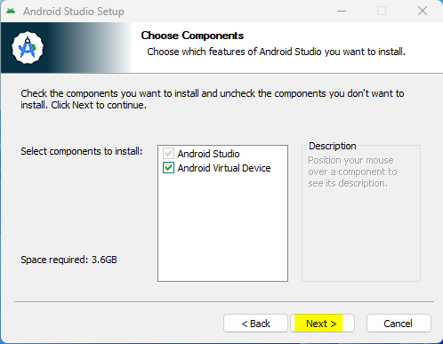
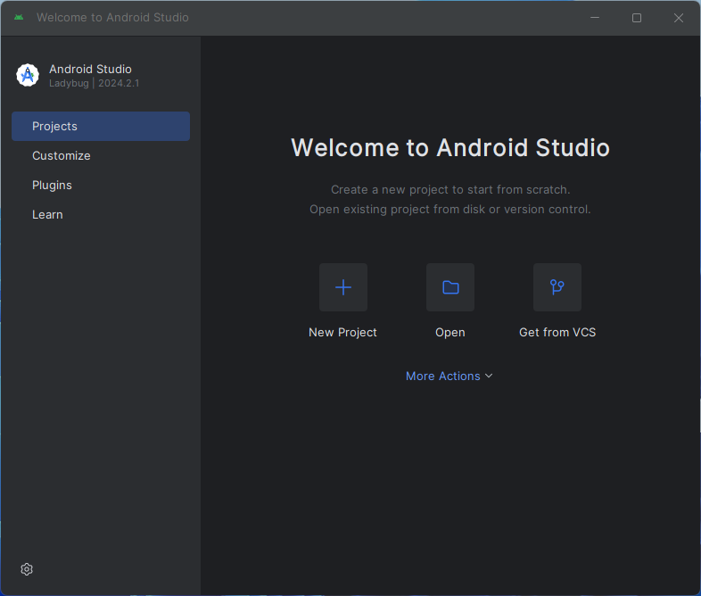

# Building AAPS

## Build yourself instead of download

**由于医疗器械相关法规的限制，AAPS应用（一个apk文件）无法提供下载。 It is legal to build the app for your own use, but you must not give a copy to others!**

See [FAQ page](../UsefulLinks/FAQ.md) for details.


(Building-APK-recommended-specification-of-computer-for-building-apk-file)=
## Computer and software specifications for building AAPS

* 请使用至少为**[Hedgehog（2023.1.1）版本或更新版本（如Iguana、Jellyfish、Koala或Ladybug）的Android Studio](https://developer.android.com/studio/)**来构建apk文件。 Older versions of Android Studio need to be updated first!
* Android Studio 不支持 [Windows 32位系统](#troubleshooting_androidstudio-unable-to-start-daemon-process)。 请牢记，**64位CPU和64位操作系统是必要条件**。 如果您的系统不满足这一条件，您需要更换相应的硬件、软件或整个系统。

<table class="tg">
<tbody>
  <tr>
    <th class="tg-baqh">OS (Only 64 bit)</th>
    <td class="tg-baqh">Windows 8 or higher</td>
    <td class="tg-baqh">Mac OS 10.14 or higher</td>
    <td class="tg-baqh">Any Linux supports Gnome, KDE, or Unity DE;&nbsp;&nbsp;GNU C Library 2.31 or later</td>
  </tr>
  <tr>
    <th class="tg-baqh"><p align="center">CPU (Only 64 bit)</th>
    <td class="tg-baqh">x86_64 CPU architecture; 2nd generation Intel Core or newer, or AMD CPU with support for a <br><a href="https://developer.android.com/studio/run/emulator-acceleration#vm-windows" target="_blank" rel="noopener noreferrer"><span style="text-decoration:var(--devsite-link-text-decoration,none)">Windows Hypervisor</span></a></td>
    <td class="tg-baqh">ARM-based chips, or 2nd generation Intel Core or newer with support for <br><a href="https://developer.android.com/studio/run/emulator-acceleration#vm-mac" target="_blank" rel="noopener noreferrer"><span style="text-decoration:var(--devsite-link-text-decoration,none)">Hypervisor.Framework</span></a></td>
    <td class="tg-baqh">x86_64 CPU architecture; 2nd generation Intel Core or newer, or AMD processor with support for AMD Virtualization (AMD-V) and SSSE3</td>
  </tr>
  <tr>
    <th class="tg-baqh"><p align="center">RAM</th>
    <td class="tg-baqh" colspan="3"><p align="center">8GB or more</td>
  </tr>
  <tr>
    <th class="tg-baqh"><p align="center">Disk</th>
    <td class="tg-baqh" colspan="3"><p align="center">At least 30GB free space. SSD is recommended.</td>
  </tr>
  <tr>
    <th class="tg-baqh"><p align="center">Resolution</th>
    <td class="tg-baqh" colspan="3"><p align="center">至少1280 x 800 <br></td>
  </tr>
  <tr>
    <th class="tg-baqh"><p align="center">Internet</th>
    <td class="tg-baqh" colspan="3"><p align="center">Broadband</td>
  </tr>
</tbody>
</table>

**强烈建议（非强制）使用固态硬盘（SSD）而非机械硬盘（HDD），因为这将减少你构建AAPS apk文件所需的时间。**不过，在构建**AAPS** apk文件时，你仍然可以使用机械硬盘。 If you do, the building process may take a long time to complete, but once it has started, you can leave it running unattended.

## Help and support during the building process

如果在构建**AAPS**应用的过程中遇到困难，有一个专门的[**Android Studio故障排除**](../GettingHelp/TroubleshootingAndroidStudio)部分，请先参考该部分。


如果你认为构建说明中有错误、遗漏或令人困惑的地方，或者你仍然在努力解决问题，请联系[Facebook](https://www.facebook.com/groups/AndroidAPSUsers)或[Discord](https://discord.gg/4fQUWHZ4Mw)上的其他**AAPS**用户组。 如果你想自己更改某些内容（如更新截图_等_），请提交一个[拉取请求（PR）](../SupportingAaps/HowToEditTheDocs.md)。

## Step-by-step guide to building the AAPS app

```{admonition} WARNING
:class:警告
如果你之前已经构建过AAPS，则无需再次执行以下所有步骤。
请直接跳转到[更新指南](../Maintenance/UpdateToNewVersion.md)！
```

```{contents} The overall steps for building the **AAPS** apk file
:depth: 1
:local: true
```

在本指南中，您将看到构建**AAPS** apk文件的_示例_截图。 由于我们用于构建**AAPS** apk的软件**Android Studio**会定期更新，这些截图可能与您的安装界面不完全一致，但您仍然可以按照它们进行操作。

**Android Studio**可在Windows、Mac OS X和Linux平台上运行，因此不同平台的步骤可能会存在细微差异。

(install-git-if-you-dont-have-it)=
### Git安装步骤

```{admonition} Why Git? 
:class: 下拉菜单（dropdown？）
Git是一个“_版本控制系统_”（VCS）。\
Git是一个程序，允许您跟踪代码中的更改并与他人协作。 您将使用Git从GitHub网站将**AAPS**源代码的副本复制到您的本地计算机。 然后，您将在计算机上使用Git来构建**AAPS**应用程序（apk）。 
```

(BuildingAaps-steps-for-installing-git)=
#### Steps for Installing Git

1.  检查**Git**是否已安装</0。 您可以通过在Windows搜索栏中输入“git”来进行检查。如果看到**“Git bash”**或其他形式的Git，则表示已安装，您可以直接跳到[安装Android Studio](#install-android-studio)部分。


2. 如果您的系统未安装 Git，请从[**这里**](https://git-scm.com/downloads)的“下载”部分下载并安装适用于您系统的最新版本。 Any recent Git version should work, select the correct version according to your system, either Mac, Windows and Linux.

**Mac用户注意：**Git网页还会指导您安装一个名为“homebrew”的附加程序以辅助安装。 If you install Git via homebrew, there is no need to change any preferences.

(Make_a_note_of_Git_path)=

* 在安装过程中，当您被要求“选择目标位置”时，请记下Git的_安装位置_（即“**安装路径**”），因为您将在下一步中需要检查它。 It will be something similar to "C:\Program Files\Git\cmd\git.exe"

*  As you proceed through several steps of the Git installation, just accept all the default options.

*  After the install, if you forgot to make a note of the where Git was installed, you can find it as follows: type "git" into the PC search bar, right click on "Git bash", select "open file location" hover over the "Git bash" icon with your mouse, which will then reveal where it is installed.

* Reboot your computer before the next step.

(Building-APK-install-android-studio)=
### Install Android Studio

- **在以下步骤中，您必须始终保持在线状态，因为Android Studio会下载多个更新。**

```{admonition} What is Android Studio?
:class: 下拉菜单（dropdown？）
Android Studio 是一个运行在计算机上的程序。 Android Studio允许您从互联网下载源代码（使用Git），并构建智能手机（和智能手表）应用程序。 在您的PC上使用Android Studio构建新的或更新的应用程序，不会破坏当前在智能手机上运行的AAPS循环版本，因为它们是完全独立的过程。 
```

安装Android Studio时最重要的一点就是**要有耐心！**在安装和设置过程中，Android Studio会下载大量内容，这需要一些时间。

Any version of Android Studio like version Hedgehog or any newer is suitable. With version Ladybug, you might need to do one extra step, but it's doable!

```{admonition} Different UI
:class:警告
重要提示：Android Studio在最近的版本中更改了其用户界面。 本指南将向您展示在“Ladybug”中的新用户界面下执行这些步骤的方法。 如果您仍在使用旧的用户界面，您可能想先按照[这些说明]将Android Studio更改为新的用户界面。
```

从[**存档**](https://developer.android.com/studio/archive)下载[当前版本的Android Studio](https://developer.android.com/studio)或旧版本，并接受下载协议。


Once the download is finished, start the downloaded application to install it on your computer. You might need to accept/confirm some warnings about downloaded apps from Windows!

Install Android Studio by clicking "Next", as shown in the following screenshots. 您**无需**更改任何设置！





Now click on "Install":


Once it's completed, press "Next"


In the last step, click on "Finished" to start Android Studio for the first time.


You will be asked if you want to help improve Android Studio. Choose the option to your liking, it won't make any difference for the following steps.


The welcome screen greets you to the installation of Android Studio. Press "Next".


Select "Standard" as installation type.


Verify the settings by clicking "Next" again.


Now you need to accept the license agreements. You have two sections (1 + 3) on the left side which you have to select one after the other and each select "Accept" (2 + 4) on the right side.

Then the "Finish" (5) button can be clicked.


Some Android packages will now be downloaded and installed. Be patient and wait.

When it's finished, you will find the following screen where you can select "Finish" again.


You will now see the Welcome screen of Android Studio.




(Building-APK-download-AAPS-code)=
### Download the AAPS code

```{admonition} Why can it take a long time to download the AAPS code?
:class: 下拉菜单（dropdown？）
当**AAPS**首次被下载时，Android Studio将通过互联网连接到Github网站，以下载**AAPS**的源代码。 这个过程大约需要1分钟。 

然后，Android Studio将使用Gradle（一种Android应用开发工具）来识别在您的计算机上构建这些项目所需的其他组件。 
```

在Android Studio的欢迎屏幕上，检查左侧是否已高亮显示“**项目**”(1)。

然后点击右侧的“**从版本控制系统获取**”(2)：


We will now tell Android Studio where to get the code from:


* "Repository URL" should be selected (by default) on the left (1).
* "Git" should be selected (by default) as version control (2).
* Now copy this URL:
    ```
    https://github.com/nightscout/AndroidAPS.git
    ```
    and paste it into the URL textbox (3).

* Check the (default) directory for saving the cloned code exists on your computer and doesn't already exists (4). You can change it to some directory, but please remember where you stored it!
* Now click the button "Clone" (5).

```{admonition} INFORMATION
:class: 信息
记下这个目录。 这是您的源代码存储的位置！
```

You will now see a screen telling you that the repository is being cloned:


At some point, Android Studio will close and start again. You may be asked whether you want to trust the project. Click on "Trust project":

  


Only for Windows users: If your firewall asks for permission, grant access:

 

After the repository is cloned successfully, Android Studio will open the cloned project.

(NewUI)=
```{admonition} New UI
:class:信息
Android Studio 最近更改了其用户界面。 新安装的Android Studio默认使用新的用户界面！

只有当您的Android Studio看起来与新的用户界面不同时，您才可能需要切换到新的用户界面：
点击左上角的汉堡菜单，然后选择**设置**（在Apple计算机上可能是**偏好设置**）。
在**外观&行为**中，转到**新UI**并勾选**启用新UI**。 然后重启Android Studio以开始使用新UI。

如果您找不到**新UI**选项，不用担心：您已经在使用它了！
```


当Android Studio打开时，请耐心等待（这可能需要几分钟），特别是**不要**按照弹出窗口中的建议更新项目。

Android Studio will start a "Gradle project sync" automatically, which will take a couple of minutes to finish. You can see it (still) running:


```{admonition} NEVER UPDATE GRADLE!
:class:警告
Android Studio可能会建议更新Gradle系统。 不要更新Gradle！ 这会带来麻烦。
```

仅限Windows计算机：你可能会遇到Windows Defender运行的通知：点击**Automatically**并确认，这将使构建运行得更快！


You can leave the gradle sync running and follow the next steps already.

(Building-APK-set-git-path-in-preferences)=
### Set Git path in Android Studio preferences

现在，我们将告诉Android Studio在哪里可以找到[之前](#install-git-if-you-dont-have-it)安装的Git。

* 仅限Windows用户：在[安装Git](#install-git-if-you-dont-have-it)后确保你已经重启了计算机。 If not, restart now and re-open Android Studio

在**Android Studio**左上角，打开汉堡菜单，导航到**File**> **Settings**（Windows上）或**Android Studio** > **Preferences**（Mac上）。 这将打开以下窗口，点击展开名为**Version Control**（1）的下拉菜单，然后选择**Git**


检查**Android Studio**是否可以自动定位正确的**Git可执行文件路径**，方法是点击“Test”按钮（1）：


如果自动设置成功，你当前版本的**Git**将显示在路径旁边。

   


如果你发现**git.exe**没有自动找到，或者点击“Test”导致错误（1），你可以要么
* 手动输入你[之前](#BuildingAaps-steps-for-installing-git)保存的路径，要么
* 点击文件夹图标（1），然后手动导航到之前[已安装](#BuildingAaps-steps-for-installing-git)**git.exe**的目录。
* 使用Test按钮验证你的设置！

  

(Building-APK-generate-signed-apk)=
### Build the AAPS "signed" APK

```{admonition} Why does the AAPS app need to be "signed"?
:class:下拉菜单（dropdown？）
Android要求每个应用都必须被_签名_，以确保它只能在以后从发布原始应用的同一可信来源更新。 有关此主题的更多信息，请访问[这个链接]
(https://developer.android.com/studio/publish/app-signing.html#generate-key). 

这意味着我们生成一个签名或“keystore”文件，并在构建**AAPS**应用时使用它。
```


**重要提示：在进行下一步之前，请确保Gradle同步已成功完成！**


Click the hamburger menu on the top left to open the menu bar. 选择**Build**（1），然后选择**Generate Signed App Bundle / APK**（2）。


Select "APK" instead of "Android App Bundle" and click "Next":


In the next screen, make sure that "Module" is set to "AAPS.app" (1).

(Building-APK-wearapk)=
```{admonition} INFORMATION!
:class: information
If you want to create the apk for your watch, you now need to select AAPS.wear!
```


Click "Create new..." (2) to start creating your key store.

```{admonition} INFORMATION!
:class: information
您只需要创建一次keystore。
如果您之前已经构建过AAPS，请不要创建新的keystore，而是选择您现有的keystore并输入其密码！
```

**_注意：_** keystore是一个文件，用于存储签名应用的信息。 It is encrypted, and the information is secured with passwords.


* Click the "folder" symbol (1) to select a path on your computer for your key store.

  **不要**使用存储源代码的目录，而是选择您也会转移到新计算机上的某个目录。

```{admonition} WARNING!
:class:警告
请务必记下您的keystore存储位置。 在构建下一个AndroidAPS更新时，您将需要它！
```

* Now choose a simple password (and make a note of it), enter it in the password box (2), and confirm it (2).

  The passwords for key store and key do not have to be sophisticated. 如果您将来丢失了密码，请参阅[丢失keystore的故障排除](#troubleshooting_androidstudio-lost-keystore)。

* The default alias (3) for your key is "key0", leave this unchanged.

* You now need a password for your key. To keep it simple, if you want, you can use the same password you used for your keystore, above. Enter a password (4) and confirm it.

```{admonition} WARNING!
:class:警告
记下这些密码！ 在构建下一个AAPS更新时，您将需要它们！
```

* The validity is 25 years by default, leave it as it is.

* Enter your first and last name (5). No other information needs to be added but you are free to do (6-7).

* Click "OK" (8) to continue:


在**Generate signed App Bundle or APK**页面上，现在将显示您的keystore的路径。 Now re-enter the Key Store password (1) and Key password (2), and tick the box (3) to remember passwords, so you don't have to enter them again next time you build the apk (i.e. when updating to a new AAPS version). Click "Next" (4):


On the next screen, select build variant "fullRelease" (2) and click "Create" (3). You should remember the directory displayed at (1), as later you will find your built apk file there!

   

Android Studio现在将构建AAPS apk。 It will show "Gradle Build running" (2) at the bottom right. 此过程需要一些时间，具体取决于您的计算机和互联网连接，因此**请耐心等待！**如果您想查看构建进度，请点击Android Studio底部的“build”小锤子图标（1）：


Now you can watch the building progress:


Android Studio will display the information "BUILD SUCCESSFUL" after build is finished. You may see a popup notification which you can click to select "locate". 如果您错过了这个通知，请点击通知图标（1），然后在屏幕最底部点击**locate**（2）以打开通知列表：


**_如果构建不成功，请参阅[Android Studio故障排除部分](../GettingHelp/TroubleshootingAndroidStudio)。_**

In the Notifications box, click on the blue link "locate":

 构建成功后，您将收到通知，并可以通过点击通知中的链接来定位您的apk文件。

   

Congratulations! 现在您已经构建了AAPS apk文件，接下来您将把这个文件传输到您的智能手机上。

```{tip}
如果您认为将来可能会使用Android Wear智能手表，那么现在是构建AAPS Wear apk的最佳时机，以确保它与您的AAPS apk同步。
```

接下来，请转到下一阶段[传输和安装**AAPS**](../SettingUpAaps/TransferringAndInstallingAaps.md)。


