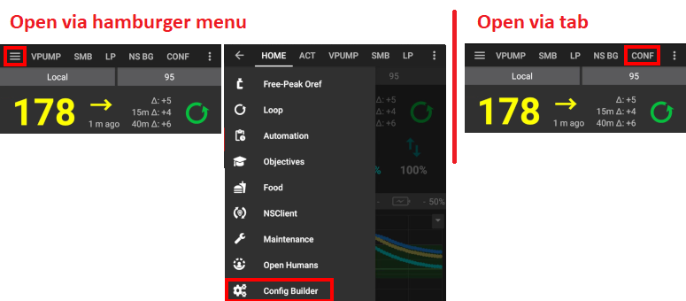

# 修改AAPS配置

在完成**[设置向导](../SettingUpAaps/SetupWizard.md)**后，如果您只想更改**AAPS**配置的某些部分，则无需再次运行整个向导。

有三种途径可以更改AAPS的配置。 选择哪种途径主要取决于您的便利性或个人偏好，因为每种途径都可以到达相同的配置设置。

这些途径如下：

1. 配置文件构建器
1. 点击右侧的三个点菜单，选择“Preferences（偏好设置）”
1. 点击右侧的三个点菜单，选择“Plugin preferences（插件偏好设置）”

在这里，我们解释一下在每种情况下哪种选择最为方便：

## 配置构建器

如果您想**启用插件**及其在顶层菜单中的**可见性**，请使用**配置构建器**。 一旦启用，这些**插件**将始终运行，并且您可以决定是否在顶层菜单中看到它们。 禁用的插件无法使其可见。

您可以使用每个已激活插件旁边的齿轮图标来访问其设置。

有关配置构建器的文档，请点击[此处](../SettingUpAaps/ConfigBuilder.md)查阅。

## Preferences

**偏好设置**对话框可以通过**AAPS**中任何选项卡的右上角<0>三个点</0>菜单进入。 这允许您**在一个位置更改所有已启用插件的配置**。

如果您不确定在哪里查找配置选项，这是一个不错的选择，但如果您知道只想更改某个特定插件的配置，它可能会有点繁琐。

有关偏好设置的文档，请[点击此处](/SettingUpAaps/Preferences.md)查阅。

## 插件选项

**插件偏好设置**对话框可以通过AAPS主页屏幕的右上角**三个点**菜单进入。 它允许您更改**当前屏幕上插件的配置**。

例如，如果您知道想要更改BYODA的配置， 那么您需要在**AAPS**顶部菜单上选择“BYODA”选项卡，然后在BYODA页面上，点击右上角的_三个点_菜单，然后选择“插件偏好设置”条目。 您会被直接带到专门用于BYODA插件的偏好设置对话框。

这是进入通用偏好设置对话框的“快捷方式”，有关偏好设置的文档，请[点击此处](../SettingUpAaps/Preferences.md)查阅。
