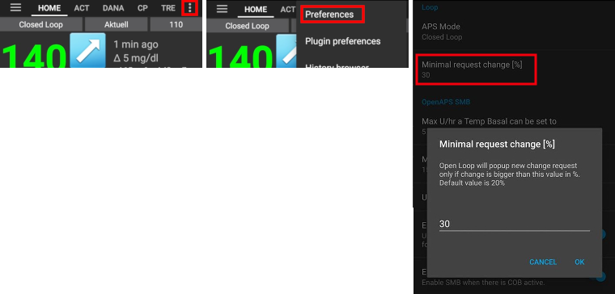
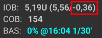

# Completing the Objectives

**AAPS**有一系列必须完成的**目标**，以帮助用户从基础开环控制进步到混合闭环控制，并最终实现**AAPS**的全部功能。 完成**目标**旨在确保您具备：

* 在您的**AAPS**设置中正确配置了所有内容；
* 了解了**AAPS**的基本功能；以及
* 对你的系统能力有一个基本了解，将有助于增强你使用 **AAPS** 的信心。

当 **AAPS** 首次安装时，你必须完成每个目标后才能继续下一个。 随着每个**目标**的完成，新的功能将逐渐解锁。

**目标1至8** 将引导你从在智能手机上配置 **AAPS** 开始，直至实现“基础”混合闭环操作。 This will take about 6 weeks to complete. 你可以使用一个虚拟泵（同时采用其他胰岛素输送方式）来完成至 **目标5**。 **目标9至11** 旨在测试更高级的 **AAPS** 功能，以更好地控制你的糖尿病，这将需要长达3个月的时间来完成，甚至可能更长。 关于预计时间分配的更多详细信息，可在此处获取：[需要多长时间？ ](#preparing-how-long-will-it-take)

在逐步完成目标的同时，如果你需要，也可以移除你的进度并[回到早期的目标](#go-back-in-objectives)。

## Backup your settings

```{admonition} Note
:class: note

Exporting your **AAPS** settings is recommended after completing each **Objective**!
```

强烈建议在完成每个目标后[导出你的设置](../Maintenance/ExportImportSettings.md)，以避免在 **AAPS** 中丢失任何进度。 此导出过程会创建一个**设置文件**（.json），应将其备份在一个或多个安全的位置（例如Google Drive、硬盘、电子邮件附件_等_）。 这可以确保你在 **AAPS** 中的任何进度都被保存。 如果你的手机丢失或你不小心删除了进度，可以使用json文件重新加载到 **AAPS** 中，通过导入最近的设置文件来恢复。 如果需要新的 **AAPS** 智能手机（由于升级、丢失、手机损坏_等_原因），也需要有备份的**设置文件**。

**设置**文件不仅会保存您在**目标**中的进度，还会保存您的所有**AAPS**设置，例如**最大餐前大剂量**等。

如果您没有备份您的设置，并且您的**AAPS**智能手机发生任何问题，那么您将需要从头开始重新完成**目标**。 完成**目标**需要花费时间，因此，如果因为丢失智能手机等原因而不得不重新完成这些目标，那最好是避免这种情况的发生。

(objectives-objective1)=
## Objective 1: Setting up visualization and monitoring, analyzing basals and ratios

**目标1**要求用户在**AAPS**中设置其基本的技术配置。 No progress can be made until this step has been completed.

- 在[配置构建器](#Config-Builder-bg-source)中选择正确的CGM/FGM。 有关更多信息，请参阅[血糖数据源](../Getting-Started/CompatiblesCgms.md)。
- 在[配置构建器](../SettingUpAaps/ConfigBuilder.md)中选择正确的泵，以确保你的泵可以与 **AAPS** 通信。 如果你使用的泵型号没有适配 **AAPS** 的驱动程序，或者你想在完成早期**目标**时使用其他胰岛素输送系统，请选择**虚拟泵**。 有关更多信息，请参阅[胰岛素泵](../Getting-Started/CompatiblePumps.md)。
- If using Nightscout:
  - 按照[Nightscout](../SettingUpAaps/Nightscout.md)页面上的说明进行操作，以确保**Nightscout**能够接收并显示**AAPS**的数据。
  - 请注意，**NSClient** 中的URL必须以**“/api/v1/”**结尾 - 参见[首选项 > NSClient](#Preferences-nsclient)。
- If using Tidepool:
  - 按照[Tidepool](../SettingUpAaps/Tidepool.md)页面上的说明进行操作，以确保**Tidepool**能够接收并显示**AAPS**的数据。

*注意*：你可能需要等待下一个传感器葡萄糖读数到达后，**AAPS** 才能识别它。

## 目标2：学习如何控制AAPS

**目标2** 需要完成几个“任务”，如下方截图所示。 点击橙色文本“尚未完成”以访问待办事项。 Links will be provided to guide you, in case you are not familiar with a specific action yet.


完成**目标2**的任务包括：
- 将你的**配置文件**设置为90%，持续时间为10分钟。
  - _提示_：在“概览”屏幕上长按你的配置文件名称。 更多信息请参阅[配置文件切换&配置文件百分比](../DailyLifeWithAaps/ProfileSwitch-ProfilePercentage.md)。
  - _注意_：**AAPS** 不接受低于0.05U/hr的基础率。 如果你的**配置文件**包含0.06U/hr或更低的基础率，你需要在完成此任务之前创建一个临时**配置文件**，其中包含更高的基础率。 在完成任务后切换回你的正常**配置文件**。
- 通过在 **AAPS** 中[断开你的泵](#AapsScreens-section-c-bg-loop-status)来模拟“洗澡”，持续时间为1小时。
  - _提示_：在“概览”屏幕上长按闭环图标以打开闭环对话框。
- End "taking a shower" by reconnecting your pump.
  - _提示_：长按“已断开连接”图标以打开闭环对话框。
- 设置一个自定义的[**临时目标**](../DailyLifeWithAaps/TempTargets.md)，持续时间为10分钟。
  - _提示_：在“概览”屏幕上长按目标栏以打开临时目标对话框。
- 在[**配置构建器**](../SettingUpAaps/ConfigBuilder.md)中激活**操作**插件，使其出现在顶部可滚动菜单栏中。
  - _提示_：进入**配置构建器**并向下滚动到“常规”。
- 展示**闭环**插件的内容。
- [缩放BG图表](#aaps-screens-main-graph)以便能够查看更大或更小的时间框架：在6小时、12小时、18小时、24小时的历史数据之间切换。
  - _提示_：长按图表或使用右上角的箭头。

(objectives-objective3)=
## 目标3：证明您的知识

**目标3**要求用户通过一项多项选择题考试，该考试旨在测试您对**AAPS**的了解程度。

有些用户发现 **目标3** 是最难完成的目标。 请结合 **AAPS** 文档仔细阅读问题。 如果您在研究了 **AAPS** 文档后仍然感到困惑，请在 [Facebook](https://www.facebook.com/groups/AndroidAPSUsers) 或 [Discord](https://discord.gg/4fQUWHZ4Mw) 群组中搜索“目标3”（因为很可能您的问题已经被问过并得到解答了）。 这些群组可以提供友好的提示，或将您重定向到 **AAPS** 文档的相关部分。

In the meantime :
- 为了减少在开环模式下需要您做出决定（临时基础率）的次数，请在您的 **Profile** 中设置一个较宽的目标范围，例如 90 - 150 mg/dl 或 5.0 - 8.5 mmol/l。
- You might want to set a wider upper limit, or even disable Open Loop, at night.

要开始 **目标3**，请点击橙色文本“**尚未完成**”以访问相关问题。 Please read each question carefully and select your answer(s).

For each question, there may be more than one answer that is correct! If an incorrect answer is selected, the question will be time-locked for 1 hour before you can go back and answer the question again. Be aware that the order of the answers may have changed when you next try to answer, this is to make sure you read them carefully and really understand the validity (or not) of each response.

```{admonition}  __What happens if new question(s) are added to an Objective when I update to a newer version of AAPS?__
:class: 注意
不时地，**AAPS** 会添加新功能，这可能需要向 **目标** 中添加新问题，特别是 **目标3**。 因此，任何添加到 **目标3** 的新问题都将被标记为“未完成”，因为 **AAPS** 要求您对此进行操作。 不用担心，因为每个 **目标** 都是独立的，只要其他 **目标** 已完成，您**不会失去现有的 **AAPS** 功能**。
```

## 目标4：开始开环操作

**目标4** 的目的是让您了解 **AAPS** 将如何根据用户的血糖水平评估基础率，并推荐临时基础率调整。 作为此 **目标** 的一部分，您将首次激活开环操作，并接受20个提出的临时基础率更改建议，如果需要，请手动在您的泵上应用这些更改。 您还将观察[**临时目标**](../DailyLifeWithAaps/TempTargets.md)的影响。 如果您还不熟悉如何在 **AAPS** 中设置临时基础率更改，请参考[**操作**选项卡](#screens-action-tab)。

完成此目标的最短时间：**7天**。 This is a mandatory wait time. 即使已经执行了所有基础率更改，也不可能在此之前进入下一个 **目标**。

- 从 [Preferences > OpenAPS](#Preferences-aps-mode) 菜单或通过长按 **Overview** 屏幕左上角的闭环图标来选择开环。
- Manually enact at least 20 of the temporary basal rate suggestions over a period of 7 days; key them into your (physical) pump and confirm in AAPS that you have accepted them. 确保这些基础率调整在**AAPS**和**Nightscout**中都能显示出来。
- 必要时使用[**临时目标**](../DailyLifeWithAaps/TempTargets.md)。 After treating a hypo, use the predefined "hypo temp target" to prevent the system from overcorrecting upon the bounce back.

为了减少在开环模式下提出的基础率更改建议的数量，您仍然可以使用 **目标3** 中描述的技巧。 Additionally, you can change the minimum percentage for recommended basal rate changes. The higher the value, the fewer change notifications you will receive.



```{admonition} Note
:class: Note

You don't need to action each and every system recommendation!
```
(objectives-objective5)=
## Objective 5: Understanding your open loop, including its temp basal recommendations

作为 **目标5** 的一部分，您将开始了解临时基础率建议是如何得出的。 这包括[确定基础率的逻辑](https://openaps.readthedocs.io/en/latest/docs/While%20You%20Wait%20For%20Gear/Understand-determine-basal.html)，通过观察 [**AAPS Overview** 中的预测线](#aaps-screens-prediction-lines)（或 Nightscout）以及查看 **OpenAPS** 选项卡上显示的详细计算来分析其影响。

预计完成此目标的时间：**7天**。

此 **目标** 要求您确定并设置您的“每小时可设置的临时基础量最大值”（max-basal）值，如 [OpenAPS 功能](#Open-APS-features-max-u-h-a-temp-basal-can-be-set-to) 中所述。 此值可以在 **Preferences > OpenAPS** 中设置。 如果您仍在使用虚拟泵，请确保在 **AAPS** 和您的胰岛素泵中都设置了此安全设置。

在您对**AAPS**的计算和设置感到满意之前，您可能会希望将[**配置文件**中的血糖目标值](#profile-glucose-targets)设定得比平时高一些。 您可能会想尝试在您的**个人设置**中将**血糖目标值**调整到一个更严格的范围（比如说，1mmol/l[20mg/dl]或更小的范围），并观察由此产生的行为变化。


```{admonition} If you have been using a virtual pump, change to a real insulin pump now!
:class: 注意
如果您正在使用虚拟泵进行开环操作，请**在此处停止**。 只有在切换到使用实际胰岛素泵（用于输送胰岛素）后，才能在完成此 **目标** 时点击验证。

```


(objectives-objective6)=
## Objective 6: Starting to close the loop with Low Glucose Suspend


```{admonition}  Closed loop will not correct high **BG** values in **Objective 6** as it is limited to **Low Glucose Suspend** only!
:class: Note
You will still need to correct high BG values by yourself (manually with corrections by pump or pen)!
```

作为**目标6**的一部分，您将关闭闭环系统并激活其**低血糖暂停**（LGS）模式，同时将[最大活性胰岛素](#Open-APS-features-maximum-total-iob-openaps-cant-go-over)（max IOB）设置为零。 您必须保持在低血糖暂停（LGS）模式下5天，以完成这个**目标**。 您应该利用这段时间来检查您的**个人设置**是否准确，以及低血糖暂停（LGS）事件是否没有被过于频繁地触发。

完成此目标的最短时间：**5天**。 This is a mandatory wait time. 在此之前，您无法进入下一个 **目标**。

在您将闭环系统置于**低血糖暂停（LGS）**模式之前，至关重要的是您当前的**个人设置**（基础率、胰岛素敏感系数ISF、碳水系数IC）已经过充分测试。 错误的**个人设置**可能会导致您出现低血糖情况，而这些情况需要手动处理。 一个准确的**个人设置**将有助于减少在5天期间对低血糖治疗的需求。

**如果您仍然观察到频繁或严重的低血糖发作，请考虑调整您的 DIA、基础率、ISF 和碳水系数。 ** 请参阅 [Facebook](https://www.facebook.com/groups/AndroidAPSUsers) 或 [Discord](https://discord.gg/4fQUWHZ4Mw) 群组，其中有很多关于此问题的讨论。


在**目标6**期间，**AAPS**会将最大活性胰岛素（maxIOB）设置覆盖为零。 **当进入目标7时，此覆盖设置将结束。**

这意味着，在 **目标6** 期间，如果传感器血糖水平下降，**AAPS** 将为您减少基础胰岛素输送。 但是，如果传感器血糖水平上升，**AAPS** 仅在由于之前的 LGS 导致**基础 IOB**为负时，才会将基础率提高到您的 **Profile** 值以上。 否则，即使血糖水平上升，**AAPS** 也不会将基础率提高到当前配置文件值以上。 这个提醒是为了避免在您学习使用**AAPS**的过程中出现低血糖。

**因此，您必须通过手动注射胰岛素来进行高血糖的校正。**

- 如果您的基础 IOB 为负（请参见下方截图），在 **目标6** 中可以触发大于 100% 的临时基础率（TBR）。



- Set your target range slightly higher than you usually would aim at, just to be safe and to add a safety buffer.
- Enable 'Low Glucose Suspend' mode by pressing and holding the Loop icon in the top right corner of the OVERVIEW screen and selecting the Loop - LGS mode icon.
- Watch active temporary basals by looking at the turquoise basal text on the OVERVIEW screen or the turquoise basal render as part of the OVERVIEW graph.
- You may temporarily experience spikes following treated hypos without being able to increase basals on the rebound.

## Objective 7: Tuning the closed loop, raising maxIOB above 0 and gradually lowering BG targets

要完成 **目标7**，您必须完成闭环并将 [max IOB](#Open-APS-features-maximum-total-iob-openaps-cant-go-over) 提高到 0 以上。 在**目标6**中，**maxIOB** 被自动设置为零。 This is now reverted. **AAPS** 将开始使用您定义的 maxIOB 值来纠正高血糖值。

完成此目标的最短时间：**1天**。 This is a mandatory wait time. 在此时间段结束之前，无法继续进行下一个**目标**。

- 从 [Preferences > OpenAPS](../SettingUpAaps/Preferences.md) 或通过长按 **Overview** 屏幕右上角的 Loop 图标来选择**闭环**。 在闭环模式下保持1天。

- Slowly raise your 'Maximum total IOB OpenAPS can’t go over' (in OpenAPS called 'max-iob') above 0, until you find the settings that work best for you.

此设置的默认建议是“**平均餐时大剂量 + 3 倍最大每日基础率**”，其中“最大每日基础率”是每天任何时间段内的最大每小时值。


This recommendation should be seen as a starting point. If you use this rule but are experiencing AAPS delivering too much insulin as glucose levels rise, you may need to :
* lower the "Maximum total IOB OpenAPS can’t go over" value;
* 逐一检查您的**配置文件**，并每次只进行一项调整。

另外，如果您非常胰岛素抵抗，请非常谨慎地提高 **maxIOB** 值。

一旦您对 **maxIOB** 适合您的闭环模式的程度有信心，就将您的 **血糖目标**降低到所需水平。

(objectives-objective8)=
## Objective 8: Adjust basals and ratios if needed, and then enable Autosens

作为此**目标**的一部分，您将重新评估您的**个人设置**的性能，并将使用[Autosens](#Open-APS-features-autosens)功能作为错误设置的指示器。

完成此目标的最短时间**：7天**。 This is a mandatory wait time. 在此时间段结束之前，无法继续进行下一个**目标**。

在7天内启用 [Autosens](../DailyLifeWithAaps/KeyAapsFeatures.md)，并观察 [**Overview** 的图形白线](#AapsScreens-section-g-additional-graphs)，它显示了由于运动或激素等原因您的胰岛素敏感性如何上升或下降。 请留意 OpenAPS 报告选项卡，它显示了 **AAPS** 如何相应地调整敏感性、基础率和目标。

这是审查您的 [敏感性检测](../SettingUpAaps/ConfigBuilder.md#sensitivity-detection) 设置的好时机。 您可以在主屏幕上的[附加图形](../DailyLifeWithAaps/AapsScreens.md#section-g---additional-graphs)中查看您的敏感性数值。

此外，您可以使用 [Autotune](https://openaps.readthedocs.io/en/latest/docs/Customize-Iterate/autotune.html) 作为一次性检查来验证您的基础率是否仍然准确，或者进行传统的基础率测试。

(objectives-objective9)=
## Objective 9: Enabling additional oref1 features for daytime use, such as super micro bolus (SMB)

在 **目标9** 中，您将解决并使用**“超级微型大剂量（SMB）”**作为核心功能之一。 After working through the mandatory readings you will have a good understanding of what SMBs are, how these work, and why basal is set to zero temporarily after SMBs are given (zero-temping).

完成此目标的最短时间**：28天**。 This is a mandatory wait time. You can’t proceed to the next Objective before this time is up.

- 本文档中的[SMB部分](#Open-APS-features-super-micro-bolus-smb)和[openAPS文档中的oref1介绍](https://openaps.readthedocs.io/en/latest/docs/Customize-Iterate/oref1.html)是理解**SMB**和**零临时基础率**概念的必读内容。
- 完成后，您可以提高 [max IOB](#Open-APS-features-maximum-total-iob-openaps-cant-go-over) 以使 **SMB** 更有效地工作。 现在，maxIOB 包括了所有 **IOB**，而不仅仅是累积的基础量。 此阈值将在 IOB 降至此值以下时暂停 **SMB**（_例如_，如果 **maxIOB** 设置为 7U，并且给予 8U 的推注来覆盖一餐：除非 **IOB** 降至 7U 以下，否则将暂停SMB）。 一个良好的起点是将**maxIOB（最大胰岛素在板量）**设置为**平均餐时大剂量 + 3倍最大日基础率**，其中“最大日基础率”是指一天中任何时间段内的最大每小时值。 请参阅 [目标7](#objective-7-tuning-the-closed-loop-raising-maxiob-above-0-and-gradually-lowering-bg-targets) 作为参考。
- 评估您的碳水化合物吸收速率，如果您发现其过快或过慢，请考虑更改[设置 > 吸收设置 > min_5m_carbimpact（5分钟内碳水化合物影响最小值）](#Preferences-min_5m_carbimpact)参数。

(objectives-objective10)=
## 目标10：自动化

当**目标10**启动时，**自动化功能**将变得可用。

完成此目标的最短时间**：28天**。 This is a mandatory wait time. You can’t proceed to the next Objective before this time is up.

首先阅读文档页面 [Automation](../DailyLifeWithAaps/Automations.md)。

Set-up the most basic automation rule; for example trigger an Android notification in a few minutes:
- Select the notification tab
- From the top right 3 dots menu, select add rule
- Give a task name "My first automation notification"
- "edit"  "condition"
  - click the "+" symbol to add the first trigger
  - 选择“时间”并点击“确定”，这将创建一个默认条目 AT TODAY HOUR:MINUTE
  - click the MINUTE portion to edit the time such that it triggers in a few minutes. Then click ok to close
  - click "ok"  to close the Triggers screen
- "ADD" an "Action"
  - select "Notification", "OK"
  - click "Notification" to edit the message, enter something like "My first automation"
- Wait until the time triggers the notification (note that depending on your phone, it can be a few minutes late)

然后，您可以尝试设置更有用的**自动化**。 文档页面给出了几个示例，您还可以在 [Facebook](https://www.facebook.com/groups/AndroidAPSUsers) 群组中搜索“自动化”截图。 [Discord](https://discord.gg/4fQUWHZ4Mw) 社区中也有一个专用频道。

例如，如果您每天早上在上学/上班前都吃同样的早餐，您可以创建一个**自动化**，如“早餐前目标”，以在早餐前30分钟设置一个稍低的**临时目标**。 In such case, your condition is likely to include "recurring time" which consists of selecting specific days of the week (Monday, Tuesday, Wednesday, Thursday, Friday) and a specific time (06:30 am). The action will consist of "Start temp target" with a lower than usual target value and a 30 minutes duration.

(objectives-objective11)=
## Objective 11: Enabling additional features for daytime use, such as Dynamic Sensitivity plugin (DynISF).

完成此 **目标** 的最短时间**：28天**。 This is a mandatory wait time. 在此时间段结束之前，无法继续进行下一个**目标**。

- 确保**SMB**运行正常。
- 阅读[此处](../DailyLifeWithAaps/DynamicISF.md) 关于 **动态 ISF** 的文档
- Search the [Facebook](https://www.facebook.com/groups/AndroidAPSUsers) and [Discord](https://discord.gg/4fQUWHZ4Mw) groups for discussions around **Dynamic ISF** and read about other users' experiences and recommendations.
- Enable the **DynamicISF plugin** and identify the appropriate calibration for your body's uniqueness. It is advisable to begin with a value lower than 100% for safety reasons.

(CompletingTheObjectives-go-back-in-objectives)=
## Go back in objectives

If you wish to go back in the **Objectives** for whatever reason you can do so by clicking at "clear finished".

