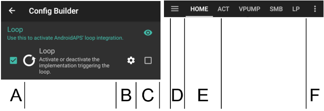
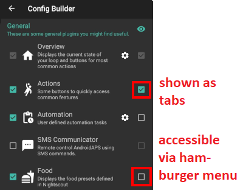
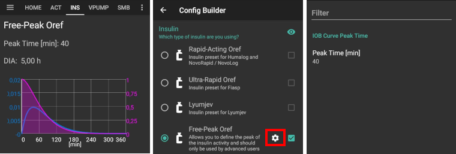

# 配置生成器

根据您的设置，您可以通过**AAPS**屏幕顶部的选项卡或汉堡菜单来打开配置生成器。


**Config Builder** 是您打开和关闭模块化功能的选项卡。 在下面的图片中，左侧（A）的复选框允许您选择想要激活的模块，右侧（C）的复选框允许您将这些模块作为选项卡（E）在**AAPS**中查看。 如果右侧复选框未激活，您可以通过屏幕左上角的汉堡菜单（D）访问该功能。 查看下方的[标签或汉堡菜单](#tab-or-hamburger-menu)。

当模块内有其他可用设置时，您可以点击齿轮图标（B），这将带您进入首选项中的具体设置。



(Config-Builder-tab-or-hamburger-menu)=

## 选项卡或汉堡菜单

通过眼睛符号下的复选框，您可以决定如何打开相应的程序部分。



```{contents}
:backlinks: entry
:depth: 2
```

(ConfigBuilder_Profile)=

## 配置文件

此模块无法禁用，因为它是**AAPS**的核心部分。

查看[您的AAPS配置文件](../SettingUpAaps/YourAapsProfile.md)，以基本了解您的**配置文件**中包含哪些内容。

(Config-Builder-insulin)=

## 胰岛素


选择您正在使用的胰岛素类型。

有关**AAPS**中显示的[胰岛素资料](#AapsScreens-insulin-profile)的更多信息，请<1>点击此处</1>了解。

### 胰岛素类型差异

* “速效Oref”、“超速效Oref”、“Lyumjev”和“Free-Peak Oref”这几个选项都具有指数形状。
* 对于“速效Rapid-Acting”、“超速效Ultra-Rapid”和“Lyumjev”，DIA（胰岛素作用持续时间）是您唯一可以自行调整的变量，达峰时间则是固定的。 
* Free-Peak 允许您同时调整DIA和达峰时间，但仅建议高级用户使用，他们应了解这些设置的影响。 
* [胰岛素曲线图](#AapsScreens-insulin-profile)可帮助您理解不同的曲线。

#### 速效 Oref


* 推荐用于优泌乐（Humalog）、诺和锐（Novolog）和诺和灵（Novorapid）。
* DIA = 至少5.0小时
* 最大 最大达峰时间 = 注射后75分钟（固定，不可调整）

#### 超速效 Oref


* 推荐用于FIASP
* DIA = 至少5.0小时
* 最大 达峰时间 = 注射后55分钟（固定，不可调整）

(Config-Builder-lyumjev)=

#### Lyumjev(超速效赖脯胰岛素)


* Lyumjev的专用胰岛素配置文件
* DIA = 至少5.0小时
* 最大 达峰时间 = 注射后45分钟（固定，不可调整）

#### Free Peak Oref



* 使用“Free Peak Oref”配置文件，您可以单独输入达峰时间。 要执行此操作，请点击齿轮图标以进入高级设置。
* 如果在配置文件中未指定更高的DIA，则DIA将自动设置为5小时。
* 如果使用未经支持的胰岛素或不同胰岛素的混合物，建议使用此配置文件。

(Config-Builder-bg-source)=

## 血糖数据源

选择您正在使用的血糖数据来源。 有关更多设置信息，请参见[血糖数据来源](../Getting-Started/CompatiblesCgms.md)页面。


* [xDrip+](../CompatibleCgms/xDrip.md)
* [NSClient BG](../CompatibleCgms/CgmNightscoutUpload.md) - 仅当您清楚自己在做什么时才选择此项，请参阅[血糖数据来源](../Getting-Started/CompatiblesCgms.md)。
* [美敦力640g](../CompatibleCgms/MM640g.md)
* [Glimp](#libre1-using-glimp) - 仅支持4.15.57及更高版本
* [自建Dexcom应用程序 Build Your Own Dexcom App (BYODA)](#DexcomG6-if-using-g6-with-build-your-own-dexcom-app).
* [Poctech](../CompatibleCgms/PocTech.md)
* 用于MiaoMiao设备的[Tomato App](#libre1-using-tomato)
* 用于Glunovo CGM系统的[Glunovo App](https://infinovo.com/)
* 随机 Random BG：生成随机BG数据（仅演示模式）

## Smoothing


请参阅[平滑血糖数据](../CompatibleCgms/SmoothingBloodGlucoseData.md)。

(Config-Builder-pump)=

## Pump

选择您正在使用的泵。 有关更多设置信息，请参阅[兼容泵](../Getting-Started/CompatiblePumps.md)页面。


* [Dana R](../CompatiblePumps/DanaR-Insulin-Pump.md)
* Dana R Korean（用于韩国产DanaR胰岛素泵）
* Dana Rv2（带有非官方固件升级的DanaR泵）
* [丹纳-i/RS](../CompatiblePumps/DanaRS-Insulin-Pump.md)
* [Accu Chek Insight](../CompatiblePumps/Accu-Chek-Insight-Pump.md)
* Accu Chek Combo 
  * [使用Ruffy的驱动程序](../CompatiblePumps/Accu-Chek-Combo-Pump.md)（需要安装ruffy）
  * [无需额外要求的驱动程序](../CompatiblePumps/Accu-Chek-Combo-Pump-v2.md)，在[AAPS v.3.2](#version3200)中添加
* Omnipod for [Omnipod Eros](../CompatiblePumps/OmnipodEros.md)
* Dash for [Omnipod DASH](../CompatiblePumps/OmnipodDASH.md)
* [美敦力](../CompatiblePumps/MedtronicPump.md)
* [Diaconn G8](../CompatiblePumps/DiaconnG8.md)
* [EOPatch2](../CompatiblePumps/EOPatch2.md)
* [移宇](../CompatiblePumps/MedtrumNano.md)
* 虚拟泵：开环 - **仅AAPS建议** 
  * 当您初次使用**AAPS**时，在完成最初的[目标](../SettingUpAaps/CompletingTheObjectives.md)期间
  * 对于尚未有驱动程序的泵

## 灵敏度检测

选择灵敏度检测的类型。 有关不同设计的更多详细信息，请参阅[此处](../DailyLifeWithAaps/SensitivityDetectionAndCob.md)。 这将实时分析历史数据，并且如果它识别到您对胰岛素的反应比平时更敏感（或者相反，更抵抗），就会进行相应的调整。 有关灵敏度算法的更多详细信息，请参阅[OpenAPS文档](https://openaps.readthedocs.io/en/latest/docs/Customize-Iterate/autosens.html)。

您可以在主屏幕上通过[附加图表](#AapsScreens-section-g-additional-graphs)查看您的敏感度。 您可以在主屏幕上通过选择SEN并查看白线来查看灵敏度。 请注意，您需要在[目标8](#objectives-objective8)中才能允许灵敏度检测/[Autosens](#Open-APS-features-autosens)自动调整胰岛素的输送量。 在达到该目标之前，Autosens百分比/图表中的线条仅供信息参考。

### 碳水吸收率设置

如果您将Oref1与**SMB**一起使用，必须将**min_5m_carbimpact**更改为8。 该值仅在**动态CGM**读数出现间隔或身体活动“消耗掉”所有血糖（否则会导致**AAPS**衰减COB）时使用。 当无法根据您血液的反应动态计算出[碳水化合物吸收率](../DailyLifeWithAaps/CobCalculation.md)时，它会为您的碳水化合物插入一个默认的衰减率。 基本上，它是一个故障保护机制。

(Config-Builder-aps)=

## APS算法

选择所需的APS算法以进行治疗调整。 您可以在OpenAPS（OAPS）选项卡中查看所选算法的活动详细信息。

* OpenAPS AMA（高级膳食助手） 
  * 高级膳食助手：旧算法，不再推荐。
  * 简单来说，好处就是当你给自己注射餐时大剂量胰岛素后，如果你可靠地输入了碳水化合物数据，系统就能更快地增加临时基础率。
* [OpenAPS SMB（超级微小大剂量）](#Open-APS-features-super-micro-bolus-smb) 
  * 超级微小大剂量：推荐给所有用户的最新算法。
  * 与AMA不同，SMB不使用临时基础率来控制血糖水平，而主要使用小的**超级微小大剂量（Super Micro Boluses）**。
  * 注意：建议从一开始就使用这个算法，尽管在达到[目标9](#objectives-objective9)之前，SMBs不会实际给予胰岛素输注。

如果从AMA切换到SMB算法，必须在[首选项 > 灵敏度检测 > 灵敏度Oref1设置](../SettingUpAaps/Preferences.md)中手动将*min_5m_carbimpact*更改为**8**（SMB的默认值）。

## 闭环（Loop）

这个模块不应被禁用，因为它是**AAPS**的核心组成部分。

## 约束条件

### 目标

**AAPS** 有一个学习程序（一系列目标），您必须逐步完成。 这将引导您安全地设置闭环系统。 它确保您已正确设置所有内容并了解系统的确切作用。 只有这样，您才能信任该系统。

有关更多信息，请参阅[目标](../SettingUpAaps/CompletingTheObjectives.md)页面。

## 同步

在这个部分，您可以选择是否/以及您希望**AAPS**将您的数据发送到哪里。

### NSClient 或 NSClientV3

可用作[报告服务器](../SettingUpAaps/SettingUpTheReportingServer.md)和/或用于[远程监控](../RemoteFeatures/RemoteMonitoring.md)、[远程控制](../RemoteFeatures/RemoteControl.md)。

请参阅[与报告服务器的同步](#SetupWizard-synchronization-with-the-reporting-server-and-more)，以帮助您选择NSClient（v1）和NSClientV3。

### Tidepool

可用作[报告服务器](../SettingUpAaps/SettingUpTheReportingServer.md)。

请参阅[Tidepool](../SettingUpAaps/Tidepool.md)。

### xDrip

用于将治疗动作等数据**发送**到xDrip+。

### 开源人类项目（Open Humans）

请参阅[Open Humans](../SupportingAaps/OpenHumans.md)。

### 手表

使用您的Android WearOS手表监控和控制**AAPS**（请参阅[手表界面页面](../WearOS/WearOsSmartwatch.md)）。

### Samsung Tizen

将数据广播到三星 G-Watch Wear App（Tizen OS）。

### Garmin（佳明）

连接到Garmin设备（Fenix、Edge...）

## 治疗动作（Treatments）

如果您查看“治疗（Treat）”选项卡，您可以看到已上传到nightscout的治疗动作数据。 如果您希望编辑或删除条目（例如，您摄入的碳水比预期少），请选择“删除”并通过[主页屏幕上的碳水按钮](#screens-bolus-carbs)输入新值（必要时更改时间）。

## 一般

### 概览

这是**AAPS**的[主屏幕](#AapsScreens-the-homescreen)，无法禁用。

#### 在治疗对话框中显示备注字段

选择是否在输入治疗方案时包含备注字段。

#### 状态指示灯

选择是否要在概览中显示[状态指示灯](#Preferences-status-lights)，以指示管路使用时长、胰岛素使用时长、传感器使用时长、电池使用时长、储药器剩余量或电池电量。 当达到警告级别时，状态指示灯的颜色将变为黄色。 达到临界使用时长时，将以红色显示。

#### 高级设置

**餐时大剂量计算结果的实际输注比例（Deliver this part of bolus wizard result）**：在使用SMB时，许多人不会完全按照所需的胰岛素量进行餐时大剂量注射，而是只注射一部分（例如75%），然后让带有UAM（无人值守用餐检测）功能的SMB来完成剩余的工作。 在此设置中，您可以选择大剂量向导应计算出的百分比的默认值。 如果此设置为75%，并且您需要注射10单位的大剂量，那么大剂量向导将仅建议注射7.5单位的大剂量。

**在计算器中启用超级大剂量（super bolus）功能**（与*超级微量大剂量（super micro bolus）*不同！）：请谨慎使用，在了解其具体功能前请勿启用。 基本上，接下来两小时的基础率会被添加到大剂量中，并激活两小时的零临时基础率。 **AAPS循环功能将被禁用 - 因此请谨慎使用！ 如果您使用SMB，则根据您在[“SMB基础率分钟数上限”](#Open-APS-features-max-minutes-of-basal-to-limit-smb-to)中的设置，AAPS的闭环功能将被禁用；如果您不使用SMB，闭环功能将被禁用两个小时。**有关超级大剂量（super bolus）的详细信息，请[点击此处](https://www.diabetesnet.com/diabetes-technology/blue-skying/super-bolus)查看。

(Config-Builder-actions)=

### 手动操作

一个提供多个按钮以在**AAPS**中执行[操作（actions）](#screens-action-tab)的选项卡。

### 自动操作

一个用于管理您的[自动化（Automations）](../DailyLifeWithAaps/Automations.md)的选项卡，从[目标10](#objectives-objective10)开始。

(Config-Builder-sms-communicator)=

### SMS短信通讯器

允许远程护理人员通过SMS控制某些**AAPS**功能，请参阅[SMS命令](../RemoteFeatures/SMSCommands.md)以获取更多设置信息。

### 食物

显示Nightscout食品数据库中预定义的食物，请参阅[Nightscout Readme](https://github.com/nightscout/cgm-remote-monitor#food-custom-foods)以获取更多设置信息。

注意：条目（Entries）不能在**AAPS**计算器中使用。 （仅供查看）

(Config-Builder-wear)=

### 手表

使用您的Android Wear手表监控和控制AAPS（请参阅[手表界面页面](../WearOS/WearOsSmartwatch.md)）。 使用设置（齿轮图标）来定义在计算通过手表给予的餐时大剂量时应考虑哪些变量（例如，15分钟趋势、 活性碳水...）。

如果您想通过手表进行大剂量等操作， 那么在“手表设置”中，您需要启用“从手表控制”。


通过手表选项卡或汉堡菜单（如果未显示选项卡，则在屏幕左上角），您可以：

* 重新发送所有数据。 如果手表在一段时间内未连接，并且您希望将信息推送到手表，这可能会很有帮助。
* 直接从手机打开手表上的设置。

### 维护

访问此选项卡以导出/导入设置。

### 配置生成器

当前选项卡。