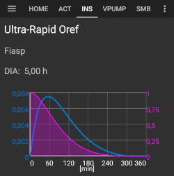

# 配置生成器

根据您的设置，您可以通过**AAPS**屏幕顶部的选项卡或汉堡菜单来打开配置生成器。


**Config Builder** 是您打开和关闭模块化功能的选项卡。 在下面的图片中，左侧（A）的复选框允许您选择想要激活的模块，右侧（C）的复选框允许您将这些模块作为选项卡（E）在**AAPS**中查看。 如果右侧复选框未激活，您可以通过屏幕左上角的汉堡菜单（D）访问该功能。 查看下方的[标签或汉堡菜单](#tab-or-hamburger-menu)。

当模块内有其他可用设置时，您可以点击齿轮图标（B），这将带您进入首选项中的具体设置。


(Config-Builder-tab-or-hamburger-menu)=

## 选项卡或汉堡菜单

通过眼睛符号下的复选框，您可以决定如何打开相应的程序部分。


```{contents}
:backlinks: entry
:depth: 2
```

(ConfigBuilder_Profile)=

## 配置文件

此模块无法禁用，因为它是**AAPS**的核心部分。

查看[您的AAPS配置文件](../SettingUpAaps/YourAapsProfile.md)，以基本了解您的**配置文件**中包含哪些内容。

(Config-Builder-insulin)=

## 胰岛素


选择您正在使用的胰岛素类型。

有关**AAPS**中显示的[胰岛素资料](#AapsScreens-insulin-profile)的更多信息，请<1>点击此处</1>了解。

### 胰岛素类型差异

* “速效Oref”、“超速效Oref”、“Lyumjev”和“Free-Peak Oref”这几个选项都具有指数形状。
* 对于“速效Rapid-Acting”、“超速效Ultra-Rapid”和“Lyumjev”，DIA（胰岛素作用持续时间）是您唯一可以自行调整的变量，达峰时间则是固定的。 
* Free-Peak 允许您同时调整DIA和达峰时间，但仅建议高级用户使用，他们应了解这些设置的影响。 
* [胰岛素曲线图](#AapsScreens-insulin-profile)可帮助您理解不同的曲线。

#### 速效 Oref


* 推荐用于优泌乐（Humalog）、诺和锐（Novolog）和诺和灵（Novorapid）。
* DIA = 至少5.0小时
* Max. 最大达峰时间 = 注射后75分钟（固定，不可调整）

#### 超速效 Oref



* 推荐用于FIASP
* DIA = 至少5.0小时
* Max. 达峰时间 = 注射后55分钟（固定，不可调整）

(Config-Builder-lyumjev)=

#### Lyumjev(超速效赖脯胰岛素)


* Lyumjev的专用胰岛素配置文件
* DIA = 至少5.0小时
* Max. 达峰时间 = 注射后45分钟（固定，不可调整）

#### Free Peak Oref


* 使用“Free Peak Oref”配置文件，您可以单独输入达峰时间。 要执行此操作，请点击齿轮图标以进入高级设置。
* 如果在配置文件中未指定更高的DIA，则DIA将自动设置为5小时。
* 如果使用未经支持的胰岛素或不同胰岛素的混合物，建议使用此配置文件。

(Config-Builder-bg-source)=

## 血糖数据源

选择您正在使用的血糖数据来源。 有关更多设置信息，请参见[血糖数据来源](../Getting-Started/CompatiblesCgms.md)页面。


* [xDrip+](../CompatibleCgms/xDrip.md)
* [NSClient BG](../CompatibleCgms/CgmNightscoutUpload.md) - 仅当您清楚自己在做什么时才选择此项，请参阅[血糖数据来源](../Getting-Started/CompatiblesCgms.md)。
* [美敦力640g](../CompatibleCgms/MM640g.md)
* [Glimp](#libre1-using-glimp) - 仅支持4.15.57及更高版本
* [自建Dexcom应用程序 Build Your Own Dexcom App (BYODA)](#DexcomG6-if-using-g6-with-build-your-own-dexcom-app).
* [Poctech](../CompatibleCgms/PocTech.md)
* 用于MiaoMiao设备的[Tomato App](#libre1-using-tomato)
* 用于Glunovo CGM系统的[Glunovo App](https://infinovo.com/)
* Random BG：生成随机BG数据（仅演示模式）

## Smoothing


请参阅[平滑血糖数据](../CompatibleCgms/SmoothingBloodGlucoseData.md)。

(Config-Builder-pump)=

## Pump

选择您正在使用的泵。 有关更多设置信息，请参阅[兼容泵](../Getting-Started/CompatiblePumps.md)页面。


* [Dana R](../CompatiblePumps/DanaR-Insulin-Pump.md)
* Dana R Korean（用于韩国产DanaR胰岛素泵）
* Dana Rv2（带有非官方固件升级的DanaR泵）
* [丹纳-i/RS](../CompatiblePumps/DanaRS-Insulin-Pump.md)
* [Accu Chek Insight](../CompatiblePumps/Accu-Chek-Insight-Pump.md)
* Accu Chek Combo 
  * [使用Ruffy的驱动程序](../CompatiblePumps/Accu-Chek-Combo-Pump.md)（需要安装ruffy）
  * [无需额外要求的驱动程序](../CompatiblePumps/Accu-Chek-Combo-Pump-v2.md)，在[AAPS v.3.2](#version3200)中添加
* Omnipod for [Omnipod Eros](../CompatiblePumps/OmnipodEros.md)
* Dash for [Omnipod DASH](../CompatiblePumps/OmnipodDASH.md)
* [美敦力](../CompatiblePumps/MedtronicPump.md)
* [Diaconn G8](../CompatiblePumps/DiaconnG8.md)
* [EOPatch2](../CompatiblePumps/EOPatch2.md)
* [Medtrum](../CompatiblePumps/MedtrumNano.md)
* 虚拟泵：开环 - **仅AAPS建议** 
  * 当您初次使用**AAPS**时，在完成最初的[目标](../SettingUpAaps/CompletingTheObjectives.md)期间
  * 对于尚未有驱动程序的泵

## 灵敏度检测

选择灵敏度检测的类型。 有关不同设计的更多详细信息，请参阅[此处](../DailyLifeWithAaps/SensitivityDetectionAndCob.md)。 这将实时分析历史数据，并且如果它识别到您对胰岛素的反应比平时更敏感（或者相反，更抵抗），就会进行相应的调整。 有关灵敏度算法的更多详细信息，请参阅[OpenAPS文档](https://openaps.readthedocs.io/en/latest/docs/Customize-Iterate/autosens.html)。

您可以在主屏幕上通过[附加图表](#AapsScreens-section-g-additional-graphs)查看您的敏感度。 您可以在主屏幕上通过选择SEN并查看白线来查看灵敏度。 请注意，您需要在[目标8](#objectives-objective8)中才能允许灵敏度检测/[Autosens](#Open-APS-features-autosens)自动调整胰岛素的输送量。 在达到该目标之前，Autosens百分比/图表中的线条仅供信息参考。

### 碳水吸收率设置

如果您将Oref1与**SMB**一起使用，必须将**min_5m_carbimpact**更改为8。 该值仅在**动态CGM**读数出现间隔或身体活动“消耗掉”所有血糖（否则会导致**AAPS**衰减COB）时使用。 当无法根据您血液的反应动态计算出[碳水化合物吸收率](../DailyLifeWithAaps/CobCalculation.md)时，它会为您的碳水化合物插入一个默认的衰减率。 基本上，它是一个故障保护机制。

(Config-Builder-aps)=

## APS算法

选择所需的APS算法以进行治疗调整。 You can view the active detail of the chosen algorithm in the OpenAPS(OAPS) tab.

* OpenAPS 自动化管理助手 
  * Advanced Meal Assist: older algorithm not recommended anymore.
  * In simple terms, the benefits are after you give yourself a meal bolus, the system can high-temp more quickly IF you enter carbs reliably.
* [OpenAPS SMB（超级微小大剂量）](#Open-APS-features-super-micro-bolus-smb) 
  * Super Micro Bolus: most recent algorithm recommended for all users.
  * In contrast to AMA, SMB does not use temporary basal rates to control glucose levels, but mainly small **Super Micro Boluses**.
  * Note : It is recommended to use this algorithm from the beginning, even though you will not actually get SMBs delivered until [Objective 9](#objectives-objective9).

If switching from AMA to SMB algorithm, *min_5m_carbimpact* must be changed manually to **8** (default value for SMB) in [Preferences > Sensitivity detection > Sensitivity Oref1 settings](../SettingUpAaps/Preferences.md).

## 闭环

This module should not be disabled as it is a core part of **AAPS**.

## 约束条件

### 目标

**AAPS** has a learning program (a series of objectives) that you have to fulfill step by step. This should guide you safely through setting up a closed loop system. It guarantees that you have set everything up correctly and understand what the system does exactly. This is the only way you can trust the system.

See [Objectives](../SettingUpAaps/CompletingTheObjectives.md) page for more information.

## Synchronization

In this section, you can choose if/where you want **AAPS** to send your data to.

### NSClient or NSClientV3

Can be used as a [reporting server](../SettingUpAaps/SettingUpTheReportingServer.md) and/or for [remote monitoring](../RemoteFeatures/RemoteMonitoring.md), [remote control](../RemoteFeatures/RemoteControl.md).

See [Synchronization with the reporting server](#SetupWizard-synchronization-with-the-reporting-server-and-more) to help you choose between NSClient (v1) and NSClientV3.

### Tidepool

Can be used as a [reporting server](../SettingUpAaps/SettingUpTheReportingServer.md).

See [Tidepool](../SettingUpAaps/Tidepool.md).

### xDrip

Used to **send** data such as treatments to xDrip+.

### Open Humans

See [Open Humans](../SupportingAaps/OpenHumans.md).

### 手表

Monitor and control **AAPS** using your Android WearOS watch (see [page Watchfaces](../WearOS/WearOsSmartwatch.md)).

### Samsung Tizen

Broadcast data to Samsung's G-Watch Wear App (Tizen OS).

### Garmin

Connection to Garmin device (Fenix, Edge...)

## 治疗

If you view the Treatments (Treat) tab, you can see the treatments that have been uploaded to nightscout. Should you wish to edit or delete an entry (e.g. you ate less carbs than you expected) then select 'Remove' and enter the new value (change the time if necessary) through the [carbs button on the home screen](#screens-bolus-carbs).

## 一般

### 首页概览

This is the [main screen](#AapsScreens-the-homescreen) of **AAPS** and can not be disabled.

#### 在治疗对话框中显示备注字段

Choose if you want to have a notes field when entering treatments or not.

#### 状态指示灯

Choose if you want to have [status lights](#Preferences-status-lights) on overview for cannula age, insulin age, sensor age, battery age, reservoir level or battery level. When warning level is reached, the color of the status light will switch to yellow. Critical age will show up in red.

#### Advanced settings

**Deliver this part of bolus wizard result**: When using SMB, many people do not meal-bolus 100% of needed insulin, but only a part of it (e.g. 75 %) and let the SMB with UAM (unattended meal detection) do the rest. In this setting, you can choose a default value for the percentage the bolus wizard should calculate with. If this setting is 75 % and you had to bolus 10u, the bolus wizard will propose a meal bolus of only 7.5 units.

**Enable super bolus functionality in wizard** (It is different from *super micro bolus*!): Use with caution and do not enable until you learn what it really does. Basically, the basal for the next two hours is added to the bolus and a two hour zero-temp activated. **AAPS looping functions will be disabled - so use with care! If you use SMB AAPS looping functions will be disabled according to your settings in ["Max minutes of basal to limit SMB to"](#Open-APS-features-max-minutes-of-basal-to-limit-smb-to), if you do not use SMB looping functions will be disabled for two hours.** Details on super bolus can be found [here](https://www.diabetesnet.com/diabetes-technology/blue-skying/super-bolus).

(Config-Builder-actions)=

### 手动操作

A tab offering multiple buttons to take [actions](#screens-action-tab) in **AAPS**.

### 自动操作

A tab for managing your [Automations](../DailyLifeWithAaps/Automations.md), starting at [Objective 10](#objectives-objective10).

(Config-Builder-sms-communicator)=

### SMS短信通讯器

Allows remote caregivers to control some **AAPS** features via SMS, see [SMS Commands](../RemoteFeatures/SMSCommands.md) for more setup information.

### 食物

Displays the food presets defined in the Nightscout food database, see [Nightscout Readme](https://github.com/nightscout/cgm-remote-monitor#food-custom-foods) for more setup information.

Note: Entries cannot be used in the **AAPS** calculator. (View only)

(Config-Builder-wear)=

### 手表

Monitor and control AAPS using your Android Wear watch (see [page Watchfaces](../WearOS/WearOsSmartwatch.md)). Use settings (cog wheel) to define which variables should be considered when calculating bolus given though your watch (i.e. 15min trend, COB...).

If you want to bolus etc. from the watch then within "Wear settings" you need to enable "Controls from Watch".


Through Wear tab or hamburger menu (top left of screen, if tab is not displayed) you can

* Resend all data. Might be helpful if watch was not connected for some time and you want to push the information to the watch.
* Open settings on your watch directly from your phone.

### 维护

Access this tab to export / import settings.

### 配置生成器

This current tab.