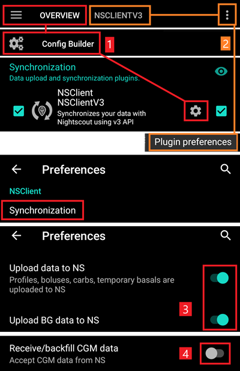

# Nightscout

(Nightscout-security-considerations)=

## 安全考虑

除了报告功能外，Nightscout还可以用于控制AAPS。 例如，您可以设置临时目标或添加未来碳水化合物摄入量。 这些信息将被AAPS接收，并据此做出相应操作。 因此，有必要考虑保护您的Nightscout网站的安全。

如果使用Nightscout作为AAPS的数据源，请务必格外小心。

### Nightscout settings

您可以通过使用[认证角色](https://nightscout.github.io/nightscout/security)来拒绝公众访问您的Nightscout站点：确保您只与具有“可读”权限的令牌共享您的URL，切勿与具有“管理员”权限的令牌共享。

Nightscout的`API_SECRET`是您的站点主密码：请勿公开分享。

(Nightscout-aaps-settings)=

### AAPS设置

您可以设置AAPS以接受Nightscout的命令（如配置文件更改、治疗等），或完全禁用它。

* 通过以下方式访问NSClient或NSClientV3插件设置： 1) 主视图 -> 配置构建器 -> 同步 -> NSClient齿轮图标 2) NSCLIENT选项卡 -> 三个点菜单 -> 插件偏好设置
* 启用所有数据上传到Nightscout（3），因为除非您的BG（血糖）数据源是Nightscout，否则这是标准方法。如果您的AAPS BG数据源是Nightscout，则**不要**启用“上传BG数据到NS”（3）。
* 除非Nightscout是您的BG数据源，否则不要启用“接收/回填数据”（4）。

#### 不要从Nightscout同步

禁用这些选项可确保AAPS不会使用Nightscout的更改。

#### 接受来自Nightscout的更改

启用这些选项后，您可以通过Nightscout远程更改AAPS设置，如配置文件修改和切换、临时目标和添加碳水化合物等，AAPS  
将会考虑这些更改。 请注意，胰岛素治疗（treatment）将仅用于计算，如“仅记录，不输注”。

### 其他安全设置

请按照[安全第一](#preparing-safety-first)中的说明保持您的手机更新。

(Nightscout-manual-nightscout-setup)=

## 手动Nightscout设置

假设您已经有一个Nightscout站点，如果没有，请访问[Nightscout](http://nightscout.github.io/nightscout/new_user/)页面，了解有关设置的完整说明，以下是需要添加到您的Nightscout站点的设置。 您的Nightscout站点至少需要是15版才能与AAPS 3.2一起使用，因此请检查您是否正在运行[最新版本](https://nightscout.github.io/update/update/#updating-your-site-to-the-latest-version)，否则您的AAPS应用程序将显示错误消息。

* [编辑您的变量](https://nightscout.github.io/nightscout/setup_variables/#nightscout-configuration)

* 按如下方式添加或编辑变量：
  
  * `ENABLE` = `careportal boluscalc food bwp cage sage iage iob cob basal dbsize pushover pump openaps`
  * `DEVICESTATUS_ADVANCED` = `true`
  * `SHOW_FORECAST` = `openaps`
  * `PUMP_FIELDS` = `reservoir battery clock`
  * 可以为[泵状态监测](https://github.com/nightscout/cgm-remote-monitor#pump-pump-monitoring)设置各种警报，特别是电池电量警报： 
    * `PUMP_WARN_BATT_P` = `51`
    * `PUMP_URGENT_BATT_P` = `26` 

* 保存更改。 现在，您的Nightscout站点应该允许您显示这些胶囊图标。 您可以通过在`SHOW_PLUGINS`中添加它们来强制默认显示。
  
  * `SHOW_PLUGINS` = `careportal boluscalc food bwp cage sage iage iob cob basal dbsize pushover pump openaps`
  
  

## Nightscout作为付费SaaS（软件即服务）

使用供应商Web界面设置变量。 如有必要，请联系供应商支持服务。