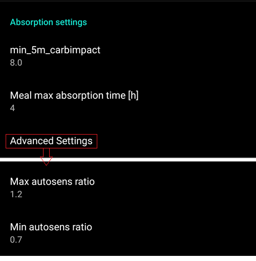
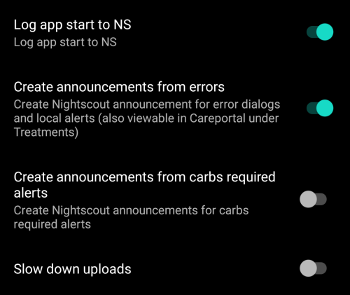

# Preferences

- 通过点击主页屏幕右上角的三个点菜单来**打开参数设置**。


- 您可以通过打开相应的选项卡（例如，泵选项卡）并点击“插件偏好设置”，直接跳转到该选项卡的偏好设置页面。


- 点击子菜单标题下方的三角形可以**打开子菜单**。


- 在偏好设置屏幕的顶部有一个**筛选器**，您可以通过它快速找到并访问特定的偏好设置项。 只需开始输入您要查找的文本的一部分即可。


```{contents}
:backlinks: entry
:depth: 2
```

(Preferences-general)=
## 一般


**单位**

- 根据你的偏好设置单位为mmol/l或mg/dl。

**语言**

- 新选项：使用手机默认语言（推荐）。

- 如果你想让**AAPS**使用与手机标准语言不同的语言，你可以从多种语言中选择。

- 如果你使用不同的语言，有时可能会看到语言混合的情况。 这是由于Android系统的一个问题，即有时覆盖默认的Android语言设置并不起作用。

**患者名称**

- 如果你需要区分多个设置（例如，家中有两个1型糖尿病患者），可以使用此选项。

(Preferences-protection)=
### 保护（Protection）


(Preferences-master-password)=
#### 主密码

必须设置主密码才能[导出设置](../Maintenance/ExportImportSettings.md)，因为从版本2.7开始，设置是加密的。

**生物识别保护功能可能在一加手机上无法正常工作。 这是一些一加手机上已知的问题。**


#### 设置保护

- 使用密码或手机的生物识别身份验证（例如，[孩子正在使用**AAPS**](../RemoteFeatures/RemoteMonitoring.md)）来保护你的设置。 如果启用此功能，每次访问任何与参数设置相关的视图时，系统都会提示你进行身份验证。

- 如果只想使用主密码来保护[导出的设置](../Maintenance/ExportImportSettings.md)，而使用不同的密码来编辑参数设置，则应使用自定义密码。

- 如果使用自定义密码，请点击“设置密码”这一行，按照[上面](#Preferences-master-password)的说明设置主密码。


#### 应用保护

如果应用受到保护，你必须输入密码或使用手机的生物识别身份验证才能打开**AAPS**。

如果输入的密码错误，**AAPS**将立即关闭，但如果之前已成功打开，它仍将在后台运行。

#### 大剂量安全验证

- 如果**AAPS**由小孩使用，并且你通过[短信输注大剂量](../RemoteFeatures/SMSCommands.md)，大剂量安全验证可能很有用。

- 在下面的示例中，你看到的是生物识别保护的提示。 如果生物识别身份验证不起作用，请点击白色提示上方的空白处并输入主密码。


#### 密码和PIN保留时间

定义在成功输入密码后，参数设置或大剂量功能保持解锁的时间（以秒为单位）。

(Preferences-skin)=
#### 皮肤
你可以从四种类型的皮肤中选择：


“低分辨率皮肤”带有较短的标签，并移除了年龄/级别，以便在低分辨率屏幕上获得更多可用空间。

其他皮肤之间的差异取决于手机的显示方向：

##### 竖屏方向

- **原始皮肤**和**始终显示在屏幕底部的按钮**是相同的。
- **大分辨率显示**与其他皮肤相比，所有图形的高度都有所增加。

##### 横屏方向

- 使用**原始皮肤**和**大分辨率显示**时，你需要向下滚动才能看到屏幕底部的按钮。

- **大分辨率显示**与其他皮肤相比，所有图形的高度都有所增加。


## 概览

在**概览**部分，你可以定义主页屏幕的参数设置。


### 保持屏幕常亮

“保持屏幕常亮”选项将强制Android始终保持屏幕开启。 这对于演示等场景很有用 但它会消耗大量电池电量。 因此，建议将手机连接到充电线。

(Preferences-buttons)=
### 按钮

- 定义主页屏幕底部显示哪些按钮。


- **增量**选项允许你为碳水化合物和胰岛素对话框中的三个按钮定义数量，以便轻松输入。


(Preferences-quick-wizard)=
### Quick Wizard

为某些标准餐食或零食创建自定义按钮，这些按钮将显示在主页屏幕上。 这对于经常吃的标准餐食很有用。

对于每个按钮，你定义碳水化合物和计算大剂量的方法。 然后，你定义按钮在主页屏幕上显示的时间段——每个时间段只能显示一个按钮。 如果当前时间不在指定的时间范围内，或者你的体内活性胰岛素（IOB）足以覆盖快速向导按钮中定义的碳水化合物，则按钮将不会显示。 If different times are specified for the different meals you will always have the appropriate standard meal button on the home screen, depending on the time of day.


If you click the quick wizard button **AAPS** will calculate and propose a bolus for those carbs based on your current ratios (considering blood glucose value or insulin on board if set up).

The proposal has to be confirmed before insulin is delivered.


(Preferences-default-temp-targets)=
### Default temp targets

[Temporary targets (TT)](../DailyLifeWithAaps/TempTargets.md) allow you to change your blood glucose target for a certain time period. When setting a default TT, you can easily change your target for activity, eating soon etc.

Here you can change the target and the duration for each predefined TT. Preset values are:

* Eating soon: target 72 mg/dL / 4.0 mmol/l, duration 45 min
* Activity: target 140 mg/dL / 7.8 mmol/l, duration 90 min
* Hypo: target 125 mg/dL / 6.9 mmol/l, duration 45 min


Learn how to [activate Temp Targets here](#TempTargets-where-can-i-select-a-temp-target).

### Fill/Prime standard insulin amounts

If you want to fill the tube or prime cannula through **AAPS** you can do this through the [**Actions** tab](#screens-action-tab).

Pre-set values can be defined in this dialogue. Choose the default amounts of the three buttons in fill/prime dialogue, depending on the length of your catheter.

(Preferences-range-for-visualization)=
### Range for visualization

Choose the high and low marks for the BG-graph on **AAPS** overview and smartwatch. It is only the visualization, not the target range for your BG. Example: 70 - 180 mg/dl or 3.9 - 10 mmol/l


### Shorten tab titles

Useful to see more tab titles on screen.

For example the 'OpenAPS AMA' tab becomes 'OAPS', 'OBJECTIVES' becomes 'OBJ' etc.


(Preferences-show-notes-field-in-treatments-dialogs)=
### Show notes field in treatments dialogs

Gives you the option to add short text notes to your treatments (bolus wizard, carbs, insulin...)


(Preferences-status-lights)=
### 状态指示灯

Status lights give a visual warning for:

- Sensor age
- Sensor battery level for certain smart readers (see [screenshots page](#screens-sensor-level-battery) for details).
- Insulin age (days reservoir is used)
- Reservoir level (units)
- Cannula age
- Pump battery age
- Pump battery level (%)

If the warning threshold is exceeded, values will be shown in yellow. If the critical threshold is exceeded, values will be shown in red.

The last option allows you to import those settings from Nightscout if defined there. See [Nightscout documentation](https://nightscout.github.io/nightscout/setup_variables/#age-pills) for more information.


(Preferences-deliver-this-part-of-bolus-wizard-result)=
### Deliver this part of bolus wizard result

Set the [default percentage](#AapsScreens-section-j) of the bolus calculated when using the bolus wizard.

Default is 100%: no correction. Even when setting a different value here, you can still change each time you use the bolus wizard. If this setting is 75 % and you had to bolus 10U, the bolus wizard will propose a meal bolus of only 7.5 units.

When using [SMB](#objectives-objective9), many people do not meal-bolus 100% of needed insulin, but only a part of it (e.g. 75 %) and let the SMB with UAM (Unattended Meal Detection) do the rest. Using a value lower than 100% here can be useful:
* for people with slow digestion: sending all the bolus upfront can cause hypo because the insulin action is faster than the digestion.
* to leave more room to **AAPS** to deal by itself with **BG rise**. In both cases, **AAPS** will compensate for the missing part of the bolus with SMBs, if/when deemed adequate.

### Enabled bolus advisor


When enabled, when you use the bolus wizard as you are in hyperglycemia, you will get a warning, prompting you if you wish to pe-bolus and eat later, when your **BG** gets back in range.

### Enabled bolus reminder

% todo

(Preferences-advanced-settings-overview)=
### Advanced Settings (Overview)


#### Superbolus

Option to enable superbolus in bolus wizard.

[Superbolus](https://www.diabetesnet.com/diabetes-technology/blue-skying/super-bolus/) is a concept to "borrow" some insulin from basal rate in the next two hours to prevent spikes. It is different from *super micro bolus*!

Use with caution and do not enable it until you learn what it really does. 基本上，接下来两小时的基础率会被添加到大剂量中，并激活两小时的零临时基础率。 **AAPS looping functions will be disabled - so use with care! If you use SMB **AAPS** looping functions will be disabled according to your settings in ["Max minutes of basal to limit SMB to"](#Open-APS-features-max-minutes-of-basal-to-limit-smb-to), if you do not use SMB looping functions will be disabled for two hours.** Details on super bolus can be found [here](https://www.diabetesnet.com/diabetes-technology/blue-skying/super-bolus).

## Treatment safety

(preferences-patient-type)=
### Patient type

- Safety limits are set based on the age you select in this setting.
- If you start hitting these hard limits (like max bolus) it's time to move one step up.
- It's a bad idea to select higher than real age because it can lead to overdosing by entering the wrong value in the insulin dialog (by skipping the decimal dot, for example).
- If you want to know the actual numbers for these hard-coded safety limits, scroll to the algorithm feature you are using on [this page](../DailyLifeWithAaps/KeyAapsFeatures.md).

### Max allowed bolus

- Defines the maximum amount of bolus insulin, in insulin units, that **AAPS** is allowed to deliver at once.
- This setting exists as a safety limit to prevent the delivery of a massive bolus due to accidental input or user error.
- It is recommended to set this to a sensible amount that corresponds roughly to the maximum amount of bolus insulin that you are ever likely to need for a meal or correction dose.
- This restriction is also applied to the results of the bolus calculator.

### Max allowed carbs

- Defines the maximum amount of carbs, in grams, that **AAPS** bolus calculator is allowed to dose for.
- This setting exists as a safety limit to prevent the delivery of a massive bolus due to accidental input or user error.
- It is recommended to set this to a sensible amount that corresponds roughly to the maximum amount of carbs that you are ever likely to need for a meal.

## 闭环（Loop）

(Preferences-aps-mode)=
### APS mode
Switch between Open Loop, Closed Loop and Low Glucose Suspend (LGS).


(Preferences-pen-loop)=
#### Open Loop
**AAPS** continuously evaluates all available data (IOB, COB, BG...) and makes treatment suggestions (temporary basal rates) on how to adjust your therapy if necessary.

The suggestions will not be executed automatically (as in closed loop). The suggestions have to be enacted by the user manually into the pump (if using virtual pump) or by using a button if **AAPS** is connected to a real pump.

This option is for getting to know how **AAPS** works or if you are using an unsupported pump. You will be in Open Loop, no matter what choice you make here, until the end of **[Objective 5](#objectives-objective5)**.

(preferences-closed-loop)=
#### Closed Loop

**AAPS** continuously evaluates all available data (IOB, COB, BG...) and automatically adjusts the treatment if necessary (_i.e._ without further intervention by you) to reach the set [target range or value](#profile-glucose-targets) (bolus delivery, temporary basal rate, insulin switch-off to avoid hypo etc.).

The Closed Loop works within numerous safety limits, which can be set individually.

Closed Loop is only possible if you are in **[Objective 6](#objectives-objective6)** or higher and use a supported pump.

#### Low Glucose Suspend (LGS)

In this mode, [maxIOB](#Open-APS-features-maximum-total-iob-openaps-cant-go-over) is set to zero.

This means that if blood glucose is dropping, **AAPS** can reduce the basal for you. But if blood glucose is rising, no automatic correction will be made. Your basal rates will remain the same as defined in your current **Profile**. Only if basal IOB is negative (from a previous Low Glucose Suspend) additional insulin will be given to lower **BG**.

(Preferences-minimal-request-change)=
### Minimal request change

When using **Open loop**, you will receive notifications every time **AAPS** recommends adjusting the basal rate. To reduce the number of notifications you can either use a [wider bg target range](#profile-glucose-targets) or increase the percentage of the minimal request rate. This defines the relative change required to trigger a notification.

## Advanced Meal Assist (AMA) or Super Micro Bolus (SMB)

Depending on your settings in [config builder](../SettingUpAaps/ConfigBuilder.md) you can choose between three algorithms:

- [Advanced meal assist (OpenAPS AMA)](#Open-APS-features-advanced-meal-assist-ama) - state of the algorithm in 2017
- [Super Micro Bolus (OpenAPS SMB)](#Open-APS-features-super-micro-bolus-smb) - most recent algorithm recommended for beginners
- [Dynamic ISF](../DailyLifeWithAaps/DynamicISF.md) - released in 2024, available starting at **[Objective 11](#objectives-objective11)**

### OpenAPS AMA（高级膳食助手）

All the settings for OpenAPS AMA are described in the dedicated section in [Key AAPS Features > Advanced Meal Assist (AMA)](#Open-APS-features-advanced-meal-assist-ama).

(Preferences-openaps-smb-settings)=
### OpenAPS SMB（超级微小大剂量）

All the settings for OpenAPS SMB are described in the dedicated section in [Key AAPS Features > Super Micro Bolus (SMB)](#Open-APS-features-super-micro-bolus-smb).

### Dynamic ISF

All the settings for Dynamic ISF are described in the dedicated section in [Dynamic ISF](../DailyLifeWithAaps/DynamicISF.md).

## 碳水吸收率设置

(Preferences-min_5m_carbimpact)=
### min_5m_carbimpact

The algorithm uses BGI (blood glucose impact) to determine when [carbs are absorbed](../DailyLifeWithAaps/CobCalculation.md).

At times when carb absorption can’t be dynamically worked out based on your blood's reactions, **AAPS** inserts a default decay to your carbs. 基本上，它是一个故障保护机制。 This value is only used during gaps in **CGM** readings or when physical activity “uses up” all the blood glucose rise that would otherwise cause **AAPS** to decay COB.

To put it simply: The algorithm "knows" how your BGs *should* behave when affected by the current dose of insulin etc. Whenever there is a positive deviation from the expected behaviour, some carbs are absorbed/decayed. Big change=many carbs etc.

The min_5m_carbimpact does define the default carb absorption impact per 5 minutes. For more details see [OpenAPS docs](https://openaps.readthedocs.io/en/latest/docs/While%20You%20Wait%20For%20Gear/preferences-and-safety-settings.html?highlight=carbimpact#min-5m-carbimpact).

Standard value for AMA is 5, for SMB it's 8.

The COB graph on the home screen indicates when min_5m_impact is being used by putting an orange circle at the top.


### Meal max absorption time

If you often eat high fat or protein meals you will need to increase your meal absorption time.

### Advanced settings - autosens ratio



- Define min. and max. [autosens](#Open-APS-features-autosens) ratio.
- Normally standard values (max. 1.2 and min. 0.7) should not be changed.

## Pump

### BT Watchdog

Activate BT watchdog if necessary (e.g. for Dana pumps). It switches off bluetooth for one second if no connection to the pump is possible. This may help on some phones where the bluetooth stack freezes.

## Pump settings

The options here will vary depending on which pump driver you have selected in [Config Builder](#Config-Builder-pump).  Pair and set your pump up according to the [pump related instructions](../Getting-Started/CompatiblePumps.md).

## Tidepool

More information on the dedicated [Tidepool](../SettingUpAaps/Tidepool.md) page.

(Preferences-nsclient)=
## NSClient


Original communication protocol, can be used with older Nightscout versions.

- Set your *Nightscout URL* (i.e. <https://yoursitename.yourplaform.dom>).
- **Make sure that the URL is WITHOUT /api/v1/ at the end.**
- The *[API secret](https://nightscout.github.io/nightscout/setup_variables/#api-secret-nightscout-password)* (a 12 character password recorded in your Nightscout variables).
- This enables data to be read and written between both the Nightscout website and **AAPS**.
- Double check for typos here if you are stuck in Objective 1.

## NSClientV3


[New protocol introduced with AAPS 3.2.](#Important-comments-on-using-v3-versus-v1-API-for-Nightscout-with-AAPS) Safer and more efficient.

```{admonition} V3 data uploaders
:class: warning

When using NSClientV3, all uploaders must be using the API V3. Since most are not compatible yet, this means **you must let **AAPS** upload all data** (BG, treatments, ...) to Nightscout and disable all other uploaders if they're not V3 compliant.
```

- Set your *Nightscout URL* (i.e. <https://yoursitename.yourplaform.dom>).
- **Make sure that the URL is WITHOUT /api/v1/ at the end.**
- In Nightscout, create an *[Admin token](https://nightscout.github.io/nightscout/security/#create-a-token)* (requires [Nightscout 15](https://nightscout.github.io/update/update/) to use the V3 API) and enter it in the **NS access token** (not your API Secret!).
- This enables data to be read and written between both the Nightscout website and **AAPS**.
- Double check for typos here if you are stuck in Objective 1.
- Leave Connect to websockets enabled (recommended).

### Synchronization

Synchronization choices will depend on the way you will want to use **AAPS**.

You can select which data you want to [upload and download to or from Nightscout](#Nightscout-aaps-settings).

### 报警选项


- Alarm options allows you to select which Nightscout alarms to use through the app. **AAPS** will alarm when a Nightscout alarm triggers.
- For the alarms to sound you need to set the Urgent High, High, Low and Urgent Low alarm values in your [Nightscout variables](https://nightscout.github.io/nightscout/setup_variables/#alarms).
- They will only work whilst you have a connection to Nightscout and are intended for parent/caregivers.
- If you have the **CGM** source on your phone (i.e. xDrip+ or BYODA) then use those alarms instead of Nightscout Alarms.
- Create notifications from Nightscout [announcements](https://nightscout.github.io/nightscout/discover/#announcement) will echo Nightscout announcements in the **AAPS** notifications bar.
- You can change stale data and urgent stale data alarms threshold when no data is received from Nightscout after a certain time.

### Connection settings


- Connection settings define when Nightscout connection will be enabled.
- Restrict Nightscout upload to Wi-Fi only or even to certain Wi-Fi SSIDs.
- If you want to use only a specific Wi-Fi network you can enter its Wi-Fi SSID.
- Multiple SSIDs can be separated by semicolon.
- To delete all SSIDs enter a blank space in the field.

(Preferences-advanced-settings-nsclient)=
### Advanced settings (NSClient)



Options in advanced settings are self-explanatory.

## SMS短信通讯器

More information on the dedicated [SMS Commands](../RemoteFeatures/SMSCommands.md) page.

## 自动操作

Select which location service shall be used:

- Use passive location: **AAPS** only takes locations if other apps are requesting it
- Use network location: Location of your Wi-Fi
- Use GPS location (Attention! May cause excessive battery drain!)

## Local alerts


Settings should be self-explanatory.

## Data choices


You can help develop **AAPS** further by sending crash reports to the developers.

## Maintenance settings


Standard recipient of logs is <logs@aaps.app>.

## Open Humans

You can help the community by donating your data to research projects! Details are described on the [Open Humans page](../SupportingAaps/OpenHumans.md).

In Preferences, you can define when data shall be uploaded
- only if connected to Wi-Fi
- only if charging