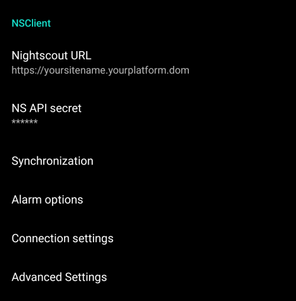

# Preferences

- 通过点击主页屏幕右上角的三个点菜单来**打开参数设置**。


- 您可以通过打开相应的选项卡（例如，泵选项卡）并点击“插件偏好设置”，直接跳转到该选项卡的偏好设置页面。


- 点击子菜单标题下方的三角形可以**打开子菜单**。


- 在偏好设置屏幕的顶部有一个**筛选器**，您可以通过它快速找到并访问特定的偏好设置项。 只需开始输入您要查找的文本的一部分即可。


```{contents}
:backlinks: entry
:depth: 2
```

(Preferences-general)=
## 一般


**单位**

- 根据你的偏好设置单位为mmol/l或mg/dl。

**语言**

- 新选项：使用手机默认语言（推荐）。

- 如果你想让**AAPS**使用与手机标准语言不同的语言，你可以从多种语言中选择。

- 如果你使用不同的语言，有时可能会看到语言混合的情况。 这是由于Android系统的一个问题，即有时覆盖默认的Android语言设置并不起作用。

**患者名称**

- 如果你需要区分多个设置（例如，家中有两个1型糖尿病患者），可以使用此选项。

(Preferences-protection)=
### 保护（Protection）


(Preferences-master-password)=
#### 主密码

必须设置主密码才能[导出设置](../Maintenance/ExportImportSettings.md)，因为从版本2.7开始，设置是加密的。

**生物识别保护功能可能在一加手机上无法正常工作。 这是一些一加手机上已知的问题。**


#### 设置保护

- 使用密码或手机的生物识别身份验证（例如，[孩子正在使用**AAPS**](../RemoteFeatures/RemoteMonitoring.md)）来保护你的设置。 如果启用此功能，每次访问任何与参数设置相关的视图时，系统都会提示你进行身份验证。

- 如果只想使用主密码来保护[导出的设置](../Maintenance/ExportImportSettings.md)，而使用不同的密码来编辑参数设置，则应使用自定义密码。

- 如果使用自定义密码，请点击“设置密码”这一行，按照[上面](#Preferences-master-password)的说明设置主密码。


#### 应用保护

如果应用受到保护，你必须输入密码或使用手机的生物识别身份验证才能打开**AAPS**。

如果输入的密码错误，**AAPS**将立即关闭，但如果之前已成功打开，它仍将在后台运行。

#### 大剂量安全验证

- 如果**AAPS**由小孩使用，并且你通过[短信输注大剂量](../RemoteFeatures/SMSCommands.md)，大剂量安全验证可能很有用。

- 在下面的示例中，你看到的是生物识别保护的提示。 如果生物识别身份验证不起作用，请点击白色提示上方的空白处并输入主密码。


#### 密码和PIN保留时间

定义在成功输入密码后，参数设置或大剂量功能保持解锁的时间（以秒为单位）。

(Preferences-skin)=
#### 皮肤
你可以从四种类型的皮肤中选择：


“低分辨率皮肤”带有较短的标签，并移除了年龄/级别，以便在低分辨率屏幕上获得更多可用空间。

其他皮肤之间的差异取决于手机的显示方向：

##### 竖屏方向

- **原始皮肤**和**始终显示在屏幕底部的按钮**是相同的。
- **大分辨率显示**与其他皮肤相比，所有图形的高度都有所增加。

##### 横屏方向

- 使用**原始皮肤**和**大分辨率显示**时，你需要向下滚动才能看到屏幕底部的按钮。

- **大分辨率显示**与其他皮肤相比，所有图形的高度都有所增加。


## 概览

在**概览（Overview）**部分，你可以定义主屏的参数设置。


### 保持屏幕常亮

“保持屏幕常亮”选项将强制Android始终保持屏幕开启。 这对于演示等场景很有用 但它会消耗大量电池电量。 因此，建议将手机连接到充电线。

(Preferences-buttons)=
### 按钮

- 定义主页屏幕底部显示哪些按钮。


- **增量**选项允许你为碳水化合物和胰岛素对话框中的三个按钮定义数量，以方便输入。


(Preferences-quick-wizard)=
### Quick Wizard

为某些标准餐食或零食创建自定义按钮，这些按钮将显示在主页屏幕上。 适用于经常吃的标准餐食。

对于每个按钮，你定义碳水化合物和计算大剂量的方法。 然后，你定义按钮在主页屏幕上显示的时间段——每个时间段只能显示一个按钮。 如果当前时间不在指定的时间范围内，或者你的体内活性胰岛素（IOB）足以覆盖快速向导按钮中定义的碳水化合物，则按钮将不会显示。 如果你为不同的餐食指定了不同的时间，你将始终根据一天中的时间，在主页屏幕上看到适当的标准餐食按钮。


如果你点击快速向导按钮，**AAPS**将根据当前比率计算并给出一个大剂量建议（参考血糖值和设置的活性胰岛素IOB）。

点OK确认之后才会按照建议进行输注。


(Preferences-default-temp-targets)=
### 默认临时目标

[临时目标（TT）](../DailyLifeWithAaps/TempTargets.md)允许你为特定的时间段更改血糖目标。 设置默认TT时，你可以轻松地更改活动、即将进食等情况下的目标。

在这里，你可以更改每个预定义TT的目标和持续时间。 预设值为：

* 即将进食：目标72 mg/dL / 4.0 mmol/l，持续时间45分钟
* 活动：目标140 mg/dL / 7.8 mmol/l，持续时间90分钟
* 低血糖：目标125 mg/dL / 6.9 mmol/l，持续时间45分钟


在这里了解如何[启用临时目标](#TempTargets-where-can-i-select-a-temp-target)。

### 输注/充盈标准胰岛素剂量

如果你想通过**AAPS**填充管路，可以通过[**操作**标签页](#screens-action-tab)进行此操作。

可以在此对话框中定义预设值。 根据你的管路长度，选择“填充/灌注”对话框中三个按钮的默认量。

(Preferences-range-for-visualization)=
### 可视化范围

为**AAPS**概览和智能手表上的血糖图选择高点和低点标记。 这只是可视化，不是你的血糖目标范围。 例如：70 - 180 mg/dl 或 3.9 - 10 mmol/l。


### 缩写标签标题

有助于在屏幕上显示更多的标签页标题。

例如，“OpenAPS AMA”标签页变为“OAPS”，“OBJECTIVES”变为“OBJ”等。


(Preferences-show-notes-field-in-treatments-dialogs)=
### 在治疗（treatments）对话框中显示备注字段

允许您为自己的治疗方案（大剂量向导、碳水、胰岛素...）添加简短的文本备注。


(Preferences-status-lights)=
### 状态指示灯

状态指示灯为以下情况提供视觉警告：

- Sensor age
- 某些动态传感器的电池电量（详细信息请参阅[屏幕截图页面](#screens-sensor-level-battery)）。
- Insulin age (days reservoir is used)
- Reservoir level (units)
- Cannula age
- 泵电池使用时间
- 泵电池电量（%）

如果超过警告阈值，数值将以黄色显示。 如果超过临界阈值，数值将以红色显示。

最后一个选项允许您从Nightscout导入那些设置（如果在Nightscout中已定义）。 更多信息请参阅[Nightscout文档](https://nightscout.github.io/nightscout/setup_variables/#age-pills)。


(Preferences-deliver-this-part-of-bolus-wizard-result)=
### 输注大剂量向导计算结果的一部分（Deliver this part of bolus wizard result）

设置使用大剂量向导计算时使用的[默认百分比](#AapsScreens-section-j)。

默认值为100%：不进行校正。 即使在这里设置了不同的值，你每次使用大剂量向导时仍然可以更改它。 如果这里设置为75%，并且你需要输注10U，大剂量向导将仅建议7.5单位的餐时大剂量。

在使用[SMB](#objectives-objective9)时，许多人不会输注所需胰岛素的100%，而只是其中的一部分（例如75%），并让SMB与UAM（无人值守用餐检测）完成其余部分。 下面这些情况使用低于100%的值可能很有用：
* 对于消化缓慢的人：提前输送所有大剂量可能会导致低血糖，因为胰岛素的作用比消化快。
* 为**AAPS**自己处理**血糖升高**留下更多空间。 在这两种情况下，如果认为合适，**AAPS**将通过SMB补偿缺失的部分大剂量。

### 启用大剂量顾问（bolus advisor）


启用后，在高血糖状态下使用大剂量向导时，你将收到一个警告，提示你是否希望给个提前大剂量，然后等**血糖**回到范围内时再进食。

### 启用大剂量提醒

% todo

(Preferences-advanced-settings-overview)=
### 高级设置（概览）


#### 超级大剂量（Superbolus）

在大剂量向导中启用超级大剂量选项。

[超级大剂量](https://www.diabetesnet.com/diabetes-technology/blue-skying/super-bolus/)的概念是从未来两小时的基础率中提前“借”过来一部分胰岛素，从而防止血糖飙升。 它与*超级微小大剂量SMB*不同！

请谨慎使用，并且在了解它真正的作用之前不要启用它。 基本上，接下来两小时的基础率会被添加到大剂量中，并激活两小时的零临时基础率。 **AAPS闭环功能将被禁用——因此请谨慎使用！ **如果您使用SMB，**AAPS的闭环功能将根据您在[“SMB限制基础率的时间上限（分钟）”](#Open-APS-features-max-minutes-of-basal-to-limit-smb-to)中的设置而被禁用；如果您不使用SMB，循环功能将被禁用两个小时。**有关超级大剂量的详细信息，请[点击此处](https://www.diabetesnet.com/diabetes-technology/blue-skying/super-bolus)查看。

## 治疗安全

(preferences-patient-type)=
### 患者类型

- 安全限制是根据你在这里选择的年龄来设置的。
- 如果你开始触及这些硬性限制（比如最大剂量），那就是时候更进一步了。
- 选择高于实际年龄是不明智的，因为如果在胰岛素对话框中输错数值（例如跳过小数点）可能会导致用药过量。
- 要了解这些硬性安全限制的具体数值，请在[此页面](../DailyLifeWithAaps/KeyAapsFeatures.md)上按您正在使用的算法来找。

### 允许的最大大剂量

- 定义**AAPS**一次输注所允许的最大胰岛素量（以胰岛素单位计算）。
- 此设置作为安全限制存在，以防止因意外输入或用户错误而注入大量胰岛素。
- 建议将此设置为一个合理的数值，该数值大致对应于您一餐或校正剂量所需的最大胰岛素量。
- 此限制也适用于大剂量计算器的结果。

### 最大允许碳水化合物

- 定义**AAPS**大剂量计算器计算结果所允许覆盖的最大碳水化合物量（以克计算）。
- 此设置作为安全限制存在，以防止因意外输入或用户错误而注入大量胰岛素。
- 建议将其设置为一个合理的量，大致对应于你一顿饭可能摄入的最大碳水化合物量。

## 闭环（Loop）

(Preferences-aps-mode)=
### APS模式
在开环、闭环和低血糖暂停（LGS）之间切换。


(Preferences-pen-loop)=
#### 开环（Open Loop）
**AAPS**连续评估所有可用数据（IOB、COB、BG...），如有必要，会就如何调整治疗（如临时基础率）提出建议。

建议不会像闭环模式中那样自动执行。 如果使用虚拟泵，用户必须手动将建议输入到泵中，如果**AAPS**连着真实的泵，用户需要通过相应的按钮来执行操作。

此选项适用于了解**AAPS**的工作原理，或者你使用的是不受支持的泵。 在**[目标5](#objectives-objective5)**结束之前，无论你做出什么选择，你都将处于开环模式。

(preferences-closed-loop)=
#### 闭环

**AAPS**连续评估所有可用数据（IOB、COB、BG...），并在必要时（_即_无需你进一步干预）自动调整治疗以达到设定的[目标范围或值](#profile-glucose-targets)（大剂量输注、临时基础率、胰岛素关闭以避免低血糖等）。

闭环在多个安全限制内工作，这些限制可以单独设置。

闭环仅在达到**[目标6](#objectives-objective6)**或更高，并且使用已经支持的泵时才可用。

#### 低血糖暂停（LGS）

在此模式下，[maxIOB](#Open-APS-features-maximum-total-iob-openaps-cant-go-over)设置为零。

这意味着如果血糖正在下降，**AAPS**可以降低你的基础率。 但如果血糖正在上升，则不会自动进行校正。 您的基础率将保持与您当前**个人设置**中定义的一致。 仅当基础率IOB为负值时（缘于之前的低血糖暂停LGS），才会额外给予胰岛素以降低**血糖（BG）**。

(Preferences-minimal-request-change)=
### 最小请求更改（Minimal request change）

When using **Open loop**, you will receive notifications every time **AAPS** recommends adjusting the basal rate. To reduce the number of notifications you can either use a [wider bg target range](#profile-glucose-targets) or increase the percentage of the minimal request rate. This defines the relative change required to trigger a notification.

## Advanced Meal Assist (AMA) or Super Micro Bolus (SMB)

Depending on your settings in [config builder](../SettingUpAaps/ConfigBuilder.md) you can choose between three algorithms:

- [Advanced meal assist (OpenAPS AMA)](#Open-APS-features-advanced-meal-assist-ama) - state of the algorithm in 2017
- [Super Micro Bolus (OpenAPS SMB)](#Open-APS-features-super-micro-bolus-smb) - most recent algorithm recommended for beginners
- [Dynamic ISF](../DailyLifeWithAaps/DynamicISF.md) - released in 2024, available starting at **[Objective 11](#objectives-objective11)**

### OpenAPS AMA（高级膳食助手）

All the settings for OpenAPS AMA are described in the dedicated section in [Key AAPS Features > Advanced Meal Assist (AMA)](#Open-APS-features-advanced-meal-assist-ama).

(Preferences-openaps-smb-settings)=
### OpenAPS SMB（超级微小大剂量）

All the settings for OpenAPS SMB are described in the dedicated section in [Key AAPS Features > Super Micro Bolus (SMB)](#Open-APS-features-super-micro-bolus-smb).

### Dynamic ISF

All the settings for Dynamic ISF are described in the dedicated section in [Dynamic ISF](../DailyLifeWithAaps/DynamicISF.md).

## 碳水吸收率设置

(Preferences-min_5m_carbimpact)=
### min_5m_carbimpact

The algorithm uses BGI (blood glucose impact) to determine when [carbs are absorbed](../DailyLifeWithAaps/CobCalculation.md).

At times when carb absorption can’t be dynamically worked out based on your blood's reactions, **AAPS** inserts a default decay to your carbs. 基本上，它是一个故障保护机制。 This value is only used during gaps in **CGM** readings or when physical activity “uses up” all the blood glucose rise that would otherwise cause **AAPS** to decay COB.

To put it simply: The algorithm "knows" how your BGs *should* behave when affected by the current dose of insulin etc. Whenever there is a positive deviation from the expected behaviour, some carbs are absorbed/decayed. Big change=many carbs etc.

The min_5m_carbimpact does define the default carb absorption impact per 5 minutes. For more details see [OpenAPS docs](https://openaps.readthedocs.io/en/latest/docs/While%20You%20Wait%20For%20Gear/preferences-and-safety-settings.html?highlight=carbimpact#min-5m-carbimpact).

Standard value for AMA is 5, for SMB it's 8.

The COB graph on the home screen indicates when min_5m_impact is being used by putting an orange circle at the top.


### Meal max absorption time

If you often eat high fat or protein meals you will need to increase your meal absorption time.

### Advanced settings - autosens ratio


- Define min. and max. [autosens](#Open-APS-features-autosens) ratio.
- Normally standard values (max. 1.2 and min. 0.7) should not be changed.

## Pump

### BT Watchdog

Activate BT watchdog if necessary (e.g. for Dana pumps). It switches off bluetooth for one second if no connection to the pump is possible. This may help on some phones where the bluetooth stack freezes.

## Pump settings

The options here will vary depending on which pump driver you have selected in [Config Builder](#Config-Builder-pump).  Pair and set your pump up according to the [pump related instructions](../Getting-Started/CompatiblePumps.md).

## Tidepool

More information on the dedicated [Tidepool](../SettingUpAaps/Tidepool.md) page.

(Preferences-nsclient)=
## NSClient



Original communication protocol, can be used with older Nightscout versions.

- Set your *Nightscout URL* (i.e. <https://yoursitename.yourplaform.dom>).
- **Make sure that the URL is WITHOUT /api/v1/ at the end.**
- The *[API secret](https://nightscout.github.io/nightscout/setup_variables/#api-secret-nightscout-password)* (a 12 character password recorded in your Nightscout variables).
- This enables data to be read and written between both the Nightscout website and **AAPS**.
- Double check for typos here if you are stuck in Objective 1.

## NSClientV3


[New protocol introduced with AAPS 3.2.](#Important-comments-on-using-v3-versus-v1-API-for-Nightscout-with-AAPS) Safer and more efficient.

```{admonition} V3 data uploaders
:class: warning

When using NSClientV3, all uploaders must be using the API V3. Since most are not compatible yet, this means **you must let **AAPS** upload all data** (BG, treatments, ...) to Nightscout and disable all other uploaders if they're not V3 compliant.
```

- Set your *Nightscout URL* (i.e. <https://yoursitename.yourplaform.dom>).
- **Make sure that the URL is WITHOUT /api/v1/ at the end.**
- In Nightscout, create an *[Admin token](https://nightscout.github.io/nightscout/security/#create-a-token)* (requires [Nightscout 15](https://nightscout.github.io/update/update/) to use the V3 API) and enter it in the **NS access token** (not your API Secret!).
- This enables data to be read and written between both the Nightscout website and **AAPS**.
- Double check for typos here if you are stuck in Objective 1.
- Leave Connect to websockets enabled (recommended).

### Synchronization

Synchronization choices will depend on the way you will want to use **AAPS**.

You can select which data you want to [upload and download to or from Nightscout](#Nightscout-aaps-settings).

### 报警选项


- Alarm options allows you to select which Nightscout alarms to use through the app. **AAPS** will alarm when a Nightscout alarm triggers.
- For the alarms to sound you need to set the Urgent High, High, Low and Urgent Low alarm values in your [Nightscout variables](https://nightscout.github.io/nightscout/setup_variables/#alarms).
- They will only work whilst you have a connection to Nightscout and are intended for parent/caregivers.
- If you have the **CGM** source on your phone (i.e. xDrip+ or BYODA) then use those alarms instead of Nightscout Alarms.
- Create notifications from Nightscout [announcements](https://nightscout.github.io/nightscout/discover/#announcement) will echo Nightscout announcements in the **AAPS** notifications bar.
- You can change stale data and urgent stale data alarms threshold when no data is received from Nightscout after a certain time.

### Connection settings


- Connection settings define when Nightscout connection will be enabled.
- Restrict Nightscout upload to Wi-Fi only or even to certain Wi-Fi SSIDs.
- If you want to use only a specific Wi-Fi network you can enter its Wi-Fi SSID.
- Multiple SSIDs can be separated by semicolon.
- To delete all SSIDs enter a blank space in the field.

(Preferences-advanced-settings-nsclient)=
### Advanced settings (NSClient)


Options in advanced settings are self-explanatory.

## SMS短信通讯器

More information on the dedicated [SMS Commands](../RemoteFeatures/SMSCommands.md) page.

## 自动操作

Select which location service shall be used:

- Use passive location: **AAPS** only takes locations if other apps are requesting it
- Use network location: Location of your Wi-Fi
- Use GPS location (Attention! May cause excessive battery drain!)

## Local alerts


Settings should be self-explanatory.

## Data choices


You can help develop **AAPS** further by sending crash reports to the developers.

## Maintenance settings


Standard recipient of logs is <logs@aaps.app>.

## Open Humans

You can help the community by donating your data to research projects! Details are described on the [Open Humans page](../SupportingAaps/OpenHumans.md).

In Preferences, you can define when data shall be uploaded
- only if connected to Wi-Fi
- only if charging