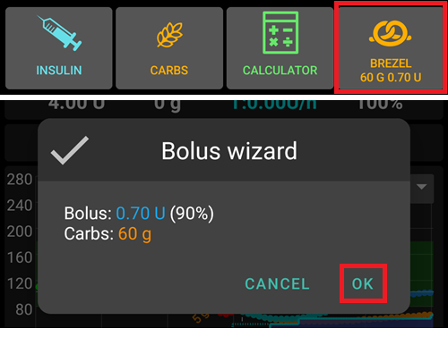
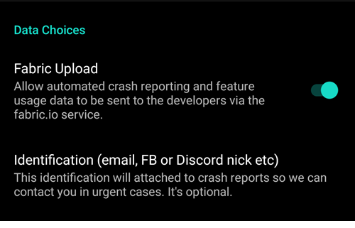

# 偏好设置

- 通过点击主页屏幕右上角的三个点菜单来**打开参数设置**。


- 您可以通过打开相应的选项卡（例如，泵选项卡）并点击“插件偏好设置”，直接跳转到该选项卡的偏好设置页面。


- 点击子菜单标题下方的三角形可以**打开子菜单**。


- 在偏好设置屏幕的顶部有一个**筛选器**，您可以通过它快速找到并访问特定的偏好设置项。 只需开始输入您要查找的文本的一部分即可。


```{contents}
:backlinks: entry
:depth: 2
```

(Preferences-general)=
## 常规


**单位**

- 根据你的偏好设置单位为mmol/l或mg/dl。

**语言**

- 新选项：使用手机默认语言（推荐）。

- 如果你想让**AAPS**使用与手机标准语言不同的语言，你可以从多种语言中选择。

- 如果你使用不同的语言，有时可能会看到语言混合的情况。 这是由于Android系统的一个问题，即有时覆盖默认的Android语言设置并不起作用。
- 该设置在[简单模式](#preferences-simple-mode)下被隐藏。

(preferences-simple-mode)= **简单模式**

**简单模式**在首次安装**AAPS**时默认启用。 在**简单模式**下，大量设置项将被隐藏，用户偏好配置将替换为预设值。 主页的[附加图表区域](#AapsScreens-section-g-additional-graphs)也将采用预定义布局。 当您熟悉**AAPS**界面及设置后，应关闭简单模式。

**患者名称**

- 如果你需要区分多个设置（例如，家中有两个1型糖尿病患者），可以使用此选项。
- 显示于[双表盘](../WearOS/WearOsSmartwatch.md)界面。

(Preferences-skin)=
### 皮肤

该设置在[简单模式](#preferences-simple-mode)下被隐藏。

你可以从四种类型的皮肤中选择：


“低分辨率皮肤”带有较短的标签，并移除了年龄/级别，以便在低分辨率屏幕上获得更多可用空间。

其他皮肤之间的差异取决于手机的显示方向：

#### 竖屏方向

- **原始皮肤**和**始终显示在屏幕底部的按钮**是相同的。
- **大分辨率显示**与其他皮肤相比，所有图形的高度都有所增加。

#### 横屏方向

- 使用**原始皮肤**和**大分辨率显示**时，你需要向下滚动才能看到屏幕底部的按钮。

- **大分辨率显示**与其他皮肤相比，所有图形的高度都有所增加。


(Preferences-protection)=
## 保护（Protection）


(Preferences-master-password)=
### 主密码

必须设置主密码才能[导出设置](../Maintenance/ExportImportSettings.md)，因为从版本2.7开始，设置是加密的。

**生物识别保护功能可能在一加手机上无法正常工作。 这是一些一加手机上已知的问题。**


### 设置保护

- 使用密码或手机的生物识别身份验证（例如，[孩子正在使用**AAPS**](../RemoteFeatures/RemoteMonitoring.md)）来保护你的设置。 如果启用此功能，每次访问任何与参数设置相关的视图时，系统都会提示你进行身份验证。

- 如果只想使用主密码来保护[导出的设置](../Maintenance/ExportImportSettings.md)，而使用不同的密码来编辑参数设置，则应使用自定义密码。

- 如果使用自定义密码，请点击“设置密码”这一行，按照[上面](#Preferences-master-password)的说明设置主密码。


### 应用保护

如果应用受到保护，你必须输入密码或使用手机的生物识别身份验证才能打开**AAPS**。

如果输入的密码错误，**AAPS**将立即关闭，但如果之前已成功打开，它仍将在后台运行。

### 大剂量安全验证

- 如果**AAPS**由小孩使用，并且你通过[短信输注大剂量](../RemoteFeatures/SMSCommands.md)，大剂量安全验证可能很有用。

- 在下面的示例中，你看到的是生物识别保护的提示。 如果生物识别身份验证不起作用，请点击白色提示上方的空白处并输入主密码。


### 密码和PIN保留时间

定义在成功输入密码后，参数设置或大剂量功能保持解锁的时间（以秒为单位）。

## 概览

在**概览（Overview）**部分，你可以定义主屏的参数设置。


### 保持屏幕常亮

“保持屏幕常亮”选项将强制Android始终保持屏幕开启。 这对于演示等场景很有用 但它会消耗大量电池电量。 因此，建议将手机连接到充电线。

(Preferences-buttons)=
### 按钮

- 定义主页屏幕底部显示哪些按钮。
- 该设置在[简单模式](#preferences-simple-mode)下被隐藏。


- **增量**选项允许你为碳水化合物和胰岛素对话框中的三个按钮定义数量，以方便输入。


(Preferences-quick-wizard)=
### 快速向导

为某些标准餐食或零食创建自定义按钮，这些按钮将显示在主页屏幕上。 适用于经常吃的标准餐食。

对于每个按钮，你定义碳水化合物和计算大剂量的方法。 然后，你定义按钮在主页屏幕上显示的时间段——每个时间段只能显示一个按钮。 如果当前时间不在指定的时间范围内，或者你的体内活性胰岛素（IOB）足以覆盖快速向导按钮中定义的碳水化合物，则按钮将不会显示。 如果你为不同的餐食指定了不同的时间，你将始终根据一天中的时间，在主页屏幕上看到适当的标准餐食按钮。


如果你点击快速向导按钮，**AAPS**将根据当前比率计算并给出一个大剂量建议（参考血糖值和设置的活性胰岛素IOB）。

点OK确认之后才会按照建议进行输注。



同一时间仅显示一个快捷向导按钮。 如需执行其他操作：长按当前显示的快捷向导按钮， 将跳转至所有快捷选项列表。 选择目标项后再次长按即可执行， 操作前需二次确认。

(Preferences-default-temp-targets)=
### 默认临时目标

该设置在[简单模式](#preferences-simple-mode)下被隐藏。

[临时目标（TT）](../DailyLifeWithAaps/TempTargets.md)允许你为特定的时间段更改血糖目标。 设置默认TT时，你可以轻松地更改活动、即将进食等情况下的目标。

在这里，你可以更改每个预定义TT的目标和持续时间。 预设值为：

* 即将进食：目标72 mg/dL / 4.0 mmol/l，持续时间45分钟
* 活动：目标140 mg/dL / 7.8 mmol/l，持续时间90分钟
* 低血糖：目标125 mg/dL / 6.9 mmol/l，持续时间45分钟


在这里了解如何[启用临时目标](#TempTargets-where-can-i-select-a-temp-target)。

### 输注/充盈标准胰岛素剂量

该设置在[简单模式](#preferences-simple-mode)下被隐藏。

如果你想通过**AAPS**填充管路，可以通过[**操作**标签页](#screens-action-tab)进行此操作。

可以在此对话框中定义预设值。 根据你的管路长度，选择“填充/灌注”对话框中三个按钮的默认量。

(Preferences-range-for-visualization)=
### 可视化范围

为**AAPS**概览和智能手表上的血糖图选择高点和低点标记。 这只是可视化，不是你的血糖目标范围。 例如：70 - 180 mg/dl 或 3.9 - 10 mmol/l。


### 缩写选项卡标题

该设置在[简单模式](#preferences-simple-mode)下被隐藏。

有助于在屏幕上显示更多的标签页标题。

例如，“OpenAPS AMA”标签页变为“OAPS”，“OBJECTIVES”变为“OBJ”等。


(Preferences-show-notes-field-in-treatments-dialogs)=
### 在治疗（treatments）对话框中显示备注字段

该设置在[简单模式](#preferences-simple-mode)下被隐藏。

允许您为自己的治疗方案（大剂量向导、碳水、胰岛素...）添加简短的文本备注。


(Preferences-status-lights)=
### 状态指示灯

该设置在[简单模式](#preferences-simple-mode)下被隐藏。

状态指示灯为以下情况提供视觉警告：

- 探头使用时间
- 某些动态传感器的电池电量（详细信息请参阅[屏幕截图页面](#screens-sensor-level-battery)）。
- 胰岛素使用时间（储液器使用天数）
- 储液器药量（单位）
- 管路使用时间
- 泵电池使用时间
- 泵电池电量（%）

如果超过警告阈值，数值将以黄色显示。 如果超过临界阈值，数值将以红色显示。

最后一个选项允许您从Nightscout导入那些设置（如果在Nightscout中已定义）。 更多信息请参阅[Nightscout文档](https://nightscout.github.io/nightscout/setup_variables/#age-pills)。


(Preferences-deliver-this-part-of-bolus-wizard-result)=
### 执行大剂量向导计算结果中的此部分

设置使用大剂量向导计算时使用的[默认百分比](#AapsScreens-section-j)。

默认值为100%：不进行校正。 即使在这里设置了不同的值，你每次使用大剂量向导时仍然可以更改它。 如果这里设置为75%，并且你需要输注10U，大剂量向导将仅建议7.5单位的餐时大剂量。

在使用[SMB](#objectives-objective9)时，许多人不会输注所需胰岛素的100%，而只是其中的一部分（例如75%），并让SMB与UAM（无人值守用餐检测）完成其余部分。 下面这些情况使用低于100%的值可能很有用：
* 对于消化缓慢的人：提前输送所有大剂量可能会导致低血糖，因为胰岛素的作用比消化快。
* 为**AAPS**自己处理**血糖升高**留下更多空间。 在这两种情况下，如果认为合适，**AAPS**将通过SMB补偿缺失的部分大剂量。

### 启用大剂量顾问（bolus advisor）

该设置在[简单模式](#preferences-simple-mode)下被隐藏。


启用后，在高血糖状态下使用大剂量向导时，你将收到一个警告，提示你是否希望给个提前大剂量，然后等**血糖**回到范围内时再进食。

### 启用大剂量提醒

该设置在[简单模式](#preferences-simple-mode)下被隐藏。

% todo

(Preferences-advanced-settings-overview)=
### 高级设置（概览）


#### 超级大剂量Superbolus

该设置在[简单模式](#preferences-simple-mode)下被隐藏。

在大剂量向导中启用超级大剂量选项。

[超级大剂量](https://www.diabetesnet.com/diabetes-technology/blue-skying/super-bolus/)的概念是从未来两小时的基础率中提前“借”过来一部分胰岛素，从而防止血糖飙升。 它与*超级微小大剂量SMB*不同！

请谨慎使用，并且在了解它真正的作用之前不要启用它。 基本上，接下来两小时的基础率会被添加到大剂量中，并激活两小时的零临时基础率。 **AAPS闭环功能将被禁用——因此请谨慎使用！ **如果您使用SMB，**AAPS的闭环功能将根据您在[“SMB限制基础率的时间上限（分钟）”](#Open-APS-features-max-minutes-of-basal-to-limit-smb-to)中的设置而被禁用；如果您不使用SMB，循环功能将被禁用两个小时。**有关超级大剂量的详细信息，请[点击此处](https://www.diabetesnet.com/diabetes-technology/blue-skying/super-bolus)查看。

## 治疗安全

(preferences-patient-type)=
### 患者类型

- 安全限制是根据你在这里选择的年龄来设置的。
- 如果你开始触及这些硬性限制（比如最大剂量），那就是时候更进一步了。
- 选择高于实际年龄是不明智的，因为如果在胰岛素对话框中输错数值（例如跳过小数点）可能会导致用药过量。
- 要了解这些硬性安全限制的具体数值，请在[此页面](../DailyLifeWithAaps/KeyAapsFeatures.md)上按您正在使用的算法来找。

### 允许的最大大剂量

- 定义**AAPS**一次输注所允许的最大胰岛素量（以胰岛素单位计算）。
- 此设置作为安全限制存在，以防止因意外输入或用户错误而注入大量胰岛素。
- 建议将此设置为一个合理的数值，该数值大致对应于您一餐或校正剂量所需的最大胰岛素量。
- 此限制也适用于大剂量计算器的结果。

### 最大允许碳水量

- 定义**AAPS**大剂量计算器计算结果所允许覆盖的最大碳水化合物量（以克计算）。
- 此设置作为安全限制存在，以防止因意外输入或用户错误而注入大量胰岛素。
- 建议将其设置为一个合理的量，大致对应于你一顿饭可能摄入的最大碳水化合物量。

## 闭环（Loop）

(Preferences-aps-mode)=
### APS模式
在开环、闭环和低血糖暂停（LGS）之间切换。


(Preferences-pen-loop)=
#### 开环
**AAPS**连续评估所有可用数据（IOB、COB、BG...），如有必要，会就如何调整治疗（如临时基础率）提出建议。

建议不会像闭环模式中那样自动执行。 如果使用虚拟泵，用户必须手动将建议输入到泵中，如果**AAPS**连着真实的泵，用户需要通过相应的按钮来执行操作。

此选项适用于了解**AAPS**的工作原理，或者你使用的是不受支持的泵。 在**[目标5](#objectives-objective5)**结束之前，无论你做出什么选择，你都将处于开环模式。

(preferences-closed-loop)=
#### 闭环

**AAPS**连续评估所有可用数据（IOB、COB、BG...），并在必要时（_即_无需你进一步干预）自动调整治疗以达到设定的[目标范围或值](#profile-glucose-targets)（大剂量输注、临时基础率、胰岛素关闭以避免低血糖等）。

闭环在多个安全限制内工作，这些限制可以单独设置。

闭环仅在达到**[目标6](#objectives-objective6)**或更高，并且使用已经支持的泵时才可用。

#### 低血糖暂停（LGS）

在此模式下，[maxIOB](#Open-APS-features-maximum-total-iob-openaps-cant-go-over)设置为零。

这意味着如果血糖正在下降，**AAPS**可以降低你的基础率。 但如果血糖正在上升，则不会自动进行校正。 您的基础率将保持与您当前**个人设置**中定义的一致。 Only if IOB is negative (from a previous Low Glucose Suspend) additional insulin will be given to lower **BG**.

(Preferences-minimal-request-change)=
### 最小请求更改（Minimal request change）

在**开环**模式下，每次**AAPS**建议调整基础率，你都会收到通知。 为了减少通知的数量，您可以要么使用[更宽的血糖目标范围](#profile-glucose-targets)，要么提高最小请求率的百分比。 这定义了触发通知所需的相对变化量（如果建议的基础率变化低于这个值，AAPS会忽略掉，也就不会通知你）。

## 高级膳食助手（AMA）或超级微小大剂量（SMB）

根据您在[配置构建器 > APS](../SettingUpAaps/ConfigBuilder.md)中的设置，可在两种算法间选择：

- [高级膳食助手（OpenAPS AMA）](#Open-APS-features-advanced-meal-assist-ama) - 发布于2017年的算法
- [超级微小大剂量（OpenAPS SMB）](#Open-APS-features-super-micro-bolus-smb) - 推荐给初学者的最新算法

自[**AAPS** 3.3版本起](#version3300)，[动态ISF](../DailyLifeWithAaps/DynamicISF.md)功能已作为OpenAPS SMB的组成部分整合。

### OpenAPS AMA（高级膳食助手）

OpenAPS AMA的所有设置均在[AAPS关键功能>高级膳食助手（AMA）](#Open-APS-features-advanced-meal-assist-ama)中有专栏描述。

(Preferences-openaps-smb-settings)=
### OpenAPS SMB（超级微小大剂量）

OpenAPS SMB的所有设置均在[AAPS关键功能>超级微小大剂量（SMB）](#Open-APS-features-super-micro-bolus-smb)中有专栏描述。

## 碳水吸收率设置

(Preferences-min_5m_carbimpact)=
### min_5m_carbimpact

该设置在[简单模式](#preferences-simple-mode)下被隐藏。

该算法使用BGI（血糖影响）来确定[碳水化合物何时被吸收](../DailyLifeWithAaps/CobCalculation.md)。

有时，基于血糖反应无法动态计算出碳水化合物的吸收情况，**AAPS**会为你的碳水化合物插入一个默认衰减。 基本上，它是一个故障保护机制。 这个值只在两种情况下起效，一是**CGM**读数缺失时，二是运动“消耗了”本该由**AAPS**的COB来覆盖的血糖时。

简而言之：算法“知道”在当前剂量胰岛素等的影响下，你的血糖*应该*如何变化。 每当出现与预期行为的正偏差时，就会吸收/衰减一些碳水化合物（衰减，decay，应该是说AAPS根据算法来减少数值的意思）。 数值越大=吸收越多的碳水化合物。

min_5m_carbimpact定义了每5分钟的默认碳水化合物吸收影响。 有关更多详细信息，请参阅[OpenAPS文档](https://openaps.readthedocs.io/en/latest/docs/While%20You%20Wait%20For%20Gear/preferences-and-safety-settings.html?highlight=carbimpact#min-5m-carbimpact)。

min_5m_carbimpact的标准值：AMA算法为5，SMB算法为8。

当使用min_5m_impact时，主页屏幕上的COB图会在顶部放置一个橙色圆圈。


### 膳食最大吸收时间

如果你经常吃高脂肪或高蛋白膳食，则需要增加膳食吸收时间。

### 高级设置 - 自动灵敏度比率（autosens ratio）


- 定义最小和最大[自动灵敏度（autosens）](#Open-APS-features-autosens)比率。
- 通常，不应更改标准值（最大1.2，最小0.7）。

## 胰岛素泵

### 蓝牙看门狗

如有必要请激活蓝牙看门狗（例如，对于Dana泵）。 如果无法与泵建立连接，它将蓝牙关闭一秒钟。 这可能有助于解决某些手机上的蓝牙卡顿问题。

## 泵设置

在[配置构建器 > 泵](#Config-Builder-pump)中选择的泵驱动将决定此处显示的配置选项。  根据[与泵相关的说明](../Getting-Started/CompatiblePumps.md)配对并设置你的泵。

## Tidepool

在[Tidepool](../SettingUpAaps/Tidepool.md)页面上有更多信息。

(Preferences-nsclient)=
## NSClient


原始通信协议，可与老版本的Nightscout配合使用。

- 设置您的*Nightscout网址*（例如<https://yoursitename.yourplaform.dom>）。
- **确保网址末尾没有 /api/v1/。**
- *[API密钥](https://nightscout.github.io/nightscout/setup_variables/#api-secret-nightscout-password)*（记录在您的Nightscout变量文件中的一个12字符密码）。
- 这使得数据能够在Nightscout网站和**AAPS**之间读取和写入。
- 如果您在目标1中遇到了问题，请仔细检查此处是否有拼写错误。

## NSClientV3


[AAPS 3.2引入的新协议。](#Important-comments-on-using-v3-versus-v1-API-for-Nightscout-with-AAPS) 更安全、更高效。

```{admonition} V3 data uploaders
:class:警告
当使用NSClientV3时，所有数据上传器都必须使用API V3。 由于大多数上传器目前还不兼容，这意味着**您必须让**AAPS**上传所有数据**（血糖值、治疗方案等）到Nightscout，并禁用所有其他非V3兼容的上传器。
```

- 设置您的*Nightscout网址*（例如<https://yoursitename.yourplaform.dom>）。
- **确保网址末尾没有 /api/v1/。**
- 在Nightscout中，创建一个*[管理员令牌](https://nightscout.github.io/nightscout/security/#create-a-token)*（使用V3 API需要[Nightscout 15](https://nightscout.github.io/update/update/)版本）并将其输入到**NS访问令牌**中（不是您的API密钥！）。
- 这使得数据能够在Nightscout网站和**AAPS**之间读取和写入。
- 如果您在目标1中遇到了问题，请仔细检查此处是否有拼写错误。
- 保持启用Websockets连接（推荐）。

### 同步

同步选项将取决于您希望使用**AAPS**的方式。

您可以选择您想要[从Nightscout上传和下载哪些数据](#Nightscout-aaps-settings)。

### 报警选项


- “警报选项”允许您选择要通过该应用程序使用的Nightscout警报。 当Nightscout警报触发时，**AAPS**将会发出警报。
- 为了使警报响起，您需要在您的[Nightscout变量](https://nightscout.github.io/nightscout/setup_variables/#alarms)中设置紧急高血糖、高血糖、低血糖和紧急低血糖警报值。
- 它们只有在您与Nightscout保持连接时才会起作用，并且是为家长/护理人员设计的。
- 如果您的手机上有**动态（CGM）**数据应用（如xDrip+或BYODA），则请使用这些警报而不是Nightscout警报。
- “从Nightscout[公告](https://nightscout.github.io/nightscout/discover/#announcement)创建通知”功能将在**AAPS**通知栏中重复显示Nightscout公告。
- 当一段时间没有从Nightscout接收到数据时，您可以更改数据超时警报和紧急数据超时警报的阈值。

### 连接设置


- 连接设置定义了何时启用与Nightscout的连接。
- 将Nightscout上传限制为仅通过Wi-Fi进行，甚至限制为特定的Wi-Fi SSID。
- 如果您只想使用特定的Wi-Fi网络，可以输入其Wi-Fi SSID。
- 多个SSID可以用分号分隔。
- 要在字段中删除所有SSID，请输入一个空格。

(Preferences-advanced-settings-nsclient)=
### 高级设置（NSClient）


高级设置中的选项都是一看就能明白。

## SMS短信通讯器

有关更多信息，请访问专门的[SMS命令](../RemoteFeatures/SMSCommands.md)页面。

## 自动操作

选择要使用的定位服务：

- 使用被动位置：只有当其他应用请求时，**AAPS**才会获取位置信息。
- 使用网络位置：您的Wi-Fi位置
- 使用GPS位置（注意！ 可能会导致电池电量飞降！）

## 本地警报


设置一看就能明白。

(preferences-maintenance-settings)=
## 维护设置


**邮件接收地址**：日志的标准接收地址为<logs@aaps.app>。

**数据选择**



您可以通过向开发者发送崩溃报告来帮助**AAPS**进一步发展。

**无人值守设置导出**<br/> 启用此功能后，您将允许**AAPS**自动执行设置导出操作，无需用户手动干预。 为此，主密码将在下次手动导出时安全地存储在您的手机上（仅限于此）。 存储的密码将有效期长达4周。 4周后，您将收到密码即将到期的通知。 在为期1周的宽限期内，您可以通过从维护菜单手动导出设置来刷新密码。

1周的宽限期过后，存储的密码将过期，任何自动化设置导出都将中止，并通知用户重新输入密码。  [（**自动化设置导出**）](../DailyLifeWithAaps/Automations.md#automating-preference-settings-export)将记录在AAPS的“Careportal”和“用户输入”列表下的“治疗”部分。

启用此功能后，需立即执行一次手动设置导出操作。此时系统将要求您输入密码，**AAPS**会加密存储该密码以实现后续自动导出。

(preferences-maintenance-logdirectory)= 维护设置还包含**AAPS目录**，该目录可直接在维护选项卡下找到。 此设置允许用户在手机上选择一个目录，供**AAPS**存储偏好设置、日志及其他文件。


## 开源人类项目（Open Humans）

您可通过向研究项目捐献数据来助力科研社区！ 详细信息在[Open Humans页面](../SupportingAaps/OpenHumans.md)上有描述。

在“首选项”中，您可以定义何时上传数据。
- 仅在连接到Wi-Fi时
- 仅在充电时
