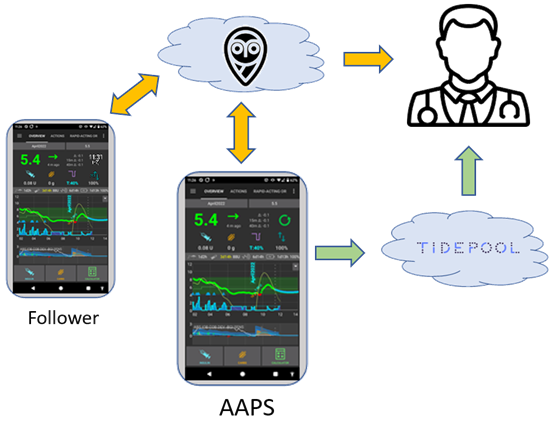

# 设置报告服务器

目前有两种报告服务器可与**AAPS**一起使用：

- [Nightscout](https://nightscout.github.io/)
- [Tidepool](https://www.tidepool.org/)



我们建议使用Nightscout。

(SettingUpTheReportingServer-nightscout)=
## Nightscout

Nightscout是一个网络应用程序，可以记录和显示您的CGM数据和**AAPS**数据，并生成报告。 它是一个功能强大的平台，已经与**AAPS**集成多年。 它使用户和护理人员能够近乎实时地跟踪患者的糖尿病数据（如果所有相关组件之间的互联网连接足够稳定，数据接收和数据提供之间可能只相隔几秒钟）。 它还允许护理人员向**AAPS**发送远程命令。

Nightscout是开源软件。 任何人都可以使用免费或付费服务来创建和运营Nightscout服务器。

您可以在[Nightscout项目网站](http://nightscout.github.io/)上找到更多信息。

### 选项1 - 自行设置您的Nightscout服务器。

创建您的Nightscout报告服务器可能需要一个或多个基于Web的应用程序，这些应用程序将需要维护。 为了获得完全免费的服务，如果服务提供商取消免费层级，您可能需要迁移您的Nightscout网站和数据。

有关如何设置Nightscout以及各种操作选项的优缺点（包括成本估算）的描述，可以在[此处](https://nightscout.github.io/nightscout/new_user/#free-diy)找到。

### 选项2 - 付费使用托管式Nightscout服务。

也有不同的服务提供商提供每月收费的Nightscout托管服务供您选择。 费用是可以管理的，而且托管服务的优势在于您无需具备IT知识，也无需拥有任何运营基础设施。


现有的Nightscout用户可以不时地重新考虑其Nightscout服务器的托管位置和方式，并在发现更合适的选项时进行更换。

一些Nightscout托管服务可以在[此处](https://nightscout.github.io/nightscout/new_user/#vendors-comparison-table)找到。

### Nightscout的进一步配置

一旦您的Nightscout实例启动并运行，请参阅[Nightscout配置页面](../SettingUpAaps/Nightscout.md)以获取其他注意事项。

(SettingUpTheReportingServer-tidepool)=
## Tidepool

Tidepool自2023年末发布的3.2版本起才可在**AAPS**中使用。

```{admonition} Tidepool with **AAPS** is only for reporting
:class: 危险 
当使用Tidepool时，**AAPS**数据接收和报告之间存在三个小时的延迟，因此Tidepool不适合与护理人员共享实时信息。  
另一方面，如果Nightscout不是一个被接受的解决方案，Tidepool可以是一个与患者内分泌科医生共享报告的好选择。  
```

Tidepool是一个[开源](https://github.com/tidepool-org)项目。 它提供在Tidepool服务器上免费运行帐户的服务。

有关如何使用AAPS设置Tidepool的更多信息，请[见此](../SettingUpAaps/Tidepool.md)。

```{admonition} **AAPS** has a the uploader for Tidepool integrated
:class: 注意
您**不需要**使用Tidepool的上传器应用程序：**AAPS**将为您上传血糖、治疗和基础率。 您只需要一个Tidepool个人帐户。 不要使用单独的Tidepool上传器工具上传您的数据，因为这会导致数值重复。  
```

## 下一步

设置好报告服务器后，您现在可以为AAPS设置一个[专用的Google帐户](../UsefulLinks/DedicatedGoogleAccountForAaps.md)，或者直接转到[构建AAPS应用程序](../SettingUpAaps/BuildingAaps.md)。 