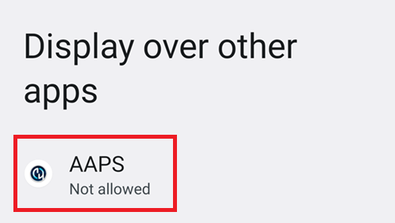
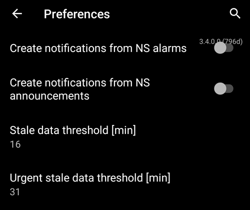

# AAPS 设置向导

当您首次启动 **AAPS** 时，**设置向导** 会引导您一次性快速完成应用程序所有的基本配置。 **设置向导** 的目的是为了避免遗漏关键步骤。 例如，**权限设置** 对于正确设置 **AAPS** 至关重要。

然而，在首次使用 **设置向导** 时，并不一定要完全配置所有内容，您可以轻松退出向导并在稍后返回。 在 **设置向导** 之后，有三种方式可以进一步优化/更改配置。 这些内容将在下一节中进行解释。 所以，如果您在设置向导中跳过了一些步骤，也没关系，您稍后可以轻松地进行配置。

在使用 **设置向导** 期间和之后，您可能发现**AAPS** 没啥明显的变化。 要启用您的 **AAPS** 循环，您必须按照 **目标** 启用各个功能。 您将在 设置向导 结束时开始**目标 1**。 您是 **AAPS** 的主人，别搞反了。

```{admonition} Preview Objectives
:class: 注意
如果您急于了解“目标（Objectives）”都是有哪些，请阅读 [完成目标](../SettingUpAaps/CompletingTheObjectives.md)，但之后请先返回这里运行 设置向导。

```

根据以往经验，我们了解到新用户往往急于尽快设置 **AAPS**，这可能会导致挫败感，因为学习曲线可能很陡峭。

因此，请花点时间配置您的闭环，运行良好的 **AAPS** 闭环将带来巨大的好处。

```{admonition} Ask for Help
:class: 注意
如果文档中有错误，或者您有更好的解释方法，您可以按照 [联系其他用户](../GettingHelp/WhereCanIGetHelp.md) 中的说明向社区寻求帮助。
```
## 欢迎信息

这只是欢迎信息，您可以点击“NEXT”按钮跳过：


## 许可协议

在最终用户许可协议中，有关于使用 **AAPS** 的法律方面的重要信息。 请仔细阅读。

如果您不理解或不能同意最终用户许可协议，请不要使用 **AAPS**！

如果您理解并同意，请点击“我理解并同意”按钮，并按照设置向导进行操作：


## 所需权限

**AAPS**需要满足一些要求才能正常运行。

In the following screen you are asked several questions you have to agree to, to get **AAPS** working. 向导本身会解释它为什么要请求相关设置。

在这一屏幕中，我们旨在提供更多背景信息，将更多技术术语翻译成普通语言或解释原因。 Continue reading below to see each permission request.


### Notifications

如果应用程序想要向您发送通知，Android 需要特殊权限。

While it is a good feature to disable notifications _e.g._ from  social media apps, it is essential that you allow **AAPS** to send you notifications.

Please click the first "ASK FOR PERMISSION" button:


选择“AAPS”应用程序：



通过将滑块向右滑动来启用“在其他应用上层显示”：


如果已启用，滑块应如下所示：


### 电池优化

Battery consumption on smartphones is a consideration, as the performance of batteries is still quite limited. Therefore, the Android operating system on your smartphone is restrictive about allowing applications to run and consume CPU time, and therefore battery power.

然而，**AAPS** 需要定期运行，例如，每几分钟接收一次血糖读数，然后根据您设定的参数来应用算法，以决定如何调整您的血糖。 因此，Android 必须允许它这样做。

您通过确认设置来做到这一点。

请点击第二个“申请权限”按钮。


请选择“允许”：


### 存储权限

**AAPS** 需要将信息记录到智能手机的永久存储中。 永久存储意味着即使在重新启动智能手机后，信息仍然可用。（PC硬盘的概念） 其他信息只是丢失了，因为它们没有被保存到永久存储中。

请点击第一个“申请权限”按钮：


点击“允许”：


点击“AAPS目录”。 这将打开手机文件系统，您可选择AAPS存储数据的位置。


默认目录为**AAPS**，但您可使用任意专用目录。 如需可新建目录，进入后选择“使用此文件夹”：


确认您要授予**AAPS**访问所选目录的权限：


点击“下一步”按钮：


### 位置

Android links the use of Bluetooth communication to the ability to use location services. 也许您在其他应用程序中也看到过这一点。 It's common to need location permission if you want to access Bluetooth.

**AAPS** uses Bluetooth to communicate with your CGM and insulin pump if they are directly controlled by **AAPS** and not another app which is used by **AAPS**. 具体细节可能因设置而异。

请点击第一个“申请权限”按钮：


这一点很重要。 否则，**AAPS** 将根本无法正常工作。

点击“在使用应用时”：


请点击第二个“申请权限”按钮：


选择“始终允许”。


点击“下一步”按钮：


## 主密码

由于 **AAPS** 的配置包含一些敏感数据（_例如_，访问您的 Nightscout 服务器的 API_KEY），因此它会被您在此处设置的密码加密。

第二句话非常重要，请**不要丢失您的主密码**。 请把它记好，_例如_放在Google Drive上。 Google Drive是一个好地方，因为它会由Google为您进行备份。 您的智能手机或电脑可能会崩溃，而您可能没有实际备份。 如果您忘记了主密码，以后可能很难恢复您的配置文件和 **目标**完成进度。

在两次填写密码后，请点击“下一步”按钮：


## 单位（mg/dL <-> mmol/L）

Please select if your glucose values are in mg/dL or mmol/L and then please click the "NEXT" button:


## 显示设置

 在这里，您选择传感器血糖显示的范围，该范围将在您设置的值之间显示为“在范围内”。 您可以暂时保留默认值，稍后再进行编辑。

您选择的值仅影响图表的图形表示，而不影响其他内容。

您的血糖目标（例如）在您的配置文件中单独配置。

用于分析 TIR（入框时间）的范围在您的报告服务器上单独配置。

请点击“下一步”按钮：


(SetupWizard-synchronization-with-the-reporting-server-and-more)=
## 与报告服务器的同步等

在这里，您正在配置数据上传到报告服务器。

您还可以在此处进行其他配置，但对于首次运行，我们将只关注报告服务器。

如果您目前无法设置，请暂时跳过此步骤。 您可以在稍后配置它。

如果您在此处左侧选择了一个项目，则可以在右侧勾选可见性（眼睛）框，这会把这个插件放置在 **AAPS** 主屏幕的顶部菜单中。 如果您此时配置报告服务器，请也选择可见性。

在此示例中，我们选择 Nightscout 作为报告服务器，并将对其进行配置。

```{admonition}  **NSClient** version
:class: 注意
点击 [这里](#version3200) 查看 **AAPS** 3.2.0.0 的发布说明，其中解释了顶部选项 **NSClient**（这是“v1”，尽管没有明确标记）和第二个选项 **NSClient v3** 之间的差异。
```
对于 Tidepool 来说更简单，因为您只需要个人登录信息。

做出选择后，请点击旁边的齿轮按钮：


您正在这里配置 Nightscout 报告服务器。

请点击“Nightscout URL”：


输入您的Nightscout URL，这是您的个人Nightscout服务器。 这只是您自己设置的 URL，或者您的 Nightscout 服务提供商提供给您的 URL。

请点击“OK”按钮：


Enter your Nightscout access token. 这是您为 Nightscout 服务器配置的访问令牌。 没有这个令牌，将无法访问。

如果您目前看不到它，请查看 **AAPS** 文档中关于设置报告服务器的文档。

After filling in the "**Nightscout access token**" and clicking "OK", please click on the "Synchronization" button:


Please select "Upload data to NS" if you already configured Nightscout in the previous steps of the Setup Wizard.

如果您在 Nightscout 上存储了配置文件并希望将它们下载到 **AAPS**，请启用“Receive profile store”：


返回上一屏幕并选择“警报选项”：



现在，请将开关保持禁用状态。 我们带您浏览此界面，是为了让您熟悉未来可能需要配置的选项。 目前没有必要进行这些配置。

返回之前的屏幕并选择“连接设置”。

在这里，您可以配置如何将数据传输到报告服务器。

看护人必须启用“使用手机流量（use cellular connection）”，否则被看护人的智能手机（例如，孩子的手机）无法在 WiFi 范围外（_例如_，在上学的路上）上传数据。

其他**AAPS**用户若希望节省流量或电量，可禁用手机流量。

如果有疑问，请将所有选项保持启用状态。

返回之前的屏幕并选择“高级设置”。


如果您想在报告服务器上获取此信息，请启用“Log app start to NS”。 这可以帮助您（特别是作为护理人员）远程了解应用程序是否以及何时被重新启动。

一开始通过 Nightscout来查看 **AAPS** 停止或启动可能挺好玩，但时间长了一般就没啥必要了。

启用“从错误中创建公告”和“从所需碳水化合物警报中创建公告”。

将“减慢上传速度”保持禁用状态。 仅在特殊情况下使用此功能，例如需向Nightscout服务器传输大量数据，且该服务器处理速度较慢时。

返回两次，在插件列表中选择“下一步”以转到下一个屏幕：


## 患者名称

在这里，您可以在 **AAPS** 中设置您的姓名。

这可能是任何原因。 这只是为了区分用户。

为了简单起见，请输入名字和姓氏。

点击“下一步”转到下一个屏幕。


## 患者类型

在这里，您选择“患者类型”，这很重要，因为 **AAPS** 根据患者的年龄有不同的限制。 出于安全和保护隐私的原因，这一点非常重要。

在这里，您还可以配置**餐时大剂量的最大上限**。 也就是说，这是你需要用来应对日常餐食的最大剂量。 这是一个安全功能，有助于避免输注餐时大剂量的时候意外过量给药。

第二个限制在概念上类似，但与您预期的最大碳水化合物摄入量有关。

设置这些值后，点击“下一步”转到下一个屏幕：


## 使用的胰岛素

选择泵中使用的胰岛素类型。

胰岛素的名称应该是不言自明的。

```{admonition} Don't use the "Free-Peak Oref" unless you know what you are doing
:class: 危险
对于高级用户或医学研究，可以使用“Free-Peak Oref”定义自定义配置文件，说明胰岛素如何起作用。 除非您是专家，否则请不要使用它，通常预定义的值对每种品牌胰岛素都有效。
```

点击“下一步”转到下一个屏幕：


## 血糖数据来源

选择您正在使用的 BG 来源。 请阅读您 [血糖数据源](../Getting-Started/CompatiblesCgms.md) 的文档。

由于有多个选项可用，我们不会在这里解释所有选项的配置。 We are using xDrip+ in our example here:


Enable the visibility in the top level menu by clicking the check box on the right side.

做出选择后，点击“下一步”转到下一个屏幕：


Click on the cogwheel button to access the settings.

启用“将血糖数据上传到NS”和“将探头更换记录到NS”。

返回并点击“下一步”转到下一个屏幕：


(setup-wizard-profile)=
## 配置文件

现在，我们进入设置向导的一个非常重要的部分。

在接下来的屏幕上输入您的配置文件详细信息之前，请先阅读有关 [配置文件](../SettingUpAaps/YourAapsProfile.md) 的文档。

```{admonition} Working profile required - no exceptions here !
:class: 危险
准确的配置文件是确保**AAPS**安全运行的必要条件。

您必须与医生共同制定并讨论您的治疗方案，且通过基础率、胰岛素敏感系数（ISF）及碳水化合物比率（IC）测试验证其有效性！

如果机器人输入错误，它将始终无法正常工作。 **AAPS** 只能根据给定的信息工作。 如果您的配置方案太猛，您可能会面临低血糖的风险；而如果方案太柔，则可能会面临高血糖的风险。 
```

点击“下一步”转到下一个屏幕。 输入一个“配置文件名称”：


如果需要，长期来看你可以拥有多个配置文件。 我们在这里只创建一个。

```{admonition} Profile only for tutorial - not for your usage
:class: 信息
此处的示例配置文件仅用于向您展示如何输入数据。

它不打算作为准确的配置文件或优化得很好的配置文件，因为每个人的需求都大不相同。

不要用它来实际配置闭环！
```

输入您的 [胰岛素作用持续时间（DIA）](#your-aaps-profile-duration-of-insulin-action)（小时）。 然后点击“IC”：


输入您的 [IC](#your-aaps-profile-insulin-to-carbs-ratio) 值：


点击“ISF”。 输入您的[胰岛素敏感系数（ISF）](#your-aaps-profile-insulin-sensitivity-factor)值：


点击"BAS". 输入您的[基础率](#your-aaps-profile-basal-rates)：


点击 "TARG"。 输入你的目标血糖值。

对于开环，这里的目标范围可以设置得宽一些，否则**AAPS**会不断提示您更改临时基础率或其他设置，有时候可能挺烦人。

之后，对于闭环系统，你通常只会有一个上限值和下限值。 这样，**AAPS**更容易达到目标值，并为您提供更好的糖尿病整体控制。

输入/确认目标值：


通过点击“保存”来保存配置文件：


保存后，新的"激活配置文件"按钮将出现。

```{admonition} Several defined but only one active profile
:class: 信息
你可以定义多个配置文件，但在任何给定时间只有一个激活的配置文件在运行。
```

点击“激活配置文件”：


出现配置文件切换对话框。 在这种情况下，让它保持为预设值。

```{admonition} Several defined but only one active profile
:class: 信息
稍后您将学习如何使用此通用对话框来处理疾病或运动等情况，在这些情况下，您需要更改适合当前情况的配置。
```


点击“确定”：


出现配置文件切换的确认对话框。

你可以通过点击“确定”来确认。 点击“下一步”转到下一个屏幕：


你的配置文件现在已经设置好了：


## 胰岛素泵


现在你要选择你的胰岛素泵。

你会看到一个重要的警告对话框。 请阅读它，然后点击“确定”。

如果你已经在之前的步骤中设置好了配置文件，并且知道如何连接你的泵，那么现在可以随意连接它。

否则，使用左上角的箭头退出设置向导，让**AAPS**首先显示一些血糖值。 你可以随时回来，或者使用直接的配置选项（不使用向导）。

请阅读您的[胰岛素泵](../Getting-Started/CompatiblePumps.md)文档。

点击“下一步”转到下一个屏幕。


在此，我们选择“虚拟泵”。

点击“下一步”转到下一个屏幕：


## APS算法

使用OpenAPS SMB算法作为您的APS算法。 尽管功能名称包含"SMB"，但该算法功能将保持禁用状态，直至您完成以下前提条件：​熟悉AAPS操作且通过初始目标考核。 与OpenAPS AMA相比，OpenAPS SMB是较新的版本，通常也更好。

在开始阶段禁用SMB功能的原因是，SMB功能通过超级微型大剂量来更快地应对血糖升高，而不是增加基础率百分比。 在开始时，您的配置通常不如经过一段时间的使用后那么好，因此一开始禁用了此功能。

```{admonition} Only use the older algorithm **OpenAPS AMA** if you know what you are doing
:class: 信息
OpenAPS AMA是最基本的算法，不支持用SMB纠正高血糖。 在某些情况下，使用此算法可能更好，但它不是推荐选项。
```

点击齿轮图标以查看详细信息：


只需阅读文本，不要在此处进行任何更改。

由于**目标（Objectives）**所带来的限制，您目前反正无法使用“闭环”或“SMB功能”。

返回并点击“下一步”转到下一个屏幕：


## 灵敏度检测

选择“Sensitivity Oref1”作为灵敏度插件的标准选项。

点击“下一步”转到下一个屏幕：


## 开始目标1

你现在正在进入“目标”设置。 这是获得进一步**AAPS**功能的资格要求。

在这里，我们开始目标1，即使目前我们的设置还没有完全准备好成功完成这个目标。

但这是开始。

点击绿色“开始”开始目标1：


您会看到您已经取得了一些进展，但还有其他领域需要完成。

点击“完成”以进入下一个屏幕。


您来到了**AAPS**的主屏幕。

在这里，您可以在**AAPS**中找到您设置配置文件时的信息消息。

这是在我们切换到新配置时完成的。

你可以点击“稍后再提醒”，它就会消失。


如果您在任何时候意外退出了设置向导，您可以简单地重新启动向导，或者手动更改[AAPS闭环的配置](../SettingUpAaps/ChangeAapsConfiguration.md)。

如果您的**AAPS**闭环已经全部设置完成，请继续阅读下一节[“完成目标”](../SettingUpAaps/CompletingTheObjectives.md)。