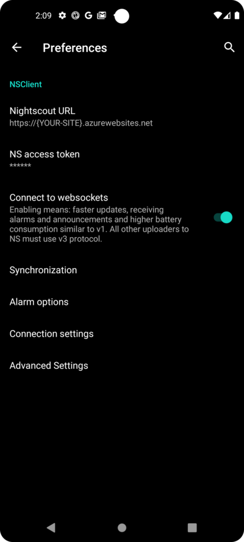
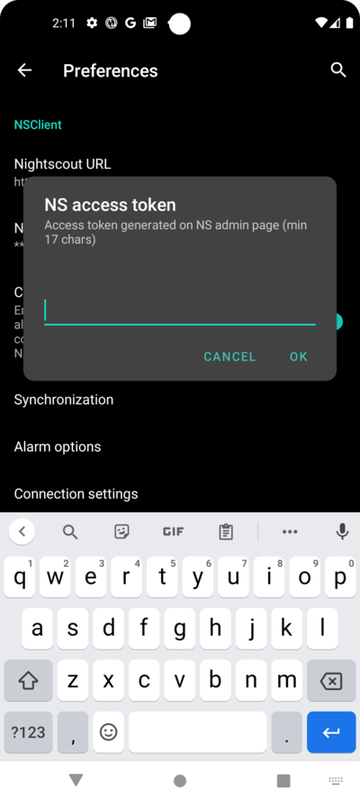
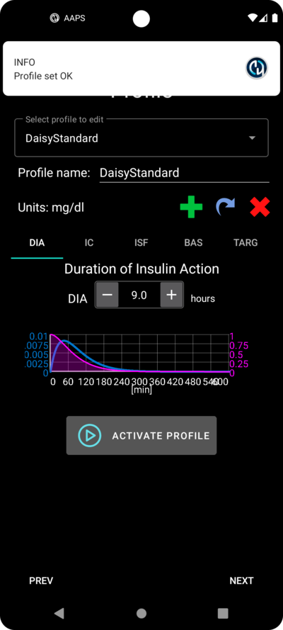

# AAPS 设置向导

当您首次启动 **AAPS** 时，**设置向导** 会引导您一次性快速完成应用程序所有的基本配置。 **设置向导** 的目的是为了避免遗漏关键步骤。 例如，**权限设置** 对于正确设置 **AAPS** 至关重要。

然而，在首次使用 **设置向导** 时，并不一定要完全配置所有内容，您可以轻松退出向导并在稍后返回。 在 **设置向导** 之后，有三种方式可以进一步优化/更改配置。 这些内容将在下一节中进行解释。 所以，如果您在设置向导中跳过了一些步骤，也没关系，您稍后可以轻松地进行配置。

在使用 **设置向导** 期间和之后，您可能发现**AAPS** 没啥明显的变化。 要启用您的 **AAPS** 循环，您必须按照 **目标** 启用各个功能。 您将在 设置向导 结束时开始**目标 1**。 您是 **AAPS** 的主人，别搞反了。

```{admonition} Preview Objectives
:class: 注意
如果您急于了解“目标（Objectives）”都是有哪些，请阅读 [完成目标](../SettingUpAaps/CompletingTheObjectives.md)，但之后请先返回这里运行 设置向导。

```

根据以往经验，我们了解到新用户往往急于尽快设置 **AAPS**，这可能会导致挫败感，因为学习曲线可能很陡峭。

因此，请花点时间配置您的闭环，运行良好的 **AAPS** 闭环将带来巨大的好处。

```{admonition} Ask for Help
:class: 注意
如果文档中有错误，或者您有更好的解释方法，您可以按照 [联系其他用户](../GettingHelp/WhereCanIGetHelp.md) 中的说明向社区寻求帮助。
```
## AAPS 设置向导的逐步指南
### 欢迎信息

这只是欢迎信息，您可以点击“NEXT”按钮跳过：


### 许可协议

在最终用户许可协议中，有关于使用 **AAPS** 的法律方面的重要信息。 请仔细阅读。

如果您不理解或不能同意最终用户许可协议，请不要使用 **AAPS**！

如果您理解并同意，请点击“我理解并同意”按钮，并按照设置向导进行操作：


### 所需权限

**AAPS**需要满足一些要求才能正常运行。

在接下来的屏幕中，您会被问到几个问题，您必须同意这些问题，才能使 **AAPS** 正常工作。 向导本身会解释它为什么要请求相关设置。

在这一屏幕中，我们旨在提供更多背景信息，将更多技术术语翻译成普通语言或解释原因。

请点击“下一步”按钮：


智能手机的电池消耗仍然是一个需要考虑的问题，因为电池的性能仍然相当有限。 因此，您智能手机上的 Android 操作系统对允许应用程序运行和消耗 CPU 时间（以及因此消耗电池电量）有相当严格的限制。

然而，**AAPS** 需要定期运行，例如，每几分钟接收一次血糖读数，然后根据您设定的参数来应用算法，以决定如何调整您的血糖。 因此，Android 必须允许它这样做。

您通过确认设置来做到这一点。

请点击“请求权限”按钮：


请选择“允许”：


如果应用程序想要向您发送通知，Android 需要特殊权限。

虽然禁用社交媒体应用程序等通知是一个很好的功能，但允许 **AAPS** 发送通知至关重要。

请点击“请求权限”按钮：


选择“AAPS”应用程序：


通过将滑块向右滑动来启用“在其他应用上层显示”：


如果已启用，滑块应如下所示：


Android 将蓝牙通信的使用与定位服务的使用联系起来。 也许您在其他应用程序中也看到过这一点。 如果要使用蓝牙，通常需要位置权限。

如果您的动态和泵直接由 **AAPS** 控制，而不是由 **AAPS** 使用的另一个应用程序控制，**AAPS** 会使用蓝牙与它们通信。 具体细节可能因设置而异。

请点击“请求权限”按钮：


这一点很重要。 否则，**AAPS** 将根本无法正常工作。

点击“在使用应用时”：


点击“下一步”按钮：


**AAPS** 需要将信息记录到智能手机的永久存储中。 永久存储意味着即使在重新启动智能手机后，信息仍然可用。（PC硬盘的概念） 其他信息只是丢失了，因为它们没有被保存到永久存储中。

请点击“请求权限”按钮：


点击“允许”：


您会收到通知，告知您需要在更改后重新启动智能手机才能使其生效。

**请不要现在停止设置向导**。 您可以等完成设置向导之后再说。

点击“OK”，然后点击“下一步”按钮：


### 主密码

由于 **AAPS** 的配置包含一些敏感数据（_例如_，访问您的 Nightscout 服务器的 API_KEY），因此它会被您在此处设置的密码加密。

第二句话非常重要，请**不要丢失您的主密码**。 请把它记好，_例如_放在Google Drive上。 Google Drive是一个好地方，因为它会由Google为您进行备份。 您的智能手机或电脑可能会崩溃，而您可能没有实际备份。 如果您忘记了主密码，以后可能很难恢复您的配置文件和 **目标**完成进度。

在两次填写密码后，请点击“下一步”按钮：


### Fabric 上传

在这里，您可以设置使用自动化崩溃和使用情况报告服务。

虽然这不是强制性的，但使用它是一个好习惯。

它有助于开发人员更好地了解您对应用程序的使用情况，并告知他们发生的崩溃情况。

他们获得：

1. 应用程序崩溃的信息，这对开发者来说很重要，因为在他们自己的设置中一切正常，所以他们可能不知道应用程序已经崩溃。
1. 在发送的数据（崩溃信息）中，有关于崩溃发生的情况和正在使用的配置类型的信息。

因此，它有助于开发人员改进应用程序。

请通过向右滑动滑块来启用“Fabric 上传”：


此外，您可以填写身份信息，以防开发人员想联系您询问问题或紧急情况：


填写完您的“联系信息”后，点击“确定”按钮。 联系信息可以是您在 Facebook、Discord 上的身份标识，... 只是您认为有助于通过最佳途径联系您的信息：


点击“下一步”按钮：


### 单位（mg/dL <-> mmol/L）

请选择您的血糖值是以 mg/dl 还是 mmol/L 为单位，然后点击“下一步”按钮：


### 显示设置

 在这里，您选择传感器血糖显示的范围，该范围将在您设置的值之间显示为“在范围内”。 您可以暂时保留默认值，稍后再进行编辑。

您选择的值仅影响图表的图形表示，而不影响其他内容。

您的血糖目标（例如）在您的配置文件中单独配置。

用于分析 TIR（入框时间）的范围在您的报告服务器上单独配置。

请点击“下一步”按钮：


(SetupWizard-synchronization-with-the-reporting-server-and-more)=
### 与报告服务器的同步等

在这里，您正在配置数据上传到报告服务器。

您还可以在此处进行其他配置，但对于首次运行，我们将只关注报告服务器。

如果您目前无法设置，请暂时跳过此步骤。 您可以在稍后配置它。

如果您在此处左侧选择了一个项目，则可以在右侧勾选可见性（眼睛）框，这会把这个插件放置在 **AAPS** 主屏幕的顶部菜单中。 如果您此时配置报告服务器，请也选择可见性。

在此示例中，我们选择 Nightscout 作为报告服务器，并将对其进行配置。

```{admonition}  Make sure to choose the correct **NSClient** version for your needs! 
:class: 注意
点击 [这里](#version3200) 查看 **AAPS** 3.2.0.0 的发布说明，其中解释了顶部选项 **NSClient**（这是“v1”，尽管没有明确标记）和第二个选项 **NSClient v3** 之间的差异。

Nightscout 用户应选择 **NSClient v3**，除非您想通过 Nightscout 监控或发送远程治疗（例如，作为使用 **AAPS** 的儿童的家长或看护人），在这种情况下，请选择第一个选项“**NSClient**”，直到另行通知。 
```
对于 Tidepool 来说更简单，因为您只需要个人登录信息。

做出选择后，请点击旁边的齿轮按钮：


您正在这里配置 Nightscout 报告服务器。

请点击“Nightscout URL”：



输入您的Nightscout URL，这是您的个人Nightscout服务器。 这只是您自己设置的 URL，或者您的 Nightscout 服务提供商提供给您的 URL。

请点击“OK”按钮：


输入您的 Nightscout 访问令牌。 这是您为 Nightscout 服务器配置的访问令牌。 没有这个令牌，将无法访问。

如果您目前看不到它，请查看 **AAPS** 文档中关于设置报告服务器的文档。

在填写“**NS访问令牌（NS access token）**”并点击“OK”后，请点击“同步（Synchronization）”按钮：



如果您已经在设置向导的先前步骤中配置了 Nightscout，请选择“Upload data to NS”。

如果您在 Nightscout 上存储了配置文件并希望将它们下载到 **AAPS**，请启用“Receive profile store”：


返回上一屏幕并选择“警报选项”：


现在，请将开关保持禁用状态。 我们之所以走到这一步，只是为了让您熟悉您将来可能会配置的一些可能选项。 目前没有必要进行这些配置。

返回之前的屏幕并选择“连接设置”。

在这里，您可以配置如何将数据传输到报告服务器。

看护人必须启用“使用手机流量（use cellular connection）”，否则被看护人的智能手机（例如，孩子的手机）无法在 WiFi 范围外（_例如_，在上学的路上）上传数据。

其他 **AAPS** 用户可以禁用通过手机流量的传输以节省流量或电池电量。

如果有疑问，请将所有选项保持启用状态。

返回之前的屏幕并选择“高级设置”。


如果您想在报告服务器上获取此信息，请启用“Log app start to NS”。 这可以帮助您（特别是作为护理人员）远程了解应用程序是否以及何时被重新启动。

一开始通过 Nightscout来查看 **AAPS** 停止或启动可能挺好玩，但时间长了一般就没啥必要了。

启用“从错误中创建公告”和“从所需碳水化合物警报中创建公告”。

将“减慢上传速度”保持禁用状态。 您只有在特殊情况下才会使用它，例如，当有大量信息需要传输到Nightscout服务器，而Nightscout服务器处理这些数据时速度较慢时。

返回两次，在插件列表中选择“下一步”以转到下一个屏幕：


### 患者名称

在这里，您可以在 **AAPS** 中设置您的姓名。

这可能是任何原因。 这只是为了区分用户。

为了简单起见，请输入名字和姓氏。

点击“下一步”转到下一个屏幕。


### 患者类型

在这里，您选择“患者类型”，这很重要，因为 **AAPS** 根据患者的年龄有不同的限制。 出于安全和保护隐私的原因，这一点非常重要。

在这里，您还可以配置**餐时大剂量的最大上限**。 也就是说，这是你需要用来应对日常餐食的最大剂量。 这是一个安全功能，有助于避免输注餐时大剂量的时候意外过量给药。

第二个限制在概念上类似，但与您预期的最大碳水化合物摄入量有关。

设置这些值后，点击“下一步”转到下一个屏幕：


### 使用的胰岛素

选择泵中使用的胰岛素类型。

胰岛素的名称应该是不言自明的。

```{admonition} Don't use the "Free-Peak Oref" unless you know what you are doing
:class: 危险
对于高级用户或医学研究，可以使用“Free-Peak Oref”定义自定义配置文件，说明胰岛素如何起作用。 除非您是专家，否则请不要使用它，通常预定义的值对每种品牌胰岛素都有效。
```

点击“下一步”转到下一个屏幕：


### 血糖数据来源

选择您正在使用的 BG 来源。 请阅读您 [血糖数据源](../Getting-Started/CompatiblesCgms.md) 的文档。

由于有多个选项可用，我们不会在这里解释所有选项的配置。 我们在此示例中使用 Dexcom G6 和 BYODA 应用程序：


如果您使用 Dexcom G6 和 BYODA，请通过点击右侧的复选框在顶层菜单中启用可见性。

做出选择后，点击“下一步”转到下一个屏幕：


如果您使用 Dexcom G6 和 BYODA，请点击齿轮按钮访问 BYODA 的设置。

启用“将血糖数据上传到NS”和“将探头更换记录到NS”。

返回并点击“下一步”转到下一个屏幕：


(setup-wizard-profile)=
### 配置文件

现在，我们进入设置向导的一个非常重要的部分。

在接下来的屏幕上输入您的配置文件详细信息之前，请先阅读有关 [配置文件](../SettingUpAaps/YourAapsProfile.md) 的文档。

```{admonition} Working profile required - no exceptions here !
:class: 危险
准确的配置文件对于控制 **AAPS** 的安全操作是必要的
您必须与医生确定并讨论您的配置文件，并且确保基础率、ISF 和 IC已经验证无误。

如果机器人输入错误，它将始终无法正常工作。 **AAPS** 只能根据给定的信息工作。 如果您的配置方案太猛，您可能会面临低血糖的风险；而如果方案太柔，则可能会面临高血糖的风险。 
```

点击“下一步”转到下一个屏幕。 输入一个“配置文件名称”：


如果需要，长期来看你可以拥有多个配置文件。 我们在这里只创建一个。

```{admonition} Profile only for tutorial - not for your usage
:class: 信息
此处的示例配置文件仅用于向您展示如何输入数据。

它不打算作为准确的配置文件或优化得很好的配置文件，因为每个人的需求都大不相同。

不要用它来实际配置闭环！
```

输入您的 [胰岛素作用持续时间（DIA）](#your-aaps-profile-duration-of-insulin-action)（小时）。 然后点击“IC”：


输入您的 [IC](#your-aaps-profile-insulin-to-carbs-ratio) 值：


点击“ISF”。 输入您的[胰岛素敏感系数（ISF）](#your-aaps-profile-insulin-sensitivity-factor)值：


点击"BAS". 输入您的[基础率](#your-aaps-profile-basal-rates)：


点击 "TARG"。 输入你的目标血糖值。

对于开环，这里的目标范围可以设置得宽一些，否则**AAPS**会不断提示您更改临时基础率或其他设置，有时候可能挺烦人。

之后，对于闭环系统，你通常只会有一个上限值和下限值。 这样，**AAPS**更容易达到目标值，并为您提供更好的糖尿病整体控制。

输入/确认目标值：


通过点击“保存”来保存配置文件：


保存后，会出现一个新的按钮“激活配置文件”。

```{admonition} Several defined but only one active profile
:class: 信息
你可以定义多个配置文件，但在任何给定时间只有一个激活的配置文件在运行。
```

点击“激活配置文件”：


出现配置文件切换对话框。 在这种情况下，让它保持为预设值。

```{admonition} Several defined but only one active profile
:class: 信息
稍后您将学习如何使用此通用对话框来处理疾病或运动等情况，在这些情况下，您需要更改适合当前情况的配置。
```


点击“确定”：


出现配置文件切换的确认对话框。

你可以通过点击“确定”来确认。 点击“下一步”转到下一个屏幕：


你的配置文件现在已经设置好了：




### 胰岛素泵


现在你要选择你的胰岛素泵。

你会看到一个重要的警告对话框。 请阅读它，然后点击“确定”。

如果你已经在之前的步骤中设置好了配置文件，并且知道如何连接你的泵，那么现在可以随意连接它。

否则，使用左上角的箭头退出设置向导，让**AAPS**首先显示一些血糖值。 你可以随时回来，或者使用直接的配置选项（不使用向导）。

请阅读您的[胰岛素泵](../Getting-Started/CompatiblePumps.md)文档。

点击“下一步”转到下一个屏幕。


在此，我们选择“虚拟泵”。

点击“下一步”转到下一个屏幕：


### APS algorithm

使用OpenAPS SMB算法作为您的APS算法。 尽管名称中包含SMB，但在您熟悉AAPS并完成第一个目标之前，SMB功能是被禁用的。 与OpenAPS AMA相比，OpenAPS SMB是较新的版本，通常也更好。

在开始阶段禁用SMB功能的原因是，SMB功能通过超级微型大剂量来更快地应对血糖升高，而不是增加基础率百分比。 在开始时，您的配置通常不如经过一段时间的使用后那么好，因此一开始禁用了此功能。

```{admonition} Only use the older algorithm **OpenAPS AMA** if you know what you are doing
:class: 信息
OpenAPS AMA是最基本的算法，不支持用SMB纠正高血糖。 在某些情况下，使用此算法可能更好，但它不是推荐选项。
```

点击齿轮图标以查看详细信息：


只需阅读文本，不要在此处进行任何更改。

由于**目标（Objectives）**所带来的限制，您目前反正无法使用“闭环”或“SMB功能”。

返回并点击“下一步”转到下一个屏幕：


### APS模式

保持“Open Loop（开环）”选中状态。

点击“下一步”转到下一个屏幕：


### 灵敏度检测

选择“Sensitivity Oref1”作为灵敏度插件的标准选项。

点击“下一步”转到下一个屏幕：


### 开始目标1

你现在正在进入“目标”设置。 这是获得进一步**AAPS**功能的资格要求。

在这里，我们开始目标1，即使目前我们的设置还没有完全准备好成功完成这个目标。

但这是开始。

点击绿色“开始”开始目标1：


您会看到您已经取得了一些进展，但还有其他领域需要完成。

点击“完成”以进入下一个屏幕。


您来到了**AAPS**的主屏幕。

在这里，您可以在**AAPS**中找到您设置配置文件时的信息消息。

这是在我们切换到新配置时完成的。

你可以点击“稍后再提醒”，它就会消失。


如果您在任何时候意外退出了设置向导，您可以简单地重新启动向导，或者手动更改[AAPS闭环的配置](../SettingUpAaps/ChangeAapsConfiguration.md)。

如果您的**AAPS**闭环已经全部设置完成，请继续阅读下一节[“完成目标”](../SettingUpAaps/CompletingTheObjectives.md)。