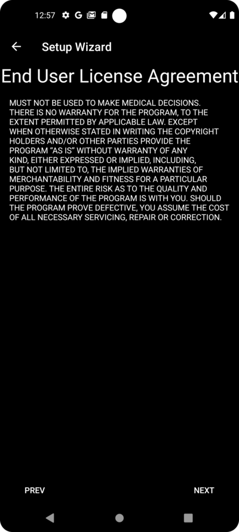
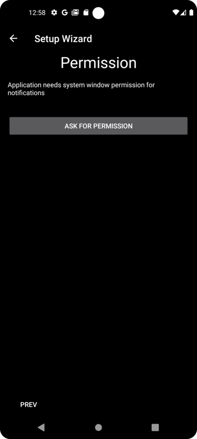
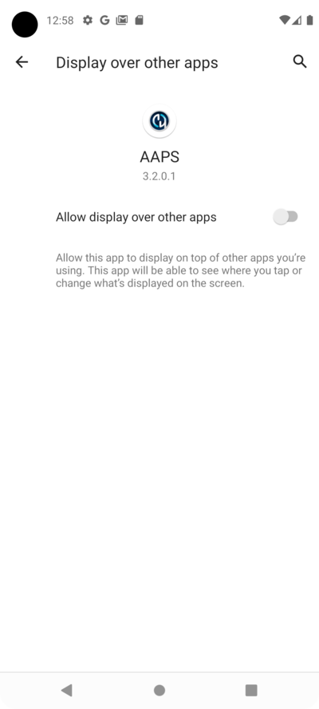
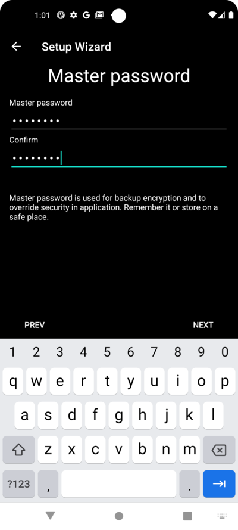
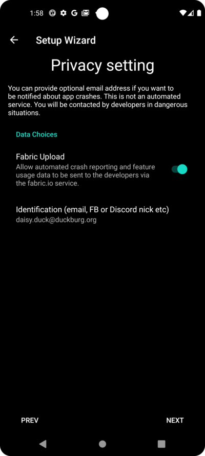
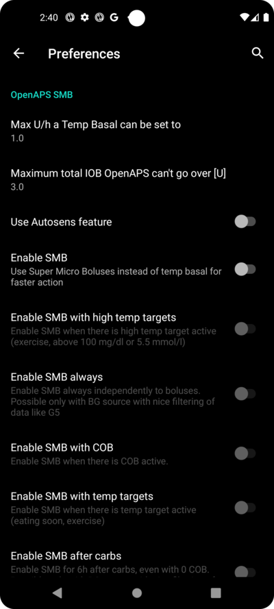

# AAPS Setup Wizard

当您首次启动 **AAPS** 时，**设置向导** 会引导您一次性快速完成应用程序所有的基本配置。 **设置向导** 的目的是为了避免遗漏关键步骤。 例如，**权限设置** 对于正确设置 **AAPS** 至关重要。

然而，在首次使用 **设置向导** 时，并不一定要完全配置所有内容，您可以轻松退出向导并在稍后返回。 在 **设置向导** 之后，有三种方式可以进一步优化/更改配置。 These will be explained in the next section. So, it's okay if you skip some points in the Setup Wizard, you can easily configure them later.

在使用 **设置向导** 期间和之后，您可能发现**AAPS** 没啥明显的变化。 要启用您的 **AAPS** 循环，您必须按照 **目标** 启用各个功能。 您将在 设置向导 结束时开始**目标 1**。 您是 **AAPS** 的主人，别搞反了。

```{admonition} Preview Objectives
:class: 注意
如果您急于了解“目标（Objectives）”都是有哪些，请阅读 [完成目标](../SettingUpAaps/CompletingTheObjectives.md)，但之后请先返回这里运行 设置向导。

```

根据以往经验，我们了解到新用户往往急于尽快设置 **AAPS**，这可能会导致挫败感，因为学习曲线可能很陡峭。

因此，请花点时间配置您的闭环，运行良好的 **AAPS** 闭环将带来巨大的好处。

```{admonition} Ask for Help
:class: note
If there is an error in the documentation or you have a better idea for how something can be explained, you can ask for help from the community as explained at [Connect with other users](../GettingHelp/WhereCanIGetHelp.md).
```
## Step-wise guide to the AAPS Setup Wizard
### Welcome message

This is just the welcome message which you can skip with the "NEXT" button:


### License agreement

在最终用户许可协议中，有关于使用 **AAPS** 的法律方面的重要信息。 Please read it carefully.

如果您不理解或不能同意最终用户许可协议，请不要使用 **AAPS**！

If you understand and agree, please click the "I UNDERSTAND AND AGREE" button and follow the Setup Wizard:


### Required permissions

**AAPS**需要满足一些要求才能正常运行。

在接下来的屏幕中，您会被问到几个问题，您必须同意这些问题，才能使 **AAPS** 正常工作。 The Wizard itself explains why it asks for the relevant setting.

In this screen, we aim to give some more background information, translate more technical speak into common language or explain the reason.

Please click the "NEXT" button:



Battery consumption on smartphones is still a consideration, as the performance of the batteries is still quite limited. Therefore, the Android operating system on your smartphone is quite restrictive about allowing applications to run and consume CPU time, and therefore battery power.

然而，**AAPS** 需要定期运行，例如，每几分钟接收一次血糖读数，然后根据您的设定的参数来应用算法，以决定如何调整您的血糖。 Therefore it must be allowed to do so by Android.

You do this by confirming the setting.

Please click the "ASK FOR PERMISSION" button:


Please select "Allow":


Android requires special permission for apps if they want to send you notifications.

虽然禁用社交媒体应用程序等通知是一个很好的功能，但允许 **AAPS** 发送通知至关重要。

Please click the "ASK FOR PERMISSION" button:




Select the "AAPS" app:


Enable "Allow display over other apps" by sliding the slider to the right:



The slider should look this way if it is enabled:


Android links the use of bluetooth communication to the ability to use location services. Perhaps you have seen it with other apps too. It's common to need location permission if you want to access bluetooth.

如果您的动态和泵直接由 **AAPS** 控制，而不是由 **AAPS** 使用的另一个应用程序控制，**AAPS** 会使用蓝牙与它们通信。 Details may differ from setup to setup.

Click the "ASK FOR PERMISSION" button:


This is important. 否则，**AAPS** 将根本无法正常工作。

Click "While using the app":


Click the "NEXT" button:


**AAPS** 需要将信息记录到智能手机的永久存储（硬盘的概念，关机不丢数据）中。 Permanent storage means that it will be available even after rebooting your smartphone. Other information is just lost, as it is not saved to permanent storage.

Click the "ASK FOR PERMISSION" button:


Click "Allow":


You are being informed that you have to reboot your smartphone after this change to take effect.

**请不要现在停止设置向导**。 You can do it after finishing the Setup Wizard.

Click "OK" and then the "NEXT" button:


### 主密码

由于 **AAPS** 的配置包含一些敏感数据（_例如_，访问您的 Nightscout 服务器的 API_KEY），因此它会被您在此处设置的密码加密。

第二句话非常重要，请**不要丢失您的主密码**。 请把它记好，_例如_放在Google Drive上。 Google Drive is a good place as it is backed up by Google for you. Your smartphone or PC can crash and you may have no actual copy. If you forget your Master Password, it can be difficult to recover your profile configuration and progress through the **Objectives** at a later date.

After filling in the password twice, please click the "NEXT" button:




### Fabric upload

Here you can setup the usage of an automated crash and usage reporting service.

It's not mandatory, but it is good practice to use it.

It helps the developers to better understand your usage of the app, and informs them about crashes which happen.

They get:

1. The information that the app crashed, which they would not otherwise know since in their own set-up everything works fine and
1. In the send data (crash information), there is information about the circumstances under which the crash happened, and what kind of configuration is being used.

So it helps the developers to improve the app.

Please enable the "Fabric Upload" by sliding the slider to the right:


Furthermore you can identify yourself that just in case the developers want to reach out to you for questions or urgent concerns:


After filling in your "contact information" click the "OK" button. Contact information can be your identification on Facebook, on Discord, ... Just the information you think is helpful to contact you through the best route:


Click the "NEXT" button:



### Units (mg/dL <-> mmol/L)

Please select if your glucose values are in mg/dl or mmol/L and then please click the "NEXT" button:


### Display settings

 Here you select the range for the sensor glucose display, which will be shown as "in range" between the values you set. You can leave it as the default values for now, and edit it later.

The values you choose only affect the graphical presentation of the diagram, and nothing else.

Your glucose target _e.g._ is configured separately in your profile.

Your range to analyze TIR (time in range) is configured separately in your reporting server.

Please press the "NEXT" button:


(SetupWizard-synchronization-with-the-reporting-server-and-more)=
### Synchronization with the reporting server and more

Here you are configuring the data upload to your reporting server.

You could do other configurations here too, but for the first run we will just focus on the reporting server.

If you are not able to set it up at the moment, skip it for now. You can configure it later.

If you select an item here on the left tick box, on the right you can then ticking the visibility (eye) box, which will place this plugin in the upper menu on the **AAPS** home screen. Please select the visibility too if you configure your reporting server at this point.

In this example we select Nightscout as reporting server, and will configure it.

```{admonition}  Make sure to choose the correct **NSClient** version for your needs! 
:class: Note

Click [here](#version3200) for the release notes of **AAPS** 3.2.0.0 which explain the differences between the top option **NSClient** (this is "v1", although it is not explicitly labelled) and the second option, **NSClient v3**.

Nightscout users should choose **NSClient v3**, unless you want to monitor or send remote treatments (_e.g._ as a parent or caregiver using **AAPS** for a child) through Nightscout, in which case, choose the first option "**NSClient**" until further notice. 
```
For Tidepool it is even simpler, as you only need your personal login information.

After making your selection, please press the cogwheel button next to the item you selected :


Here you are configuring the Nightscout reporting server.

Please click on "Nightscout URL":


Enter you Nightscout URL which is your personal Nightscout server. It's just an URL you setup yourself, or you were given from your service provider for Nightscout.

Please click the "OK" button:


Enter your nightscout access token. This is the access token for your Nightscout server you configured. Without this token, access will not work.

If you don't have it at the moment please check the documentation for setting up the reporting server in the **AAPS** documentation.

After filling in the "**NS access token**" and clicking "OK", please click on the "Synchronization" button:


Please select "Upload data to NS" if you already configured nightscout in the previous steps of the Setup Wizard.

If you have stored profiles on Nightscout and want to download them to **AAPS**, enable "Receive profile store":


Go back to the previous screen and select "Alarm option":


For now, leave the switches disabled. We only walked to the screen to make you familar with possible options you might configure in the future. At the moment there is no need to do it.

Go back to the previous screen before and select "Connection settings".

Here you can configure how to transfer your data to the reporting server.

Caregivers must enable "use cellular connection" as otherwise the smartphone which serves the dependant/child can not upload data outside of WiFi range _e.g._ on the way to school.

Other **AAPS** users can disable the tranfer via cellular connection if they want to save data or battery.

If in doubt, just leave all enabled.

Go back to the screen before and select "Advanced Settings".


Enable "Log app start to NS" if you want get this information in the reporting server. It can help you to know remotely if and when the app has been restarted, particularly as a caregiver.

It might be interesting to see if **AAPS** is correctly configured now, but later it is usually not that important to be able to see **AAPS** stopping or starting in Nightscout.

Enable "Create announcements from errors" and "Create announcements from carbs required alerts".

Leave "Slow down uploads" disabled. You would only use it in unusual circumstances if for example a lot of information is to be transfered to the Nightscout server, and the Nightscout server is being slow in processing this data.

Go back twice, to the list of plugins and select "NEXT" to go to the next screen:


### 患者名称

Here you can setup your name in **AAPS**.

It can be anything. It's just for differentiating users.

To keep it simple just enter first name and last name.

Press "NEXT" to go to the next screen.


### 患者类型

Here you select your "Patient type" which is important, as the **AAPS** software has different limits, depending on the age of the patient. This is important for security and safety reasons.

Here is where you also configure the **maximum allowed bolus** for a meal. That is, the largest bolus you need to give to cover your typical meals. It's a security feature to help avoid accidentally overdosing when you are bolusing for meal.

The second limit is similar in concept, but relates to the max carbohydrate intake you expect.

After setting these values, press "NEXT" to go to the next screen:


### Used insulin

Select the type of insulin being used in the pump.

The insulin names should be self-explanatory.

```{admonition} Don't use the "Free-Peak Oref" unless you know what you are doing
:class: danger
For advanced users or medical studies there is the possibility to define with "Free-Peak Oref" a customised profile of how insulin acts. Please don't use it unless you are an expert, usually the pre-defined values work well for each branded insulin.
```

Press "NEXT" to go to the next screen:


### Blood sugar source

Select the BG source you are using. Please read the documentation for your [BG source](../Getting-Started/CompatiblesCgms.md).

As there are several options available, we don't explain the configuration for all of them here. We are using Dexcom G6 with the BYODA app in our example here:


If you are using Dexcom G6 with BYODA, enable the visibility in the top level menu by clicking the tickbox on the right side.

After making your selection, press "NEXT" to go to the next screen:


If you are using Dexcom G6 with BYODA, click on the cogwheel button to access the settings for BYODA.

Enable the "Upload BG data to NS" and "Log sensor change to NS".

Go back and press "NEXT" to go to the next screen:


(setup-wizard-profile)=
### 配置文件

Now we are entering a very important part of the Setup Wizard.

Please read the documentation about [profiles](../SettingUpAaps/YourAapsProfile.md) before you try to enter your profile details on the following screen.

```{admonition} Working profile required - no exceptions here !
:class: danger
An accurate profile is necessary to control the safe action of **AAPS**

It's required that you have determined and discussed your profile with your doctor, and that it has been proven to work by successful basal rate, ISF and IC testing!

If a robot has an incorrect input it will fail - consistently. **AAPS** can only work with the information it is given. If your profile is too strong, you risk hypoglycemia, and if it is too weak, you risk hyperglycemia. 
```

Press "NEXT" to go to the next screen. Enter a "profile name":


You can have several profiles in the long-term if needed. We only create one here.

```{admonition} Profile only for tutorial - not for your usage
:class: information
The example profile here is only to show you how to enter data.

It is not intended to be an accurate profile or something very well optimised, because each person's needs are so different.

Don't use it for actually looping!
```

Enter your [Duration of insulin Action (DIA)](#your-aaps-profile-duration-of-insulin-action) in hours. Then press "IC":


Enter your [IC](#your-aaps-profile-insulin-to-carbs-ratio) values:


Press "ISF". Enter your [ISF values](#your-aaps-profile-insulin-sensitivity-factor):


Press "BAS". Enter your [basal values](#your-aaps-profile-basal-rates):


Press "TARG". Enter your blood sugar target values.

For open looping this target can be a wider range, as otherwise **AAPS** notifies you permanently to change the temporary basal rate or another setting, which can be exhausting.

Later, for closed looping, you will generally have only one value for top and bottom. That makes it easier for **AAPS** to hit the target and give you better overall diabetes control.

Enter/confirm the target values:


Save the profile by clicking on "SAVE":


After saving a new buttom "Activate Profile" occurs.

```{admonition} Several defined but only one active profile
:class: information
You can have several profiles defined, but only one activated profile running at any given time.
```

Press "Activate Profile":


The profile switch dialogue appears. In this case let it stay as preset.

```{admonition} Several defined but only one active profile
:class: information
You will learn later how to use this general dialog to handle situations like illness or sport, where you need to change your profile suitable for the circumstances.
```


Press "OK":


A confirmation dialog for the profile switch appears.

You can confirm it with pressing "OK". Press "NEXT" to go to the next screen:


Your profile has now been set:


### 胰岛素泵


Now you are selecting your insulin pump.

You get an important warning dialog. Please read it, and press "OK".

If your have already setup your profile in the steps before and you know how to connect your pump, feel free to connect it now.

Otherwise, leave the Setup Wizard, using the arrow in the top left corner and let **AAPS** first show you some blood glucose values. You can come back anytime or use one of the direct configuration options (not using the Wizard).

Please read the documentation for your [insulin pump](../Getting-Started/CompatiblePumps.md).

Press "NEXT" to go to the next screen.


In this case we select "Virtual Pump".

Press "NEXT" to go to the next screen:


### APS algorithm

Use the OpenAPS SMB algorithm as your APS algorithm. Despite the name the SMB feature of the algorithm is disabled until you are familar with AAPS and already worked through the first objectives. OpenAPS SMB is newer and in general better compared to the OpenAPS AMA anyway.

The reason SMB is disabled in the beginning is because the SMB feature enables faster reaction on blood sugar increase through the Super Micro Bolus instead of increasing the basal rate percentage. As in the beginning your profile is in general not as good as after some time of experience the feature is disabled in the beginning.

```{admonition} Only use the older algorithm **OpenAPS AMA** if you know what you are doing
:class: information
OpenAPS AMA is the most basic algorithm which does not support micro boluses to correct high values. There might be circumstances where it is better to use this algorithm but it is not the recommendation.
```

Press the cogwheel to see the details:


Only read the text and change nothing here.

Due to the limitations which are imposed by the **Objectives** you can't use either "closed loop" or "SMB features" at the moment anyway.

Go back and press "NEXT" to go to the next screen:



### APS模式

Let "Open Loop" remain selected.

Press "NEXT" to go to the next screen:


### 灵敏度检测

Let "Sensitivity Oref1" the standard for the sensitivity plugins selected.

Press "NEXT" to go to the next screen:


### Start Objective 1

You are entering now the Objectives. The qualification for access to further **AAPS** features.

Here we start Objective 1, even if at the moment our setup is not completely ready to successfully complete this Objective.

But this is the start.

Press the green "START" to to start objective 1:


You see that you already made some progress, but other areas are to be done.

Press "FINISH" to go to the next screen.


You are coming to the home screen of **AAPS**.

Here you find the information message in **AAPS** that you set your profile.

This was done when we switched to our new profile.

You can click "SNOOZE" and it will disappear.


If you accidentally leave the Setup Wizard at any point, you can either simply re-start the Wizard, or change the [configuration of the AAPS loop](../SettingUpAaps/ChangeAapsConfiguration.md) manually.

If your **AAPS** loop is now fully setup, please move on to the next section ["Completing the objectives"](../SettingUpAaps/CompletingTheObjectives.md).