# AAPS 设置向导

当您首次启动 **AAPS** 时，**设置向导** 会引导您一次性快速完成应用程序所有的基本配置。 **设置向导** 的目的是为了避免遗漏关键步骤。 例如，**权限设置** 对于正确设置 **AAPS** 至关重要。

然而，在首次使用 **设置向导** 时，并不一定要完全配置所有内容，您可以轻松退出向导并在稍后返回。 在 **设置向导** 之后，有三种方式可以进一步优化/更改配置。 这些内容将在下一节中进行解释。 所以，如果您在设置向导中跳过了一些步骤，也没关系，您稍后可以轻松地进行配置。

在使用 **设置向导** 期间和之后，您可能发现**AAPS** 没啥明显的变化。 要启用您的 **AAPS** 循环，您必须按照 **目标** 启用各个功能。 您将在 设置向导 结束时开始**目标 1**。 您是 **AAPS** 的主人，别搞反了。

```{admonition} Preview Objectives
:class: 注意
如果您急于了解“目标（Objectives）”都是有哪些，请阅读 [完成目标](../SettingUpAaps/CompletingTheObjectives.md)，但之后请先返回这里运行 设置向导。

```

根据以往经验，我们了解到新用户往往急于尽快设置 **AAPS**，这可能会导致挫败感，因为学习曲线可能很陡峭。

因此，请花点时间配置您的闭环，运行良好的 **AAPS** 闭环将带来巨大的好处。

```{admonition} Ask for Help
:class: 注意
如果文档中有错误，或者您有更好的解释方法，您可以按照 [联系其他用户](../GettingHelp/WhereCanIGetHelp.md) 中的说明向社区寻求帮助。
```
## AAPS 设置向导的逐步指南
### 欢迎信息

这只是欢迎信息，您可以点击“NEXT”按钮跳过：

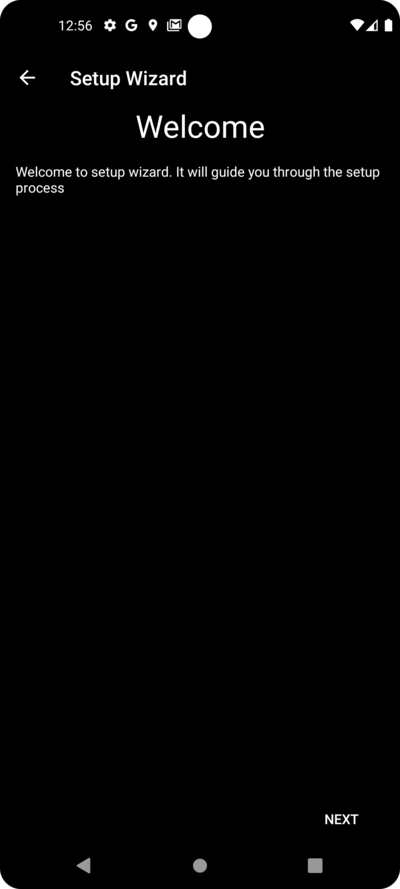

### 许可协议

在最终用户许可协议中，有关于使用 **AAPS** 的法律方面的重要信息。 请仔细阅读。

如果您不理解或不能同意最终用户许可协议，请不要使用 **AAPS**！

如果您理解并同意，请点击“我理解并同意”按钮，并按照设置向导进行操作：


### 所需权限

**AAPS**需要满足一些要求才能正常运行。

在接下来的屏幕中，您会被问到几个问题，您必须同意这些问题，才能使 **AAPS** 正常工作。 向导本身会解释它为什么要请求相关设置。

在这一屏幕中，我们旨在提供更多背景信息，将更多技术术语翻译成普通语言或解释原因。

请点击“下一步”按钮：


智能手机的电池消耗仍然是一个需要考虑的问题，因为电池的性能仍然相当有限。 因此，您智能手机上的 Android 操作系统对允许应用程序运行和消耗 CPU 时间（以及因此消耗电池电量）有相当严格的限制。

然而，**AAPS** 需要定期运行，例如，每几分钟接收一次血糖读数，然后根据您设定的参数来应用算法，以决定如何调整您的血糖。 因此，Android 必须允许它这样做。

您通过确认设置来做到这一点。

请点击“请求权限”按钮：

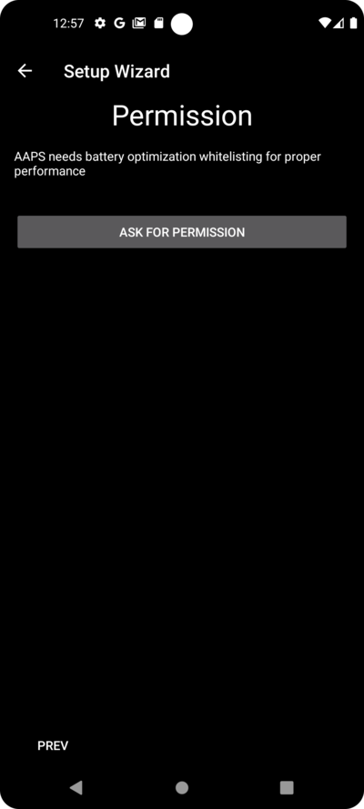

请选择“允许”：


如果应用程序想要向您发送通知，Android 需要特殊权限。

虽然禁用社交媒体应用程序等通知是一个很好的功能，但允许 **AAPS** 发送通知至关重要。

请点击“请求权限”按钮：


选择“AAPS”应用程序：


通过将滑块向右滑动来启用“在其他应用上层显示”：


如果已启用，滑块应如下所示：


Android 将蓝牙通信的使用与定位服务的使用联系起来。 也许您在其他应用程序中也看到过这一点。 如果要使用蓝牙，通常需要位置权限。

如果您的动态和泵直接由 **AAPS** 控制，而不是由 **AAPS** 使用的另一个应用程序控制，**AAPS** 会使用蓝牙与它们通信。 具体细节可能因设置而异。

请点击“请求权限”按钮：


这一点很重要。 否则，**AAPS** 将根本无法正常工作。

点击“在使用应用时”：


点击“下一步”按钮：


**AAPS** 需要将信息记录到智能手机的永久存储中。 永久存储意味着即使在重新启动智能手机后，信息仍然可用。（PC硬盘的概念） 其他信息只是丢失了，因为它们没有被保存到永久存储中。

请点击“请求权限”按钮：


点击“允许”：


您会收到通知，告知您需要在更改后重新启动智能手机才能使其生效。

**请不要现在停止设置向导**。 您可以等完成设置向导之后再说。

点击“OK”，然后点击“下一步”按钮：


### 主密码

由于 **AAPS** 的配置包含一些敏感数据（_例如_，访问您的 Nightscout 服务器的 API_KEY），因此它会被您在此处设置的密码加密。

第二句话非常重要，请**不要丢失您的主密码**。 请把它记好，_例如_放在Google Drive上。 Google Drive is a good place as it is backed up by Google for you. Your smartphone or PC can crash and you may have no actual copy. 如果您忘记了主密码，以后可能很难恢复您的配置文件和 **目标**完成进度。

After filling in the password twice, please click the "NEXT" button:


### Fabric upload

Here you can setup the usage of an automated crash and usage reporting service.

It's not mandatory, but it is good practice to use it.

It helps the developers to better understand your usage of the app, and informs them about crashes which happen.

They get:

1. The information that the app crashed, which they would not otherwise know since in their own set-up everything works fine and
1. In the send data (crash information), there is information about the circumstances under which the crash happened, and what kind of configuration is being used.

So it helps the developers to improve the app.

Please enable the "Fabric Upload" by sliding the slider to the right:


Furthermore you can identify yourself that just in case the developers want to reach out to you for questions or urgent concerns:


After filling in your "contact information" click the "OK" button. Contact information can be your identification on Facebook, on Discord, ... Just the information you think is helpful to contact you through the best route:


点击“下一步”按钮：


### 单位（mg/dL <-> mmol/L）

Please select if your glucose values are in mg/dl or mmol/L and then please click the "NEXT" button:

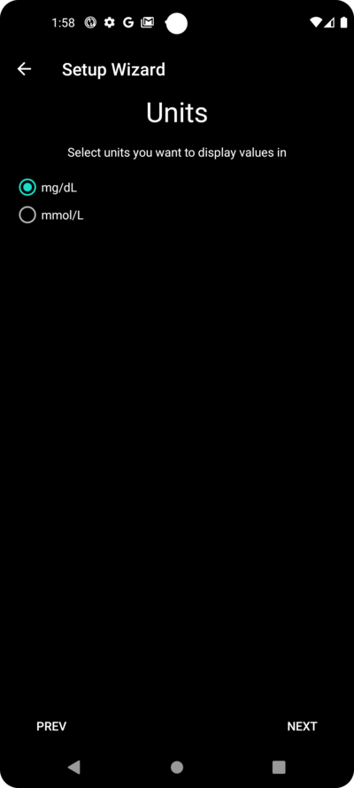

### Display settings

 Here you select the range for the sensor glucose display, which will be shown as "in range" between the values you set. You can leave it as the default values for now, and edit it later.

The values you choose only affect the graphical presentation of the diagram, and nothing else.

您的血糖目标（例如）在您的配置文件中单独配置。

Your range to analyze TIR (time in range) is configured separately in your reporting server.

Please press the "NEXT" button:

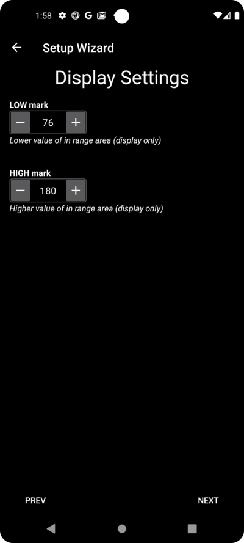

(SetupWizard-synchronization-with-the-reporting-server-and-more)=
### Synchronization with the reporting server and more

Here you are configuring the data upload to your reporting server.

You could do other configurations here too, but for the first run we will just focus on the reporting server.

If you are not able to set it up at the moment, skip it for now. You can configure it later.

如果您在此处左侧选择了一个项目，则可以在右侧勾选可见性（眼睛）框，这会把这个插件放置在 **AAPS** 主屏幕的顶部菜单中。 Please select the visibility too if you configure your reporting server at this point.

In this example we select Nightscout as reporting server, and will configure it.

```{admonition}  Make sure to choose the correct **NSClient** version for your needs! 
:class: 注意
点击 [这里](#version3200) 查看 **AAPS** 3.2.0.0 的发布说明，其中解释了顶部选项 **NSClient**（这是“v1”，尽管没有明确标记）和第二个选项 **NSClient v3** 之间的差异。

Nightscout 用户应选择 **NSClient v3**，除非您想通过 Nightscout 监控或发送远程治疗（例如，作为使用 **AAPS** 的儿童的家长或看护人），在这种情况下，请选择第一个选项“**NSClient**”，直到另行通知。 
```
For Tidepool it is even simpler, as you only need your personal login information.

After making your selection, please press the cogwheel button next to the item you selected :

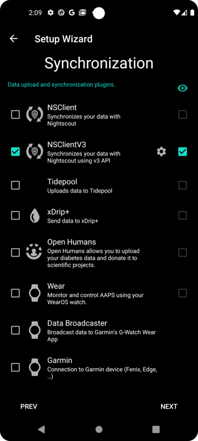

Here you are configuring the Nightscout reporting server.

Please click on "Nightscout URL":


Enter you Nightscout URL which is your personal Nightscout server. It's just an URL you setup yourself, or you were given from your service provider for Nightscout.

Please click the "OK" button:


Enter your nightscout access token. This is the access token for your Nightscout server you configured. Without this token, access will not work.

如果您目前看不到它，请查看 **AAPS** 文档中关于设置报告服务器的文档。

在填写“**NS访问令牌（NS access token）**”并点击“OK”后，请点击“同步（Synchronization）”按钮：


Please select "Upload data to NS" if you already configured nightscout in the previous steps of the Setup Wizard.

如果您在 Nightscout 上存储了配置文件并希望将它们下载到 **AAPS**，请启用“Receive profile store”：


Go back to the previous screen and select "Alarm option":

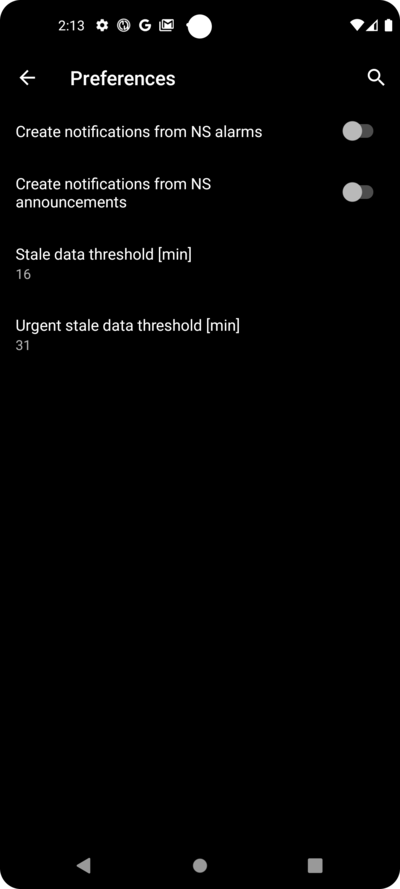

For now, leave the switches disabled. We only walked to the screen to make you familar with possible options you might configure in the future. At the moment there is no need to do it.

Go back to the previous screen before and select "Connection settings".

Here you can configure how to transfer your data to the reporting server.

看护人必须启用“使用手机流量（use cellular connection）”，否则被看护人的智能手机（例如，孩子的手机）无法在 WiFi 范围外（_例如_，在上学的路上）上传数据。

其他 **AAPS** 用户可以禁用通过手机流量的传输以节省流量或电池电量。

If in doubt, just leave all enabled.

Go back to the screen before and select "Advanced Settings".

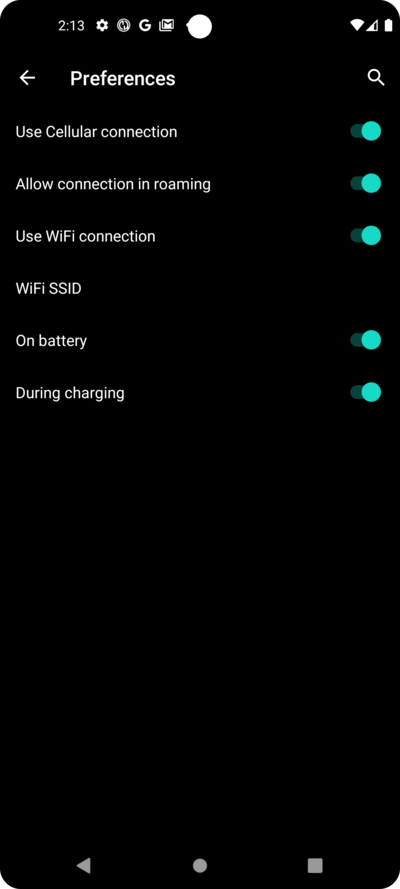

Enable "Log app start to NS" if you want get this information in the reporting server. It can help you to know remotely if and when the app has been restarted, particularly as a caregiver.

一开始通过 Nightscout来查看 **AAPS** 停止或启动可能挺好玩，但时间长了一般就没啥必要了。

Enable "Create announcements from errors" and "Create announcements from carbs required alerts".

Leave "Slow down uploads" disabled. You would only use it in unusual circumstances if for example a lot of information is to be transfered to the Nightscout server, and the Nightscout server is being slow in processing this data.

Go back twice, to the list of plugins and select "NEXT" to go to the next screen:


### 患者名称

在这里，您可以在 **AAPS** 中设置您的姓名。

It can be anything. It's just for differentiating users.

To keep it simple just enter first name and last name.

Press "NEXT" to go to the next screen.


### 患者类型

在这里，您选择“患者类型”，这很重要，因为 **AAPS** 根据患者的年龄有不同的限制。 This is important for security and safety reasons.

在这里，您还可以配置**餐时大剂量的最大上限**。 That is, the largest bolus you need to give to cover your typical meals. It's a security feature to help avoid accidentally overdosing when you are bolusing for meal.

The second limit is similar in concept, but relates to the max carbohydrate intake you expect.

After setting these values, press "NEXT" to go to the next screen:


### Used insulin

Select the type of insulin being used in the pump.

The insulin names should be self-explanatory.

```{admonition} Don't use the "Free-Peak Oref" unless you know what you are doing
:class: 危险
对于高级用户或医学研究，可以使用“Free-Peak Oref”定义自定义配置文件，说明胰岛素如何起作用。 除非您是专家，否则请不要使用它，通常预定义的值对每种品牌胰岛素都有效。
```

Press "NEXT" to go to the next screen:


### Blood sugar source

Select the BG source you are using. 请阅读您 [血糖数据源](../Getting-Started/CompatiblesCgms.md) 的文档。

As there are several options available, we don't explain the configuration for all of them here. We are using Dexcom G6 with the BYODA app in our example here:


If you are using Dexcom G6 with BYODA, enable the visibility in the top level menu by clicking the tickbox on the right side.

After making your selection, press "NEXT" to go to the next screen:


If you are using Dexcom G6 with BYODA, click on the cogwheel button to access the settings for BYODA.

Enable the "Upload BG data to NS" and "Log sensor change to NS".

Go back and press "NEXT" to go to the next screen:

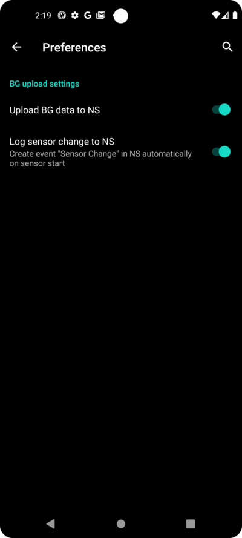

(setup-wizard-profile)=
### 配置文件

Now we are entering a very important part of the Setup Wizard.

在接下来的屏幕上输入您的配置文件详细信息之前，请先阅读有关 [配置文件](../SettingUpAaps/YourAapsProfile.md) 的文档。

```{admonition} Working profile required - no exceptions here !
:class: 危险
准确的配置文件对于控制 **AAPS** 的安全操作是必要的
您必须与医生确定并讨论您的配置文件，并且确保基础率、ISF 和 IC已经验证无误。

如果机器人输入错误，它将始终无法正常工作。 **AAPS** 只能根据给定的信息工作。 如果您的配置方案太猛，您可能会面临低血糖的风险；而如果方案太柔，则可能会面临高血糖的风险。 
```

Press "NEXT" to go to the next screen. Enter a "profile name":

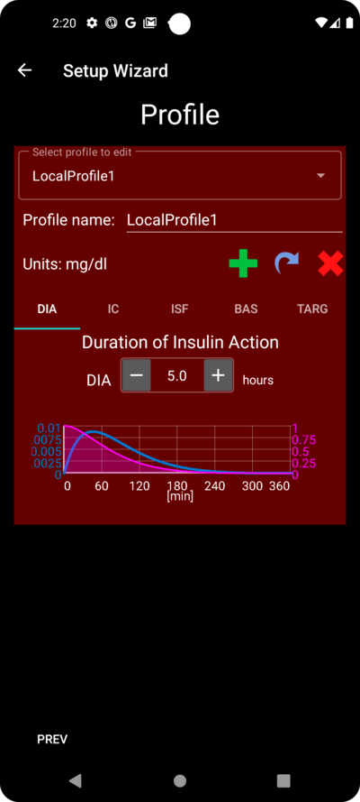


You can have several profiles in the long-term if needed. We only create one here.

```{admonition} Profile only for tutorial - not for your usage
:class: 信息
此处的示例配置文件仅用于向您展示如何输入数据。

它不打算作为准确的配置文件或优化得很好的配置文件，因为每个人的需求都大不相同。

不要用它来实际配置闭环！
```

输入您的 [胰岛素作用持续时间（DIA）](#your-aaps-profile-duration-of-insulin-action)（小时）。 Then press "IC":


输入您的 [IC](#your-aaps-profile-insulin-to-carbs-ratio) 值：

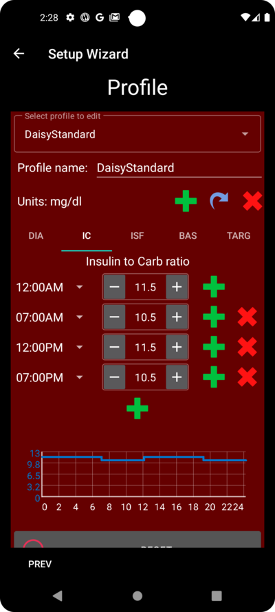

Press "ISF". 输入您的[胰岛素敏感系数（ISF）](#your-aaps-profile-insulin-sensitivity-factor)值：


Press "BAS". 输入您的[基础率](#your-aaps-profile-basal-rates)：


Press "TARG". Enter your blood sugar target values.

对于开环，这里的目标范围可以设置得宽一些，否则**AAPS**会不断提示您更改临时基础率或其他设置，有时候可能挺烦人。

Later, for closed looping, you will generally have only one value for top and bottom. 这样，**AAPS**更容易达到目标值，并为您提供更好的糖尿病整体控制。

Enter/confirm the target values:


Save the profile by clicking on "SAVE":


After saving a new buttom "Activate Profile" occurs.

```{admonition} Several defined but only one active profile
:class: information
You can have several profiles defined, but only one activated profile running at any given time.
```

Press "Activate Profile":

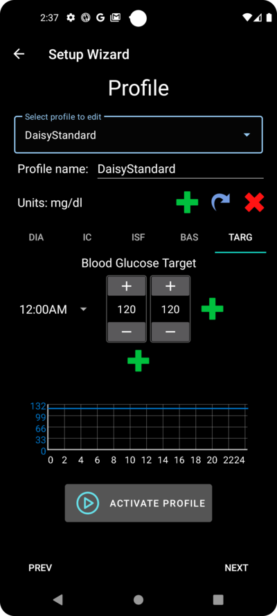


The profile switch dialogue appears. In this case let it stay as preset.

```{admonition} Several defined but only one active profile
:class: information
You will learn later how to use this general dialog to handle situations like illness or sport, where you need to change your profile suitable for the circumstances.
```


Press "OK":


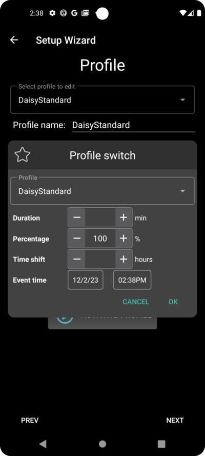


A confirmation dialog for the profile switch appears.

You can confirm it with pressing "OK". Press "NEXT" to go to the next screen:


Your profile has now been set:


### 胰岛素泵


Now you are selecting your insulin pump.

You get an important warning dialog. Please read it, and press "OK".

If your have already setup your profile in the steps before and you know how to connect your pump, feel free to connect it now.

否则，使用左上角的箭头退出设置向导，让**AAPS**首先显示一些血糖值。 You can come back anytime or use one of the direct configuration options (not using the Wizard).

请阅读您的[胰岛素泵](../Getting-Started/CompatiblePumps.md)文档。

Press "NEXT" to go to the next screen.

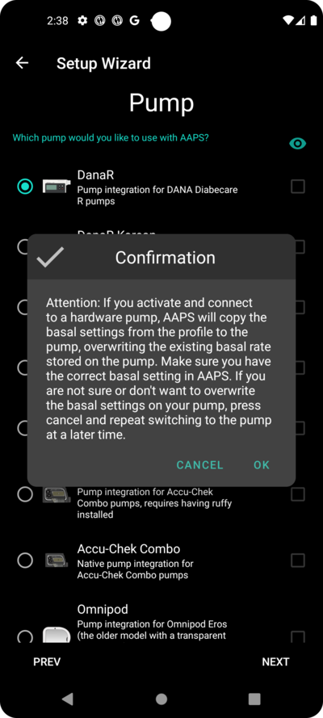


In this case we select "Virtual Pump".

Press "NEXT" to go to the next screen:

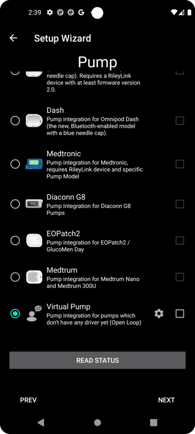

### APS algorithm

Use the OpenAPS SMB algorithm as your APS algorithm. Despite the name the SMB feature of the algorithm is disabled until you are familar with AAPS and already worked through the first objectives. OpenAPS SMB is newer and in general better compared to the OpenAPS AMA anyway.

The reason SMB is disabled in the beginning is because the SMB feature enables faster reaction on blood sugar increase through the Super Micro Bolus instead of increasing the basal rate percentage. 在开始时，您的配置通常不如经过一段时间的使用后那么好，因此一开始禁用了此功能。

```{admonition} Only use the older algorithm **OpenAPS AMA** if you know what you are doing
:class: 信息
OpenAPS AMA是最基本的算法，不支持用SMB纠正高血糖。 在某些情况下，使用此算法可能更好，但它不是推荐选项。
```

Press the cogwheel to see the details:


Only read the text and change nothing here.

由于**目标（Objectives）**所带来的限制，您目前反正无法使用“闭环”或“SMB功能”。

Go back and press "NEXT" to go to the next screen:


### APS模式

Let "Open Loop" remain selected.

Press "NEXT" to go to the next screen:


### 灵敏度检测

选择“Sensitivity Oref1”作为灵敏度插件的标准选项。

Press "NEXT" to go to the next screen:


### Start Objective 1

You are entering now the Objectives. 这是获得进一步**AAPS**功能的资格要求。

Here we start Objective 1, even if at the moment our setup is not completely ready to successfully complete this Objective.

But this is the start.

Press the green "START" to to start objective 1:


You see that you already made some progress, but other areas are to be done.

Press "FINISH" to go to the next screen.


您来到了**AAPS**的主屏幕。

在这里，您可以在**AAPS**中找到您设置配置文件时的信息消息。

This was done when we switched to our new profile.

You can click "SNOOZE" and it will disappear.


如果您在任何时候意外退出了设置向导，您可以简单地重新启动向导，或者手动更改[AAPS闭环的配置](../SettingUpAaps/ChangeAapsConfiguration.md)。

如果您的**AAPS**闭环已经全部设置完成，请继续阅读下一节[“完成目标”](../SettingUpAaps/CompletingTheObjectives.md)。