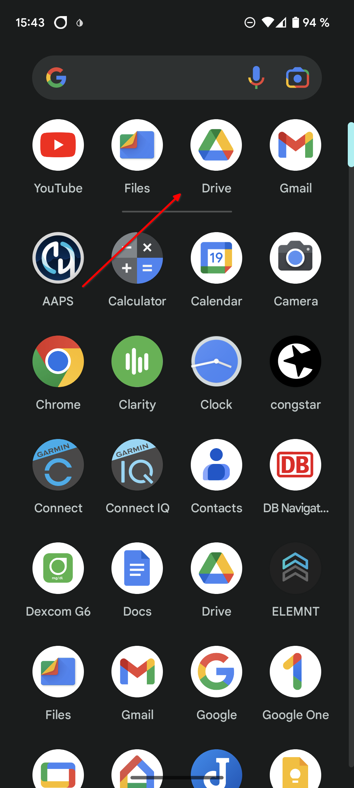

# 在智能手机上传输和安装AAPS

在之前的部分，[构建AAPS](../SettingUpAaps/BuildingAaps.md)中，您已经在计算机上构建了AAPS应用程序（这是一个.apk文件）。

接下来的步骤是将**AAPS** APK文件（以及您可能需要的其他应用程序，如BYODA、Xdrip+或其他CGM接收器应用程序）**传输**到您的Android智能手机上，然后**安装**这些应用程序。

在智能手机上安装**AAPS**之后，您就可以继续进行[**配置AAPS闭环**](../SettingUpAaps/SetupWizard.md)了。

有多种方法可以将**AAPS** APK文件从计算机传输到智能手机。 在这里，我们介绍两种不同的方法：

* 方法一 - 使用您的Google drive（Gdrive）
* 方法二 - 使用USB数据线

请注意，通过电子邮件传输可能会造成困难，因此不建议使用。

## 方法 1. 使用Google drive传输文件

在您的网络浏览器中打开[Google.com](https://www.google.com/)，并登录到您的Google帐户。

在右上角，从谷歌菜单中选择“云端硬盘”应用。


在Google Drive应用中，右键点击文件和文件夹下方的空白区域，然后选择“上传文件”。


现在，Apk文件应该已经上传到了Google Drive。


### 使用Google Drive应用执行APK文件进行安装

切换到您的手机并启动Google Drive应用。 它是一个预装的应用程序，可以在其他谷歌应用程序所在的位置找到，或者通过搜索应用程序的名称来找到。



在移动设备的Google Drive应用中，找到APK文件名并点击以开始安装过程。


如果您收到安全提示，告知您当前不允许从Google Drive安装应用，请允许此次操作，但之后请务必禁用此功能，因为始终允许此功能会带来安全风险。


安装完成后，您就完成了这一步。

您应该能够看到**AAPS**图标，并能够打开应用程序。

```{warning}
重要安全提示
您是否记得禁止从Google Drive安装应用？
```

请继续[配置AAPS闭环](../SettingUpAaps/SetupWizard.md)。

## 方法 2. 使用USB数据线传输文件
将AAPS apk文件传输到智能手机的第二种方法是使用[USB线](https://support.google.com/android/answer/9064445?hl=en)。

使用USB数据线将电脑上的文件传输到手机上的“下载”文件夹中。

在手机上，您需要允许从未知来源安装应用。 有关如何执行此操作的说明可以在互联网上找到（_例如_[这里](https://www.expressvpn.com/de/support/vpn-setup/enable-apk-installs-android/)或[这里](https://www.androidcentral.com/unknown-sources)）。

一旦您通过拖动的方式完成了文件传输，要安装它的话，请打开手机上的“下载”文件夹，长按APK文件，然后选择“安装”。 然后，您可以继续下一步，[设置向导](../SettingUpAaps/SetupWizard.md)，它将帮助您在智能手机上设置**AAPS**应用程序和闭环。

请继续[配置AAPS闭环](../SettingUpAaps/SetupWizard.md)。