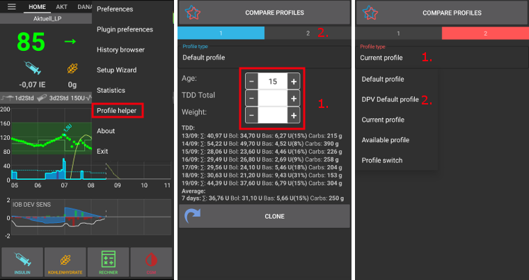
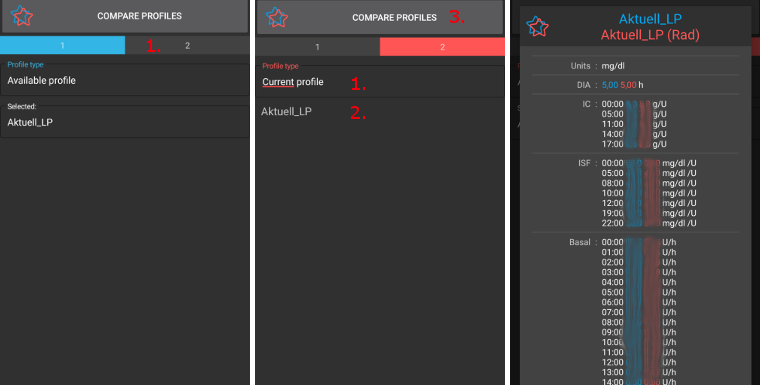

# 你的AAPS配置文件

**你的AAPS配置文件**是一组五个关键参数，定义了AAPS如何根据你的传感器血糖水平来输注胰岛素。 这些参数是AAPS运行的基础。 随着你完成各个**目标**，你将解锁额外的可修改参数（如SMB设置），但这些功能的性能依赖于你的底层**配置文件**是否正确。 配置文件包括：
* [胰岛素作用时间](#duration-of-insulin-action-dia) (DIA),
* [目标血糖](#glucose-targets)，
* [基础率](#basal-rates) (BR),
* [胰岛素敏感因子](#insulin-sensitivity-factor-isf)（ISF）
* [碳水系数](#insulin-to-carb-ratio-icr)（IC或ICR）

作为AAPS管理的一部分，用户应不断评估和审查其**配置文件**设置的准确性。 建议按照这里提供的顺序调整设置。 在更改另一个设置之前，确保一个设置正确。 以小步骤进行更改，而不是一次性进行大幅更改。 不要忘记在每次更改后激活新的配置文件。 通过导出你的偏好设置来定期[备份你的**配置文件**](#YourAapsProfile_Profile-backup)设置。

**配置文件**的设置会相互影响——有时候虽然设置有问题但运行起来没问题，但多数情况下不会这样。 例如，如果基础率过高恰好与碳水化合物比例过高同时发生。 这意味着你需要单独考虑每个设置，并检查它们在各种情况下是否和谐工作。

你可以使用[Autotune](https://autotuneweb.azurewebsites.net/)来指导你的思考，但不应盲目跟随：它可能不适用于你或所有情况。

```{admonition} Your diabetes may vary
:class: 信息
**配置文件**因人而异，差异显著。

对于基础率（BR）、胰岛素敏感因子（ISF）和碳水系数（IC或ICR），胰岛素需求的绝对值和趋势因个人的生物学特征、性别、年龄、健康状况等因素而异，还受到短期因素如疾病和近期运动的影响。 有关此方面的更多指导，Adam Brown的书籍[“亮点与雷区（Brights Spots and Landmines）”](https://diatribe.org/bright-spots-and-landmines/)是一本值得一读的优秀书籍。

```

最后四个参数（血糖目标、基础率、胰岛素敏感因子和碳水系数）可以设置为不同的值，如果需要，可以每小时更改一次，持续24小时。


以下是AAPS中**示例**配置文件的屏幕截图。 请注意，下面的示例配置文件显示了大量时间点。 当你刚开始使用**AAPS**时，你的配置文件可能非常简单。

(your-aaps-profile-duration-of-insulin-action)=
## 胰岛素作用时间（DIA）

### 描述

胰岛素衰减到零所需的时间长度。

胰岛素作用时间在AAPS中设置为单一值，因为你的泵将持续输注相同类型的胰岛素。


结合[胰岛素类型](#Config-Builder-insulin)，这将生成[胰岛素配置文件](#AapsScreens-insulin-profile)，如上图所示。 重要的是要注意，衰减有一个**长尾效应**。 如果你已经习惯了手动泵，你可能已经习惯了认为胰岛素在更短的时间内衰减，即大约3.5小时。 然而，当你在使用闭环系统时，长尾效应就很重要了，因为计算变得更加精确，当这些微小的量受到**AAPS**算法中的递归计算影响时，它们会累积起来。 因此，AAPS使用至少5小时作为DIA。

关于胰岛素作用时间及其重要性的额外阅读：
* [基于指数活动曲线的理解新的IOB曲线（Understanding the New IOB Curves Based on Exponential Activity Curves）](https://openaps.readthedocs.io/en/latest/docs/While%20You%20Wait%20For%20Gear/understanding-insulin-on-board-calculations.html#understanding-the-new-iob-curves-based-on-exponential-activity-curves)-OpenAPS文档。
* [为什么我们经常错误地使用胰岛素作用时间（DIA），以及为什么这很重要…（Why we are regularly wrong in the duration of insulin action (DIA) times we use, and why it matters…）](https://www.diabettech.com/insulin/why-we-are-regularly-wrong-in-the-duration-of-insulin-action-dia-times-we-use-and-why-it-matters/)-Diabettech。
* [指数胰岛素曲线+Fiasp（Exponential Insulin Curves + Fiasp）](https://web.archive.org/web/20220630154425/http://seemycgm.com/2017/10/21/exponential-insulin-curves-fiasp/)-See My CGM（archive）。
* [闭环中的修订版Humalog模型（Revised Humalog model in a closed loop）](https://bionicwookiee.com/2022/04/13/revised-humalog-model-in-a-closed-loop/)以及Bionic Wookie上的其他文章，推荐使用9小时的DIA用于Lyumjev、Fiasp、NovoRapid、Humalog。


### 影响

太短的**DIA**可能导致低血糖。 反之亦然。

如果**DIA**太短，**AAPS**会过早地计算出你之前注射的胰岛素已经全部被消耗掉，而如果你的**BG**（血糖）仍然很高，它就会过度地输送胰岛素。 （实际上，它并没有等待那么长时间，而是预测会发生什么，并继续添加胰岛素）。 这基本上会造成“胰岛素叠加”，而**AAPS**是无法察觉到的。 这在夜间尤其明显，比如当你看到负IOB数值，但通过最后几次输注情况也得不出合理的解释。

**DIA**过短的例子是**高血糖**后跟随**AAPS**过度纠正并导致**低血糖**。

### 如何设置

**下图**显示了在**AAPS**配置文件中设置**DIA**的示例。


新用户经常将**DIA**设置得过短。 将DIA设置为6或7可能是一个不错的起点。 越来越多的人发现8到9小时的**DIA**对他们来说效果很好。 请参阅上面提到的额外阅读内容。

(profile-glucose-targets)=
## 血糖目标

### 描述

你的**BG目标**是一个核心参数，AAPS的所有计算都基于它。 这不同于您通常努力使血糖值保持的目标范围。 目标用于**AAPS**计算：如果**AAPS**预测你的**BG**将落在目标范围之外，那么它将采取行动将你带回到该范围内。

目标可以在以下范围内定义：

|     | _低_目标                 | _高_目标                 |
| --- | --------------------- | --------------------- |
| 最小值 | 4 mmol/l 或 72 mg/dL   | 5 mmol/l 或 90 mg/dL   |
| 最大值 | 10 mmol/l 或 180 mg/dL | 15 mmol/l 或 225 mg/dL |

### 影响

如果**配置文件**中的目标非常宽（例如，3 mmol/l [50 mg/dl]或更宽），你经常会发现AAPS很少有动作。 这是因为预测**BG**水平将位于该宽范围内，因此**AAPS**不太可能采取临时基础率。

### 如何设置

**下图**显示了如何在**AAPS**中设置目标的示例。


**血糖（Blood Glucose，BG）**目标是根据您的个人偏好和需求来设定的。 例如，如果你担心夜间低血糖，你可以在晚上9点至早上7点将目标稍微设置高一些，如117 mg/dL（6.5 mmol/L）。 如果你想确保在早上注射早餐前有足够的胰岛素在体内（IOB），你可以在早上7点至8点将目标设置低一些，如81 mg/dL（4.5 mmol/L）。

在[开环](#Preferences-pen-loop)中，尤其是在完成[第一个目标](../SettingUpAaps/CompletingTheObjectives.md)时，使用较宽的目标范围可能是一个不错的选择，同时你可以学习AAPS的行为并调整你的**配置文件**。 <br/>在[闭环](#preferences-closed-loop)（从**[目标6](#objectives-objective6)**开始）中，建议缩小范围，直到你每天为每个时间段设置单个目标（_低_目标 = _高_目标），以确保AAPS迅速对**BG**波动做出反应。

(your-aaps-profile-basal-rates)=

## 基础率

### 描述

你的基础胰岛素率（单位/小时）提供背景胰岛素，在没有食物或运动的情况下保持你的血糖水平稳定。

胰岛素泵每隔几分钟就会输送少量的速效胰岛素，以防止肝脏释放过多的葡萄糖，并将葡萄糖转移到体细胞中。 基础胰岛素通常占您每日总剂量（total daily dose，TDD）的40%至50%，具体取决于您的饮食，并且通常遵循昼夜节律，在24小时内胰岛素需求有一个高峰和一个低谷。 For more information, chapter 6 of [“Think like a Pancreas”](https://amzn.eu/d/iVU0RGe) by Gary Scheiner is very useful.

大多数1型糖尿病教育工作者（和1型糖尿病患者！）都同意，你应该先让基础率正确，然后再尝试优化ISF和ICR。

### 影响

准确的基础率可以让你醒来时血糖在范围内，并且可以跳过餐食——或者在一天中更早或更晚进食，而不会升高或降低血糖。

基础率过高可能导致低血糖。 反之亦然。

AAPS以默认基础率为“基线”。 如果基础率设置得太高，那么“零临时基础率”状态对活性胰岛素（IOB）数值的减低量会比实际的大。 这将导致AAPS给出更多的后续纠正，以最终将IOB降至零。

因此，过高的基础率不仅会在使用默认速率时导致**低血糖**，而且在**AAPS**进行目标校正的几个小时内也会导致低血糖。

相反，基础率过低可能导致高血糖，并且无法将血糖水平降低到目标范围内。

### 如何设置

**下图**显示了如何在**AAPS**配置文件中设置基础率。


正确设置基础率需要通过反复试验来确定，并且应该与您的糖尿病治疗团队协商进行。

有一些基础率测试方法，通常需要在24小时内的间歇性禁食期间观察您的基础率和胰岛素需求。 虽然你需要测试一整天的基础率，但不建议连续24小时禁食。 这是因为身体会触发激素等机制进行补偿。 一个推荐的方法是在一天中进行三次8小时的禁食。

推荐的方法是暂停循环，这将恢复到你的默认基础率。 观察你的**BG**如何变化：如果它在下降，基础率就过高。 反之亦然。<br/> 另一种方法（可能更棘手）是让闭环系统持续运行，并观察**活性胰岛素（IOB）**的变化情况。 如果IOB为负，你的基础率就过高。 反之亦然。 请注意，这种方法依赖于**ISF**来纠正**BG**，因此取决于其他变量设置得是否合理才能成功。 <br/>另一种调整基础率的方法是观察夜间循环操作，当所有碳水化合物都已消耗时。 这种方法对儿童特别有用，当禁食困难或胰岛素需求经常变化时。 [Tidepool的Dr Saleh Adi](https://www.youtube.com/watch?v=-fpWnGRhLSo)提供了有用的方法来分析夜间BG曲线，以优化你的基础率。

根据基础测试的结果更改配置文件时，应更改上升/下降情况的前1小时的设置。 根据需要重复测试，直到你对基础率设置感到满意。

(your-aaps-profile-insulin-sensitivity-factor)=

## 胰岛素敏感因子（ISF）

### 描述

胰岛素敏感因子（有时称为校正因子）是衡量每单位胰岛素将降低多少血糖水平的指标。

**以mg/dL单位**： 如果你的ISF为40，每单位胰岛素将使你的血糖降低约40 mg/dL（例如，你的血糖将从140 mg/dL降至100 mg/dL）。

**以mmol/L单位**： 如果你的ISF为1.5，每单位胰岛素将使你的血糖降低约1.5 mmol/L（例如，从8 mmol/L降至6.5 mmol/L）。

从这些例子中你可以看出，**ISF**值<1>越小</1>，你对胰岛素的敏感性就越低。 因此，如果你将ISF从40降低到35（mg/dl）或从1.5降低到1.3（mmol/L），这通常被称为增强你的ISF。 相反，将ISF值从40增加到45（mg/dl）或从1.5增加到1.8 mmol/L会削弱你的ISF。

### 影响

**较低/较强的ISF**（即40而不是50）意味着每单位胰岛素降低的**BG**较少。 这会导致循环进行更激进/更强的纠正，**输注更多胰岛素**。 如果你的ISF过强（值较小），这可能导致低血糖。

**较高/较弱的ISF**（即45而不是35）意味着每单位胰岛素降低的BG更多。 这会导致循环进行不那么激进/较弱的纠正，**输注较少胰岛素**。 如果你的ISF过弱（值较大），这可能导致高血糖。

**示例：**
* BG为190 mg/dL（10.5 mmol/L），目标为100 mg/dL（5.6 mmol/L）。
* 因此，你需要纠正`190 - 110 = 90 mg/dL`或`10.5 - 5.6 = 4.9 mmol/L`
* 如果`ISF = 30` -> `90 / 30 = 3`或`ISF = 1.63` -> `4.9 / 1.63 = 3`：3单位胰岛素
* 如果`ISF = 45` -> `90 / 45 = 2`或`ISF = 2.45` -> `4.9 / 2.45 = 2`：2单位胰岛素

**ISF**设置过低（因此更激进，这并不罕见）可能导致“过度纠正”，因为**AAPS**计算出用户需要比实际更多的胰岛素来纠正高血糖。 这可能导致“过山车”式的BG水平（尤其是在禁食时），如下图所示。 在这种情况下，应增加**ISF**值，以使**AAPS**不那么激进。 这将确保**AAPS**输送更小的纠正剂量，并避免过度纠正**高血糖**导致**低血糖**。


相反，如果设置的**胰岛素敏感系数（ISF）**过高，可能会导致校正不足，即你的**血糖（BG**）会保持在目标水平之上——尤其在夜间更为明显。

### 如何设置

**下图**显示了如何在**AAPS**配置文件中设置ISF值。


确定日间ISF的一个基本起点是根据你的每日总剂量（TDD）使用1700（94）规则。 Gary Scheiner的[“像胰腺一样思考（Think like a Pancreas）”](https://amzn.eu/d/iVU0RGe)第7章提供了更多详细信息。

    1700（如果以mg/dl测量）或94（mmol/L）/ TDD ≈ ISF。
    
    示例：每日总剂量（TDD）= 40 单位
    大约的胰岛素敏感系数（mg/dl）= 1700/40 = 43
    大约的胰岛素敏感系数（mmol/L）= 94/40 = 2.4

假设你的基础率正确，你可以通过暂停循环、检查**IOB**是否为零，并服用一些葡萄糖片来达到稳定的“高血糖”水平来测试这一点。

然后服用根据当前1/ISF估算的胰岛素量以达到目标BG。

请小心，因为这通常设置得过低。 过低意味着1U将使BG下降得比预期快。

(your-aaps-profile-insulin-to-carbs-ratio)=

## 胰岛素与碳水化合物比例（ICR）

### 描述

**ICR**是衡量每单位胰岛素覆盖多少克碳水化合物的指标。

有些人也使用**I:C**作为**ICR**的缩写，或者谈论碳水化合物比例：**CR**。

例如，1比10（1:10）的胰岛素与碳水化合物比例意味着每吃10克碳水化合物，就需要注射1单位的胰岛素。 一顿含有25克碳水化合物的餐食需要2.5单位的胰岛素。

如果你的**ICR**较弱（值较高），比如1:20，你只需要0.5U胰岛素就可以覆盖10克碳水化合物。 一顿含有25克碳水化合物的餐食需要25/20=1.25单位的胰岛素。

由于激素水平和身体活动，一天中不同时间段的**ICR**通常不同。 许多人发现他们在早餐时段的ICR最低/最强，因为他们往往更胰岛素抵抗。 因此，例如，一个成年用户的**ICR**可能在早餐时为1:8，午餐和晚餐时为1:10，但这些模式并非普遍，有些人在晚餐时更胰岛素抵抗，并且需要更强/更小的ICR。

> **注意：**
> 
> 在一些欧洲国家，使用面包单位（BU）来确定需要多少胰岛素来摄取食物。 最初1个面包单位等于12克碳水化合物，后来一些国家改为10克碳水化合物。
> 
> 在这个模型中，碳水化合物的量是固定的，而胰岛素的量是可变的。 （“需要多少胰岛素来覆盖一个面包单位？”）
> 
> 在使用**ICR（Insulin to Carb Ratio，胰岛素与碳水比例）**时，胰岛素的量是固定的，而碳水化合物的量是变化的。 （“一单位胰岛素可以覆盖多少克碳水化合物？”）
> 
> 示例：
> 
> 面包单位因子（BU = 12g碳水化合物）：2.4 U/BU -> 你吃一个面包单位时需要2.4单位胰岛素。
> 
> 相应的**ICR**：12g / 2.4 U = 5.0 g/U -> 5.0克碳水化合物可以用一单位胰岛素覆盖。
> 
> BU因子 2.4 U / 12g ===> IC = 12g / 2.4 U = 5.0 g/U
> 
> 转换表可在网上找到，例如[此处](https://www.mylife-diabetescare.com/files/media/03_Documents/11_Software/FAS/SOF_FAS_App_KI-Verha%CC%88ltnis_MSTR-DE-AT-CH.pdf)。

### 影响

**较低/更强的ICR**意味着每单位胰岛素覆盖的碳水化合物更少，即你固定量的碳水化合物获得了较多胰岛素。 也可以称为“更激进”。 如果你的胰岛素敏感系数（IC）过强，就会注射过多的胰岛素，这可能会导致**血糖**过低。

一个**较高/更弱的ICR（胰岛素与碳水比例）**意味着每单位胰岛素可以对应更多的食物，即对于固定量的碳水化合物，你所需的胰岛素会更少。 也可以称为“不那么激进”。 如果你的胰岛素敏感系数（IC）过弱，那么你得到的胰岛素就会少于你所需，这可能会导致**血糖**过高。

### 如何设置

**下图**显示了一个用户的**ICR**以及如何在**AAPS配置文件**中设置它。 在输入这些值时，我们只输入比例的最后一部分，因此1:3.5的胰岛素与碳水化合物比例只需输入为“3.5”。


如果在消化完一顿饭并且IOB已恢复到零后，你的**BG**仍然高于餐前水平，那么你的**ICR**可能太弱（_即_数字太高，应逐渐降低）。 相反，如果你的**BG**低于餐前水平，**ICR**可能太强（_即_数字太小，应逐渐增加）。

假设你的基础率是正确的，你可以通过检查**IOB（活性胰岛素）**是否为零，并且你的血糖处于正常范围内，吃已知确切数量的碳水化合物，并根据当前的胰岛素与碳水比例（IRC）估算所需的胰岛素量来进行测试。 最好是吃你每天那个时间段通常会吃的食物，并精确计算其碳水化合物含量。

## 与配置文件相关的常见问题

```{contents} Common questions related to the Profile
:depth: 1
:local: true
```

### 关于正确设置你的配置文件的重要性

**为什么我应该努力调整我的Profile设置？ 闭环系统不能自己处理吗？**

一个混合闭环系统_可以_尝试调整胰岛素输注量，以最大限度地减少因配置文件值不正确而导致的血糖控制不佳。 它可以通过在你即将出现低血糖时暂停胰岛素输注来实现这一点。 然而，如果你的**配置文件**设置已经尽可能接近你的身体需求，你可以实现更好的血糖控制。 这是先进**AAPS**采用分阶段目标，从开环输注向混合闭环系统过渡的原因之一。 此外，有时你需要打开闭环（如传感器预热、传感器故障等），有时甚至在半夜，这时你需要确保你的设置是正确的。

如果您在使用不同的开环或闭环输注系统后开始使用**AAPS**，那么您对于基础率（**BR**）、胰岛素敏感系数（**ISF**）和胰岛素与碳水比例（**ICR**）等参数的设置值应该已经有了一个合理的认识。

如果你从每日多针（MDI）转到AAPS，那么最好先阅读关于如何从MDI转到泵疗的信息，并与你的糖尿病团队仔细计划和进行转换。 John Walsh和Ruth Roberts的《[Pumping insulin（用泵输注胰岛素）](https://amzn.eu/d/iaCsFa2)》&Gary Scheiner的《Think like a Pancreas》都是非常有用的书籍。

### 在闭环系统中，导致餐后高血糖峰值的原因有哪些？
首先，检查你的基础率，并进行无碳水基础率测试。 如果它是正确的，并且你的**血糖**在碳水完全吸收后下降到目标范围内，尝试在**AAPS**中设置“即将进食”的临时目标，或与内分泌医生讨论合适的等时。 <br/> 如果你的**血糖**在饭后仍然过高，并且在碳水完全吸收后仍然过高，考虑与内分泌医生讨论减少你的**ICR**。 如果你的**血糖**在碳水吸收过程中过高，而在碳水完全吸收后过低，考虑增加你的**ICR**，并与内分泌医生讨论合适的等时。

### I'm stuck high and the loop does not bring me down
**AAPS**没有给予足够胰岛素的可能原因包括：
* 胰岛素敏感系数（ISF）不够强
* 基础率可能不够强
* 安全设置可能启动，如最大IOB限制。 或者根据你的设置，**SMB（超微大剂量）**此时被禁用。
* 自动化设置已启用并已覆盖**AAPS**。

### 我有负IOB，这是问题吗？
负**IOB**意味着你体内的绝对胰岛素量（基础+大剂量）少于基础量。 这会导致**AAPS**在**血糖**开始升高时立即输送更多胰岛素，因为它认为胰岛素不足，这可能会导致后期低**血糖**。

以下是你可能出现负IOB的一些原因以及应对措施：
* 基础率过强：调整你的**配置文件**
* 上一餐的大剂量过多：调整你的**配置文件**或检查你是否在正确的时间注射。
* DIA（胰岛素作用持续时间）过短，导致胰岛素堆积：调整你的**配置文件**
* 体力活动：下次活动时，考虑使用较低的[配置文件百分比](../DailyLifeWithAaps/ProfileSwitch-ProfilePercentage.md)来增加敏感度。

## 管理你的配置文件

```{contents} Operations that you can perform on your **Profiles** in **AAPS**
:depth: 1
:local: true
```
(your-aaps-profile-create-and-edit-profiles)=
### 创建和编辑配置文件

“配置文件”选项卡可以从顶部菜单或汉堡菜单中找到，这取决于你的[Config Builder设置](../SettingUpAaps/ConfigBuilder.md)。


按钮：

- 绿色加号：添加
- 红色X：删除
- 蓝色箭头：复制

如果你对**配置文件**做了任何更改，请确保你正在编辑正确的**配置文件**。 **配置文件**选项卡显示的可能不是实际正在使用的配置文件，例如，如果你在主屏幕上通过配置文件选项卡进行了配置文件切换，它可能与配置文件选项卡中实际显示的配置文件不同，因为这两者之间没有关联。

(your-aaps-profile-profile-from-scratch-for-a-kid)=
### 为孩子从头开始构建配置文件

[配置文件助手（Profile Helper）](#aaps-screens-profile-helper)选项卡可能有助于你为儿童（18岁以下）创建配置文件。

**重要提醒：**

**“配置文件助手”旨在帮助你为你的孩子找到初始Profile。 尽管它基于两家不同医院的数据集，但在使用新Profile之前，一定要与你的医疗团队讨论！**

配置文件助手为儿童提供了两家不同医院的数据集，以找到适合你孩子的初始配置文件（18岁以下）。



1. 确保你在“Profile 1”中。
2. 在“配置文件类型”中，确保已选择“默认配置文件”。
3. 根据医院数据集调整默认配置文件（输入孩子的年龄和总日剂量**或**体重）。
4. 通过点击右侧的**Profile 2**来切换屏幕。
5. 点击“配置文件类型”并选择“DPV Default profile”。
6. 根据另一家医院的数据集调整DPV默认配置文件（输入孩子的年龄、基础率百分比和总日剂量**或**体重）。
7. 在屏幕底部点击“比较配置文件”按钮。 将显示两个调整后的配置文件的比较（见下方截图）。
8. 如果你想基于这些建议之一开始调整你的配置文件，请使用“**克隆（Clone）**”按钮从**Profile 1**或**Profile 2**进行克隆。


### 配置文件切换

请参阅[Profile切换&Profile百分比](../DailyLifeWithAaps/ProfileSwitch-ProfilePercentage.md)。

(your-aaps-profile-clone-profile-switch)=
### 将配置文件克隆并切换至新配置文件


治疗[Treatments](#aaps-screens-treatments)选项卡显示了所有过去的**配置文件切换记录**。 在转到**配置文件切换**子选项卡时，你可以使用过去的**配置文件切换**作为基础来创建新的**配置文件**。 在这种情况下，时间偏移和百分比将应用于新的本地配置文件。 使用第**1**行显示的**克隆（Clone）**按钮。

现在你可以转到[配置文件选项卡](#your-aaps-profile-create-and-edit-profiles)来编辑新创建的配置文件。

(YourAapsProfile_Profile-backup)=
### 配置文件备份

作为您循环系统的核心设置，您的**配置文件**非常敏感，是您绝不想丢失的重要数据。

* 你的**配置文件**存储在**AAPS**数据库中。
* 如果已启用，**配置文件**还会上传到Nightscout。 设置可在[NSClient 首选项 > NSClient > 同步 > 上传数据至 NS](#Preferences-nsclient)中找到。


* 它们也是[导出的设置](../Maintenance/ExportImportSettings.md)的一部分。 因此，请确保在安全的地方有备份。

### 从Nightscout编辑Profile

如果启用，直接在Nightscout中所做的**配置文件**更改可以在**AAPS**中接收。 设置可以在[NSClient 首选项 > NSClient > 同步 > 接收配置文件存储](#Preferences-nsclient)中找到。

当您要对一个更广泛的**配置文件**进行重大更改时，这可能会很有帮助。 它们可以更容易地通过网页界面输入，_例如_手动从电子表格复制数据。

然而，要执行此操作，重要的是在Nightscout编辑器中克隆由多个配置文件组成的整个**数据库记录**（见下方截图中的蓝色箭头）。 新的数据库记录将包含当前日期。 保存后，可以在AAPS中通过常规的[配置文件切换](../DailyLifeWithAaps/ProfileSwitch-ProfilePercentage.md)激活更改/新的配置文件。


(your-aaps-profile-compare-profiles)=
### 比较两个Profile

您还可以使用[配置文件助手（Profile Helper）](#aaps-screens-profile-helper)选项卡来比较不同的配置文件或配置文件切换（在之前的[配置文件切换](../DailyLifeWithAaps/ProfileSwitch-ProfilePercentage.md)中使用的某个配置文件的百分比）。


1. 确保你在“Profile 1”中。
2. 在**配置文件类型（Profile type）**中，选择“可用配置文件（Available profile）”以在所有存储的**配置文件**中进行选择。
3. 选择您想要进行比较的**配置文件**。
4. 通过点击右侧的**Profile 2**来切换屏幕。
5. 在**配置文件类型**中，选择“配置文件切换”以在您所有**已切换的配置文件**历史中进行选择。
6. 选择您想要与之比较的**配置文件切换**。
7. 在屏幕底部点击“比较配置文件”按钮。 将显示两个调整后的配置文件的比较（见下方截图）。


