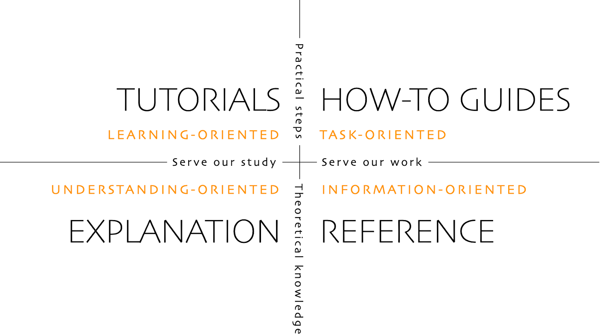

# 如何编辑文档

**本说明仅适用于英文文档的编辑工作。​ 所有新增内容须优先以英文版本提交。​ 如需翻译为其他语言（感谢您的贡献），请使用[Crowdin](https://crowdin.com/project/androidapsdocs)平台。**

关于文本格式（标题、加粗等）及链接设置的提示，请参阅本页[“代码语法”](#code-syntax)部分。​

## 一般

如有任何疑问、反馈或新想法，您可通过[Discord](https://discord.gg/4fQUWHZ4Mw)联系文档团队。​

在适当阶段，您需提交Pull Request（PR）——这是将文档变更实际部署至AAPS网页（存储于GitHub）的正式流程。​ 提交PR（Pull Request）其实并不复杂，这是参与项目贡献的绝佳方式。​ 您此刻能查阅这份文档，正是源于与您一样的贡献者提交的PR（Pull Request）。​ 无需担心操作失误或误改文档。​ 您的修改在合并至AAPS正式文档库前，均会经过严格审核。​ 在操作过程中，任何意外都不会损坏原始文档。​ 标准流程如下：​

- 通过修改现有内容，对代码或文档进行编辑与改进。​
- 请仔细核查您的修改内容，确保无误。​
- 简要记录变更内容，便于他人理解修改意图。​
- 创建一个拉取请求，向管理员申请使用你的更改。
- 他们将进行审核，并选择：(1)合并你的更改，(2)就你的更改给你回复意见，或(3)用你的更改创建新文档。

（附注：如果你是视觉学习者，[这里](https://youtu.be/4b6tsL0_kzg)有一个YouTube视频展示了拉取请求的工作流程。）

在我们的示例中，我们将对AndroidAPS文档进行编辑。 这可以在任何Windows电脑、Mac等设备上完成。 （任何可以上网的电脑都能操作）。

1. 访问 <https://github.com/openaps/AndroidAPSdocs> 并点击右上角的「Fork」按钮，创建该代码库的您个人副本。


2. 访问任意页面，然后导航至您需要编辑的目标页面。 您可以点击右上角的「在 GitHub 上编辑」链接。 此功能仅适用于英文页面。 


或者点击页面内容顶部工具栏中的铅笔图标进行编辑。 执行此操作需已登录您的GitHub账户（若尚未注册，创建流程非常简单）。


3. 执行步骤2中的任一操作，都将在您的代码库中创建一个新分支，用于保存您的编辑内容。 对文件进行编辑修改。

我们的文档页面使用Markdown格式。 这些文件使用".md"后缀。目前我们采用myst_parser解析器来处理Markdown文件（注：Markdown规范并非固定不变）。 请注意使用[下文所述](#code-syntax)的正确语法格式。


4. 您当前处于「编辑文件」标签页中进行操作。 请选择「预览更改」标签页进行最终检查，确保所有修改内容符合预期（包括检查拼写错误）。 若发现需要改进之处，请返回编辑标签页继续完善。 


5. 完成编辑后，请滚动至页面底部。 在页面底部的文本框中，于显示「添加可选扩展描述...」的输入框内填写您的备注说明。 默认标题会显示文件名。 请尽量包含一句说明**修改原因**的描述。 说明修改原因有助于审核者理解您在该PR中的意图。


6. 点击绿色的「Propose file changes」或「Commit changes」按钮。 在跳转页面中点击「Create Pull Request」按钮，然后在下一页再次点击「Create Pull Request」。


7. 至此已完成拉取请求（PR）的创建流程。 GitHub会为PR分配一个编号，显示在标题和井号(#)之后。 您可以返回该页面查看反馈（若已设置GitHub邮件通知，相关PR动态将通过邮件提醒您）。 您的编辑现已加入待审PR列表，团队将在合并到AAPS主文档前进行审核并可能提供反馈！ 要查看PR进度，请点击您GitHub账户右上角的铃铛图标，即可查看所有PR状态。


注：您的fork仓库和分支仍会保留在您个人的GitHub账户中。 当收到PR已合并的通知后，如已完成操作，您可以删除分支（步骤8的通知区域会在分支关闭或合并后提供删除链接）。 今后编辑时，只要遵循此流程，您的修改将始终基于最新版的AndroidAPSdocs代码库开始。 若选择其他方式发起PR请求（例如：从您fork仓库的master分支开始编辑），需先执行「compare」操作确保代码库最新，并合并fork后所有更新内容。 鉴于用户常忘记更新代码库，我们建议先采用上述PR流程，待熟悉「compare」操作后再调整。

(edit-the-docs-code-syntax)=

## 代码语法规范

我们的文档页面采用Markdown格式编写。 文件使用".md"作为后缀名。

Markdown是一种非常简单的文本格式化语言，它能将文本内容与格式设置分离。

作者仅需将标题标记为一级标题（例如），Markdown处理器就会在渲染过程中自动生成对应的HTML代码来呈现该标题。

其核心理念在于

- 作者应优先考虑文本内容，而非格式设置。
- Markdown文本可在不同工具间自由交换，无需依赖Microsoft Word等专有软件。
- 单个Markdown文件可生成多种输出格式。

Markdown并非完全固化的标准规范，我们力求最大程度遵循该标准，以便：

- 保持灵活性以便在Markdown工具及SaaS服务的持续创新中，能根据需要或形势要求更换工具。
- 使我们能够利用翻译服务将英文内容转换为法语、德语等目标语言。 这些工具虽可处理Markdown格式，却无法应对复杂排版代码，因其无法区分内容与版式——这一缺陷可能导致严重后果。

### 目录

- 一级标题：`# 标题文字`
- 二级标题：`## 标题文字`
- 三级标题：`### 标题内容`
- 四级标题：`#### 标题内容`

我们尽量避免使用更深层级的标题。

### 文本格式

- **加粗**：`**文本**`
- *斜体*：`*文本*`
- ***加粗斜体***：`***文本***`

### 有序列表

    1. 第一个
    2. 第二个
    3. 第三个
    

1. 第一个
2. 第二个
3. 第三个

### 无序列表

    - 一个元素
    - 另一个元素
    - 再一个元素
    

- 一个元素
- 另一个元素
- 再一个元素

### 多级列表

您可以通过向右缩进4个额外空格的方式，在列表中嵌套子列表。

    1. 第一个
    2. 第二个
    3. 第三个
    1. 一个元素
    1. 另一个元素
      1. 再一个元素
      1. 第四个
      1. 第五个
    1. 第六个
    

1. 第一个
2. 第二个
3. 第三个 
    1. 一个元素
    2. 另一个元素
    3. 再一个元素
4. 第四个
5. 第五个
6. 第六个

### 图片

要插入图片，请使用以下Markdown语法：

- 图片: ``

图片的类型应为 PNG 或 JPEG。

图片名称需符合下列命名规则之一： 示例中我使用.png作为文件后缀名。 如果您使用 JPEG，请改用 jpeg 作为后缀。

- `文件名-图片-xx.png`（其中xx为此文件中图片的唯一两位数字编号）
- `文件名-图片-xx.png`（其中xx代表该md文件作者的有意义命名）

图片统一存放在英文版的images文件夹中，并通过Crowdin自动同步至其他语言版本。 您无需对此进行任何操作！

我们目前不翻译图片：图片应包含**尽可能少的文字**，以确保非英语读者也能理解。

(make-a-PR-image-size)= 请为图片选择合适尺寸，确保在电脑、平板和手机上都能清晰显示。

- 网页截图类图片的宽度应控制在**1050像素**以内。
- 流程图类图示的宽度应不超过**1050像素**。
- 应用界面截图的宽度应限制在**500像素**以内。 如非必要，请勿将图片并排排列。

### 链接

#### 外部链接

外部链接是指向第三方网站的链接。

- 外部链接: `[文本说明](www.url.tld)`

#### 内部链接是指向md文件起始位置的链接。

内部页面链接是指向我们自有服务器上存放的md文件起始位置的链接。

- 指向 .md 页面的内部链接：`[文本说明](../folder/file.md)`

#### 指向命名内联引用的内部链接

指向命名锚点的内部链接是指向我们自有服务器上存放的md文件中任何已设置引用标记位置的链接。

在目标md文件中需要跳转的位置添加命名锚点。

`(name-of-my-md-file-this-is-my-fancy-named-reference)=`

命名锚点在整个AndroidAPSDocs的md文件集合中必须保持唯一性，而不仅限于其所在的单个md文件！

因此，最佳实践是在命名锚点时以文件名开头，再添加您自定义的引用名称。

请仅使用小写字母，并用连字符连接单词。

然后在您撰写的文本中，通过以下链接格式引用该锚点：

- 指向命名内联引用的内部链接：`[文本说明](name-of-my-md-file-this-is-my-fancy-named-reference)`

### 注释、警告、可折叠注释

您可以在文档中添加注释框和警告框。

此外，您可添加可折叠的注释框来包含详细信息，避免不关注细节的用户被迫阅读全部内容。 请谨慎使用这些功能，因为文档应尽可能保持易读性。

#### 备注

    ```{admonition} 注释标题
    :class: note
    这是一个注释。
    ```
    ```
    

```{admonition} 注释标题 :class: note 这是一个注释。 ```

    <br />#### 警告
    
    ````
    ```{admonition} 警告
    :class: warning
    这是一个警告。
    

    ```{admonition} 警告标题
    :class: warning
    这是一个警告。
    ```
    
    #### 可折叠注释
    
    

    {admonition} 为感兴趣的读者提供的延伸阅读材料
    :class: dropdown
    
    该折叠式提示框已收起，
    意味着您可以在此添加详细内容，
    而不会占用页面过多空间。
    

````

```{admonition} 为感兴趣的读者提供的延伸阅读材料 :class: dropdown 该折叠式提示框已收起， 意味着您可以在此添加详细内容， 而不会占用页面过多空间。

```

## 表格

请避免使用包含长文本的表格，因为Markdown格式难以精确控制表格内容排版，通常无法适配手机屏幕宽度，翻译后可能出现显示异常。

## 风格指南

### 内容

1. 英语写作技巧

2. AAPS特定写作规范说明

3. 实用参考资料

###  1\. 英语写作技巧

#### 使用适合读者群体的语言

尽可能使用简明英语. 这既有助于非英语母语读者理解，也方便将AAPS文档翻译成其他语言。 请采用与用户对话式的写作风格，想象您正面对面为您要服务的对象撰写内容。 请注意：大多数AAPS用户并不具备编程背景。 糖尿病领域本身也存在大量专业术语和缩写。 请谨记：部分读者可能是刚确诊的患者，糖尿病经验可能不如您丰富，或接受过不同的糖尿病培训方案。 若使用简称或缩写，首次出现时应完整拼写，并在括号内直接标注缩写形式，例如："超微大剂量（Super Micro Bolus，SMB）"。 同时，请附上术语表链接。 对于读者可能不熟悉的技术术语，也可在括号内补充说明。

避免的说法：*"闭环系统中餐后血糖峰值升高的原因是什么？"*

建议的说法：*"闭环系统中**午餐后**（postprandial）出现高血糖峰值的原因是什么？"*

##### 使用通俗易懂的词汇，确保所有人都能理解。

您可以在此处查阅A-Z替代词表，让您的写作更易懂：

<https://www.plainenglish.co.uk/the-a-z-of-alternative-words.html>

#### 隐私/许可问题：

特别提醒​：若需录制视频或截图，请务必避免泄露您的隐私信息（如API密钥、密码等）。 请确保YouTube内容不公开列出，且必须通过文档中的链接才能访问。 请避免提及可能侵权的版权材料（如BYODA等）。

#### 保持句子简短，直击要点。​

- 清晰的写作应保持15-20个单词的平均句长。​

- 这并不意味着每句话都必须保持相同长度。​ 要简洁有力。​ 通过混合短句（如前句）与长句（如本句）来变化写作风格。​

- 每句话应围绕一个核心观点展开，最多可附带一个相关要点。​

- 您可能仍会偶尔写出较长的句子，尤其是在解释复杂观点时。​ 但大多数长句都可以通过某种方式拆分。​

- 删除弱势表达："you can"、"there is/are/were"、"in order to"。​

- 将关键词置于标题、句子和段落的开头位置。​

- 善用视觉化表达！​ 在可行的情况下，尽量提供简图、截图或视频说明。​

#### 无需回避直接给出操作指引

命令式是最快捷的指令表达方式，但撰写者往往顾虑使用命令语气，常以"您应执行此操作"替代简洁的"执行此操作"。​ 或许人们担心命令式语气显得过于生硬。​ 通常只需在句首添加"请"字即可解决此问题。​ 但若某项操作必须执行，则不宜使用"请"字，以免让读者误以为可选择拒绝。​

避免的说法：*"应将其视为完整声明。"*

请使用：*"将其视为完整声明。"*

#### 应优先使用主动语态动词，而非被动语态。​

**主动语态动词**示例：

- *"泵（主语）输送（动词）胰岛素（宾语）。"*

"delivers"在此处为主动语态动词。 该句子先说明执行输送动作的主体，再说明被输送的对象。​

**被动语态动词**示例：

- *"胰岛素（主语）由泵（宾语）输送（动词）"*

*"delivered"*在此处为被动语态动词。 与主动语态句子相比，主语和宾语的位置互换了。 我们不得不通过添加"is"和"by the"使句子变长。​ 亦可考虑以主动语态动词开头。​

避免的说法：​*“通过AAPS泵菜单将泵与手机连接，可选多种兼容泵型号。”*

建议的说法：*"通过AAPS泵菜单将所需泵设备连接至手机。"*

被动语态动词可能导致问题：

- 它们可能会令人困惑。

- 它们通常会使写作更加冗长。

- 它们会使写作不那么生动。

##### 被动语态动词的良好用法

某些情况下使用被动语态可能更为合适。

- 使用被动语态可缓和语气——"账单未付"（被动式）比"您未支付账单"（主动式）更委婉。

- 使用被动语态可规避归责——"操作中出现失误"（被动式）比"您操作失误"（主动式）更显中立。

- 当动作执行者未知时——"英格兰队已选定"（被动式）。

- 若被动语态的表达效果更佳时。

#### 避免名词化结构

名词化（nominalisation）指对非实体事物（如过程、技术或情感）的命名形式。 名词化结构由动词派生而成。

For example:

| 动词        | 名词化          |
| --------- | ------------ |
| complete  | completion   |
| introduce | introduction |
| provide   | provision    |
| fail      | failure      |

名词化结构常**替代**其源动词使用，但会导致表述缺乏动态感。 过度使用名词化会使文风沉闷艰涩。

避免的说法：*"The implementation of the method has been done by a team。"*

建议的说法：*"A team has implemented the method.”"*

#### 在适当的地方使用列表

列表能有效拆分信息，提升可读性。 列表主要有两种类型：

- 一种连续句式，在句首、句中或句末标注多个列举项。

- 使用引导性陈述分隔项目符号列表。

在上述项目符号列表中，每个条目均为完整句子，因此需首字母大写并以句号结尾。 建议使用项目符号（而非数字或字母），因其能突显每个要点，且不会增加额外信息负担。

#### 破除迷思

- 句子可以**以"而且"、"但是"、"因为"、"所以"或"然而"**开头。

- 可以使用分裂不定式。 所以您可以说 **“to boldly go”**。

- 句子可以用介词结尾。 事实上，这正是**我们应当支持**的做法。

- And **you** can use the same **word** twice in a sentence if **you** can't find a better **word**.

#### Optimizing writing style by purpose

To keep the documentation clear and short, we write different sections of the documentation in different styles.

An “explanation” style is used for the introduction, background and knowledge development sections.

A “How-to-guide” style (with minimal explanation) is used for building, configuring AAPS, and some of the troubleshooting sections.

A tutorial helps the pupil acquire basic competence. The user will **learn by doing**.



#####  Tutorials (e.g. teaching a kid to beat egg whites)

- narrator directly talks to the reader: In this tutorial **you** will (we) could be used to convey “we are in this together” frame-of-thought in some rare cases

- Future Tense -> to show the final target

- Imperative Tense -> to do the tasks -> Concrete steps - avoid abstract concepts

- Past Tense -> to show accomplished tasks -> Quick and immediate visible results

- Minimum Explanations -> strict necessary to complete the task - **what and why**

- Ignore options/alternatives/…. No ambiguity

- Step Transitions: finish a step with a sentence leading to the next step as a logical progression flow. Example: *You have now installed the Let’s Encrypt client, but before obtaining certificates, you need to make sure that all required ports are open. To do this, you will update your firewall settings in the next step.*

- **Tutorial** Title (Level 1 heading)

- Introduction (no heading)

- Prerequisites (Level 2 heading)

- Steps:

- Step 1 — Doing the First Thing (Level 2 heading)

- Step 2 — Doing the Next Thing (Level 2 heading)

- Step n — Doing the Last Thing (Level 2 heading)

- Conclusion (Level 2 heading)
    
    - **The Language of Tutorials**
        
        *In this tutorial, you will…*
        
        Describe what the learner will accomplish (note - not: “you will learn…”).
        
        *First, do x. Now, do y. Now that you have done y, do z.*
        
        No room for ambiguity or doubt.
        
        *We must always do x before we do y because… (see Explanation for more details).*
        
        Provide minimal explanation of actions in the most basic language possible. Link to more detailed explanation.
        
        *The output should look something like this…*
        
        Give your learner clear expectations.
        
        *Notice that… Remember that…*
        
        Give your learner plenty of clues to help confirm they are on the right track and orient themselves.
        
        *You have built a secure, three-layer hylomorphic stasis engine…*
        
        Describe (and admire, in a mild way) what your learner has accomplished (note - not: “you have learned…”)

#####  How-To Guides (e.g. a recipe)

A how-to guide’s purpose is to help the already-competent user perform a particular task correctly.

- HOW-to

- narrator directly talks to the reader: In this tutorial **you** will

- Future Tense -> to show the final target

- Conditional Imperative Tense -> to get X do y -> Concrete steps - avoid abstract concepts

- Minimum Explanations -> strict necessary to complete the task -> **what and why**

- Ignore options/alternatives/…. No ambiguity, but you can link to the reference entry or explanation entry

- **How-to**: Title (Level 1 heading)

- Introduction paragraph

- Optional Prerequisites (paragraph or Level 2 heading if more than 1)

- Steps:

- Step 1 — Doing the First Thing (Level 2 heading)

- Step 2 — Doing the Next Thing (Level 2 heading)

- Step n — Doing the Last Thing (Level 2 heading)

- Conclusion paragraph
    
    - **The Language of How-To Guides**
        
        *This guide shows you how to…*
        
        Describe clearly the problem or task that the guide shows the user how to solve.
        
        *If you want x, do y. To achieve w, do z.*
        
        Use conditional imperatives.
        
        *Refer to the x reference guide for a full list of options.*
        
        Don’t pollute your practical how-to guide with every possible thing the user might do related to x.

#####  Explanation (e.g. Science behind why egg whites stiffen when you beat them)

An explanation clarifies, deepens and broadens the reader’s understanding of a subject.

- WHY

- Start with **About**

- Provide context, link ALL relevant references

- Discuss options/alternatives

- Don’t instruct or provide reference (link to them)

- State the unknown/moving targets etc…

- **About** Title (Level 1 heading)

- Introduction (no heading)

- Optional Prerequisites (Level 2 heading)

- Subtopic 1 (level 2 heading)

- Conclusion (Level 2 heading)
    
    - **The Language of Explanation**
    
    *The reason for x is because historically, y…*
    
    Explain.
    
    *W is better than z, because…*
    
    Offer judgements and even opinions where appropriate..
    
    *An x in system y is analogous to a w in system z. However…*
    
    Provide context that helps the reader.
    
    *Some users prefer w (because z). This can be a good approach, but…*
    
    Weigh up alternatives.
    
    *An x interacts with a y as follows:…*
    
    Unfold the machinery’s internal secrets, to help understand why something does what it does.

### 2\. AAPS-specific writing/updating notes

#### Author & Editor

For writing/updating the AAPS documentation, consider the process as consisting of two stages. These can be carried out by the same person at different points, or more than one person.

An **author (e.g. you!)** writes/edits a section of the documentation in a concise conversational tone, then passes it to the editor.

The **editor (e.g. a fellow AAPS user, or the person who receives the pull request)** reviews adherence to the style guide, edits the section for clarity and accessibility, removing as many words as possible (especially for tutorial/how-to sections). Reading the text out loud may help.

#### General AAPS points

- For glucose values, state both mg/dl and mmol/l in each occurrence (also consider this for screenshots, if possible).

- For consistency, use “AAPS” rather than “Android APS”.

- Clearly state the version of Android Studio/AAPS you are writing for, or that the screenshots are taken from.

### 3\. Useful References

<https://dev.readthedocs.io/en/latest/style-guide.html>

[Diátaxis (diataxis.fr)](https://diataxis.fr/)

[Technical Writer Style Guide Examples | Technical Writer HQ](https://technicalwriterhq.com/writing/technical-writing/technical-writer-style-guide/)

[DigitalOcean's Technical Writing Guidelines | DigitalOcean](https://www.digitalocean.com/community/tutorials/digitalocean-s-technical-writing-guidelines)

[Top 10 tips for Microsoft style and voice - Microsoft Style Guide | Microsoft Learn](https://learn.microsoft.com/en-us/style-guide/top-10-tips-style-voice?source=recommendations)

<https://www.plainenglish.co.uk/how-to-write-in-plain-english.html>

<https://developers.google.com/style>

<https://www.mongodb.com/docs/meta/style-guide/screenshots/screenshot-guidelines/>