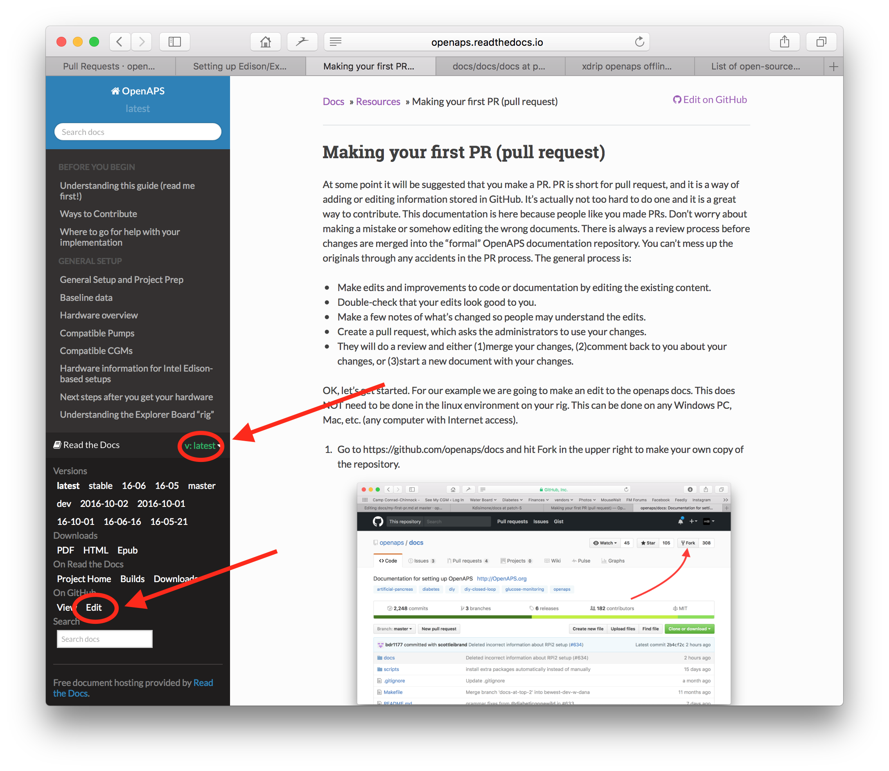

# 如何编辑文档

**本说明仅适用于英文文档的编辑工作。​ 所有新增内容须优先以英文版本提交。​ 如需翻译为其他语言（感谢您的贡献），请使用[Crowdin](https://crowdin.com/project/androidapsdocs)平台。**

关于文本格式（标题、加粗等）及链接设置的提示，请参阅本页[“代码语法”](#code-syntax)部分。​

## 一般

如有任何疑问、反馈或新想法，您可通过[Discord](https://discord.gg/4fQUWHZ4Mw)联系文档团队。​

在适当阶段，您需提交Pull Request（PR）——这是将文档变更实际部署至AAPS网页（存储于GitHub）的正式流程。​ 提交PR（Pull Request）其实并不复杂，这是参与项目贡献的绝佳方式。​ 您此刻能查阅这份文档，正是源于与您一样的贡献者提交的PR（Pull Request）。​ 无需担心操作失误或误改文档。​ 您的修改在合并至AAPS正式文档库前，均会经过严格审核。​ 在操作过程中，任何意外都不会损坏原始文档。​ 标准流程如下：​

- 通过修改现有内容，对代码或文档进行编辑与改进。​
- 请仔细核查您的修改内容，确保无误。​
- 简要记录变更内容，便于他人理解修改意图。​
- 创建一个拉取请求，向管理员申请使用你的更改。
- 他们将进行审核，并选择：(1)合并你的更改，(2)就你的更改给你回复意见，或(3)用你的更改创建新文档。

（附注：如果你是视觉学习者，[这里](https://youtu.be/4b6tsL0_kzg)有一个YouTube视频展示了拉取请求的工作流程。）

在我们的示例中，我们将对AndroidAPS文档进行编辑。 这可以在任何Windows电脑、Mac等设备上完成。 （任何可以上网的电脑都能操作）。

1. 访问 <https://github.com/openaps/AndroidAPSdocs> 并点击右上角的「Fork」按钮，创建该代码库的您个人副本。


2. 访问任意页面，然后导航至您需要编辑的目标页面。 您可以点击右上角的「在 GitHub 上编辑」链接。 此功能仅适用于英文页面。 



或者点击页面内容顶部工具栏中的铅笔图标进行编辑。 执行此操作需已登录您的GitHub账户（若尚未注册，创建流程非常简单）。


3. 执行步骤2中的任一操作，都将在您的代码库中创建一个新分支，用于保存您的编辑内容。 对文件进行编辑修改。

我们的文档页面使用Markdown格式。 这些文件使用".md"后缀。目前我们采用myst_parser解析器来处理Markdown文件（注：Markdown规范并非固定不变）。 请注意使用[下文所述](#code-syntax)的正确语法格式。


4. 您当前处于「编辑文件」标签页中进行操作。 请选择「预览更改」标签页进行最终检查，确保所有修改内容符合预期（包括检查拼写错误）。 若发现需要改进之处，请返回编辑标签页继续完善。 


5. 完成编辑后，请滚动至页面底部。 在页面底部的文本框中，于显示「添加可选扩展描述...」的输入框内填写您的备注说明。 默认标题会显示文件名。 请尽量包含一句说明**修改原因**的描述。 说明修改原因有助于审核者理解您在该PR中的意图。


6. 点击绿色的「Propose file changes」或「Commit changes」按钮。 在跳转页面中点击「Create Pull Request」按钮，然后在下一页再次点击「Create Pull Request」。


7. 至此已完成拉取请求（PR）的创建流程。 GitHub会为PR分配一个编号，显示在标题和井号(#)之后。 您可以返回该页面查看反馈（若已设置GitHub邮件通知，相关PR动态将通过邮件提醒您）。 您的编辑现已加入待审PR列表，团队将在合并到AAPS主文档前进行审核并可能提供反馈！ 要查看PR进度，请点击您GitHub账户右上角的铃铛图标，即可查看所有PR状态。


注：您的fork仓库和分支仍会保留在您个人的GitHub账户中。 当收到PR已合并的通知后，如已完成操作，您可以删除分支（步骤8的通知区域会在分支关闭或合并后提供删除链接）。 今后编辑时，只要遵循此流程，您的修改将始终基于最新版的AndroidAPSdocs代码库开始。 若选择其他方式发起PR请求（例如：从您fork仓库的master分支开始编辑），需先执行「compare」操作确保代码库最新，并合并fork后所有更新内容。 鉴于用户常忘记更新代码库，我们建议先采用上述PR流程，待熟悉「compare」操作后再调整。

(edit-the-docs-code-syntax)=

## 代码语法规范

我们的文档页面采用Markdown格式编写。 文件使用".md"作为后缀名。

Markdown是一种非常简单的文本格式化语言，它能将文本内容与格式设置分离。

作者仅需将标题标记为一级标题（例如），Markdown处理器就会在渲染过程中自动生成对应的HTML代码来呈现该标题。

其核心理念在于

- 作者应优先考虑文本内容，而非格式设置。
- Markdown文本可在不同工具间自由交换，无需依赖Microsoft Word等专有软件。
- 单个Markdown文件可生成多种输出格式。

Markdown is not a 100% fixed standard and we try to stay as near as possible to the standard, to

- stay flexible to change markdown tools as needed or forced in the further innovation of markdown tools and markdown SaaS services and
- enable us to use translation services to translate the English language in a target language like French or German. They can work on markdown but not complex formatting codes, because they can't separate content from layout, which might be fatal.

### Headlines

- Headline 1: `# headline`
- Headline 2: `## headline`
- Headline 3: `### headline`
- Headline 4: `#### headline`

We try to avoid further levels of headlines.

### Text format

- **bold**: `**text**`
- *italic*: `*text*`
- ***bold italic***: `***text***`

### Ordered list

    1. first
    1. second
    1. third
    

1. first
2. 第二
3. third

### Unordered list

    - one element
    - another element
    - and another element
    

- one element
- another element
- and another element

### Multi level list

You can insert lists in lists by indenting the next level with 4 more spaces to the right than the one before.

    1. first
    1. second
    1. third
      1. one element
      1. another element
      1. and another element
    1. four
    1. five
    1. six
    

1. first
2. 第二
3. third 
    1. one element
    2. another element
    3. and another element
4. four
5. five
6. six

### Images

To include images you use this markdown syntax.

- images: ``

The type of image should be PNG or JPEG.

Images names should confirm to one of following naming rules. In the example I use png as suffix. In case you use JPEG please use jpeg as a suffix instead.

- `filename-image-xx.png` where xx is a unique double digit number for the images in this file.
- `filename-image-xx.png` where xx is a meaning full name for the author of the md file.

Images are located in the images folder for the english language and propagated to the other languages automatically by Crowdin. You have nothing to do for this!

We are not translating images at the moment: images should contain the **minimum possible text** to allow accessibility to non-English readers.

(make-a-PR-image-size)= Use a reasonable size for the images which must be readable on PC, tablet and mobiles.

- Screenshots from web pages images should be up to **1050 pixels wide**.
- Diagrams of process flows should be up to **1050 pixels wide**.
- Screenshots from the app should be up to **500 pixels wide**. Do not place them side to side if not necessary.

### Links

#### External links

External links are links to external web sites.

- external link: `[alt text](www.url.tld)`

#### Internal links to the start of a md file

Internal links to pages are links to the start of a md file which is hosted on our own server.

- internal link to .md page: `[alt text](../folder/file.md)`

#### Internal links to named inline references

Internal links to named inline references are links to any point in a md file which is hosted on our own server and where a reference was set to link to.

Add a named reference at the location in the target md file you want to jump to.

`(name-of-my-md-file-this-is-my-fancy-named-reference)=`

The named reference must be unique in the whole AndroidAPSDocs md files and not only the own md file it resides in!

Therefore it is a good practice to start with the filename and then the reference name you select.

Use only lowercase letters and hyphenate words.

Then link this reference in the text you are writing with the following kind of link.

- Internal links to named inline references: `[alt text](name-of-my-md-file-this-is-my-fancy-named-reference)`

### Notes, Warnings, Collapsing Notes

You can add notes and warning boxes to documentation.

Furthermore you can add collapsing notes for detailed information which would users who are not interested in the details quench to read the text at all. Please use these carefully as the documentation should be as easy to read as possible.

#### 备注

    ```{admonition} Note headline
    :class: note
    This is a note.
    ```
    

```{admonition} Note headline :class: note This is a note.

    <br />#### Warnings
    
    ````
    ```{admonition} Warning
    :class: warning
    This is a warning.
    

    ```{admonition} Warning headline 
    :class: warning
    This is a warning.
    ```
    
    #### Collapsing Notes
    
    

    {admonition} further detailed readings for interested readers
    :class: dropdown
    
    This admonition has been collapsed,
    meaning you can add longer form content here,
    without it taking up too much space on the page.
    

````

```{admonition} further detailed readings for interested readers :class: dropdown This admonition has been collapsed, meaning you can add longer form content here, without it taking up too much space on the page.

```

## Tables

Avoid using tables with long texts as the contents is difficult to set in Markdown, they will usually not fit in a mobile phone screen width, and probably won't display the same after translation.

## Style Guide

### Contents

1. English language writing tips

2. AAPS-specific writing notes

3. Useful references

###  1\. English language writing tips

#### Use language that is appropriate for the reader

Use plain English wherever possible. This helps non-native readers and also aids translation of AAPS documents into other languages. Write in a conversational way with the user, imagine you are sitting across the desk from the person you are writing for. Remember - most AAPS users do not have programming backgrounds. Diabetes itself also has a lot of jargon and abbreviations. Bear in mind that some people may be recently diagnosed, may not be as experienced as you with diabetes, or may have been given different diabetes training. If you use shorthand or an abbreviation, write it out in full the first time you use it, giving the abbreviation directly after it in brackets, like “super micro bolus (SMB)”. Also, link to the glossary. Technical terms which might not be familiar to the reader can be also be added in brackets.

Instead of: *“What causes high postprandial BG peaks in closed loop?"*

Use: *“What causes a high BG peak **after lunch** (postprandial) in closed loop?"*

##### Use plain words that everyone can understand

Find an A-Z of alternative words to make your writing easier to understand here:

<https://www.plainenglish.co.uk/the-a-z-of-alternative-words.html>

#### Privacy/licensing concerns:

Particularly if you record video or screenshots, make sure not to disclose your private details (API key, passwords). Make sure YouTube content is not openly listed, and needs a link from the documentation to view. Avoid drawing attention to infringed copyrighted materials (BYODA etc).

#### Keep sentences short, get to the point

- Clear writing should have an average sentence length of 15 to 20 words.

- This does not mean making every sentence the same length. Be punchy. Vary your writing by mixing short sentences (like the last one) with longer ones (like this one).

- Stick to one main idea in a sentence, plus perhaps one other related point.

- You may still find yourself writing the odd long sentence, especially when trying to explain a complicated point. But most long sentences can be broken up in some way.

- Remove weak words: “you can”, “there is/are/were”, “in order to”.

- Place keywords near the beginning of titles, sentences and paragraphs.

- Be visual! Wherever possible provide a brief diagram, screenshot or video.

#### Don't be afraid to give instructions

Commands are the fastest way to give instructions, but writers sometimes fear giving commands, writing “you should do this” instead of just “do this”. Perhaps people worry that commands sound too harsh. You can often solve this by putting the word 'please' in front. However, if something must be done, it is best not to say ‘please’ as it gives the reader the option to refuse.

Instead of: *“You should just think of it as a complete statement."*

Use: *“Think of it as a complete statement.”*

#### Mostly use active verbs, rather than passive verbs

Example of an **active verb**:

- *“The pump (subject) delivers (verb) the insulin (object).”*

“delivers” is an active verb here. The sentence says what is doing the delivering before it says what is being delivered.

Example of a **passive verb**:

- *“The insulin (subject) is delivered (verb) by the pump (object)”*

*“delivered”* a passive verb here. The subject and object are switched around, compared to the active verb sentence. We have had to make the sentence longer by introducing “is” and “by the”. Also consider starting with the active verb.

Instead of: *“You can connect your pump with the phone through the AAPS pump menu, and there are a number of pumps available for you to connect with.”*

Use: *“Connect your desired pump to the phone through the AAPS pump menu.”*

Passive verbs can cause problems:

- They can be confusing.

- They often make writing more long-winded.

- They make writing less lively.

##### Good uses of passives

There are times when it might be appropriate to use a passive.

- To make something less hostile - 'this bill has not been paid' (passive) is softer than 'you have not paid this bill' (active).

- To avoid taking the blame - 'a mistake was made' (passive) rather than 'You made a mistake' (active).

- When you don't know who or what the doer is - 'the England team has been picked'.

- If it simply sounds better.

#### Avoid nominalisations

A nominalisation is the name of something that isn't a physical object, such as a process, technique or emotion. Nominalizations are formed from verbs.

For example:

| Verb      | Nominalization |
| --------- | -------------- |
| 完成        | completion     |
| introduce | introduction   |
| provide   | provision      |
| fail      | failure        |

They are often used **instead** of the verbs they come from, but they can sound as if nothing is actually happening. Too many of them can make writing very dull and heavy-going.

Instead of: *“The implementation of the method has been done by a team.”*

Use: *“A team has implemented the method.”*

#### Use lists where appropriate

Lists are excellent for splitting information up. There are two main types of list:

- A continuous sentence with several listed points picked out at the beginning, middle or end.

- Separate bullet points with an introductory statement.

In the bulleted list above, each point is a complete sentence so they each start with a capital letter and end with a full stop. Use bullet points rather than numbers or letters, as they draw your attention to each point without giving you extra information to take in.

#### Mythbusting

- You can start a sentence with **and, but, because, so or however**.

- You can split infinitives. So you can say **“to boldly go”**.

- You can end a sentence with a preposition. In fact, it is something **we should stand up for**.

- And **you** can use the same **word** twice in a sentence if **you** can't find a better **word**.

#### Optimizing writing style by purpose

To keep the documentation clear and short, we write different sections of the documentation in different styles.

An “explanation” style is used for the introduction, background and knowledge development sections.

A “How-to-guide” style (with minimal explanation) is used for building, configuring AAPS, and some of the troubleshooting sections.

A tutorial helps the pupil acquire basic competence. The user will **learn by doing**.


#####  Tutorials (e.g. teaching a kid to beat egg whites)

- narrator directly talks to the reader: In this tutorial **you** will (we) could be used to convey “we are in this together” frame-of-thought in some rare cases

- Future Tense -> to show the final target

- Imperative Tense -> to do the tasks -> Concrete steps - avoid abstract concepts

- Past Tense -> to show accomplished tasks -> Quick and immediate visible results

- Minimum Explanations -> strict necessary to complete the task - **what and why**

- Ignore options/alternatives/…. No ambiguity

- Step Transitions: finish a step with a sentence leading to the next step as a logical progression flow. Example: *You have now installed the Let’s Encrypt client, but before obtaining certificates, you need to make sure that all required ports are open. To do this, you will update your firewall settings in the next step.*

- **Tutorial** Title (Level 1 heading)

- Introduction (no heading)

- Prerequisites (Level 2 heading)

- Steps:

- Step 1 — Doing the First Thing (Level 2 heading)

- Step 2 — Doing the Next Thing (Level 2 heading)

- Step n — Doing the Last Thing (Level 2 heading)

- Conclusion (Level 2 heading)
    
    - **The Language of Tutorials**
        
        *In this tutorial, you will…*
        
        Describe what the learner will accomplish (note - not: “you will learn…”).
        
        *First, do x. Now, do y. Now that you have done y, do z.*
        
        No room for ambiguity or doubt.
        
        *We must always do x before we do y because… (see Explanation for more details).*
        
        Provide minimal explanation of actions in the most basic language possible. Link to more detailed explanation.
        
        *The output should look something like this…*
        
        Give your learner clear expectations.
        
        *Notice that… Remember that…*
        
        Give your learner plenty of clues to help confirm they are on the right track and orient themselves.
        
        *You have built a secure, three-layer hylomorphic stasis engine…*
        
        Describe (and admire, in a mild way) what your learner has accomplished (note - not: “you have learned…”)

#####  How-To Guides (e.g. a recipe)

A how-to guide’s purpose is to help the already-competent user perform a particular task correctly.

- HOW-to

- narrator directly talks to the reader: In this tutorial **you** will

- Future Tense -> to show the final target

- Conditional Imperative Tense -> to get X do y -> Concrete steps - avoid abstract concepts

- Minimum Explanations -> strict necessary to complete the task -> **what and why**

- Ignore options/alternatives/…. No ambiguity, but you can link to the reference entry or explanation entry

- **How-to**: Title (Level 1 heading)

- Introduction paragraph

- Optional Prerequisites (paragraph or Level 2 heading if more than 1)

- Steps:

- Step 1 — Doing the First Thing (Level 2 heading)

- Step 2 — Doing the Next Thing (Level 2 heading)

- Step n — Doing the Last Thing (Level 2 heading)

- Conclusion paragraph
    
    - **The Language of How-To Guides**
        
        *This guide shows you how to…*
        
        Describe clearly the problem or task that the guide shows the user how to solve.
        
        *If you want x, do y. To achieve w, do z.*
        
        Use conditional imperatives.
        
        *Refer to the x reference guide for a full list of options.*
        
        Don’t pollute your practical how-to guide with every possible thing the user might do related to x.

#####  Explanation (e.g. Science behind why egg whites stiffen when you beat them)

An explanation clarifies, deepens and broadens the reader’s understanding of a subject.

- WHY

- Start with **About**

- Provide context, link ALL relevant references

- Discuss options/alternatives

- Don’t instruct or provide reference (link to them)

- State the unknown/moving targets etc…

- **About** Title (Level 1 heading)

- Introduction (no heading)

- Optional Prerequisites (Level 2 heading)

- Subtopic 1 (level 2 heading)

- Conclusion (Level 2 heading)
    
    - **The Language of Explanation**
    
    *The reason for x is because historically, y…*
    
    Explain.
    
    *W is better than z, because…*
    
    Offer judgements and even opinions where appropriate..
    
    *An x in system y is analogous to a w in system z. However…*
    
    Provide context that helps the reader.
    
    *Some users prefer w (because z). This can be a good approach, but…*
    
    Weigh up alternatives.
    
    *An x interacts with a y as follows:…*
    
    Unfold the machinery’s internal secrets, to help understand why something does what it does.

### 2\. AAPS-specific writing/updating notes

#### Author & Editor

For writing/updating the AAPS documentation, consider the process as consisting of two stages. These can be carried out by the same person at different points, or more than one person.

An **author (e.g. you!)** writes/edits a section of the documentation in a concise conversational tone, then passes it to the editor.

The **editor (e.g. a fellow AAPS user, or the person who receives the pull request)** reviews adherence to the style guide, edits the section for clarity and accessibility, removing as many words as possible (especially for tutorial/how-to sections). Reading the text out loud may help.

#### General AAPS points

- For glucose values, state both mg/dl and mmol/l in each occurrence (also consider this for screenshots, if possible).

- For consistency, use “AAPS” rather than “Android APS”.

- Clearly state the version of Android Studio/AAPS you are writing for, or that the screenshots are taken from.

### 3\. Useful References

<https://dev.readthedocs.io/en/latest/style-guide.html>

[Diátaxis (diataxis.fr)](https://diataxis.fr/)

[Technical Writer Style Guide Examples | Technical Writer HQ](https://technicalwriterhq.com/writing/technical-writing/technical-writer-style-guide/)

[DigitalOcean's Technical Writing Guidelines | DigitalOcean](https://www.digitalocean.com/community/tutorials/digitalocean-s-technical-writing-guidelines)

[Top 10 tips for Microsoft style and voice - Microsoft Style Guide | Microsoft Learn](https://learn.microsoft.com/en-us/style-guide/top-10-tips-style-voice?source=recommendations)

<https://www.plainenglish.co.uk/how-to-write-in-plain-english.html>

<https://developers.google.com/style>

<https://www.mongodb.com/docs/meta/style-guide/screenshots/screenshot-guidelines/>