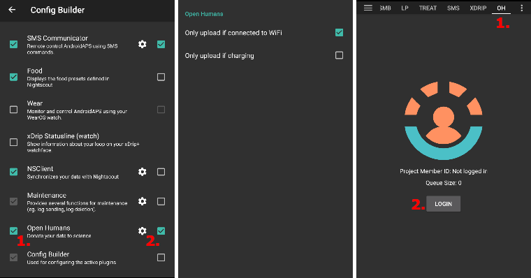
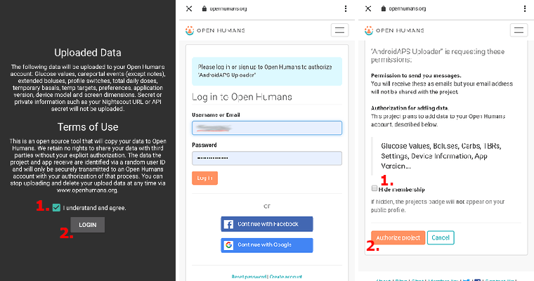

# Open Humans 数据上传器

## 为科研捐献您的数据

您可通过向研究项目捐献数据来助力科研社区！ 此举能助力科学家持续推动科研发展、孕育新科学理念，并拓展开源闭环系统的开放思维。 AAPS已支持与[Open Humans](https://www.openhumans.org)平台同步数据，该平台允许您上传、关联并存储个人数据（包括基因、活动及健康数据等）。

您始终拥有数据的完全控制权，可自主决定支持哪些研究项目并授予其数据访问权限。 根据您参与的具体项目，数据会以不同方式和程度被分析使用。

以下数据将被上传至您的Open Humans账户：

- 血糖值
- Careportal事件（除备注外）
- 扩展大剂量(方波)
- 配置文件切换
- 每日总剂量
- 临时基础率
- 临时目标
- 偏好设置
- 应用版本
- 设备型号
- 屏幕尺寸

秘密或私人信息（如 Nightscout URL 或 API 密钥）不会被上传。

## 设置

1. 如果尚未注册，请先在 [Open Humans](https://www.openhumans.org) 创建账户。 您可以选择复用现有的 Google 或 Facebook 账户。
2. 在 [配置生成器 > 同步](../SettingUpAaps/ConfigBuilder.md) 中启用 "Open Humans" 插件。
3. 通过齿轮按钮打开设置。 您可以限制仅在手机使用 Wi-Fi 和/或充电时上传。
4. 打开 Open Humans 插件（通过 OH 标签页或汉堡菜单），点击 '登录'。

5. 仔细阅读关于 Open Humans 上传器的说明和使用条款。
6. 通过勾选框确认并点击“LOGIN”。
7. 将打开 Open Humans 网站。 使用您的账户凭证登录。
8. 选择是否要在公开的 Open Humans 个人资料中隐藏您的 AAPS 上传器成员身份。
9. 点击 '授权项目' 按钮。

10. 返回 AAPS 后，您将看到登录成功的提示。
11. 保持 Open Humans 上传器插件和手机开启以完成设置。
12. 点击关闭后，您将看到成员 ID。 队列大小 > 0 表示仍有待上传数据。
13. 点击 '退出登录' 可停止向 Open Humans 上传数据。
14. Android 通知将提示上传运行状态。

15. 您可以通过登录 [Open Humans 网站](https://www.openhumans.org) 管理数据。

## 分享机会

### ["OPEN" 项目](https://www.open-diabetes.eu/)

"OPEN" 项目汇集了患者创新者、临床医生、社会科学家、计算机科学家和患者倡导组织的国际跨部门联盟，旨在研究越来越多糖尿病患者使用的 DIY 人工胰腺系统（DIY APS）的各个方面。 详情请见其[网站](https://www.open-diabetes.eu/)。

2020 年 9 月，"OPEN" 项目启动了包含数据捐赠选项的[调查](https://survey.open-diabetes.eu/)。 其网站和调查内提供了如何向"OPEN" 项目捐赠数据的[教程](https://open-diabetes.eu/en/open-survey/survey-tutorials/)。

### [OpenAPS 数据共享库](https://www.openhumans.org/activity/openaps-data-commons/)

OpenAPS 数据共享库旨在为 DIYAPS 社区提供简便的数据共享方式用于研究。 数据既可与创建传统研究项目的传统研究人员共享，也可与希望审查数据用于自身研究项目的社区团体或个人共享。 该库使用 "Open Humans" 平台来支持用户轻松上传和共享来自 AAPS、Loop 和 OpenAPS 等 DIYAPS 系统的数据。

您可通过三种方式将数据导入 Open Humans：

1. 使用AAPS数据上传器功能将您的数据导入Open Humans平台
2. 使用Nightscout数据传输功能将您的数据导入Open Humans平台
3. 手动将数据文件上传至Open Humans平台

创建账户并完成数据导入Open Humans后，请务必加入OpenAPS数据共享计划，以便在您同意的情况下捐献数据供研究使用。

## 使用条款

这是一个将您的数据复制到 [Open Humans](https://www.openhumans.org) 的开源工具。 我们无权在未经您明确授权的情况下与第三方共享数据。 项目和应用通过随机用户 ID 识别数据，仅在您授权后安全传输至 Open Humans 账户。 您可随时通过 [www.openhumans.org](https://www.openhumans.org) 停止上传并删除数据。 请注意某些接收数据的项目可能不支持此操作。

另见 [Open Humans 使用条款](https://www.openhumans.org/terms/)。

## 数据隐私

Open Humans 通过为每个项目分配数字 ID 来保护隐私。 这使得项目能识别但无法确认您的身份。 AAPS 上传的应用 ID 类似，仅用于数据管理。 更多信息请参考：

- [Open Humans 数据使用政策](https://www.openhumans.org/data-use/)
- [Open Humans GDPR](https://www.openhumans.org/gdpr/)
