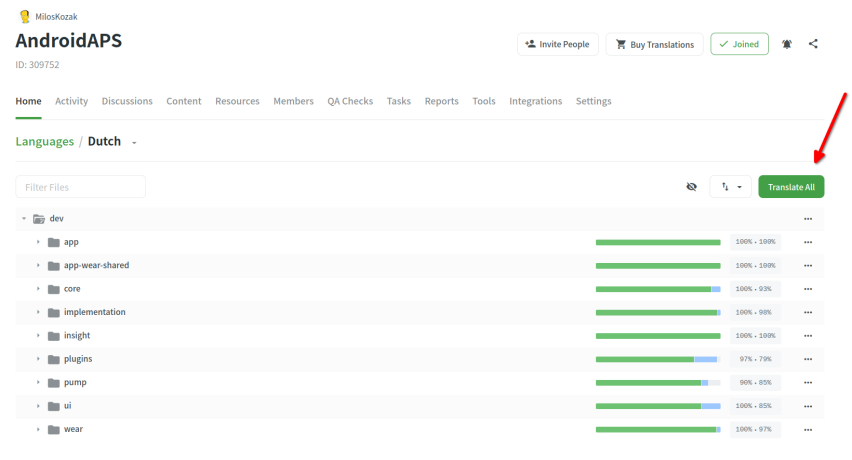
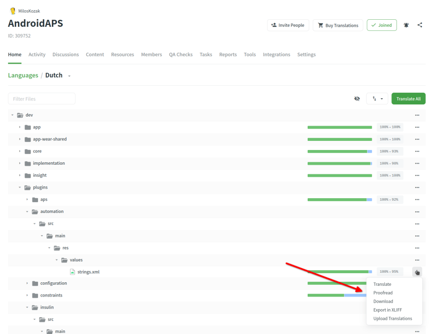

# AAPS应用及文档翻译指南

* 如需翻译应用内字符串，请访问<https://crowdin.com/project/androidaps> 并使用您的GitHub 账户登录。
* 文档翻译请访问<https://crowdin.com/project/androidapsdocs> 并使用您的GitHub 账户登录。

* 请发送加入文档团队的申请。 操作步骤：点击目标语言国旗图标 → 在下一页右上角点击"加入"按钮。 请注明语言、提供您的个人简介及AAPS使用经验，并说明申请译者或校对员（需具备翻译技能+AAPS高级用户资质）。

```{admonition} 审批时间 :class: note

审批为人工操作流程。 作为非营利组织，我们虽不提供SLA服务协议，但通常会在1个工作日内完成审批。 如未收到，请通过Facebook或Discord联系文档团队。

    <br />* 当您的申请获批后，请点击国旗图标
       
    
    ## 应用翻译
    
    (translations-translate-strings-for-AAPS-app)=
    ### 翻译AAPS应用字符串
    * 若无特定字符串偏好，直接点击"全部翻译"按钮即可开始。 系统将显示待翻译的字符串。
    
       
    
    * 如需翻译单个文件，请通过搜索框或树状目录查找目标文件，点击文件名即可开始翻译该文件内的字符串。
    
       
    
    * 在左侧翻译句子：添加新译文或编辑现有建议
    
       
    
    ### 校对AAPS应用字符串
    
    * 校对人员需从语言首页选择"校对"模式开始工作。
    
        
    
    
    并审批译文
    
       
    
    当校对员批准翻译后，该内容将被纳入下一版AAPS更新。
    
    (translations-translation-of-the-documentation)=
    ## 文档翻译
    
    * 点击您要翻译的文档页面名称
    
    
    
    
    * 逐句翻译
    
        1. 黄色文本是您当前正在处理的文本。
    
        1. 绿色文本是已经翻译过的文本。 您不需要再做一遍。
    
        1. 红色文本是剩余需要翻译的文本。
    
        1. 这是您当前正在处理的源文本。
    
        1. 这是您正在准备的翻译文本。 您可以复制上面的文本或选择下面的建议之一。
    
        1. 此为翻译建议。 您可特别关注Crowdin对此建议的匹配度评分，或查看该内容是否仅为历史译文经文本重组生成（未实质性更改）。
        1. 点击"保存"按钮提交翻译建议。 该建议随后将提交给校对人员进行最终审核。
    
    
    
    * 翻译完成的文档页面在发布前需经过审核 
    
        1. 翻译已校对
    
        1. Crowdin 和 Github 之间的同步运行完成（每小时一次），这会为 Github 创建一个 PR。
    
        1. 该GitHub上的PR（拉取请求）已获批准。
    
    通常需1-3个工作日，节假日期间可能略有延迟。
    
    ### 链接翻译
    
    ```{admonition} 链接不再进行翻译
    :class: note
    
    链接不再进行翻译。 过去我们曾在此处有相关说明，但迁移至Markdown格式和使用myst_parser解析器后，我们直接在英文文本中创建标签，并通过后台机制将这些标签传播至各语言版本。
    
    

您正在翻译的是链接的显示文本。 请务必注意**不要**删除由`<0></0>`标签对表示的链接，若同一段落中存在多个链接，其他数字标签也需保留。

校对人员需对此进行专项检查！

### 校对

* 校对员必须切换到校对模式
    
    
    
    并批准翻译的文本
    
    

* 当校对员批准翻译后，它将被添加到下一个文档构建中，该构建没有固定的时间表，而是按需进行，大约每周一次，节假日除外。 要加快此过程，您可以通知文档团队有关新翻译的信息。