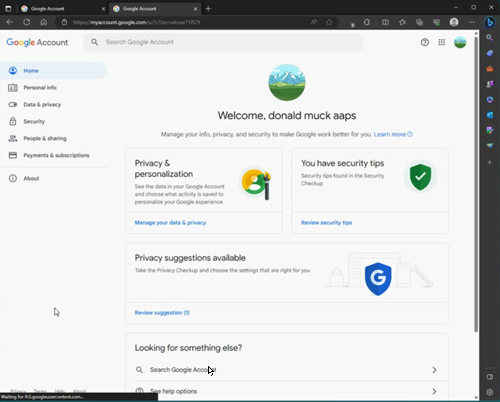
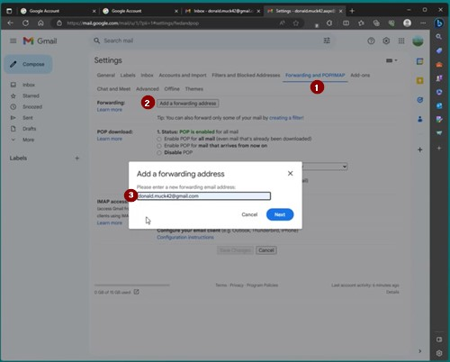
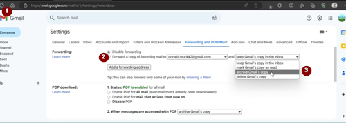
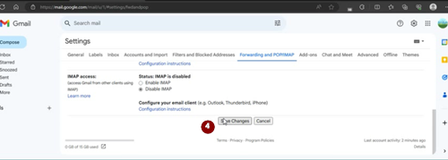

# **为AAPS设置专用谷歌账户（可选）**

一些**AAPS**用户倾向于使用他们的主要电子邮件账户作为**AAPS**账户。 另外，一些**AAPS**用户（或其护理人员）会设置一个专用的**AAPS**电子邮件账户——这是可选的，下面我们将举例说明如何操作。

如果你不想为**AAPS**设置一个专用的Gmail账户，你可以直接跳到下一节，[构建AAPS](../SettingUpAaps/BuildingAaps.md)。

```{admonition} Advantages of a dedicated Google account for AAPS
:class: dropdown

专用的Google drive空间意味着你不会因“导出偏好设置”而占用你的个人Google drive限额。
-**AAPS**（及支持的应用，如xDrip+、BYODA等）的每个版本都将存储在一个与计算机硬件无关的独立位置。 如果你的电脑或手机被盗/丢失/损坏，你仍然可以访问。
-通过统一设置，它将简化具有相似文件夹结构的用户之间的在线支持。
- 根据设置（见下文），您将在社区内拥有一个作为别名的独立身份进行通信，这可以保护您的隐私。 
- 在使用AAPS和需要成人帐户的相关功能时，患有1型糖尿病（T1D）的儿童可以作为未成年人保留他们自己的“日常”电子邮件帐户。
- Gmail允许你在同一个电话号码下注册最多4个账户。
```

## **如何为AAPS设置专用谷歌账户**

（⌛大约需要10分钟）


要求：

* 你拥有一台Windows电脑（Windows 10或更高版本）和一部Android手机（Android 9或更高版本），它们将托管AAPS应用。 这些设备都要安装最新的安全更新，可以访问互联网并具有管理员权限，因为某些步骤需要下载和安装程序。
* Android手机已经使用你的个人“日常”电子邮件地址（如Gmail账户）进行了设置。

```{admonition} Things to consider when setting up your new account
:class: dropdown
出于隐私考虑，你可以使用一个与你的名字不同但与账户相关的名称（如t1dsuperstar）。 然后，你可以在AAPS公共论坛上使用它，同时保持你的真实身份私密。 由于谷歌要求提供恢复电子邮件和电话号码，因此该账户仍然可以追溯。
- 新的**AAPS**账户将使用与你的“日常”账户相同的电话号码进行验证。 它将使用“日常”电子邮件地址进行验证；
-我们将设置邮件转发功能，以便任何发送到新的专用AAPS帐户的电子邮件都将转发到主帐户（因此无需检查两个不同的邮箱）；
-为您的_日常_Gmail帐户和专用的AAPS Gmail帐户使用不同的密码
-如果您为一个Gmail帐户使用了谷歌的“两步验证”（也称为多因素验证）身份验证，那么最好也为两个Gmail帐户都启用它。
- 如果你计划使用谷歌“Passkeys”，请确保你注册了多个设备。 这样你就不会把自己锁在外面。 只能在无人能够访问的设备上操作（即不在具有共享账户的其他人可以解锁的电脑上）。
```


```{admonition}  Video Walkthrough! 
:class: Note
点击<a href="https://drive.google.com/file/d/1dMZTIolO-kd2eB0soP7boEVtHeCDEQBF/view?usp=drive_link">此处</a>观看如何设置专用谷歌账户的视频演示。
```

 视频中概述的步骤如下：

在此示例中： 
- 你的现有“日常”谷歌账户是<donald.muck42@gmail.com>； 
- 你的新“_AAPS_”Gmail账户将是：<donald.muck42.aaps@gmail.com>； 


### 转到<https://account.google.com> 

 如果你已经登录了谷歌，这将直接带你到你的“日常”**我的账户**页面。 （1）点击页面右上角的你的头像（在此例中，为一个简单的）（2）选择“_添加另一个账户_”。


### 输入你的新专用账户详细信息： 

- 输入新账户： 
- 创建账户
- 用于个人使用。 


### 输入你的个人信息：
 - 输入名字
 - 姓氏
 - 出生日期（需要是成年年龄）

### 选择你的新电子邮件地址&密码

此示例将“.AAPS”添加到Donald Muck的现有账户后…\
设置密码

### 输入可以接收短信验证的手机号码

Gmail现在会向你发送一个唯一的代码以供输入进行验证。

### 输入恢复电子邮件地址

在此例中，它将是你的现有“日常”电子邮件……

### 完成账户设置

Gmail将显示账户名称。它将要求你接受Gmail的条款和条件并确认你的个性化设置。 它将要求你接受Gmail的条款和条件&确认你的个性化设置。

### 自定义新个人资料显示

此时，你应该在Gmail的我的账户页面上，显示你的新AAPS专用电子邮件账户。 个人资料图片将默认设置为您的名字的首字母。 为避免混淆，请将其更改为独特的内容……在此例中，Donald.Muck.AAPS已将替换为 

\


### 在两个窗口中打开Gmail网站以配置新账户

为了让您无需监控一个单独的电子邮件帐户，您可以将来自新的**AAPS**专用帐户的所有电子邮件转发到您的日常帐户\
。 这部分可能有点令人困惑，因为您将不得不在两个帐户之间来回切换。 为了使其更容易，请在彼此顶部打开两个单独的浏览器窗口：

1. 将你的现有浏览器移到屏幕顶部并调整其大小，使其只占屏幕顶部的一半左右……
2. 在任务栏中的浏览器图标上右键单击
3. 从菜单中选择“新窗口”……并调整其大小，使其只占屏幕底部的一半。

在两个浏览器窗口中打开<https://gmail.com>。 确保你的个人账户在上面，新的专用**AAPS**账户在下面，并且可以通过右上角的个人资料图片轻松识别。 （如果需要，您可以通过点击个人资料图片并选择正确的帐户来随时切换帐户。


你的Gmail主页屏幕应如下所示：\


 ### 在新的Gmail账户（底部窗口）中，打开Gmail设置……

- 点击个人资料图片左侧的齿轮
- 然后选择“**查看所有设置**”


### 设置转发……

- 点击“转发和POP/IMAP”设置选项卡
- 点击“添加转发地址”
- 添加你的“日常”电子邮件地址
- Gmail将向你的“日常”电子邮件地址发送一个验证代码。
- 你将切换回你的日常账户并点击链接以确认你接受转发（或从“日常”Gmail窗口中的Gmail验证电子邮件中获取代码，并将其剪切并粘贴到“新AAPS专用”Gmail窗口中）。

在两个窗口之间来回操作很多，但这将确保当你检查你的“日常”账户电子邮件时，你也将看到从你的AAPS专用账户转发的电子邮件，如Gmail警报。



### 验证转发的电子邮件地址

- 在“日常”gmail（顶部窗口）中，你将收到“Gmail转发确认”电子邮件。
- 打开它并点击“点击链接以确认请求”

### 在新的专用Gmail账户（底部窗口）中归档转发的电子邮件

<!---->

1. 刷新底部窗口
2. 勾选“转发收到的邮件”
3. 并归档Gmail的副本（以保持你的新专用邮箱整洁）
4. 滚动到页面底部以保存你的更改 \
   



Congratulations! 恭喜！现在你已经创建了一个AAPS专用谷歌账户。 下一步是[构建AAPS应用](../SettingUpAaps/BuildingAaps.md)。