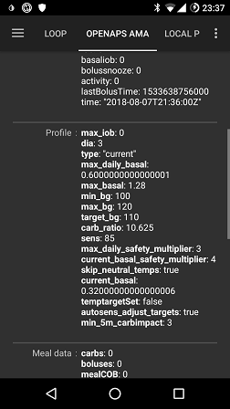

# 闭环常见问题（FAQ）

如何向FAQ添加问题：请按照以下[说明](../SupportingAaps/HowToEditTheDocs.md)操作

## 常规

### 我可以直接下载AAPS的安装文件吗？

无法直接下载。 没有可下载的AAPS apk文件。 你必须自己[构建](../SettingUpAaps/BuildingAaps.md)它。 原因如下：

AAPS用于控制您的泵并输注胰岛素。 根据欧洲现行的规定，所有被归类为IIa类或IIb类的系统都是医疗器械，需要获得监管机构的批准（即CE标志），而这需要经过各种研究和审核批准。 发布未经监管认可的设备是违法行为。 全球其他地区也有类似的规定。

这项规定不仅仅限于销售（以此获利），而是适用于任何发布行为（包括免费赠送）。 自行构建医疗设备是合规使用本APP的唯一方式。

这就是不能直接提供APK文件的原因。

(FAQ-how-to-begin)=

### 如何开始？

首先，您需要**获取可闭环的硬件组件**：

- 一台[受支持的胰岛素泵](../Getting-Started/CompatiblePumps.md)， 
- 一部[安卓智能手机](../Getting-Started/Phones.md)（AAPS不支持Apple iOS系统——您可查阅[iOS Loop](https://loopkit.github.io/loopdocs/)方案）
- 一个[持续葡萄糖监测系统（动态，CGM）](../Getting-Started/CompatiblesCgms.md) 

其次，您需要**配置以下软件组件**：[AAPS系统](../SettingUpAaps/BuildingAaps.md)、[持续/闪速血糖监测数据源](../Getting-Started/CompatiblesCgms.md)以及[报告服务器](../SettingUpAaps/SettingUpTheReportingServer.md)。

第三，您需要学习并**理解OpenAPS参考设计，以核验您的治疗参数**。 闭环治疗的基本原则是确保您的[基础率和碳水系数](../SettingUpAaps/YourAapsProfile.md)准确无误。 所有建议均基于您的基础率需求已得到满足这一前提，若观测到血糖波峰或波谷，应视为其他因素（如运动、压力等）所致，因此仅需进行一次性调整。 闭环系统为保障安全所能进行的调整存在严格限制（参见[OpenAPS参考设计](https://openaps.org/reference-design/)中允许的最大临时基础率），这意味着您不应将有限的剂量调整额度浪费在纠正错误的基础率上。 例如，若您经常在临近用餐时出现低血糖而需要临时调低基础率，则很可能需要重新调整您的基础率设置。 您可以使用[Autotune](https://openaps.readthedocs.io/en/latest/docs/Customize-Iterate/autotune.html#phase-c-running-autotune-for-suggested-adjustments-without-an-openaps-rig)分析大量数据，从而判断是否需要调整基础率和/或胰岛素敏感系数（ISF）以及如何调整，同时评估碳水比率是否需要修改。 或者，您也可以采用[传统方法](https://integrateddiabetes.com/basal-testing/)测试和设置基础代谢率。

### 闭环有哪些实际应用要点？

#### 密码保护

如果您不希望偏好设置被轻易更改，可以在偏好设置菜单中选择​“为设置添加密码”​，然后输入您设定的密码，即可对偏好设置菜单进行密码保护。 下次进入偏好设置菜单时，系统将要求输入该密码，验证通过后方可继续操作。 若之后想取消密码保护功能，请进入​“设置密码”​选项并清空文本框内容。

#### Android Wear智能手表

如果您计划通过 Android Wear 应用进行推注或更改设置，请确保未屏蔽来自 AAPS 的通知。 操作确认将通过通知发送。

(FAQ-disconnect-pump)=

#### 断开泵连接

若因淋浴、沐浴、游泳、运动或其他活动需摘除胰岛素泵，必须告知 AAPS 系统停止输注，以保持活性胰岛素（IOB）计算准确。

您可通过[AAPS 主屏幕](#AapsScreens-loop-status)上的<1>循环状态图标</1>断开胰岛素泵连接。

#### 建议不仅基于单次CGM读数

出于安全考虑，系统建议并非基于单次CGM读数，而是基于平均变化率（delta）。 因此，若出现监测数据缺失，恢复数据后AAPS可能需要一定时间才能重新启动循环功能。

#### 进一步阅读

以下精选博客提供实用技巧，助您掌握闭环系统的操作要点：

- [微调设置](https://seemycgm.com/2017/10/29/fine-tuning-settings/) - See my CGM
- [为什么DIA很重要](https://seemycgm.com/2017/08/09/why-dia-matters/) - See my CGM
- [限制餐后血糖飙升](https://diyps.org/2016/07/11/picture-this-how-to-do-eating-soon-mode/) - #DIYPS
- [激素和autosens](https://seemycgm.com/2017/06/06/hormones-2/) - See my CGM

### 推荐携带的急救设备有哪些？

你必须和其他所有使用胰岛素泵治疗的1型糖尿病患者一样，随身携带相同的应急装备。 在使用AAPS闭环系统时，强烈建议随身或在附近备有以下额外设备：

- 备用电源及充电线（用于智能手机、智能手表，以及蓝牙血糖仪/Link设备等需充电配件）
- 胰岛素泵电池
- 当前版本的 [AAPS安装包](../SettingUpAaps/BuildingAaps.md) 和 [配置文件](../Maintenance/ExportImportSettings.md)（包括其他相关应用如xDrip+、BYO Dexcom等），需在本地和云端（Dropbox、Google Drive）双重备份。

### 如何安全牢固地附着CGM/FGM？

你可以用胶带粘起来。 市场上有多种针对常见CGM系统的预穿孔"加固贴片"可供选择（可通过Google、eBay或Amazon搜索购买）。 部分闭环系统使用者会选用更经济的标准肌效贴或RockTape品牌产品。

你可以搞定它。 您还可以购买通过绑带固定CGM/FGM传感器的上臂护套（可通过Google、eBay或Amazon搜索选购）。

## APS算法

### 为什么我的个人资料中设置了不同的DIA值，但"OPENAPS AMA"标签页仍显示"dia:3"？

在AMA算法中，DIA实际上并不表示"胰岛素作用时长"。 这是一个参数，过去曾与DIA相关联。 现在，它表示"应在多长时间内完成校正"。 该参数与活性胰岛素（IOB）的计算完全无关。 在OpenAPS的SMB模式中，此参数已不再需要。

## 其他设置

### Nightscout设置

#### AAPS客户端显示"未获授权"并停止数据上传。 我能做些什么？

在 AAPSClient 中检查 "连接设置"。 也许你实际上并不在允许的WLAN中，或者你已经激活了“仅当充电时”，而你的充电电缆没有连接。

### CGM设置

#### 为什么AAPS说“BG源不支持高级过滤”？

如果你使用的是xDrip原生模式下的非Dexcom G5或G6 CGM/FGM，你会在AAPS的OpenAPS标签中看到这个警告。 请参阅[平滑血糖数据](../CompatibleCgms/SmoothingBloodGlucoseData.md)。

### 胰岛素泵

#### 泵放在哪里？

放置泵的位置有无数种可能。 是否使用闭环并不重要。

#### 电池

闭环系统运行会加速胰岛素泵电池消耗（相比手动操作模式），因为系统通过蓝牙的交互频率远高于人工操作。 建议在电池电量剩余25%时更换，因电量过低会导致通信稳定性下降。 您可以通过在Nightscout网站中设置PUMP_WARN_BATT_P参数来启用胰岛素泵电池低电量预警警报。 增加电池寿命的技巧包括：

- 缩短LCD屏幕持续亮屏时间（需在胰岛素泵设置菜单内调整）
- 请通过胰岛素泵设置菜单缩短背光持续时间
- 请将胰岛素泵的通知设置从震动模式调整为蜂鸣提示（需在泵体设置菜单内操作）。
- 请仅通过胰岛素泵按键执行重新加载操作，所有历史数据、电池电量和储药器余量均需通过AAPS查看。
- 为节省电量或释放手机内存，有的手机会频繁关闭AAPS应用。 每次启动时，AAPS都会重新初始化并与胰岛素泵建立蓝牙连接，同时重新读取当前基础率及大剂量历史记录。 这会消耗电量。 要确认是否发生此情况，请前往【设置】>【NS客户端】并启用"记录应用启动至Nightscout"功能。 每次AAPS重启时，Nightscout都会接收到相应事件记录，便于追踪该问题。 为避免此情况发生，请在手机电池设置中将AAPS应用加入白名单，以防止系统电源管理强制关闭该应用。
    
    例如，在运行Android Pie系统的三星手机上设置白名单的操作步骤如下：
    
    - 转到“设置”->“设备护理”->“电池” 
    - 滚动直到找到AAPS并选择它
    - 取消选中“使应用进入休眠状态”
    - 还要转到“设置”->“应用”->（屏幕右上角的三个圆圈符号）选择“特殊访问”->“优化电池使用”
    - 滚动到AAPS并确保它被取消选中。

- 使用酒精棉片清洁电池触点，确保去除所有出厂残留的蜡质/油脂。

- 对于[Dana R/RS胰岛素泵](../CompatiblePumps/DanaRS-Insulin-Pump.md)，其启动程序会施加高电流以刻意击穿电池钝化膜（该膜用于防止存储期间能量损耗），但这一过程并不总能实现100%的完全击穿。 请反复取出并重新插入电池2-3次，直至屏幕显示100%电量；或使用电池钥匙在安装前瞬间短接电池两极（接触时间不超过0.5秒）。
- 另请参阅针对[特定电池类型](#Accu-Chek-Combo-Tips-for-Basic-usage-battery-type-and-causes-of-short-battery-life)的更多使用技巧。

#### 更换储药器与输注管路

更换储药器操作无法通过AAPS完成，仍需像往常一样直接在胰岛素泵上执行。

- 在AAPS的「首页」选项卡中长按"开环"/"闭环"按钮，选择「暂停闭环1小时」。
- 现在断开泵的连接，并按照泵的说明更换储药器。
- 此外，管路与输注套管的预充操作也可直接在胰岛素泵上完成。 这种情况下，请使用操作选项卡中的[PRIME/FILL按钮](#screens-action-tab)仅用于记录更换操作。
- 重新连接胰岛素泵后，长按"已暂停（剩余X分钟）"按钮即可恢复闭环运行。

然而，更换输注管路时并不使用胰岛素泵自带的"充盈管路"功能，而是通过大剂量注射（该操作不会出现在大剂量历史记录中）来完成管路和/或套管的填充。 这意味着该操作不会中断当前正在运行的临时基础率。 在操作（Act）选项卡中，使用[PRIME/FILL按钮](#screens-action-tab)设置充盈输注管路所需的胰岛素量并启动预充程序。 若剂量不足，请重复执行充盈操作。 您可以在【设置】>【其他】>【充盈/预充标准胰岛素量】中配置默认剂量快捷按钮。 请参阅输注套管包装内的说明书，根据针头长度和管路长度确定所需预充胰岛素单位数。

### 壁纸

您可以在[手机页面](#Phones-phone-wallpaper)上找到适用于您手机的AAPS壁纸。

### 日常使用

#### 卫生

##### 淋浴或泡澡时需要注意什么？​

您可以在淋浴或洗澡时取下泵。 在这短时间内，您可能不需要它，但您应告知 AAPS 您已断开连接，以便 IOB 计算正确无误。 见<0>上面的描述</0>。

#### 工作

根据您的工作，您可以选择在工作日使用不同的胰岛素系数。 作为闭环用户，您应该为典型的工作日考虑一个 <0>配置切换</0>。 例如，如果您的工作强度较低（如坐在办公桌前），您可以切换到高于 100% 的配置；如果您整天活动且站立，则可以切换到低于 100% 的配置。 您还可以考虑设置较高或较低的临时目标，或在工作时间比平时早很多或晚很多时，或轮班工作时，进行 [配置时间调整](#ProfileSwitch-ProfilePercentage-time-shift-of-the-circadian-percentage-profile)。 您还可以创建第二个配置（例如“家庭”和“工作日”），并根据需要每天切换到实际需要的配置。

### 休闲活动

(FAQ-sports)=

#### 运动

您需要重新调整闭环前的旧运动习惯。 如果您像以前一样简单地摄入一份或多份运动碳水，闭环系统会识别并相应地进行校正。

因此，你的体内会有更多碳水化合物储备，但同时闭环系统会进行抵消并释放胰岛素。

当使用循环时，您可以尝试以下步骤：

- 将[配置文件切换](../DailyLifeWithAaps/ProfileSwitch-ProfilePercentage.md)设置为小于100%。
- 将[活动临时目标](#TempTargets-activity-temp-target)设置为高于你的标准目标。
- 如果使用SMB，请确保禁用["在高临时目标时启用SMB"](#Open-APS-features-enable-smb-with-high-temp-targets)和["始终启用SMB"](#Open-APS-features-enable-smb-always)选项。

这些设置的前后处理非常重要。 请在运动前及时进行调整，并考虑肌肉充血的影响。

如果您定期在相同时间进行运动（例如健身房的体育课），可以考虑使用 [自动化](../DailyLifeWithAaps/Automations.md) 来切换配置和 TT。 基于位置的自动化也是一种选择，但会使预处理变得更加困难。

配置文件切换的百分比、活动临时目标值以及最佳调整时间都是因人而异的。 如果您在寻找适合自己的数值，请从安全范围开始（先使用较低百分比和较高临时目标）。

#### 性生活

您可以摘除胰岛素泵以获得"自由"，但应告知AAPS以确保活性胰岛素(IOB)计算准确。 见<0>上面的描述</0>。

#### 饮酒

在闭环模式下饮酒存在风险，因为算法无法准确预测酒精对血糖的影响。 您需要通过AAPS的以下功能来探索适合自己的处理方法：

- 停用闭环模式并手动控制糖尿病
- 设置较高的临时目标并停用未标记餐食(UAM)功能，以防止闭环系统因未记录的餐食而增加活性胰岛素(IOB)
- 将配置文件切换至明显低于100%的比例 

饮酒时，您必须始终关注连续血糖监测仪(CGM)，以便通过摄入碳水化合物来手动预防低血糖。

#### 睡眠

##### 如何在夜间运行闭环时避免手机和WiFi辐射？

许多用户会在夜间将手机切换至飞行模式。 如果您希望闭环系统在睡眠时继续工作，请按以下步骤操作（此方法仅适用于使用本地血糖数据源的情况，如xDrip+或['自建Dexcom应用'](#DexcomG6-if-using-g6-with-build-your-own-dexcom-app)，若通过Nightscout获取血糖读数则无法使用）：

1. 将您的手机设置为飞行模式。
2. 等待直至飞行模式生效。
3. 打开蓝牙。

您现在既无法接听电话，也无法连接互联网。 但闭环仍在运行。

一些用户发现，当手机处于飞行模式时会出现本地广播问题（AAPS无法接收来自xDrip+的血糖值数据）。 进入设置 > 应用间设置 > 识别接收器，输入 `info.nightscout.androidaps`。

#### 旅行

##### 如何应对时区变化？

使用 Dana R 和 Dana R Korean 无需进行任何操作。 对于其他泵，请参阅 [时区旅行](../DailyLifeWithAaps/TimezoneTraveling-DaylightSavingTime.md) 页面了解更多详情。

### 医疗话题

#### 住院

如果您想与临床医生分享有关AAPS和DIY闭环系统的一些信息，可以打印[AAPS临床医生指南](../UsefulLinks/ClinicianGuideToAaps.md)。

#### 内分泌科医生的医疗预约

##### 报告

您可以选择展示您的Nightscout报告(https://YOUR-NS-SITE.com/report)，或者查看[Nightscout Reporter](https://nightscout-reporter.zreptil.de/)。

## Discord上的常见问题及其解答...

### 我的问题不在此列。

[获取帮助的相关信息。](../GettingHelp/WhereCanIGetHelp.md)

### 我的问题不在列表中，但我已找到解决方法

[获取帮助的相关信息。](../GettingHelp/WhereCanIGetHelp.md)

**提醒我们将您的解决方案添加到此列表中！**

### AAPS每天大约在同一时间停止运行。

停止 Google Play Protect。 检查“清理”应用程序（例如 CCleaner 等）并卸载它们。 AAPS / 三点菜单 / 关于 / 点击"保持应用在后台运行"链接以关闭所有电池优化设置。

### 如何整理我的备份？

请定期导出设置：每次更换Pod后、修改个人配置后、完成目标验证后，或是更换胰岛素泵时...即使没有任何改动，也请每月至少导出一次。 保留多份旧的导出文件。

请将以下文件备份至网络云盘（如Dropbox、Google等）：您手机上用于安装应用程序的所有apk文件（包括AAPS、xDrip、BYODA、Patched LibreLink等），以及从所有应用程序导出的设置文件。

### 我在构建应用程序时遇到问题和错误。

请

- 请查看[Android Studio故障排除](../GettingHelp/TroubleshootingAndroidStudio)以了解典型错误及其解决方案。
- 以及[逐步操作指南](https://docs.google.com/document/d/1oc7aG0qrIMvK57unMqPEOoLt-J8UT1mxTKdTAxm8-po)中的提示。

### 我被卡在一个目标上，需要帮助。

截屏问题和答案。 将其发布到 Discord 的 AAPS 频道。 别忘了说明您选择的选项（或未选择的）以及原因。 您会得到提示和帮助，但您需要自己找到答案。

### 如何在AAPS v2.8.x中重置密码？

打开汉堡菜单，启动配置向导并在提示时输入新密码。 您可以在密码阶段之后退出向导。

### 如何在AAPS v3.x中重置密码？

你可以在[这里](#Update3_0-reset-master-password)找到文档。

### 我的连接/胰岛素泵/Pod无响应（RL/OL/EmaLink等设备）

对于某些手机，蓝牙可能会断开与链接（RL/OL/EmaL 等）的连接。

部分用户还会遇到链接无响应的情况（AAPS显示设备已连接，但链接无法访问或控制胰岛素泵）。

让所有部件恢复正常工作的最简单方法是： 1/ 在AAPS中删除Link连接 2/ 关闭Link设备电源 3/ 通过AAPS三点菜单退出AAPS应用 4/ 长按AAPS图标→进入Android应用信息→强制停止AAPS→清除缓存（切勿清除主存储！） 4之补充/ 少数手机可能需要在此步骤重启。 您可以尝试不重启。 5/ 开启Link设备电源 6/ 启动AAPS应用 7/ 进入Pod标签页→三点菜单→搜索并连接Link设备

### 构建错误：文件名太长

尝试构建时出现文件名过长的错误。 可能的解决方案： 将您的源代码移至更靠近驱动器根目录的目录（例如 "c:\src\AndroidAPS-EROS"）。

在Android Studio中： 请确保在打开项目并从GitHub拉取代码后，"Gradle"已完成同步和索引工作。 在重新构建项目之前执行 Build->Clean Project。 执行 文件→使缓存无效并重启Android Studio。

### 警告：正在运行开发版本。 闭环已禁用。

AAPS 未在"开发者模式"下运行。 AAPS 显示以下消息：“运行开发版本， 闭环已禁用。”

请确保 AAPS 在"开发者模式"下运行： 在 "AAPS/extra" 目录下放置一个名为 "engineering_mode" 的文件。 任何文件都可以，只要命名正确。 确保重新启动 AAPS，以便找到文件并进入“开发者模式”。

提示：复制一份现有的日志文件，并将其重命名为"engineering_mode"（注意：不要有文件扩展名！）。

### 在哪里可以找到设置文件？

设置文件将存储在您手机的内部存储中，位于"/AAPS/preferences"目录下。 警告：请务必保管好您的密码，否则将无法导入加密的设置文件！

### 如何配置电池节能设置？

正确配置电源管理非常重要，可防止手机在闲置时系统自动挂起AAPS及相关应用和服务。 这将导致AAPS无法正常工作，且传感器与Rileylink(RL)的蓝牙连接可能中断，从而触发"胰岛素泵断开"警报并引发通信错误。 在手机上进入 设置 -> 应用，并为以下应用禁用电池优化： AAPS、xDrip 或 BYODA/Dexcom 应用、蓝牙系统应用（可能需要先选择显示系统应用），或者直接完全关闭手机上的所有电池优化功能。 因此，您的电池可能会消耗得更快，但这是判断电池优化是否导致问题的有效方法。 电池节能功能的实现方式很大程度上取决于手机品牌、型号和/或操作系统版本。 由于这个原因，几乎不可能为您的具体配置提供正确设置电池优化的指导说明。 尝试调整设置，找到最适合您的配置方案。 更多信息，请参阅"Don't kill my app"。

### 胰岛素泵无法连接警报每天或夜间多次出现。

您的手机可能正在暂停AAPS服务甚至蓝牙功能，导致与RL的连接中断（请参阅电池优化设置部分）。 建议通过右上角三点菜单进入 偏好设置→本地警报→胰岛素泵不可达阈值[分钟]，将该值配置为120分钟。

### 我可以在AAPS v3中删除治疗记录吗？

点击右上角三点菜单 → 选择"治疗记录" → 再次点击三点菜单 → 即可看到可用的不同操作选项。

### 配置和使用AAPSClient远程应用程序

AAPS可以通过AAPSClient应用程序进行远程监控和操作，同时也可选择通过运行在Android Wear智能手表上的配套Wear应用来实现这一功能。 请注意，AAPSClient（远程）应用程序与AAPS中的NSClient配置不同，且AAPSClient（远程）Wear应用程序也不同于AAPS Wear应用程序——为明确起见，远程应用程序将被称为“AAPSClient远程”和“AAPS远程Wear”应用程序。

要启用AAPSClient远程功能，您必须： 1）安装AAPSClient远程应用程序（版本需与使用的AAPS版本匹配）。 2）运行AAPSClient远程应用程序，按照配置向导完成必要权限授予及Nightscout站点访问配置。 3）此时您可能需要禁用部分警报选项，和/或关闭将AAPSClient远程应用启动记录到Nightscout站点的高级设置。 完成此操作后，AAPSClient远程应用将从您的Nightscout站点下载配置文件数据。"概览"选项卡将显示CGM数据和部分AAPS数据，但可能不会显示图表数据，并会提示尚未设置配置文件。 4) 激活配置：

- 在 AAPS > NSClient > 选项中启用远程配置同步
- 在NSClient远程端 > 配置文件中激活该配置文件 完成此操作后，配置文件即被设定，AAPSClient远程端将显示来自AAPS的所有数据 提示：如果图表仍然缺失，尝试更改图表设置以触发更新。 5) 要通过 AAPSClient 启用远程控制，请选择性启用 AAPS 的相关功能（配置更改、临时目标、碳水等），路径为 AAPS > NSClient > 选项。 完成这些更改后，您将能够通过 Nightscout 或 AAPSClient 远程控制 AAPS。

如需通过AAPSClient远程Wear应用监控/控制AAPS，需同时安装AAPSClient远程主应用及其配套的Wear应用。 编译AAPSClient远程Wear应用时，请遵循安装/配置AAPS穿戴应用的标准说明，但在编译环节需选择AAPSClient变体版本。

### 我出现红色三角形警告 / AAPS无法启用闭环模式 / 循环始终处于LGS状态 / 我出现黄色三角形警告

红色和黄色三角形是AAPS v3版本中的安全警示功能。

红色三角形表示存在重复的血糖值（BGs），导致AAPS无法准确计算血糖变化率（deltas）。 无法启用闭环模式。 您需要删除每组重复血糖值中的一条记录，才能消除红色三角形警告。 进入BYODA或xDrip选项卡，长按要删除的某行数据，在重复出现的每组数据中勾选其中一条（或通过三点菜单选择删除，具体操作取决于您的AAPS版本）。 如果存在过多重复血糖值，您可能需要重置AAPS数据库。 在这种情况下，您还将丢失统计数据、活性胰岛素(IOB)、活性碳水化合物(COB)以及当前选定的配置文件。

问题可能源于：xDrip和/或Nightscout(NS)的血糖数据回填功能。

黄色三角形表示各次血糖读数间存在不稳定的时间延迟。 您的血糖数据未规律性地每5分钟更新一次，或存在数据缺失。 这通常是Libre传感器的问题。 更换G6发射器时也会出现此问题。 若黄色三角警告与更换G6发射器有关，该警告将在数小时后（约24小时）自动消失。 若是Libre传感器，黄色三角警告将持续存在。 闭环功能可以正常启用并运行。

### 能否将运行中的DASH Pod迁移到其他硬件？

这是可行的。 请注意，由于迁移操作属于"不受支持"且"未经测试"的行为，存在一定风险。 建议在Pod即将到期时尝试此操作，这样即使出现问题，损失也较小。

关键在于重新连接时，AAPS中的泵"状态"（包括其MAC地址）必须与DASH完全匹配。

### 我在此过程中遵循的操作流程如下：

1) 暂停 DASH 泵 这能确保当DASH断开连接时，系统不会执行任何正在运行或排队的指令 2）将手机切换至飞行模式以禁用蓝牙（同时关闭WiFi和移动数据） 这样就能确保AAPS和DASH无法通信。 3）导出设置（包含DASH状态）。 4）将刚导出的设置文件从手机复制出来（由于手机处于飞行模式且我们不想改变该状态，最简单的方法是使用USB数据线）。 5）将设置文件复制到备用手机上。 6) 在备用手机的 AAPS 中导入设置。 7) 检查 DASH 选项卡以验证它是否能看到 Pod。 8）取消暂停 Pod。 9）检查 DASH 选项卡并确认它是否正在与 Pod 通信（使用刷新按钮）。

恭喜：完成了！

*等等！* 您的主手机仍然认为它可以重新连接到相同的 DASH：

1）在主手机上选择“停用”。 这很安全，因为手机无法与DASH通信来实际停用Pod（仍处于飞行模式） 2）停用操作会导致通信错误——这是预期情况。 3）只需重试几次，直到 AAPS 提供“丢弃” Pod 的选项。

当丢弃后，验证 AAPS 是否报告“无活动 Pod”。 现在您可以安全地禁用飞行模式了。

### 如何将早期版本的AAPS设置导入到AAPS v3中？

您只能导入通过AAPS v2.8x或v3.x版本导出的设置（在AAPS v3中）。如果您之前使用的AAPS版本低于v2.8x，或者需要使用v2.8x之前的设置导出文件，则需要先安装AAPS v2.8版本。 在 v2.x 中导入旧设置到 v2.8。检查一切正常后，可以从 v2.8 导出设置。安装 AAPS v3，并在 v3 中导入 v2.8 设置。

如果您使用相同的密钥构建 v2.8 和 v3，则甚至不需要导入设置。 您可以直接在 v2.8 上安装 v3。

添加了一些新的目标。 您需要验证它们。