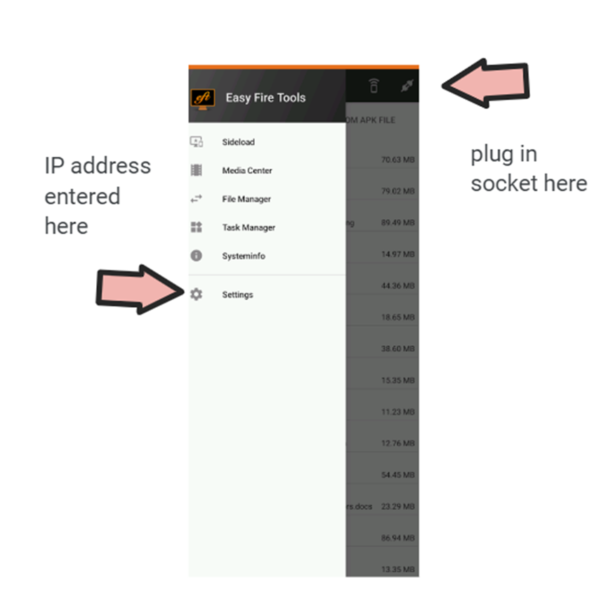
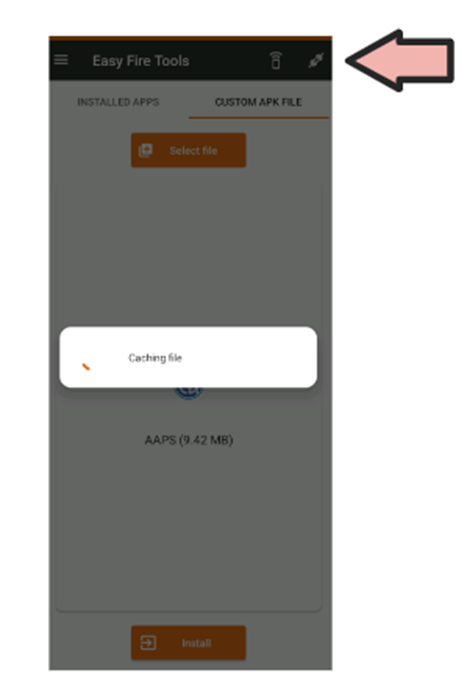

# 在您的Wear OS手表上安装AAPS

下面的说明适用于您需要构建的AAPS Wear apk（如果您尚未构建，请参阅[此处](../WearOS/BuildingAapsWearOS.md)），就像您已经构建了手机AAPS apk一样。

您还可以使用一些信息，这些信息适用于直接在[GitHub](https://github.com/nightscout/AndroidAPS/releases/tag/3.2.0.4)上可用的**AAPSClient**和**PumpControl** **Wear** apk。 每个Wear应用都将与其匹配的手机应用进行通信。 例如：AAPSClient Wear应用可用于显示AAPSClient数据，而不是AAPS数据。

(BuildingAapsWearOs-WearOS5)=

```{admonition} Android Wear OS 5
:class: warning
安装AAPS表盘必须通过[Wear Installer 2](https://www.youtube.com/watch?v=yef_qGvcCnk)，在安装Wear应用之后进行。 <br>
如果意外更改了表盘为其他表盘，则需要重复上述过程。 <br>
更改专用表盘参数，如：暗色模式、表盘分隔符等，是不可行的。
```

## 如何在Samsung Galaxy 4智能手表上设置AAPS

本节假设您完全不了解智能手表，并为您提供有关热门手表**Galaxy Watch 4**的基本指导，随后是逐步在手表上安装**AAPS**的指南。

_本指南假设您要设置的Samsung Galaxy手表运行的是Wear OS版本3或更低版本。 _ 如果您要设置运行Wear OS 4/OneUI 5或更高版本的手表，您需要使用新的ADB配对过程，这将在您手机上的Samsung软件中解释，并将在适当时候在此处更新。

这里是针对[Galaxy Watch 5](https://www.youtube.com/watch?v=Y5upzOIxwTU)和[Galaxy Watch 6](https://www.youtube.com/watch?v=D6bq20KzPW0)的基本设置指南。

## 智能手表基本操作

在根据上面的视频完成手表的基本设置后，请转到手机上的Play商店并下载以下应用：“Galaxy Wearable”、“Samsung”以及“Easy Fire tools”或“Wear Installer 2”。

YouTube上有许多第三方视频可以帮助您熟悉新智能手表，例如：

[https://www.youtube.com/watch?v=tSVkqWNmO2c](https://www.youtube.com/watch?v=tSVkqWNmO2c)

“Galaxy Wearable”应用中也包含有说明手册部分。 在手机上打开Galaxy Wearable，搜索手表，尝试将手表与手机配对。 根据您的版本，这可能会提示您从Play商店安装进一步的第三方应用“galaxy watch 4 plugin”（下载需要一些时间）。 在手机上安装此应用，然后再次尝试在Wearable应用中配对手表和手机。 完成一系列菜单并勾选各种偏好设置。

## 设置Samsung账户

您需要确保用于设置Samsung账户的电子邮件账户的出生日期表明用户年满13岁，否则Samsung权限将非常难以批准。 如果您为未满13岁的孩子提供了一个Gmail账户，并且正在使用该电子邮件地址，则不能简单地将其更改为成人账户。 一种解决方法是修改当前出生日期，使其当前年龄为12岁363天。 第二天，账户将转换为成人账户，您可以继续设置Samsung账户。

(remote-control-transferring-the-aaps-wear-app-onto-your-aaps-phone)=

## 将**AAPS** Wear应用传输到您的**AAPS**手机上。

您可以通过以下方式之一将Wear.apk从Android Studio加载到手机上：

a) 使用USB电缆将AAPS Wear apk文件放到手机上，然后“侧载”到手表上。 将Wear.apk通过USB传输到手机的下载文件夹中；或

b) 将Wear.apk从Android Studio剪切并粘贴到您的Gdrive上。


您可以使用Wear Installer 2或Easy Fire tools将AAPS侧载到手表上。 在这里，我们推荐使用Wear Installer 2，因为后面视频中的说明和过程非常清晰易懂。

## 使用Wear Installer 2将手机上的**AAPS** Wear侧载到手表上

 

Wear Installer 2由[Malcolm Bryant](https://www.youtube.com/@Freepoc)开发，可以从Google Play下载到您的手机上，并可用于将AAPS Wear应用侧载到手表上。 该应用包含一个方便的“如何侧载”的[视频](https://youtu.be/abgN4jQqHb0?si=5L7WUeYMSd_8IdPV)。

```{tip}
对于Wear OS 5手表，请参考[此视频](https://www.youtube.com/watch?v=yef_qGvcCnk)。
```

这提供了所有必要的详细信息（最好在单独的设备上打开视频，以便在设置手机的同时观看）。

如视频中所述，完成后，请关闭手表上的ADB调试，以避免耗尽智能手表的电池。

或者，您也可以：

```{admonition} Use Easy Fire tools to side-load the **AAPS** wear on the watch
:class: dropdown
1) 从Play商店在手机上下载_Easy Fire Tools_

2) 开启手表的开发者模式（一旦设置并连接到手机）：
转到设置>关于手表（底部选项）>-软件信息>软件版本。 

快速点击“软件版本”，直到出现通知，表明手表现在处于“开发者模式”。 返回到设置菜单的顶部，滚动到底部，
并在“关于手表”下方看到“开发者选项”。 

在“开发者选项”中，打开“ADB调试”和“无线调试”。 后者选项将显示手表的IP地址，该地址的最后两位数字每次手表与新手机配对时都会更改。 它看起来会像这样：**167.177.0.20.** 5555（忽略最后4位数字）。 请注意，此地址的最后两位数字（此处为“20”）在每次您为AAPS更换新手机时都会更改。  


3) 将IP地址（例如**167.177.0.20**）输入到手机上的Easy Fire tools中（进入左侧的汉堡菜单，设置并输入IP地址）。 然后点击右上角的插头插座图标。  



4) 按照[此处](https://wearablestouse.com/blog/2022/01/04/install-apps-apk-samsung-galaxy-watch-4/?utm_content=cmp-true)的说明，使用Easy Fire tools将Wear.apk侧载（即传输）到智能手表上
点击应用中右上角的的“插头”图标，以便将Wear OS.apk上传到智能手表：

下一步>在智能手表上接受授权请求


```


## 从**AAPS**设置手表与手机的连接

最后一步是在手机上配置**AAPS**以与手表上的**AAPS** Wear进行交互。 为此，请在配置构建器中启用Wear插件：

* 打开手机上的**AAPS**

* 在左侧的汉堡菜单中选择>配置构建器

* 在“常规”下勾选Wear选项


要更改为不同的**AAPS**表盘，请按手表的主屏幕，它将转到“自定义”。 然后向右滑动，直到您看到所有**AAPS**表盘。

如果已成功将**AAPS** Wear.apk侧载到智能手表上，它将如下所示：


### 排查**AAPS**手表与**AAPS**手机之间的通信问题

1.  如果EasyFire tools无法连接或您收到“授权失败”>检查IP地址是否正确输入。
2.  检查智能手表是否已连接到互联网（而不仅仅是通过蓝牙连接到手机）。
3.  检查**AAPS**手机和智能手表是否已在Samsung应用中配对或链接。
4.  重启手机和智能手表（即关闭并重新打开）也可能有所帮助。
5.  假设您已成功将Wear.apk下载到手机上，但未收到任何BG数据，_请检查_您是否已将正确的**AAPS** apk版本侧载到手表上。 如果您的AAPS wear.apk版本列为以下任一项： a)“wear-AAPSClient-release”； b)‘wear-full-release.aab’；或 c)标题中出现“debug”， 则您在构建过程中未选择正确的Wear OS apk版本。
6.  检查您的路由器是否将设备彼此隔离。

更多故障排除提示可在此处找到[here](https://freepoc.org/wear-installer-help-page/#:~:text=If%20you%20are%20having%20problems,your%20phone%20and%20your%20watch.)

(WearOS_changing-to-AAPS-watchface)=

## 在您的WearOS手表上更改为AAPS表盘

在标准构建的AAPS Wear OS APK中有多个表盘可供选择。 一旦您在手表上安装了AAPS Wear APK，它们将可用。 以下是选择表盘的步骤：

1. 在您的手表上（假设是WearOS），长按当前表盘以调出表盘选择器屏幕，并一直向右滚动，直到您看到“添加表盘”按钮并选择它


2. 滚动到列表底部，直到您看到“已下载”部分，找到“AAPS（自定义）”并点击图像中间部分将其添加到当前表盘的短列表中。 不用担心“AAPS（自定义）”表盘的当前外观，我们将在下一步中选择您喜欢的皮肤。


3. 现在，在手机上打开AAPS，并转到Wear插件（如果您在当前的插件中看不到它，请在配置构建器（在“同步”下）中启用它）。


4. 点击“加载表盘”按钮，并选择你喜欢的表盘。


5. 检查您的手表，“AAPS（自定义）”表盘现在应该显示您选择的皮肤。 给它几秒钟刷新。 您现在可以通过长按表盘，然后点击表盘图像上的“自定义”按钮来自定义小部件等。

## APSv2 watchface - Legend


A - 上次闭环运行以来的时间

B - 持续葡萄糖监测（CGM）读数

C - 自上次CGM读数以来的分钟数

D - 与上次CGM读数相比的变化（以mmol或mg/dl为单位）

E - 过去15分钟内CGM读数的平均变化

F - 手机电量

G - 基础率（标准速率期间以U/h显示，临时基础率（TBR）期间以%显示）

H - 血糖互动（BGI）-> 仅基于胰岛素活性，血糖“应该”上升或下降的程度。

I - 碳水化合物（活性碳水化合物|未来的e-carbs）

J - 活性胰岛素（来自大剂量|来自基础量）