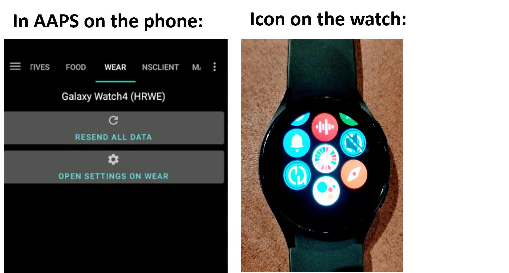

# 在您的Wear OS手表上安装AAPS

下面的说明适用于您需要构建的AAPS Wear apk（如果您尚未构建，请参阅[此处](../WearOS/BuildingAapsWearOS.md)），就像您已经构建了手机AAPS apk一样。

您还可以使用一些信息，这些信息适用于直接在[GitHub](https://github.com/nightscout/AndroidAPS/releases/tag/3.2.0.4)上可用的**AAPSClient**和**PumpControl** **Wear** apk。 每个Wear应用都将与其匹配的手机应用进行通信。 例如：AAPSClient Wear应用可用于显示AAPSClient数据，而不是AAPS数据。

(BuildingAapsWearOs-WearOS5)=

```{admonition} Android Wear OS 5
:class: warning
安装AAPS表盘必须通过[Wear Installer 2](https://www.youtube.com/watch?v=yef_qGvcCnk)，在安装Wear应用之后进行。 <br>
如果意外更改了表盘为其他表盘，则需要重复上述过程。 <br>
更改专用表盘参数，如：暗色模式、表盘分隔符等，是不可行的。
```

## 如何在Samsung Galaxy 4智能手表上设置AAPS

本节假设您完全不了解智能手表，并为您提供有关热门手表**Galaxy Watch 4**的基本指导，随后是逐步在手表上安装**AAPS**的指南。

_本指南假设您要设置的Samsung Galaxy手表运行的是Wear OS版本3或更低版本。 _ 如果您要设置运行Wear OS 4/OneUI 5或更高版本的手表，您需要使用新的ADB配对过程，这将在您手机上的Samsung软件中解释，并将在适当时候在此处更新。

这里是针对[Galaxy Watch 5](https://www.youtube.com/watch?v=Y5upzOIxwTU)和[Galaxy Watch 6](https://www.youtube.com/watch?v=D6bq20KzPW0)的基本设置指南。

## 智能手表基本操作

在根据上面的视频完成手表的基本设置后，请转到手机上的Play商店并下载以下应用：“Galaxy Wearable”、“Samsung”以及“Easy Fire tools”或“Wear Installer 2”。

YouTube上有许多第三方视频可以帮助您熟悉新智能手表，例如：

[https://www.youtube.com/watch?v=tSVkqWNmO2c](https://www.youtube.com/watch?v=tSVkqWNmO2c)

“Galaxy Wearable”应用中也包含有说明手册部分。 在手机上打开Galaxy Wearable，搜索手表，尝试将手表与手机配对。 根据您的版本，这可能会提示您从Play商店安装进一步的第三方应用“galaxy watch 4 plugin”（下载需要一些时间）。 在手机上安装此应用，然后再次尝试在Wearable应用中配对手表和手机。 完成一系列菜单并勾选各种偏好设置。

## 设置Samsung账户

您需要确保用于设置Samsung账户的电子邮件账户的出生日期表明用户年满13岁，否则Samsung权限将非常难以批准。 如果您为未满13岁的孩子提供了一个Gmail账户，并且正在使用该电子邮件地址，则不能简单地将其更改为成人账户。 一种解决方法是修改当前出生日期，使其当前年龄为12岁363天。 第二天，账户将转换为成人账户，您可以继续设置Samsung账户。

(remote-control-transferring-the-aaps-wear-app-onto-your-aaps-phone)=

## 将**AAPS** Wear应用传输到您的**AAPS**手机上。

您可以通过以下方式之一将Wear.apk从Android Studio加载到手机上：

a) 使用USB电缆将AAPS Wear apk文件放到手机上，然后“侧载”到手表上。 将Wear.apk通过USB传输到手机的下载文件夹中；或

b) 将Wear.apk从Android Studio剪切并粘贴到您的Gdrive上。


您可以使用Wear Installer 2或Easy Fire tools将AAPS侧载到手表上。 在这里，我们推荐使用Wear Installer 2，因为后面视频中的说明和过程非常清晰易懂。

## 使用Wear Installer 2将手机上的**AAPS** Wear侧载到手表上

 

Wear Installer 2由[Malcolm Bryant](https://www.youtube.com/@Freepoc)开发，可以从Google Play下载到您的手机上，并可用于将AAPS Wear应用侧载到手表上。 该应用包含一个方便的“如何侧载”的[视频](https://youtu.be/abgN4jQqHb0?si=5L7WUeYMSd_8IdPV)。

```{tip}
对于Wear OS 5手表，请参考[此视频](https://www.youtube.com/watch?v=yef_qGvcCnk)。
```

这提供了所有必要的详细信息（最好在单独的设备上打开视频，以便在设置手机的同时观看）。

如视频中所述，完成后，请关闭手表上的ADB调试，以避免耗尽智能手表的电池。

或者，您也可以：

```{admonition} Use Easy Fire tools to side-load the **AAPS** wear on the watch
:class: dropdown
1) 从Play商店在手机上下载_Easy Fire Tools_

2) 开启手表的开发者模式（一旦设置并连接到手机）：
转到设置>关于手表（底部选项）>-软件信息>软件版本。 

快速点击“软件版本”，直到出现通知，表明手表现在处于“开发者模式”。 返回到设置菜单的顶部，滚动到底部，
并在“关于手表”下方看到“开发者选项”。 

在“开发者选项”中，打开“ADB调试”和“无线调试”。 后者选项将显示手表的IP地址，该地址的最后两位数字每次手表与新手机配对时都会更改。 它看起来会像这样：**167.177.0.20.** 5555（忽略最后4位数字）。 请注意，此地址的最后两位数字（此处为“20”）在每次您为AAPS更换新手机时都会更改。  


STEP 3)     Enter IP address _e.g._ **167.177.0.20** into Easy Fire tools on the phone (go into the left hamburger, settings and enter the IP address). Then click the plug socket icon on the top right.  


STEP 4) Follow the instructions [here](https://wearablestouse.com/blog/2022/01/04/install-apps-apk-samsung-galaxy-watch-4/?utm_content=cmp-true) to side-load (i.e. transfer)  Wear.apk onto the smartwatch using Easy Fire tools

Click side "plug-in" socket in the app, in order to upload Wear OS.apk onto the smartwatch: 


 Next step > accept the authorisation request on the smartwatch


```


## Setting up the connection between the watch and the phone from **AAPS**

The final step is to configure **AAPS** on the phone to interact with **AAPS** Wear” on the watch. To do this, enable the Wear plugin in Config Builder:

* Go to the **AAPS** app on the phone

* Select > Config Builder in the left-hand Hamburger tab

* Tick for Wear selection under General


To change to a different **AAPS**  watchface, press on the home screen of the watch and it will come to “customise”. Then swipe right until you get to all the **AAPS**  faces.

If the **AAPS** Wear.apk has been successfully side-loaded onto the smartwatch, it will look like this:




### Troubleshooting the **AAPS** watch- **AAPS** phone communication

1.  If EasyFire tools does not connect or if you are receiving ‘authorisation failed’ > check IP address has been correctly entered.
2.  Check that the smartwatch is connected to the internet (and not just connected to the phone via Bluetooth).
3.  Check that the **AAPS** Phone and smartwatch are paired or linked in Samsung app.
4.  It may also help to do a hard restart of Phone and smartwatch (meaning turning phone on and off)
5.  Assuming you have managed to download the Wear.apk onto your phone but you are not receiving any BG data, _check_ that you have side-loaded the correct **AAPS** apk version onto the watch. If your AAPS wear.apk version is listed as any of the following: a) “wear-AAPSClient-release’; b) ‘wear-full-release.aab’; or c) the word ‘debug’ appears in the title, you have not selected the correct Wear OS apk version during the build.
6.  Check that your router is not isolating the devices from one another.

More troubleshooting tips can be found [here](https://freepoc.org/wear-installer-help-page/#:~:text=If%20you%20are%20having%20problems,your%20phone%20and%20your%20watch.)

(WearOS_changing-to-AAPS-watchface)=

## Changing to an AAPS Watchface on your WearOS watch

There are a number of watchfaces available in the standard build of the AAPS Wear OS APK build. Once you have installed the AAPS Wear APK on your watch, they will be available. Here are the steps for selecting one:

1. On your watch (assuming WearOS), long press on your current watchface to bring up the watchface selector screen and scroll all the way to the right until you see the "Add Watch Face" button and select it


2. Scroll to the bottom of the list until you see the "Downloaded" section and find "AAPS (Custom)" and click the middle of the image to add it to your shortlist of current watchfaces. Don't worry about the current appearance of the "AAPS (Custom)" watchface, we will select your preferred skin in the next step.


3. Now open AAPS on your phone and go to the Wear plugin (enable it in Config Builder (under Synchronization) if you don't see it in your current plugins along the top).


4. Click on the "Load Watchface" button and select the watchface that you like


5. Check your watch, the "AAPS (Custom)" watchface should now be displaying the skin that you have selected. Give it a few seconds to refresh. You may now customize the complications, etc. by long pressing the watchface and then pressing the "Customize" button on the watchface image.

## AAPSv2 watchface - Legend


A - time since last loop run

B - CGM reading

C - minutes since last CGM reading

D - change compared to last CGM reading (in mmol or mg/dl)

E - average change CGM reading last 15 minutes

F - phone battery

G - basal rate (shown in U/h during standard rate and in % during TBR)

H - BGI (blood glucose interaction) -> the degree to which BG “should” be rising or falling based on insulin activity alone.

I - carbs (carbs on board | e-carbs in the future)

J - insulin on board (from bolus | from basal)