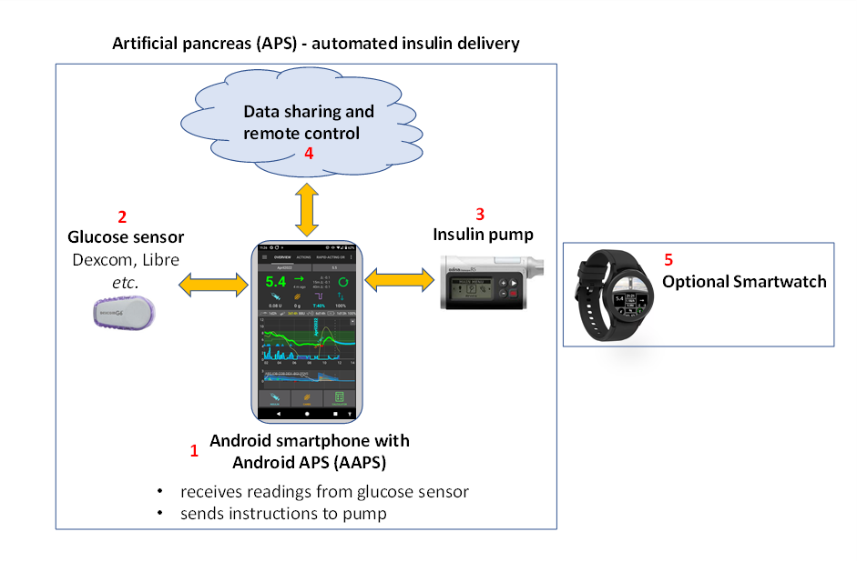

# 欢迎使用 AAPS 说明文档



Android APS (**AAPS**) 是一个开放源码的安卓应用程序，适用于糖尿病依赖型（I型）糖尿病患者。 是一款可以在安卓智能手机上运行的人工胰腺控制软件。 其主要功能是通过运用OpenAPS算法来模拟正常的胰腺功能：通过自动胰岛素输注（Automated Insulin Dosing，AID）将血糖水平保持在正常限度内。 使用**AAPS**要用到**3种**设备：**(1)**一部安卓手机，**(2)**动态血糖仪（CGM），**(3)**经过FDA/CE认证的胰岛素泵。 另外，如果你希望远程控制AAPS、远程存储查看相关数据，你还需要**(4)**相应的云服务器，以及**(5)**一块智能手表。

本文档解释了如何设置和使用 **AAPS**。 您可以通过左侧的菜单浏览 **AAPS** 文档(以及方便的"**搜索文档**"功能)， 或者使用此页面底部的 [索引](#index-aaps-documentation-index)。

## AAPS 文档概览(“说明书”)

**第2节“入门”**， [简介](Getting-Started/Introduction.md) 部分对人工胰腺系统（APS）的设计初衷作了详细说明。 概述了闭环的背景， **AAPS** 的开发目的，并把 **AAPS** 与其他类似系统进行了比较，对一些使用安全问题做了声明。 就如何与您的临床医生沟通使用 **AAPS**提出了建议。说明了为什么您需要自己去build **AAPS** 应用，而不是仅仅下载它，还简要介绍了 典型的**AAPS** 系统的连接方式。 还涉及可访问性，以及谁有可能从 **AAPS** 受益。

[准备使用AAPS](./Getting-Started/PreparingForAaps.md)详细介绍了安全注意事项，以及与**AAPS**兼容的电话、动态血糖仪（CGM）和胰岛素泵。 这部分内容概述了您将要经历的过程，并提供了获取 **AAPS** 全部功能的大致时间表。（安全起见，有些功能是需要您完成一些学习和使用的小任务之后才会开放，比如闭环功能） 本节帮助您在技术上做好准备，以尽可能快速和高效地完成您的**AAPS**安装调试工作。 [CGM配置](./Getting-Started/CompatiblesCgms.md)这一小节解释了如何优化CGM设置，以及数据平滑选项的最优配置方法。

现在，您已经对整个过程有了扎实的理解，可以开始组建您的**AAPS**闭环系统了。

第3节**设置AAPS** 包含了每一步操作的说明。 包括选择和[配置远程数据服务器](./SettingUpAaps/SettingUpTheReportingServer.md)（Nightscout或Tidepool），以便您可以查看和分享数据，准备好电脑以构建AAPS应用程序，构建AAPS应用程序并将其传输到手机上。 还涵盖了通过“设置向导”来设置 **AAPS**，将AAPS与您的CGM以及真实或虚拟的胰岛素泵进行连接，以及将 **AAPS** 连接到您的远程数据服务器。 接下来，您将通过一个安全审慎方式，一步一步地了解**AAPS**的全部功能用法，以确保您或者您的孩子能充分掌握所有不同等级的功能和菜单设定，有了足够的使用经验之后你才能使用更高级别的APP功能，教程才会进入下一环节，也就是所谓的“下一个目标”。 这些**目标**都经过专门的设计，目的是逐渐解锁AAPS从开环到闭环越来越多的功能。

第4节**AAPS的日常** 介绍了关键的 **AAPS** 功能，帮助您使用（和自定义）**AAPS**。 包括理解屏幕显示内容、活性碳水、敏感度、配置文件切换、临时目标、碳水补录（或称eCarbs）、自动化和动态ISF（DynamicISF）。 它还涵盖了一些常见话题，如如何管理不同类型的餐食、如何更换管路和探头、智能手机更新、夏令时变化，以及[使用AAPS旅行](DailyLifeWithAaps/TimezoneTraveling-DaylightSavingTime.md)和运动。 常见问题和答案位于故障排除部分。

**第5节[远程 AAPS 功能](./RemoteFeatures/RemoteControl.md)** 强调了 **AAPS** 的真正优势。 不管是远程发送指令，还是仅仅跟踪来自**AAPS**的数据，AAPS都提供了很多的选择。 不管是想为孩子使用 **AAPS** 的家长，还是想要比在手机上（手表上，在车上 _等等_）更方便地监测血糖（及其他指标）的成年糖人，再或者是其他需要检测数据的人来说，AAPS的功能都同样有用。 这一节还提供了Android Auto的使用指南，以便您可以在车上查看血糖水平。

**第6节 Wear OS的智能手表** 讲的是**Wear OS**系统的安卓手表的使用，手表可以设定上专用的**AAPS**表盘或者自定义表盘，这样我们可以通过手机进行远程遥控，或者把手表作为数据显示器。


第7节 **AAPS的维护** 讲述了如何导出和备份您的设置（如果您的手机丢了或者坏了的时候不至于抓瞎），提供了最新版本说明，并详细介绍了如何更新 **AAPS**。 一般来说，AAPS每年会有一个新版本，中间会需要更新2-3次。 跟其他所有软件一样，您最好及时更新**AAPS**，这样才能修复一些发现的小问题，也能用上一些改进的功能。 在故障排除章节专门有一部分内容讲AAPS更新的常见问题。

第8节** [寻求帮助](GettingHelp/WhereCanIGetHelp.md)** 会告诉您遇到 **AAPS** 相关的问题到哪里求助最管用。 特别是在最开始，有这样的指引能让你不会觉着孤立无助，遇到问题也能尽快联系到其他人然后弄清问题、解决问题。 尽管很多人已经顺利用上了**AAPS**，但谁都会遇到自己无法独立解决的问题。 得益于庞大的用户群，问题提出以后通常几个小时内就能收到回复。 不要因为觉着自己的问题太低级就不好意思开口求助，没有不能问的问题。 不论是新手还是老鸟，只要对系统的顺利搭建和安全运行有帮助，我们期盼大家尽可能多地提出问题。 本节包括 **AAPS** 和 **AAPSClient**（跟踪监控数据的程序）常见故障的处理方法，如果您发现**AAPS**存在需要关注和解决的技术问题，这里也介绍了如何将您的 **AAPS** 数据（日志文件）发送给开发人员以便查找问题原因。

**第9节**涵盖了**高级AAPS选项**的内容，比如如何从使用**AAPS**进行混合闭环（餐时大剂量_等_）发展到完全闭环（无需手动大剂量），以及开发和工程模式的细节。 对绝大多数用户来说，**AAPS**的正式版本已经够使了，但总会有些大牛，即便已经用的很好了，还想着继续折腾更深入的功能，这一节的内容主要是给他们看的。

在**第10节[如何支持AAPS](SupportingAaps/HowToEditTheDocs.md)**，我们提供了一些有用的信息，以便您能为这个项目提供一些支持。 你可以捐钱、捐设备或捐知识。 你可以对文档的改进提建议，也可以直接下手改，还可以参与到[文档翻译](SupportingAaps/Translations)中来，或者向开放人类项目（the Open Humans project）提供一些你的数据。

**第11节 资料**包含了很多文档，有的内容面向对**AAPS**之类的开源人工胰腺技术感兴趣的[临床医生](UsefulLinks/ClinicianGuideToAaps.md)，有的内容面向希望和医生交流相关信息的病人。 这一节还有更多关于糖尿病和闭环的参考资料。 包括[术语表](./UsefulLinks/Glossary.md)，也就是**AAPS** 中使用的缩写(或简称)清单。 举例来说，想知道ISF或TT代表什么意思就去这里找。


 ### 有兴趣开始使用 **AAPS**? 在 [引言](Getting-Started/Introduction.md) 中阅读更多关于**AAPS**的信息

```{admonition} SAFETY NOTICE
::::class:安全提示危险
**AAPS**的安全性依赖于你的硬件装备（手机、泵、动态）的安全功能。 一定要使用经过FDA/CE核准的功能完全正常的胰岛素泵和动态。 不要使用坏的、改装过的或者自制的胰岛素泵或者动态。 泵和动态一定要使用原装或者厂商认证的耗材（助针器、管路和储药器）。 使用未经测试或者改装过的耗材可能造成数据不准确或者胰岛素输注剂量错误，那样可能把使用者置于极其危险的境地。 

SGLT-2 抑制剂（格列吡嗪）能降糖，如果服用这种药的话就不要使用 AAPS 。 如果减少胰岛素的剂量会增加糖尿病酮症酸中毒（DKA）的风险，过分追求较低的血糖水平会增加严重低血糖的风险。 
```

```{admonition} Disclaimer
:class:注意
这里提供的所有信息和代码仅用于信息交流和教育目的。 使用 [Nightscout](https://nightscout.github.io/) 和 **AAPS** 的后果自负，本文档提供的信息和代码请勿用于医疗决策。 Nightscout 目前尚未尝试达到 HIPAA 隐私规定。 
- 文中来自 github.com 的代码未经正式授权也没有任何官方支持。 更多细节请查阅本代码仓库的许可协议（LICENSE）。
- 所有产品、公司名称、商标、服务标识、注册商标和注册服务标志归其所有者所有。 使用他们仅是作为参考，并不意味着与他们有任何联系或得到过他们的认可。

请注意 - 本项目与以下机构或个人没有任何关系，也未经其确认背书：[SOOIL-秀逸](https://www.sooil.com/eng/), [Dexcom-德康](https://www.dexcom.com/), [Accu-Chek, Roche Diabetes Care-罗氏](https://www.accu-chek.com/) or [Medtronic-美敦力](https://www.medtronic.com/)

```

(index-aaps-documentation-index)=

## AAPS文档索引

```{toctree}
:caption: 1）更换语言

更换语言 <./ChangeLanguage/ChangeLanguage.md>
```
```{toctree}
:caption: 2) 入门

AAPS简介 <./Getting-Started/Introduction.md>
准备使用AAPS <./Getting-Started/PreparingForAaps.md>
设备概览 <./Getting-Started/ComponentOverview.md>
- 兼容的胰岛素泵 <./Getting-Started/CompatiblePumps.md>
- 兼容的动态（CGM） <./Getting-Started/CompatiblesCgms.md>
- 兼容的手机  <./Getting-Started/Phones.md>
- 兼容的手表  <./Getting-Started/Watches.md>
```

```{toctree}
:caption: 3) AAPS设置

配置远程数据服务器 <./SettingUpAaps/SettingUpTheReportingServer.md>
- Nightscout <./SettingUpAaps/Nightscout.md>
- Tidepool <./SettingUpAaps/Tidepool.md>
构建（Building）AAPS <./SettingUpAaps/BuildingAaps.md>
传输和安装AAPS <./SettingUpAaps/TransferringAndInstallingAaps.md>
安装向导 <./SettingUpAaps/SetupWizard.md>
完成目标 <./SettingUpAaps/CompletingTheObjectives.md>
你的AAPS配置文件 <./SettingUpAaps/YourAapsProfile.md>
调整AAPS参数设置 <./SettingUpAaps/ChangeAapsConfiguration.md>
- 设置向导 <./SettingUpAaps/ConfigBuilder.md>
- 首选项 <./SettingUpAaps/Preferences.md>
```

```{toctree}
:caption: 4) AAPS的日常

AAPS 界面 <./DailyLifeWithAaps/AapsScreens.md>
AAPS关键特性 <./DailyLifeWithAaps/KeyAapsFeatures.md>
COB计算 <./DailyLifeWithAaps/CobCalculation.md>
敏感性检测 <./DailyLifeWithAaps/SensitivityDetectionAndCob.md>
切换配置文件 & Profile Percentage <./DailyLifeWithAaps/ProfileSwitch-ProfilePercentage.md>
临时目标 <./DailyLifeWithAaps/TempTargets.md>
扩展碳水 <./DailyLifeWithAaps/ExtendedCarbs.md>
自动化 <./DailyLifeWithAaps/Automations.md>
动态胰岛素敏感系数（Dynamic ISF） <./DailyLifeWithAaps/DynamicISF.md>
用于儿童的AAPS <./DailyLifeWithAaps/AapsForChildren.md>
泵与管路 <./DailyLifeWithAaps/PumpsAndCannulas.md>
跨时区旅行 & 夏令时 <./DailyLifeWithAaps/TimezoneTraveling-DaylightSavingTime.md>

```

```{toctree}
:caption: 5) 远程 AAPS 功能

远程监控 <./RemoteFeatures/RemoteMonitoring.md>
远程控制 <./RemoteFeatures/RemoteControl.md>
手机短信命令 <./RemoteFeatures/SMSCommands.md>
仅跟踪 <./RemoteFeatures/FollowingOnly.md>
安卓自动化 <./RemoteFeatures/AndroidAuto.md>

```
```{toctree}
:caption: 6) Wear OS 智能手表

适用于Wear OS的AAPS <./WearOS/BuildingAapsWearOS.md>
使用智能手表 <./WearOS/WearOsSmartwatch.md>
远程控制 <./RemoteFeatures/RemoteControlWearOS.md>
自定义表盘参数 <./ExchangeSiteCustomWatchfaces/CustomWatchfaceReference.md>
切换自定义表盘 <./ExchangeSiteCustomWatchfaces/index.md>

```

```{toctree}
:caption: 7) AAPS的维护

导出/导入设置 <./Maintenance/ExportImportSettings.md>
回顾你的数据 <./Maintenance/Reviewing.md>
AAPS发布公告 <./Maintenance/ReleaseNotes.md>
文档更新 <./Maintenance/DocumentationUpdate.md>
升级到新版本的AAPS <./Maintenance/UpdateToNewVersion.md>

```

```{toctree}
:caption: 8) 寻求帮助

去哪里寻找帮助 <./GettingHelp/WhereCanIGetHelp.md>
常见故障 <./GettingHelp/GeneralTroubleshooting.md>
Troubleshooting Android Studio <./GettingHelp/TroubleshootingAndroidStudio.md>
获取日志 <./GettingHelp/AccessingLogFiles.md>
```

```{toctree}
:caption: 9) 高级AAPS选项

全闭环 <./AdvancedOptions/FullClosedLoop.md>
代码分支 <./AdvancedOptions/DevBranch.md>
自动调优 <./AdvancedOptions/Autotune.md>

```
```{toctree}
:caption: 10) 如何支持 AAPS

如何提供帮助 <./SupportingAaps/HowCanIHelp.md>
编辑文档 <./SupportingAaps/HowToEditTheDocs.md>
参与应用和文档的翻译 <./SupportingAaps/Translations.md>
翻译声明 <./SupportingAaps/StateOfTranslations.md>
开放人类项目上传 <./SupportingAaps/OpenHumans.md>

```
```{toctree}
:caption: 11) 资料

术语表 <./UsefulLinks/Glossary.md>
FAQ <./UsefulLinks/FAQ.md>
常用糖尿病和闭环资料 <./UsefulLinks/BackgroundReading.md>
为AAPS建立专用Google账户 (可选)<./UsefulLinks/DedicatedGoogleAccountForAaps.md>
临床医生参考 (已过期) <./UsefulLinks/ClinicianGuideToAaps.md>
```