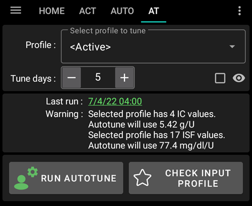
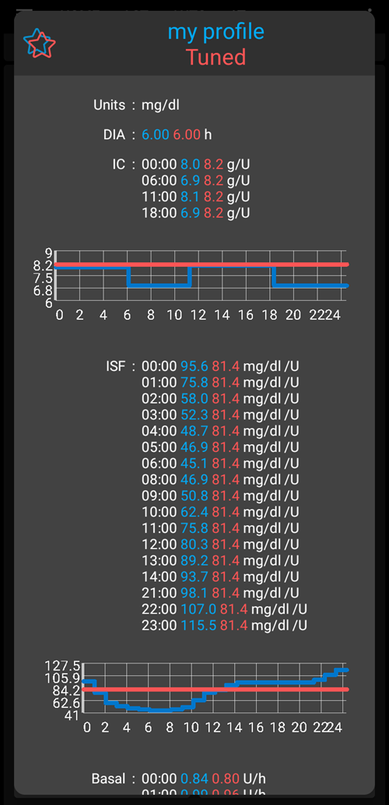
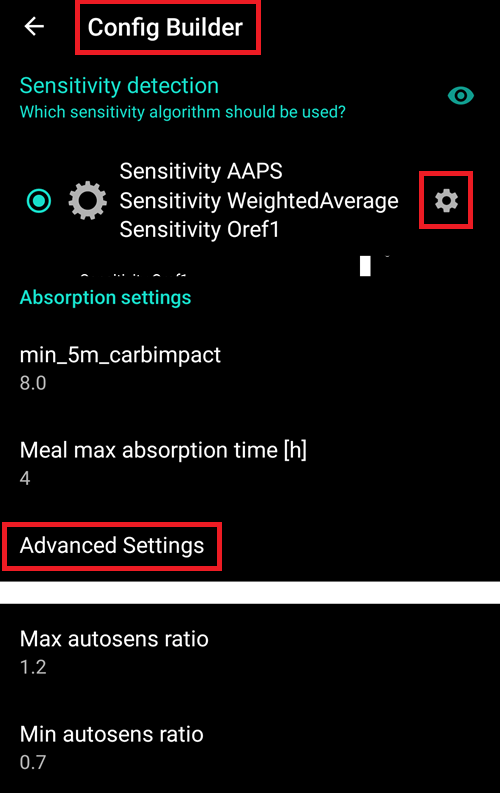
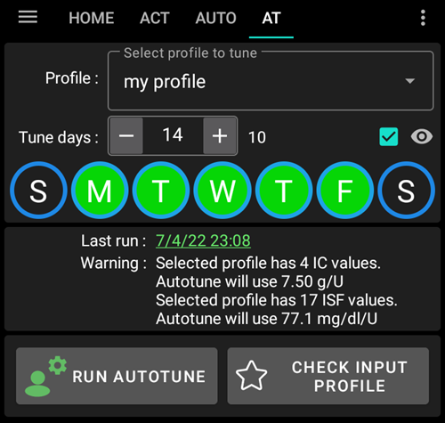
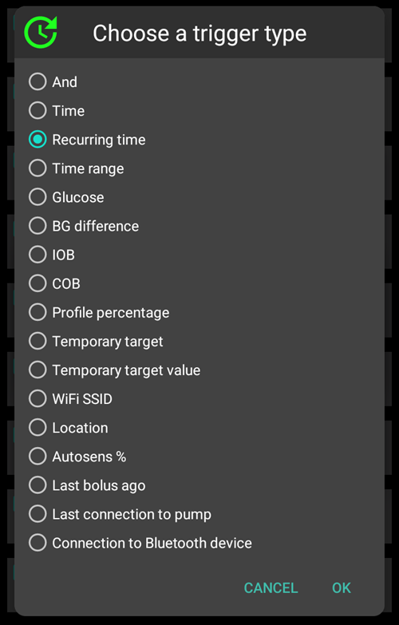
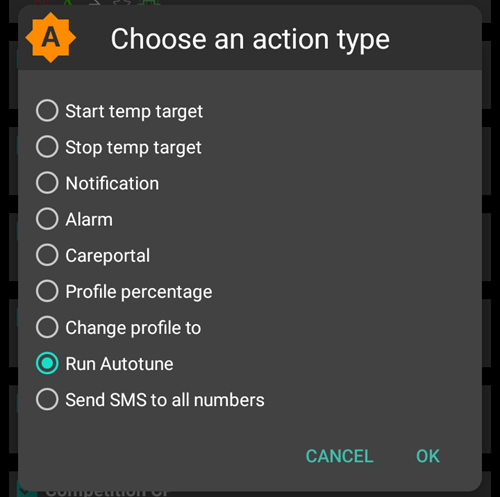

# 如何使用 Autotune 外掛（僅限開發者）

有關 Autotune 算法的文檔可以在 [OpenAPS 文檔](https://openaps.readthedocs.io/en/latest/docs/Customize-Iterate/autotune.html) 中找到。

Autotune 外掛是在 AAPS 中實作的 OpenAPS 自動調整算法。

**目前 Autotune 外掛僅在[dev 分支](../AdvancedOptions/DevBranch.md)和工程模式下可用。**

## Autotune 使用者介面

- 你可以在「設定檔」下拉選單中選擇要調整的輸入設定檔（預設會選擇目前的活動設定檔）。
  - 注意：每次選擇新的設定檔時，先前的結果將被移除，並且「調整天數」參數將重設為預設值。
- 「調整天數」是用來選擇用於計算來調整你設定檔的天數。 最小值為 1 天，最大值為 30 天。 此數字不應該太小，才能獲得正確的迭代和平滑結果（每次計算需超過7天）。
  - 注意：每次變更調整天數參數時，先前的結果將被移除。
- 「最後運作」是一個鏈接，可恢復你最後一次有效的計算結果。 如果你當天尚未啟動自動調整，或者如果以前的結果由於上面的計算參數修改而被刪除，則你可以恢復最新成功運行的參數和結果。
- 警告範例顯示有關選定設定檔的一些資訊（例如你有多個 IC 值或 ISF 值）。
  - 注意：Autotune 計算僅適用於單一的 IC 和單一的 ISF 值。 目前沒有現有的 Autotune 算法來調整生理週期 IC 或生理週期 ISF。 如果你的輸入設定檔有多個數值，你可以在警告區看到調整設定檔時考慮的平均值。
- 「檢查輸入設定檔」按鈕可打開設定檔檢視器，讓你快速驗證設定檔（單位、DIA、IC、ISF、基礎率和目標）。
  - 注意：Autotune 只會調整你的 IC（單一數值）、ISF（單一數值）以及有日夜變化的基礎率。 單位、DIA 和目標將在輸出設定檔中保持不變。

- 「執行 Autotune」將以選定的設定檔和調整天數啟動 Autotune 計算。
  - 注意：Autotune 計算可能需要較長時間。 當啟動後，你可以切換到其他視圖（主頁等），稍後再回到 Autotune 外掛查看結果。

- 運作過程中，你將在下方看到中間結果。

  - 注意：運作過程中，設定將被鎖定，無法再變更選擇的輸入設定檔或天數。 如果你想用其他參數啟動另一個運作，你必須等待目前計算結束。

  

- 當 Autotune 計算完成後，你將看到結果（調整後的設定檔）及下方的四個按鈕。

- 重要的是要比較輸入設定檔（「設定檔」欄）、輸出設定檔（「調整後」欄）和每個數值的變異百分比（「百分比」欄）。

- 對於基礎率，你也會看到「缺失天數」。 當 Autotune 沒有足夠的資料分類為「基礎率」來調整這段時間的基礎率時（例如每次餐後碳水化合物吸收時），就會出現缺失天數。 這個數字應該越低越好，特別是當基礎率很重要時（例如夜間或下午晚些時候）。

- 「比較設定檔」按鈕會打開設定檔比較視圖。 輸入設定檔顯示為藍色，輸出設定檔（名稱為「調整後」）顯示為紅色。

  - 注意：以下範例中，輸入設定檔有 IC 和 ISF 的日夜變化，但輸出計算後的設定檔只有單一數值。 If it's important for you to get a circadian output profile see [Circadian IC or ISF profile](#autotune-circadian-ic-or-isf-profile) below.

  

- 如果你信任結果（輸入和輸出設定檔之間的變異百分比很低），你可以點擊「啟用設定檔」按鈕，然後點擊 OK 進行確認。

  - 啟用調整後設定檔會自動在本地設定檔外掛中建立一個名為「調整後」的新設定檔。
  - 如果你在本地設定檔外掛中已有名為「調整後」的設定檔，則該設定檔會在啟用前更新為計算後的 Autotune 設定檔。

  

- 如果你認為調整後的設定檔需要修改（例如你認為某些變化太大），那麼你可以點擊「複製到本地設定檔」按鈕。

  - 一個帶有「調整後」前綴並附上運作日期和時間的新設定檔會在本地設定檔外掛中建立。

- 然後你可以選擇本地設定檔來編輯調整後的設定檔（當你打開本地設定檔外掛時，他會被預設選中）。

  - 本地設定檔中的數值將在使用者介面中根據你的幫浦能力進行四捨五入。

  

- 如果你想用 Autotune 結果替換你的輸入設定檔，點擊「更新輸入設定檔」按鈕並在彈出視窗中點擊 OK 確認。

  - 注意：如果你在「更新輸入設定檔」後點擊「啟用設定檔」，那麼你將啟用更新後的設定檔，而不是預設的「調整後」設定檔。

  

- 如果你已更新你的輸入設定檔，那麼「更新輸入設定檔」按鈕將被「還原輸入設定檔」按鈕替代（參見下圖）。 這樣你可以立即查看當前本地設定檔外掛中的輸入設定是否已包含上次運行的結果。 你也可以使用此按鈕恢復未包含 Autotune 結果的輸入設定檔。

  

## Autotune 設定。

(autotune-plugin-settings)=

### Autotune 外掛設定。

- Automation Switch Profile (default Off): see [Run Autotune with an automation rule](#autotune-run-autotune-with-an-automation-rule) below. 如果你將此設定更改為開啟，則輸入設定檔將自動被調整後的設定檔更新並啟用。
  - **請小心，你必須在接下來幾天內信任並驗證，在更新和啟用未修改的調整配置後，它會改善你的循環運行**

- 將 UAM 分類為基礎率（預設為開啟）：此設定適用於未輸入碳水化合物的 AndroidAPS 用戶（完全 UAM）。 當關閉時，他將阻止 UAM 被分類為基礎率。
  - 注意：如果當天偵測到至少一小時的碳水化合物吸收，無論此設定（開啟或關閉），所有分類為「UAM」的資料都會被分類為基礎率。
- 資料天數（預設為5天）：你可以使用此設定定義預設值。 每次你在 Autotune 外掛中選擇新設定檔時，調整天數參數將被替換為此預設值。
- Apply average result in circadian IC/ISF (default Off): see [Circadian IC or ISF profile](#autotune-circadian-ic-or-isf-profile) below.

### 其他設置

- 自動調整還使用最大自動感應比和最小自動感應比來限制變化。 你可以在「組態建置工具 > 敏感度偵測外掛 > 設定 > 進階設定」中查看並調整這些值。

  

## 進階功能

(autotune-circadian-ic-or-isf-profile)=

### 日夜變化的 IC 或 ISF 設定檔

- 如果你的設定檔中 IC 和/或 ISF 的變化很重要，並且你完全信任你的生理時鐘和變化，則可以設置「在生理時鐘 IC/ISF 中應用平均值」

  - 注意，Autotune 計算將始終使用單一數值，Autotune 不會調整日夜變化。 此設定僅適用於將計算的平均變化應用於 IC 和/或 ISF 的日夜變化數值。

- 請參閱下方截圖，左側為未應用平均變化的調整後設定檔，右側為應用平均變化的調整後設定檔。

  

### 調整特定星期幾

- 如果你點擊「運作天數」參數右側的帶有眼睛圖示的複選框，你將看到日期選擇功能。 你可以指定 Autotune 計算應包含哪些星期幾（在下方截圖中可以看到「工作日」的範例，週六和週日被排除在 Autotune 計算之外）。
  - 如果 Autotune 計算中包含的天數少於調整天數，則會在調整天數選擇器的右側顯示有多少天數被包含在內（下方範例中顯示為 10 天）。
  - 此設定僅在剩餘天數不太少的情況下才能獲得良好的結果（例如，如果你為週末天數調整特定設定檔，只選擇週六和週日，你應該選擇至少 21 或 28 個調整天數，以確保 Autotune 計算中包含 6 或 8 天）。

- 在 Autotune 計算期間，你可以看到計算的進度（範例中顯示為「部分結果，第 3 / 10 天已調整」）。

  

(autotune-run-autotune-with-an-automation-rule)=

## 使用自動化規則運作 Autotune

第一步是為 Autotune 定義正確的自動化規則觸發條件：

注意：有關如何設定自動化規則的更多資訊，請參閱[此處](../DailyLifeWithAaps/Automations.md)。

- 你應選擇定期時間觸發：每天只運行一次自動調整，而自動調整設計為每天運行（每次新運行會推遲一天，且快速的設定檔修改應該很小）

  

- 最好一開始在白天運作 Autotune 以便能夠檢查結果。 如果你想在夜間運作 Autotune，你必須在觸發條件中選擇 4AM 或之後，以包含當天在下一次 Autotune 計算中。

  

- 然後你可以在列表中選擇「運作 Autotune」動作。

  

- 你可以選擇 Autotune 動作來調整運作的參數。 預設參數為「活動設定檔」、Autotune 外掛偏好設定中定義的預設調整天數值，並且選擇了所有天數。

  

- 經過幾天後，如果你完全信任 Autotune 結果且修改百分比很小，你可以修改[Autotune 設定](#autotune-plugin-settings)中的「自動切換設定檔」，將其設為啟用，讓計算後自動更新並啟用調整後的設定檔。

注意：如果你想為特定的星期幾自動調整設定檔（例如「週末天數」的設定檔和「工作日」的設定檔），那麼為每個設定檔建立一個規則，選擇相同的日期作為觸發條件和 Autotune 動作中的日期，調整天數必須足夠高以確保至少有 6 或 8 天包含在內，且不要忘記在觸發條件中選擇 4AM 之後的時間…

- 請參閱下方範例，調整「我的設定檔」於所有「工作日」的規則，選擇了 14 個調整天數（因此 Autotune 計算中只包含 10 天）。

## 提示與技巧

Autotune 使用現有資料庫中的資訊，因此如果你剛在新手機上安裝了 AAPS，你必須等待幾天才能啟動 Autotune，以獲得足夠天數的資料來獲得相關結果。

Autotune 只是輔助工具，重要的是定期檢查你是否同意計算出的設定檔。 如果有任何疑問，請更改 Autotune 設定（例如天數）或將結果複製到本地設定檔，並在使用之前調整設定檔。

在應用 Autotune 結果之前，請務必手動使用 Autotune 幾天來檢查結果。 只有當你完全信任 Autotune 結果，並且前一個設定檔與計算出的設定檔之間的變異變得非常小時，才開始使用自動化（絕不要提前）。

- Autotune 對某些使用者非常有效，但對其他人可能不適用，因此**如果你不信任 Autotune 結果，請不要使用他**

分析 Autotune 結果以暸解（或嘗試暸解）Autotune 為何提出這些修改也是很重要的。

- 你可能會發現設定檔的強度整體增加或減少（例如總基礎率增加，與 ISF 和 IC 值的減少相關聯）。 這可能與隨後幾天的自動敏感度修正超過 100%（需要更激進的調整）或低於 100%（您更敏感）有關。
- 有時 Autotune 提出不同的基礎率與 IC/ISF 的平衡（例如較低的基礎率和更積極的 IC/ISF）。

我們建議在以下情況下不要使用 Autotune：

- 你沒有輸入所有的碳水化合物。
  - 如果你未輸入低血糖的碳水化合物修正值，Autotune 會看到你的血糖值出現意外上升，並增加前 4 小時的基礎率，這可能與你需要避免低血糖的情況相反，尤其是在半夜時。 因此，特別是低血糖的修正碳水化合物，輸入所有的碳水化合物是很重要的。
- 你在一天中有許多時間被偵測到未註明的餐點（UAM）。
  - 你是否已經輸入所有的碳水化合物，並正確估算了碳水化合物的攝取量？
  - 所有的未註明餐點（UAM）時間段（除非你在一天內沒有輸入碳水化合物並且未啟用將未註明餐點歸類為基礎率），所有的未註明餐點時間將會被歸類為基礎率，這可能會大幅增加你的基礎率（遠超出必要範圍）。

- 你的碳水化合物吸收速度非常慢：如果大部分的碳水化合物吸收是根據 min_5m_carbimpact 參數計算的（你可以在 COB 曲線頂端看到一個小橙點標示的這些時間段），COB 的計算可能會出錯，並導致錯誤的結果。
  - 當你運動時，你的敏感度通常會增加，血糖不會上升很多，因此在運動期間或之後，通常會看到一些碳水化合物的緩慢釋放期。 但如果你經常發生意外的碳水化合物吸收過慢的情況，那麼你可能需要調整你的設定檔（增加 IC 值）或調低 min_5m_carbimpact。
- 你有「非常糟糕的日子」，例如數小時處於高血糖狀態，需要大量的胰島素才能將血糖降至正常範圍，或者在更換傳感器後，出現長時間的錯誤血糖值。 如果在過去幾周內，你只有一到兩個「糟糕的日子」，你可以手動停用這些日子，以將他們排除在自動調整的計算之外，並再次**仔細檢查你是否可以信任結果**。
- 如果修改的百分比過高。
  - 你可以嘗試增加天數以獲得更平滑的結果。