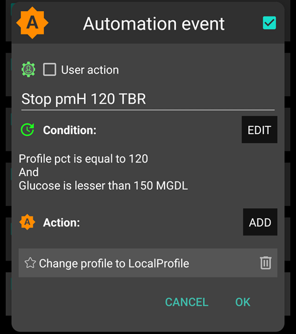

# 全自動循環(全閉環) - Full Closed Loop(FCL)


Full Closed Looping **全閉環(FCL)** 的主要吸引力在於它具有模擬人工胰臟的潛力，並且使日常管理變得更加簡單，而不需要為餐點進行注射。

儘管 **混合閉環(hybrid closed loopo)** （‘HCL’）是基於演算法的，但仍然需要用戶在用餐前手動提供注射。 因此，循環可能會暫時關閉（臨時零基礎），以防止胰島素超量輸送。

在 **全閉環(FCL)** 中，不再需要根據餐量進行注射：一切讓演算法來處理！  **AAPS** 可能在用戶不進行任何注射的情況下運行，並且不需要輸入碳水化合物，這是一種稱為‘未公告用餐’ **（‘UAM’）** 的模式。 **UAM** 可允許 **AAPS** 處理更寬容的碳水化合物範圍，並且會更積極的補充胰島素。

## What to expect?

已有許多發表的研究顯示 **全閉環(FCL)** 可以達到的良好結果。 如需進一步閱讀，請參閱以下內容：

1)   美國國家醫學圖書館，PubMed [首例使用開源自動胰島素遞送 AndroidAPS 在全自動循環場景：Pancreas4ALL 隨機試點研究](https://pubmed.ncbi.nlm.nih.gov/36826996/)；

2)  臨床試驗註冊 ClinicalTrials.gov 美國國家醫學圖書館，臨床試驗 [Pancreas4ALL（ASAP）自動胰島素遞送閉環系統的可行性和安全性研究](https://www.clinicaltrials.gov/study/NCT04835350?term=Feasibility%20and%20Safety%20Study%20of%20the%20Automated%20Insulin%20Delivery%20Closed%20Loop%20System%20Pancreas4ALL%20(ASAP)&rank=1)

成功使用 **全閉環(FCL)** 需要用戶：

- 確認他們是否滿足了 **全閉環(FCL)** 的要求；
- 設置針對其日常管理需求量身定做的 **Automations**；並且
- 微調並調整 **AAPS** 的設置（特別是 **Automations**）。


## General considerations why (not to) move from HCL to FCL

**全閉環(FCL)** 不是適合每個人：

- 某些 **全閉環(FCL)** 用戶在 TIR（70-180）方面達到約 90% 並且 HbA1c 低於 6%，然而其他用戶更喜歡更嚴格的控制。 值得注意的是，在快速碳水化合物的飲食中，要將數值最低控在 140 mg/dl 內，可能需要事先注射。
- **AAPS** 的調整可能會很有挑戰性。 它不適合那些感到有壓力的 **AAPS** 用戶。  您需要花幾個星期的時間來調整和微調您的 **全閉環(FCL)**。 投入這樣的時間可以產生更好的結果和 **血糖** 控制。
- 餐點管理可能變得更容易，但在 **全閉環(FCL)** 中，運動仍然可能存在挑戰。 我們大多數人希望限制運動中的小吃，以試圖控制體重。
- 在為小孩建立 **全閉環(FCL)** 上仍然存在困難（如下討論）。


## Well-tuned hybrid closed loop

建議在考慮過渡到 **全閉環(FCL)** 之前，先建立一個調整良好的 **混合閉環(HCL)**。  成功使用 **全閉環(FCL)** 需要對用戶的設定進行高度個性化的微調，以便 **AAPS** 能夠提供胰島素，緊密模擬您成功的混合閉環模式。

**全閉環(FCL)** 需要用戶設置和調整他們的 **Automations**。 然而，用戶必須對其胰島素管理需求有信心的理解，才能開始使用 **全閉環(FCL)**。 錯誤可以被反錯誤掩蓋。 這可能會造成不穩定的 **全閉環(FCL)** 系統，並使後續修正變得困難。 您應該預期在使用 **全閉環(FCL)** 時，能夠達到與您在 **混合閉環(HCL)** 中看到的可比率 TIR。

**全閉環(FCL) 是 DIY 由用戶根據其成功的 混合閉環(HCL) 和初次 全閉環(FCL) 體驗分析數據而設置的 **Automations**。**

## Fast insulin (Lyumjev, Fiasp)

**全閉環(FCL)** 需要快速作用的胰島素。  這樣在餐點相關的**血糖**升高開始時，**全閉環(FCL)** 可以保持**血糖**在範圍內（根據一般定義，在 180 mg/dl（10 mmol/l）以下）。

一項模型研究（詳情請參閱 LINK FullLoop V2/March2023；第 2.2 節）可以從定量角度顯示出*更快的胰島素*

來源：

 


IEEE 控制系統雜誌，ResearchGate [人工胰臟與餐點控制：1型糖尿病餐後血糖調節總覽](https://www.researchgate.net/publication/322866519_The_Artificial_Pancreas_and_Meal_Control_An_Overview_of_Postprandial_Glucose_Regulation_in_Type_1_Diabetes);

- 將會導致顯著降低的**血糖**峰值，與較慢的胰島素相比；
- 能容忍第一餐注射延遲幾分鐘的情況，同時不會導致血糖峰值過高；並且
- 最小化不同碳水化合物負荷（餐點大小）對 **血糖** 峰值的影響。

除非用戶的餐點是較低的碳水化合物，不然**全閉環(FCL)** 只在 Lyumjev 或 Fiasp 胰島素上，才有比較良好的效果。

不過，Fiasp 或 Lyumjev 可能會導致頻繁的胰島素幫浦堵塞，即使在優化針長等因素後。 重要的是要注意導管或藥囊的時間。 許多用戶發現 48 小時是胰島素效能的極限，否則將導致導管/藥囊失敗。

## Prerequisites

**血糖**值和穩定的藍牙連線對於確保 **AAPS** 能夠最佳運作而不浪費寶貴的時間是必要的。 **全閉環(FCL)** 需要一個 24/7 技術穩定的系統：

- 您的 **CGM** 性能。 您的 CGM 不應產生跳動的 **血糖</strong> 值，這可能會被 **全閉環(FCL)** 誤解為開始用餐的跡象。 同樣地，**CGM** 的校準可能會產生跳動的結果。
- 如何進行任何 **CGM** 平滑處理，這可能對您的調整有何影響。 特別是如何定義增量，以及 **AAPS** 將其識別為開始用餐的跡象。
- 幫浦和 CGM 幫浦的藍牙穩定性；
- 避免（或至少提早發現）幫浦阻塞；
- 資料流以及您手機上使用的應用程式和不同的感測器使用天數；
- 保持所有 **AAPS** 組件充滿電並保持備件在近距離；以及
- 及早執行導管（或水滴）更換，以降低阻塞風險；

以上內容將根據您的 **AAPS** 組件系統以及您的生活方式而有所不同。

## Meal-related limitations

- 對於不包含快速高影響 **血糖** 食物成分的飲食以及日常不大變化的用餐模式的人來說，設定 **全閉環(FCL)** 可能更容易。 這並不一定意味著低碳水化合物飲食。

- 高脂肪或高蛋白飲食，或慢消化/胃輕癱，對 **全閉環(FCL)** 而言使事情變得更容易而不是更難，因為晚餐碳水化合物可以很好地覆蓋在高峰時需進行注射後的不可避免的“尾部”反應。

### 血糖指數與血糖影響

對於 **UAM** 模式而言，隨著“血糖影響”（'EBG'）的上升，挑戰也隨之增加。

- 從適中/低開始，調整您的 **設定檔** 設定。 只有這樣，"測試" 用高 **EBG** 的餐點。
- 如消費非常高的 **EBG**，可考慮進行低於 50% 的初始注射。

1) **無 EBG**：例如新鮮肉類、魚類、蛋、培根、油、起司。 2) **低 EBG**：例如新鮮蔬菜和漿果、蘑菇、堅果、牛奶、優格、嫩起司。 3) **適中 EBG**：例如全穀麵包/麵條、馬鈴薯、野生米、燕麥、乾果。 4) **高 EBG**：例如小麥麵包、法棍、吐司、鬆餅、餅乾、馬鈴薯泥、麵條、米飯。 5) **非常高 EBG**：例如糖、甜飲料、水果汁、玉米片、糖果、零食、鹹扭結餅。


對 **全閉環(FCL)** 來說，最困難的餐點是那些純粹含有非常高及高 **EBG** 成分的食物（見圖片中的紅色）：不僅**血糖**迅速上升，而且幾乎沒有脂肪/蛋白質/纖維成分來平衡隨著嘗試早期控制高葡萄糖而來的不可避免的胰島素活性“尾部”。

不規律地食用含有快速吸收碳水化合物的零食和甜飲料，對 **全閉環（FCL）** 系統而言是一大問題。


## Preparing for activity/sports

在運動或活動時，若使用幫浦或混合閉環系統，建議用戶在運動前減少 **IOB**。

透過 **全閉環(FCL)**，演算法已調整以檢測 **UAM**並自動釋放胰島素以抵消 **血糖** 的上升。  高**臨時目標** 和較低**設定檔比例**（在用餐開始時已生效）應在任何活動之前提前設定。

不尋常或不穩定的運動活動水平對 **全閉環(FCL)** 造成困難。 在運動前做好計畫是必要的（尤其是如果您想降低在運動期間需要急救碳水化合物/零食的需求）。 在活動量較高的一天之後，建議在晚上餐點消化完全後設定較低的 **設定檔百分比**：在 **自動化** 中設定一個較高（>100 mg/dl）的 **血糖** 目標，並在 AAPS 偏好設定中勾選「在高目標值時不使用 **SMB**。

## Hurdles for kids

**全閉環(FCL)** 對孩子來說可能帶來額外挑戰，包括：

- Lyumjev 或 Fiasp 可能無法提供或使用後耐受性不佳。
- 每小時基礎率可能非常低，為大劑量 **SMBs** 提供不良的基礎。
- 飲食可能富含甜味成分。 由於體型較小，所以同具也會有較低的血液總量，因此特別容易出現明顯的 **血糖** 峰值。
- 生長激素和胰島素敏感性明顯變化使得準確調整 **全閉環(FCL)** 變得困難。


## Enabling boosted SMBs: safety

在 **混合閉環(HCL)** 中實施了關於幫浦劑量大小的安全限制。

**全閉環(FCL)** 循環者不再需要在餐點開始時釋放大量的幫浦劑量。 這意味著， **SMBs** 尺寸限制的約束必須擴大，以使循環能夠釋放足夠大的 **SMBs**。

如果您在主版本中使用 **AAPS**，建議在 **AAPS** 的偏好設定中設定最大允許的 **SMB** 尺寸，這樣 **全閉環(FCL)** 就可以釋放（maxUAMSMBBasalMinutes=120，即 2 小時的基礎在白天）。

如果您的基礎率非常低，導致的**SMB**限制可能太低，以至於無法充分控制餐後**血糖**的上升。 一個可能的解決方案是避免導致強烈**血糖**峰值的飲食，並轉換到具有提供新參數的** AAPS** 開發變體中，用於 **SMB** 釋放設定：smb_max_range_extension。 這將將標準最大 2 小時的基礎擴展一個因子>1。 (此外，預設 50% **SMB** 釋放比率可能在開發中提高。 變體）。

**遵循指示以啟用 AAPS 模擬您通過幾個 SMBs 的幫浦注射**。

請定期檢查**SMB**選項卡，以查看您的**SMBs**是否足夠以提供餐前開始所需的胰島素。

如果不是，你的調整努力有時可能會毫無成果！


```{admonition} Boosting **ISF** can become dangerous
:class: danger

請在用餐開始後仔細觀察/分析<strong>SMB</strong>的大小。 逐步調整，並且一次不要更改超過 1 或 2 個參數。

您的<strong>AAPS</strong>設定必須能夠充分應對您各式各樣的餐點。
```

## Meal detection/your Automations for boosting

要成功實現**全閉環(FCL)**，**ISF**是關鍵的調整參數。 當使用**AAPS** Master + **Automations**時，**> 100% 預設的變更必須在餐點識別時自動觸發**（通過血糖變化），並提供精確的**ISF**。

**AAPS** Master在**混合閉環(HCL)** p模式下允許最高130%的臨時**預設**。 提升**ISF**可以分為三個步驟：

- 步驟 1 - 檢查**預設**中適用於此餐飲時間的**ISF**，查看例如Autosens是否建議進行修改，以照顧當前（過去幾小時）的胰島素敏感度狀況。
- 步驟 2 - 應用一個因子（1/預設%, 如在**Automation**中設置）來提升**ISF**。
- 步驟 3 - 確認建議的**ISF**是否在設定的安全限制內。

### FCL's Automation templates

頂部需要勾選的選項。 您可以選擇：

- 在您的**Automation**列表中，您可以將每個欄位左側的勾選標記設置為關閉 => 這將停用該**Automation**。 例如，您可以為所有與早餐相關的**全閉環(FCL)** **Automations**執行此操作，以便在早餐時切換到**混合閉環(HCL)**。

- 對於每個**Automation**規則，您可以勾選使用者行動的框 => 然後當符合條件時，定義的行動將不會自動執行。 取而代之的是，當您的**全閉環(FCL)**會自動給出**SMB**時，**AAPS**主螢幕會提醒您。 您有機會選擇「是」或「否」。 這在您的調整階段中是非常有用的。

此功能對於某些情況非常有用，例如「腳離地」綜合徵，當早晨起床時血糖突然上升，但用戶希望防止全自動的「早餐開始」反應。

下方提供指導，說明如何將**Automation**的條件捆綁在一起以及如何處理在該情況下**AAPS**應該增加（或減少）胰島素供應的方法。 由於**ISF**無法直接調整，將**預設百分比**提高至超過100%將達到我們的目的。

### Automated big SMBs at bg rise

成功實現**全閉環(FCL)**的關鍵在於，當餐點的血糖升高時，循環必須儘快提供非常大的自動**SMB**，以「追上」所需的**IOB**（與您在<h**混合閉環(HCL)**中相似餐點的標準胰島素注射做比較！）

為了達成這一點，應分析您的**混合閉環(HCL)**數據，以確定哪些**deltas**可能與餐點無關，哪些可能與餐點有關。

- 由於您可以在預先定義的時間範圍內定義**Automation**，您只需在此進行分析。
- 如果您進食的餐點種類非常不同（例如：相當高碳水化合物的早餐，但低碳水化合物的午餐），您可以選擇為每個時段設置兩組不同的**Automations**。
- 如果你在晚上看到偶爾因壓迫而產生的低血糖，請排除夜晚的自動化。
- 通常，使用過去 5 分鐘內的變化資料就足夠了。
- 但你也可以使用其中一個平均變化資料。 通過比較**Automations**條件中的變化，您甚至可以根據**血糖**的上升速度是否加速來定義不同的行動強度。

> （delta – 短期平均變化）>n 是用於加速檢測的術語，以在**血糖**上升的最早跡象觸發第一個**SMB**。 -                                                                             
> 請注意：不適用於低品質或高度平滑化的**CGM值！

**（CGM）** 若出現資料斷斷續續的情況，會讓使用者陷入困境，因為為了保險起見，你必須「保守預測」，也就是提高判斷血糖變化（delta）是否確實代表一餐已經開始的門檻。 這意味著：

- **全閉環(FCL)** 系統因此損失更多反應時間，導致**血糖**峰值更高，且 **TIR** 數值較低；
- 您無法使用早期或較小的變化來觸發，即使沒有用餐，應該在**全閉環(FCL)**中彌補用戶的胰島素注射的**SMBs**。

此外，餐後的最初血糖上升特點是**活性胰島素**較低。 考慮到這一點，針對晚餐的自動化(#1) 可能如下所示：


自動化 #1

如果條件適用，**AAPS**會在接下來的12分鐘內提供1或2個**SMBs**，使用根據設定的提高的**預設百分比**的強化**ISF**（在示例中，胰島素需求的增加30%）。 只要這些條件適用，**Automation**規則將延長12分鐘。 低碳水化合物餐的血糖上升特性可能較慢。 他將受益於另一個自動化 (#2)，該自動化在更小的變化資料下啟動，並給予較弱的胰島素提升。


同樣的**Automation**在高碳水化合物餐中也可能啟動，一旦在Automation#1中定義的快速上升結束。

您需要「安排」這兩個（可能還有第三個）**Automations**，以符合您在餐飲（多樣性）的觀察 => 設定適當的跳躍大小、**iob**標準和放大率將是一個反覆調整的過程。  此外，如果你在條件中包括適當的時間段，你可以輕鬆地為不同的日常餐點時間設置不同的自動化（早餐、午餐、晚餐）。

請注意，仍在上升階段（！），必須阻止**iob**的「溢出」，以免胰島素的遲效（3-5小時後的「尾巴」）超過循環透過零溫度設定的制約能力（「取走」基礎胰島素，以降低低血糖風險）。

對於大餐，有時會出現**第二次上升**。 到那時，活性胰島素通常已經下降了一些，更積極的自動化再次生效。 （檢查你的自動化 #2 中的活性胰島素條件，設定是否過低以至於這種情況不會發生）。

在提供幾個初始**SMBs**後，隨之而來的是一個**平衡階段**，其中適度的胰島素供應應能涵蓋額外的碳水化合物吸收。 （除了低碳水化合物的餐點，在此情況下循環可能會看到**血糖**上升過於緩慢，並會立即進入零溫度設置中）。

在**AAPS**主螢幕（您在**UAM**完整循環中看到 cob=0）可能會在此階段要求更多的碳水化合物。 在**UAM**模式中，這簡單表示您可以進行一個粗略的合理性檢查：這個碳水化合物的數量在您身體中是否可能，是否是1小時前未被吸收的餐點中的碳水化合物（您對循環沒有提供信息）？


### iob threshold

通常，**Automations** #1和/或#2會將**iob**提升到通常足以支持**您的**餐點的高度。 為了個性化調整，請查看您的**混合閉環(HCL)**數據中，與良好管理的餐點相對應的最大**iob**值（通常是：您的餐點注射量），以及在結束時發生低血糖（或額外碳水化合物需求）的程度。

合理的**活性胰島素門檻值**，應在循環系統降低積極性的時間點設定，不同餐點可能有所不同。 但特別是在餐點開始後的第一小時，這對於**UAM**模式至關重要。 這將因每個用戶而異。 對於某些用戶，約30克/小時會被吸收，並且要定義一個有意義的**iob**，獨立於確切的餐點是可能的。

對於特殊餐點，或者如果隨後進行運動，可以迅速在您的**Automation**中設定不同的**iob**門檻。

Automation(#3)，“iobTH 達到 => **SMBs** 關閉”，這定義了結束（或暫停，直至另一波與碳水化合物相關的上升來襲）強烈的**SMB**增強。


自動化 #3

這告訴循環系統在超過你設定的 **iob 門檻值** 時，最好不要再使用任何 **SMB**

- 一個例子，通過設定「臨時目標=111」來達成這一點（簡單舉個例子：選擇一個你容易識別的數字 >100 作為自動化 **SMB** 關閉的標誌）
- 在 **AAPS 的偏好設定 / SMB** 設定中，通常不允許在提高目標時進行 **SMB**。                                                                                                                   
  所需的胰島素將必須通過 **TBR** 的瓶頸更加謹慎地交付

**注意：自動化 #3 僅在沒有啟動 TT 時有效。** 因此，如果你使用了即將用餐 TT，必須在那段時間結束，通常應在餐後 30-40 分鐘結束。

完成這一點的方法之一是設置一個 **自動化** 條件，以結束即將運行的「即將開始用餐(臨時目標)」，條件是 **iob** > 65% * iobTH。
> 運用「即將開始用餐(臨時目標)」的方法 一些循環使用者通過按下臨時目標按鈕，或者在用餐時間段相對固定的情況下自動降低 **個人設置** **血糖** 目標，大約在餐點開始前一小時或更早時設置「即將開始用餐(臨時目標)」，以確保低的起始 **血糖** 和稍微增加的 **iob**。 但假設 **全閉環(FCL)** 的目標始終朝著預設值移動，這可能不會產生太多效果，而你可能更喜歡定義一個 **自動化**，在認識到用餐開始時（葡萄糖增量，或加速 = 增量 > 平均增量）設置「即將開始用餐(臨時目標)」。 在這一階段，較低的**臨時目標**是重要的，因為任何 **SMB** 都是通過你的循環系統使用（預測葡萄糖減去臨時目標）/敏感度計算出來的，因此小的臨時目標使得所需的胰島素需求變得更大。

在第一次增加的 **SMB** 給予後，你設定的 iobTH 和 *Automation* #3 應該能達成限制葡萄糖峰值的良好平衡，但也不會在餐後導致低血糖。

如果你的早餐在碳水化合物含量上與你的平均晚餐大幅偏離，你可能會受益於定義在各自的時段中運作的 **自動化**，並擁有不同的 **iobTH**（可能還有不同的增量，和不同的 **百分比設定檔** 設定）。 你和定義你的餐點範圍及設定（尤其是 **iobTH**），以及循環系統管理展開的 **血糖** 曲線，必須接受特定的峰值高度，以降低在 **SMB** 導致的低血糖危險。

### Stagnation at high bg values

如果在“豐富”的餐後，看到了長時間停滯的 **高血糖**值，那麼 **Automation** #6（如下，左側）“餐後高”，有助於處理脂肪酸抗性：在多道菜餐後、大份量油膩比薩、拉克萊特之夜，葡萄糖曲線可能形成兩個峰或，經常出現延長的高平臺。


自動化 #4



自動化 #5

自動化 #4，「餐後高血糖」，也適用於混合閉環。

此外，還需要一個終止自動化 #5，「停止餐後高血糖」，以便當血糖開始下降時減少胰島素輸送的積極性。 （然而，通常循環系統為防止低血糖，已經會限制更多胰島素，因為預測的血糖已經偏低）。

## Hypo prevention

核心問題在於 **UAM** **全閉環(FCL)**（沒有碳水化合物攝入）可能完全不知道還有多少克的碳水化合物可供吸收，並可能耗盡這“尾部”胰島素，而不會讓你因此低血糖。

使用增強的 **SMB**，**全閉環(FCL)**“趕上了”我們以前用餐時的劑量。 但是，在**胰島素作用的「尾部」階段，防止低血糖可能成為一個嚴重的問題**。

在準備 **全閉環(FCL)** 時，使用者必須仔細檢查典型餐點的 **iob** 隨時間的變化，並判斷 **何時變得過多，以及你如何通過調整你的自動化來捕捉到這一點**。 這是可行的，因為我們有多個可調整的參數（調節旋鈕）可以使用。 要將這件事做對，可能會是一項挑戰。

通常來說，針對一種餐點不斷優化設定並沒有意義。 當你找到一個還不錯的設定，比如針對你常吃的一種午餐，試試看這個設定在其他午餐上效果如何，並想想你可以怎麼「調整」。

為了防止餐後 3-5 小時內發生低血糖，請在活性胰島素過多之前減少其積極性。 具體方法：

- 在葡萄糖上升期間，你將 **ISF** 設定得越來越溫和，如自動化範例 #1 和 #2 中所示。
- 定義 **iob** 門檻值，從此 **AAPS** 變得顯著更加小心（自動化 #3，上述）。 注意，這 **iob** 可能會被最後一個 **SMB** 超過，然後在生效之前；並且如果循環系統看到胰島素需求碳水化合物正被吸收，將會提供一種對於降低 iob 的對應運動。
- 該 **iob** 門檻值可以根據餐點進行區分：通過複製自動化，你可以輕鬆區分早餐、午餐和晚餐的時間段（甚至地理位置，像是公司餐廳，或在婆婆家等等）
> 你甚至可以在這些時間段內進一步區分，通過為低碳水和快速碳水設定不同的臨時目標等，從而能夠為在這段時間內可能出現的不同餐類“編碼”，並通過專門調整的 **自動化** 喚起它們。 這可能不是必要的，除非你的飲食習慣差異很大。

在一個特殊的用餐挑戰之前，你可以在你的 AAPS 主畫面上，在 5 秒內提高 **iob** 門檻值，或者在你的任何自動化內進行其他更改（左上角的漢堡；或 **Automations** 標籤，取決於你如何配置你的 **AAPS**）。

餐後數小時內低血糖的風險主要取決於你的餐點組成是否導致**為應對大量碳水所產生的胰島素尾部**會被**「延長碳水」所消耗**（過量/延遲的碳水化合物吸收/蛋白質/脂肪/纖維）。

隨著時間的推移，你會學會辨識模式，調整你的自動化 —— 甚至可能稍微調整你的飲食習慣，例如享受偶爾的小點心，這可能有助於在整個餐點（消化、吸收）期間保持**胰島素活動與碳水化合物吸收的良好平衡**，從而使你的循環系統（以及你自己）的生活更輕鬆。

### Order of programmed Automations

在 **Automations** 中重疊的定義可能會引發問題。 例子：問題是增量 >8 也是增量 >5，即可能有兩個競爭的 **Automations**，這時循環系統該如何處理？ 它總是根據在漢堡選單/AdAPS 主畫面中你的 **Automations** 出現的順序來決定。  範例：delta > +8 規則必須先執行（如果所有條件都適用，將啟動最強的升強）；然後檢查 delta >5（並做出較溫和的回應）。 如果順序相反，則 delta>8 規則永遠不會生效，因為 delta>5 已經適用，結果已定。
> 自動化的建議：更改順序非常簡單。 在 **AAPS/Automations** 列表中的某個條目上按下，即可將相關 **Automations** 重新排列到其他位置。

此外，隨時快速調整任何條件或動作也非常容易，直接在你的 AAPS 手機上進行，例如在參加特別的用餐活動時。 （但不要忘記在第二天將其恢復為正常狀態）。

## 問題排除

### How to get back into Hybrid Closed Loop

你可以取消勾選與你的 **全閉環(FCL)** 相關的 **Automations** 中的最上方選項框，並重新進行餐點的劑量，重新進行碳水化合物的輸入。 你可能需要進入 **AAPS** 偏好設定/總覽/按鈕，讓你的按鈕“胰島素、計算機……”回到你的 **AAPS** 主畫面上。 請注意，現在再次由你來為餐點進行劑量。

最好在 **Automations** 完全定義並選中時，僅在進行用餐（時間段）時執行 **全閉環(FCL)**，並在想要執行 **混合閉環(HCL)** 的其他用餐時間中取消選擇（或者在轉換期間尚未定義的情況下）。

例如，無需追加步驟，在為晚餐時段定義好 **Automations** 後，你完全可以僅為晚餐執行 **全閉環(FCL)**，而早餐和午餐則依然按照你習慣的 **混合閉環(HCL)** 來進行。


### Are the pre-conditions for FCL still given?

- 基本的 **設定檔** 是否仍正確？
- **CGM** 的資料品質是否已經下降
- 請參考上述的必要條件。

### Glucose goes too high

- 餐點未能及時被識別
    - 檢查藍牙連線（不）穩定性
    - 檢查是否可以設定較小的增量來觸發第一個 **SMB**
    - 在餐前幾分鐘內嘗試喝點開胃酒或湯。
- SMBs 劑量過小
    - 檢查 **Automations** 的順序（例如：大增量在小增量之前）
    - 即時檢查 **SMB** 標籤中每小時設定檔的基礎和設置的分鐘數（最多 120）限制是否允許的 SMB 大小
    - 即時檢查 **SMB** 標籤中 %設定檔是否必須設定得更大
- 如果你的所有設定都達到了極限，你可能需要接受暫時的高血糖，或調整飲食。
> 如果你準備使用 AAPS 開發版本，你也可以使用允許進一步擴展 SMB 劑量的版本。 有些使用者也會在他們的「全閉環」中使用小劑量的預注射。 然而，這會干擾葡萄糖曲線及其上升檢測和觸發的 **SMB** 的行為，因而在整體效益上並不易於實施。
- 一些先行測試者發現了一個很重要的現象，在接近用餐時間時，血糖與體內胰島素作用量（IOB）的變化趨勢，對於餐後血糖高峰的影響非常大： 如果在用餐前，血糖正處於下降階段（例如朝著設定的「即將開始用餐(臨時目標)」前進），體內已有一定的 IOB，且血糖曲線已開始轉向明顯的正加速度（上升趨勢），這樣的情況似乎特別有助於壓低餐後的血糖高峰。

### Glucose goes too low

- 餐點被錯誤識別
    - 檢查是否可以設定較大的增量來觸發第一個 **SMB**
    - 點選相關自動化中的「用戶操作」，這樣在未與餐點相關時，你可以隨時阻止該自動化的執行。
    - 為了防止小吃觸發 **SMB** 和用餐一樣，設置餐間臨時目標> 100 時進行小吃（如同你在運動或為抗低血糖的小吃時所做的一樣）
- SMBs 總是輸送過多的胰島素。
    - 即時檢查 **SMB** 標籤中是否必須將 **SMB** 範圍擴展設定得更小
    - 即時檢查 **SMB** 標籤中是否必須將 **百分比設定檔** 設定得更小
    - SMB 輸送比例可能需要調小。 在這種情況下，注意它對所有的 **SMB**（所有時間段）會形成全面性效果，
- 餐後胰島素「尾部」問題
    - 你可能需要吃零食（如果預測低血糖）或服用葡萄糖片（如果已經處於低血糖區域）。 但請注意，循環系統告訴你的所需碳水化合物量很可能被誇大，因為循環系統完全不知道你攝入了多少碳水化合物（而你可能能夠猜測還有多少碳水化合物，來自脂肪和蛋白質，仍在等待吸收）。
    - 一個有價值的信息是問題是否主要源於血糖上升階段。 此時，設定一個較低的活性胰島素門檻值可能是一個簡單的解決方案。
    - 如果經常需要額外的碳水化合物，記下所需的碳水化合物克數（不包括你最終攝入過多的部分，因為這需要額外的胰島素）。  然後使用你的設定檔 IC 值來估算 **SMB** 應該交付多少的胰島素，然後基於此資訊進行調整（關於 **百分比設定檔** 在 **Automations** 中，或可能還有你的設定 iobTH）。 這可能與在葡萄糖高時給予的 **SMB** 相關，或者還與在 **血糖** 上升過程中的 **SMB** 相關。
    - 很可能你不得不接受更高的**血糖**峰值，而不是降低。 或者，將飲食改為含較低碳水化合物和較高蛋白質及脂肪的食物。


### More info

請確保你與其他 **全閉環(FCL)** 使用者保持聯繫。

討論全閉環自動化：

- 英文: [Discord 頻道](https://discord.gg/ChXj8BaKwA)

- 德文:  [德國 Looper 社群](https://de.loopercommunity.org/t/ueber-die-kategorie-full-loop/10107)
